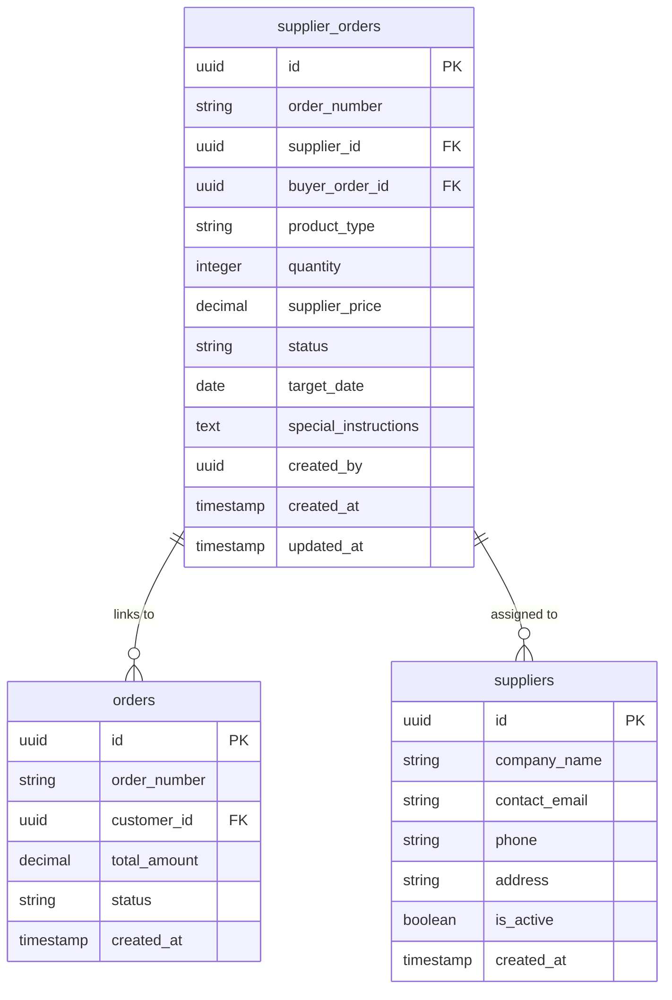
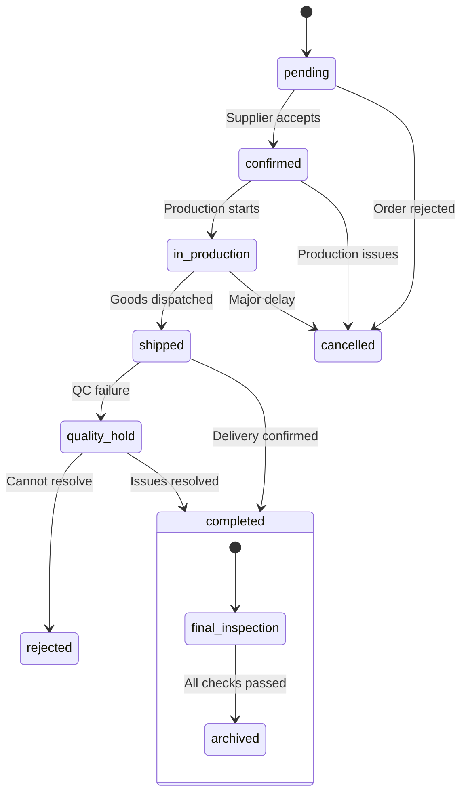
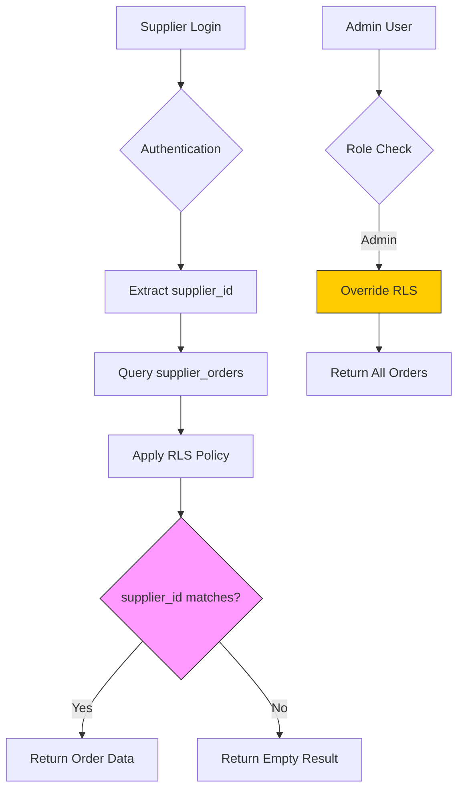
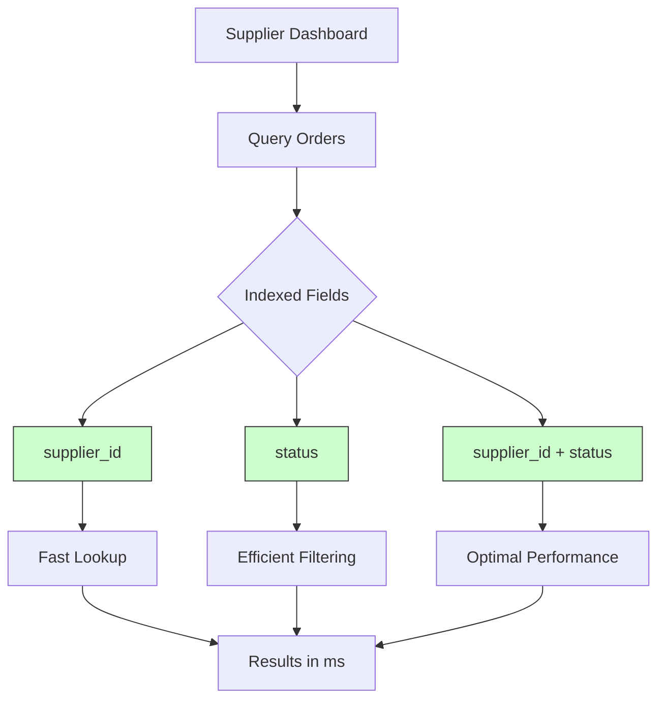

# Supplier Orders Table

<cite>
**Referenced Files in This Document **

</cite>

## Table of Contents
1. [Introduction](#introduction)
2. [Table Structure](#table-structure)
3. [Field Definitions](#field-definitions)
4. [Relationships with Other Tables](#relationships-with-other-tables)
5. [Status Workflow](#status-workflow)
6. [Row Level Security Policies](#row-level-security-policies)
7. [Audit and Accountability](#audit-and-accountability)
8. [Indexing Strategy](#indexing-strategy)
9. [Production Planning Integration](#production-planning-integration)
10. [Conclusion](#conclusion)

## Introduction
The supplier_orders table is a critical component of the sleekapp-v100 system, serving as the central data structure for managing purchase orders issued to suppliers. This table facilitates the coordination between buyers and suppliers, tracks order fulfillment status, and integrates with production planning systems to ensure timely manufacturing and delivery. The design supports a comprehensive workflow from order creation to completion, with robust security and performance considerations.

## Table Structure
The supplier_orders table contains essential fields for tracking supplier purchase orders, including identifiers, financial data, status tracking, and scheduling information. The schema is designed to support efficient querying, secure access control, and integration with related systems for order management and production tracking.

**Section sources**
- file://supabase/COMPLETE_SETUP.sql
- file://supabase/migrations/20251121040812_6c4fea3b-d195-422d-83c9-ade0c9dc73db.sql

## Field Definitions
The supplier_orders table comprises the following fields:

- **id**: Unique identifier for each supplier order, serving as the primary key
- **order_number**: Human-readable order reference number for external communication
- **supplier_id**: Foreign key linking to the suppliers table, identifying the vendor responsible for fulfillment
- **buyer_order_id**: Foreign key connecting to the orders table, establishing the relationship with the original customer purchase
- **product_type**: Classification of the products included in the order for categorization and reporting
- **quantity**: Numeric value indicating the number of units ordered
- **supplier_price**: Agreed-upon cost per unit from the supplier, used for financial calculations
- **status**: Current state of the order in the fulfillment workflow (pending, confirmed, in_production, shipped, completed, cancelled)
- **target_date**: Scheduled completion date that drives production planning and capacity allocation
- **special_instructions**: Text field for additional requirements or specifications for the order
- **created_by**: User identifier for audit trail purposes, tracking who initiated the order

**Section sources**
- file://supabase/COMPLETE_SETUP.sql
- file://supabase/migrations/20251121040812_6c4fea3b-d195-422d-83c9-ade0c9dc73db.sql

## Relationships with Other Tables
The supplier_orders table maintains critical relationships with other entities in the system through foreign key constraints. The buyer_order_id field creates a direct link to the orders table, enabling traceability from supplier procurement back to customer demand. This relationship supports order fulfillment tracking and ensures alignment between customer expectations and supplier delivery. The supplier_id field establishes a connection to the suppliers table, allowing the system to manage vendor-specific information, performance metrics, and communication channels. These relationships form the backbone of the supply chain management system, enabling end-to-end visibility from customer order to supplier fulfillment.

**Diagram sources**
- file://supabase/COMPLETE_SETUP.sql
- file://supabase/migrations/20251121040812_6c4fea3b-d195-422d-83c9-ade0c9dc73db.sql

**Section sources**
- file://supabase/COMPLETE_SETUP.sql
- file://supabase/migrations/20251121040812_6c4fea3b-d195-422d-83c9-ade0c9dc73db.sql

## Status Workflow
The status field in the supplier_orders table implements a defined workflow that tracks order progression through the fulfillment lifecycle. Orders begin in 'pending' status when created, then transition to 'confirmed' once the supplier acknowledges acceptance. The next stage is 'in_production' when manufacturing commences, followed by 'shipped' when goods leave the facility. Final status is 'completed' upon successful delivery and quality verification. The workflow also includes 'cancelled' status for orders that cannot be fulfilled. This state machine integrates with the production tracking system by triggering notifications, updating capacity planning models, and initiating quality control processes at each transition point. Status changes are logged for audit purposes and drive automated communications to all stakeholders.

**Diagram sources**
- file://supabase/COMPLETE_SETUP.sql
- file://supabase/migrations/20251121040812_6c4fea3b-d195-422d-83c9-ade0c9dc73db.sql

**Section sources**
- file://supabase/COMPLETE_SETUP.sql
- file://supabase/migrations/20251121040812_6c4fea3b-d195-422d-83c9-ade0c9dc73db.sql

## Row Level Security Policies
The supplier_orders table implements Row Level Security (RLS) policies to ensure data privacy and appropriate access control. Suppliers can only access orders where their supplier_id matches their account, preventing unauthorized viewing of competitor orders. The policy checks the supplier's authentication context and filters results accordingly. Admin users and system processes have elevated privileges to view all orders for oversight and coordination purposes. These security measures protect sensitive pricing and production information while maintaining operational transparency within appropriate boundaries. The RLS policies are enforced at the database level, providing a robust security layer that cannot be bypassed by application logic errors.

**Diagram sources**
- file://supabase/COMPLETE_SETUP.sql
- file://supabase/migrations/20251121040812_6c4fea3b-d195-422d-83c9-ade0c9dc73db.sql

**Section sources**
- file://supabase/COMPLETE_SETUP.sql
- file://supabase/migrations/20251121040812_6c4fea3b-d195-422d-83c9-ade0c9dc73db.sql

## Audit and Accountability
The created_by field in the supplier_orders table serves as a critical audit trail component, recording which user initiated each order. This field enables accountability by linking actions to specific user accounts, supporting compliance requirements and operational reviews. Combined with timestamp fields, it creates a complete record of order creation and modification history. This information is valuable for investigating issues, understanding decision-making patterns, and ensuring proper authorization procedures are followed. The audit trail also supports performance evaluation of procurement staff and helps identify process bottlenecks or inefficiencies in the ordering workflow.

**Section sources**
- file://supabase/COMPLETE_SETUP.sql
- file://supabase/migrations/20251121040812_6c4fea3b-d195-422d-83c9-ade0c9dc73db.sql

## Indexing Strategy
The supplier_orders table employs strategic indexing to optimize query performance, particularly for the supplier dashboard interface. An index on supplier_id enables rapid retrieval of orders for a specific supplier, ensuring quick load times when suppliers log in to view their assigned orders. A composite index on status and supplier_id supports efficient filtering of orders by status (e.g., showing all 'pending' or 'in_production' orders) for a particular supplier. These indexes are crucial for maintaining responsive user experiences as the volume of orders grows over time. The indexing strategy balances query performance with write efficiency, avoiding excessive indexes that could slow down order creation and updates.

**Diagram sources**
- file://supabase/COMPLETE_SETUP.sql
- file://supabase/migrations/20251121040812_6c4fea3b-d195-422d-83c9-ade0c9dc73db.sql

**Section sources**
- file://supabase/COMPLETE_SETUP.sql
- file://supabase/migrations/20251121040812_6c4fea3b-d195-422d-83c9-ade0c9dc73db.sql

## Production Planning Integration
The target_date field in the supplier_orders table plays a pivotal role in factory capacity planning. This date represents the scheduled completion deadline for the order and is used by production managers to allocate resources, schedule machinery, and assign personnel. The system aggregates target dates across all supplier orders to create a comprehensive view of upcoming production demands, enabling proactive capacity management. When new orders are created or existing ones are modified, the target_date triggers capacity planning algorithms that assess resource availability and identify potential bottlenecks. This integration ensures that production commitments are aligned with actual capacity, reducing the risk of overcommitment and missed deadlines.

**Section sources**
- file://supabase/COMPLETE_SETUP.sql
- file://supabase/migrations/20251121040812_6c4fea3b-d195-422d-83c9-ade0c9dc73db.sql

## Conclusion
The supplier_orders table is a foundational element of the sleekapp-v100 supply chain management system, providing structured data storage for supplier purchase orders with comprehensive relationships, security, and performance features. Its design supports end-to-end order fulfillment tracking, integrates with production planning systems, and ensures data security through Row Level Security policies. The careful indexing strategy enables responsive user experiences, while the audit trail and workflow management features support operational excellence. This table effectively bridges the gap between customer demand and supplier fulfillment, serving as a critical coordination point in the manufacturing ecosystem.