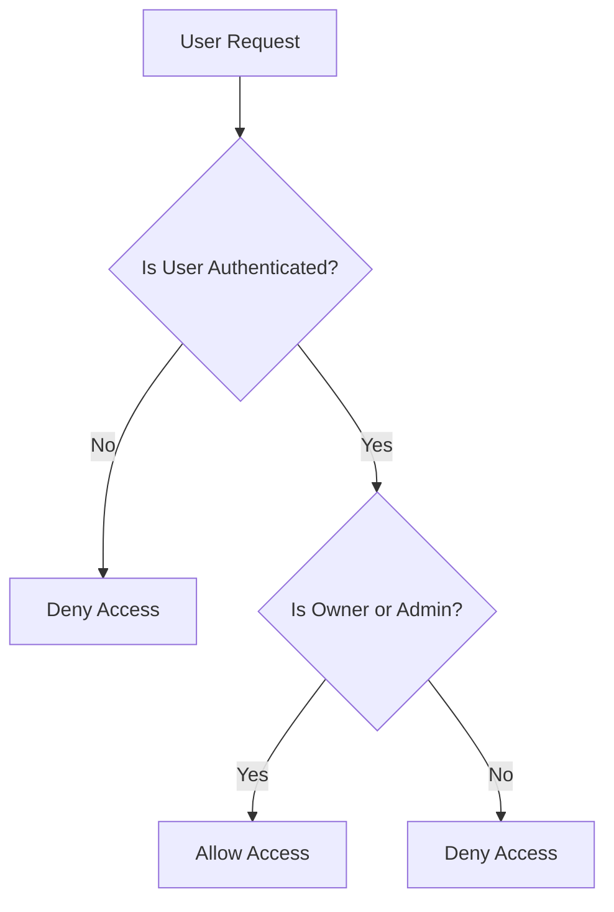
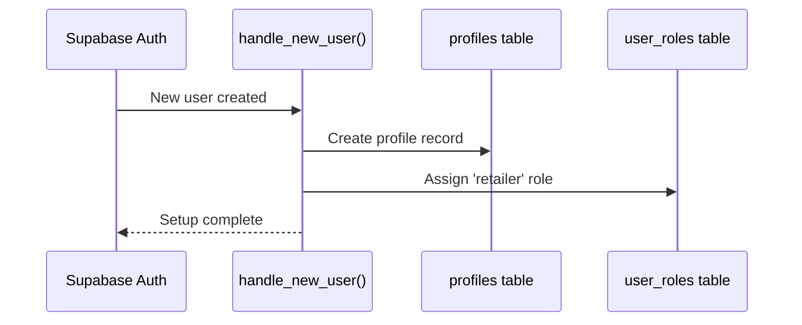
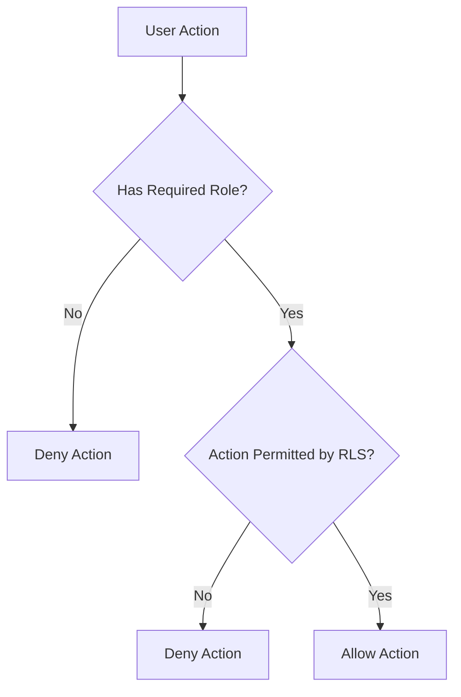
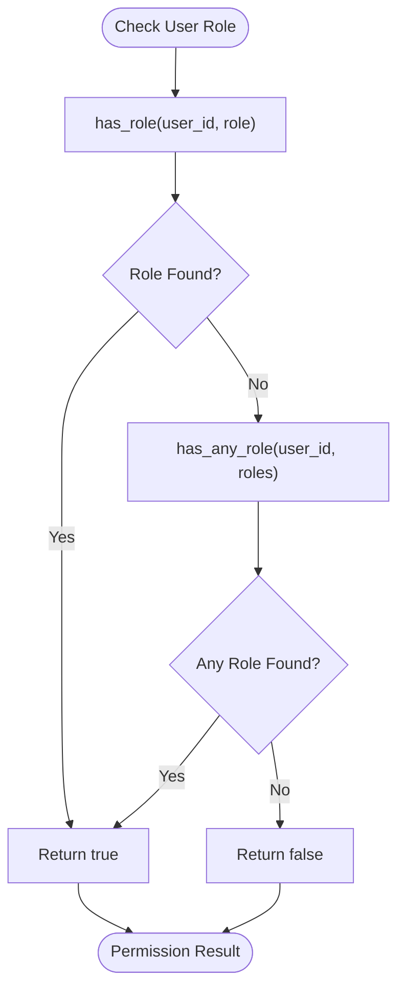

# Users and Roles Tables

<cite>
**Referenced Files in This Document**  
- [supabase/migrations/20251115150759_remix_migration_from_pg_dump.sql](file://supabase/migrations/20251115150759_remix_migration_from_pg_dump.sql)
- [supabase/seed.sql](file://supabase/seed.sql)
- [supabase/config.toml](file://supabase/config.toml)
- [src/types/database.ts](file://src/types/database.ts)
- [supabase/functions/handle_new_user/index.ts](file://supabase/functions/handle_new_user/index.ts)
- [supabase/functions/assign_user_role/index.ts](file://supabase/functions/assign_user_role/index.ts)
- [supabase/functions/has_role/index.ts](file://supabase/functions/has_role/index.ts)
- [supabase/functions/has_any_role/index.ts](file://supabase/functions/has_any_role/index.ts)
</cite>

## Table of Contents
1. [Introduction](#introduction)
2. [Data Model Overview](#data-model-overview)
3. [Auth Users Table](#auth-users-table)
4. [Profiles Table](#profiles-table)
5. [User Roles Table](#user-roles-table)
6. [Role-Based Access Control System](#role-based-access-control-system)
7. [Row Level Security Policies](#row-level-security-policies)
8. [Automated User Setup](#automated-user-setup)
9. [Security Model](#security-model)
10. [Role Checking Functions](#role-checking-functions)

## Introduction
This document provides comprehensive documentation for the user management and role-based access control system in sleekapp-v100. The system is built on Supabase Auth and extends its functionality with custom tables and security policies to support a multi-tenant application with distinct user roles. The documentation covers the data model, security implementation, and automated processes that manage user profiles and permissions.

## Data Model Overview

```mermaid
erDiagram
auth.users {
uuid id PK
string email UK
timestamp created_at
jsonb raw_user_meta_data
}
profiles {
uuid id PK FK
string full_name
string company_name
string phone
string avatar_url
}
user_roles {
uuid user_id PK FK
app_role role
timestamp created_at
}
auth.users ||--o{ profiles : "1-to-1"
auth.users ||--o{ user_roles : "1-to-many"
```

**Diagram sources**
- [supabase/migrations/20251115150759_remix_migration_from_pg_dump.sql](file://supabase/migrations/20251115150759_remix_migration_from_pg_dump.sql)
- [src/types/database.ts](file://src/types/database.ts)

**Section sources**
- [supabase/migrations/20251115150759_remix_migration_from_pg_dump.sql](file://supabase/migrations/20251115150759_remix_migration_from_pg_dump.sql)
- [src/types/database.ts](file://src/types/database.ts)

## Auth Users Table

The `auth.users` table is the core identity table provided by Supabase Auth, which manages user authentication and basic account information. This table is automatically maintained by Supabase and contains essential user data including email, creation timestamp, and authentication metadata. The `id` field serves as the primary key and is referenced by other tables in the system to establish relationships with user profiles and roles.

**Section sources**
- [supabase/migrations/20251115150759_remix_migration_from_pg_dump.sql](file://supabase/migrations/20251115150759_remix_migration_from_pg_dump.sql)

## Profiles Table

The `profiles` table extends the basic user information from `auth.users` with additional profile data specific to the application's needs. The table has a one-to-one relationship with `auth.users` through the `id` field, which serves as both the primary key and foreign key. The table includes fields for `full_name`, `company_name`, `phone`, and `avatar_url`, allowing users to maintain a complete professional profile within the application.

```mermaid
erDiagram
auth.users {
uuid id PK
string email
}
profiles {
uuid id PK FK
string full_name
string company_name
string phone
string avatar_url
}
auth.users ||--o{ profiles : "extends"
```

**Diagram sources**
- [supabase/migrations/20251115150759_remix_migration_from_pg_dump.sql](file://supabase/migrations/20251115150759_remix_migration_from_pg_dump.sql)
- [src/types/database.ts](file://src/types/database.ts)

**Section sources**
- [supabase/migrations/20251115150759_remix_migration_from_pg_dump.sql](file://supabase/migrations/20251115150759_remix_migration_from_pg_dump.sql)
- [src/types/database.ts](file://src/types/database.ts)

## User Roles Table

The `user_roles` table implements the role-based access control system by associating users with specific application roles. The table uses an ENUM type called `app_role` to define the valid roles within the system. Each record contains a `user_id` that references the `auth.users` table, a `role` field that specifies the user's role, and a `created_at` timestamp that records when the role was assigned. This design allows users to have multiple roles if needed, supporting complex permission scenarios.

```mermaid
erDiagram
user_roles {
uuid user_id PK FK
app_role role
timestamp created_at
}
```

**Diagram sources**
- [supabase/migrations/20251115150759_remix_migration_from_pg_dump.sql](file://supabase/migrations/20251115150759_remix_migration_from_pg_dump.sql)
- [src/types/database.ts](file://src/types/database.ts)

**Section sources**
- [supabase/migrations/20251115150759_remix_migration_from_pg_dump.sql](file://supabase/migrations/20251115150759_remix_migration_from_pg_dump.sql)
- [src/types/database.ts](file://src/types/database.ts)

## Role-Based Access Control System

The role-based access control system in sleekapp-v100 provides fine-grained permission management through the `user_roles` table and associated security functions. The system is designed to support multiple user types including retailers, suppliers, and administrators, each with distinct capabilities within the application. Roles are defined as an ENUM type to ensure data integrity and prevent invalid role assignments. The system allows for flexible permission management while maintaining strict security controls through Row Level Security policies.

**Section sources**
- [supabase/migrations/20251115150759_remix_migration_from_pg_dump.sql](file://supabase/migrations/20251115150759_remix_migration_from_pg_dump.sql)
- [src/types/database.ts](file://src/types/database.ts)

## Row Level Security Policies

Row Level Security (RLS) policies are implemented to restrict access to sensitive data based on user identity and roles. The `profiles` table has policies that ensure users can only view and modify their own profile information, while administrators have elevated access to manage profiles as needed. These policies are enforced at the database level, providing a robust security layer that cannot be bypassed by application logic. The RLS policies work in conjunction with the role-based access control system to provide comprehensive data protection.



**Diagram sources**
- [supabase/migrations/20251115150759_remix_migration_from_pg_dump.sql](file://supabase/migrations/20251115150759_remix_migration_from_pg_dump.sql)

**Section sources**
- [supabase/migrations/20251115150759_remix_migration_from_pg_dump.sql](file://supabase/migrations/20251115150759_remix_migration_from_pg_dump.sql)

## Automated User Setup

The system includes an automated user setup process triggered by the `handle_new_user()` function, which executes when a new user is created in Supabase Auth. This trigger automatically creates a corresponding record in the `profiles` table and assigns a default 'retailer' role to the user. This automation ensures that all new users have a complete profile and basic permissions immediately upon registration, providing a seamless onboarding experience without requiring manual intervention.



**Diagram sources**
- [supabase/functions/handle_new_user/index.ts](file://supabase/functions/handle_new_user/index.ts)

**Section sources**
- [supabase/functions/handle_new_user/index.ts](file://supabase/functions/handle_new_user/index.ts)

## Security Model

The security model in sleekapp-v100 follows the principle of least privilege, where users are granted only the permissions necessary for their role. Only users with administrative privileges can assign roles through the `assign_user_role()` function, which performs strict validation to prevent unauthorized role changes. This centralized role assignment process ensures that permission management is controlled and auditable. The security model combines database-level RLS policies with application-level role checking to provide defense in depth.



**Diagram sources**
- [supabase/functions/assign_user_role/index.ts](file://supabase/functions/assign_user_role/index.ts)

**Section sources**
- [supabase/functions/assign_user_role/index.ts](file://supabase/functions/assign_user_role/index.ts)

## Role Checking Functions

The system includes two key functions for role checking: `has_role()` and `has_any_role()`. These functions are used within RLS policies and application logic to determine whether a user has the necessary permissions to perform specific actions. The `has_role()` function checks if a user has a specific role, while `has_any_role()` checks if a user has any of a specified set of roles. These functions provide a flexible and reusable way to implement role-based access control throughout the application, ensuring consistent permission checks across different components and services.



**Diagram sources**
- [supabase/functions/has_role/index.ts](file://supabase/functions/has_role/index.ts)
- [supabase/functions/has_any_role/index.ts](file://supabase/functions/has_any_role/index.ts)

**Section sources**
- [supabase/functions/has_role/index.ts](file://supabase/functions/has_role/index.ts)
- [supabase/functions/has_any_role/index.ts](file://supabase/functions/has_any_role/index.ts)