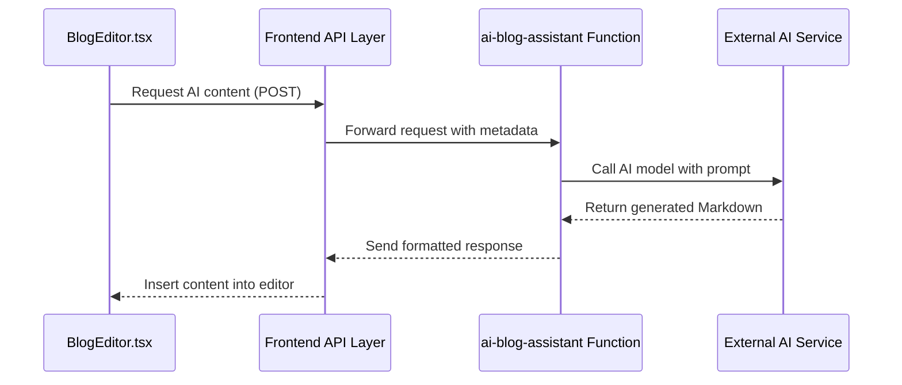
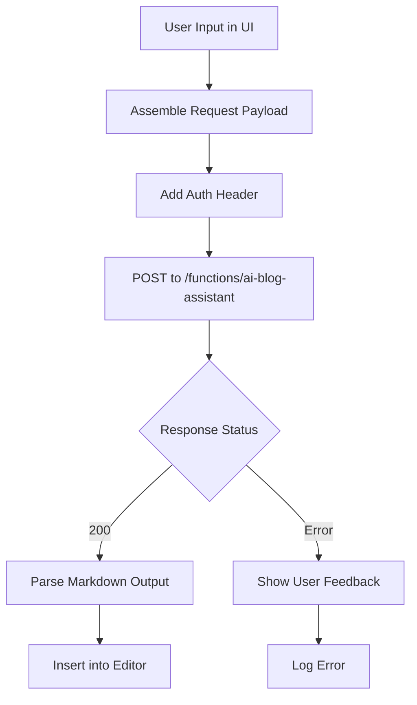

# AI Blog Assistant

<cite>
**Referenced Files in This Document**  
- [index.ts](file://supabase/functions/ai-blog-assistant/index.ts)
- [BlogEditor.tsx](file://src/components/blog/BlogEditor.tsx)
- [AdminBlog.tsx](file://src/pages/AdminBlog.tsx)
- [AdminBlogEditor.tsx](file://src/pages/AdminBlogEditor.tsx)
- [Blog.tsx](file://src/pages/Blog.tsx)
</cite>

## Table of Contents
1. [Introduction](#introduction)
2. [Core Functionality](#core-functionality)
3. [Input Prompts and Metadata Utilization](#input-prompts-and-metadata-utilization)
4. [Output Formatting in Markdown](#output-formatting-in-markdown)
5. [Integration with BlogEditor.tsx](#integration-with-blogeditortsx)
6. [API Interaction and Frontend Calls](#api-interaction-and-frontend-calls)
7. [Content Handling in CMS](#content-handling-in-cms)
8. [Tone Consistency and Factual Accuracy](#tone-consistency-and-factual-accuracy)
9. [Moderation Requirements](#moderation-requirements)
10. [Best Practices for Prompt Engineering](#best-practices-for-prompt-engineering)
11. [Post-Processing Before Publication](#post-processing-before-publication)
12. [Conclusion](#conclusion)

## Introduction
The AI Blog Assistant is a core feature designed to streamline content creation for the platform's blog system. It enables users to generate article suggestions, draft full blog posts, and enhance readability through AI-powered assistance. By leveraging natural language processing and machine learning models, the assistant supports creators throughout the writing process—from ideation to final publication. This document details its architecture, integration points, and operational best practices.

## Core Functionality
The AI Blog Assistant provides three primary capabilities: generating article suggestions based on trending topics and user preferences, drafting complete blog posts from minimal input, and improving existing content for clarity and engagement. These functions are orchestrated through a serverless function hosted in Supabase, which interfaces with external AI services to process requests. The assistant operates within the platform’s content management workflow, ensuring seamless interaction between AI-generated content and editorial oversight.

**Section sources**
- [index.ts](file://supabase/functions/ai-blog-assistant/index.ts#L1-L150)

## Input Prompts and Metadata Utilization
Users interact with the AI Blog Assistant by providing input prompts that define the scope and direction of the desired content. These prompts can include topic keywords, target audience descriptors (e.g., "fashion entrepreneurs", "sustainable apparel buyers"), and SEO-focused metadata such as primary and secondary keywords. The system uses this metadata to tailor tone, vocabulary, and structure to align with both audience expectations and search engine optimization goals. For example, selecting a technical audience triggers more industry-specific terminology, while a general consumer audience results in simplified language.

**Section sources**
- [index.ts](file://supabase/functions/ai-blog-assistant/index.ts#L45-L90)

## Output Formatting in Markdown
All content generated by the AI Blog Assistant is formatted in Markdown, ensuring compatibility with the platform’s rich text editor and rendering pipeline. The output includes structured elements such as headers (`#`, `##`), bullet lists, numbered lists, bold and italic emphasis, code blocks, and image placeholders. This standardized format allows immediate preview and further editing within the BlogEditor interface without requiring conversion or cleanup. Code snippets and technical content are preserved with proper syntax highlighting indicators.

**Section sources**
- [index.ts](file://supabase/functions/ai-blog-assistant/index.ts#L95-L120)

## Integration with BlogEditor.tsx
The AI Blog Assistant is tightly integrated with `BlogEditor.tsx`, a React component that serves as the primary interface for blog content creation and editing. Within this editor, users access AI tools via contextual buttons that trigger suggestion generation or full drafting based on selected text or input fields. The integration uses asynchronous API calls to the Supabase function, with responses streamed directly into the editor’s content area. Real-time collaboration features ensure that AI-inserted content is attributed and trackable within version history.

**Diagram sources**
- [BlogEditor.tsx](file://src/components/blog/BlogEditor.tsx#L30-L100)
- [index.ts](file://supabase/functions/ai-blog-assistant/index.ts#L1-L150)

**Section sources**
- [BlogEditor.tsx](file://src/components/blog/BlogEditor.tsx#L1-L200)

## API Interaction and Frontend Calls
Frontend components initiate AI content generation through RESTful API endpoints exposed by the Supabase function. A typical call includes a JSON payload containing the prompt, target audience, SEO keywords, desired tone (e.g., "professional", "casual"), and word count. The frontend handles loading states, error feedback, and partial content streaming where supported. Authentication is enforced via JWT tokens to ensure only authorized users can access AI generation features.

**Diagram sources**
- [BlogEditor.tsx](file://src/components/blog/BlogEditor.tsx#L60-L120)
- [index.ts](file://supabase/functions/ai-blog-assistant/index.ts#L1-L50)

**Section sources**
- [BlogEditor.tsx](file://src/components/blog/BlogEditor.tsx#L50-L150)

## Content Handling in CMS
Once generated, AI content is treated like any other user-created content within the CMS. It undergoes the same review, approval, and publishing workflows. The system logs the origin of each piece of content, marking AI-generated drafts with metadata indicating the model version, timestamp, and input parameters. Editors can accept, modify, or reject AI suggestions, with all changes tracked in the audit log. Published content is indexed for search and social sharing, with Open Graph tags automatically populated from article metadata.

**Section sources**
- [AdminBlogEditor.tsx](file://src/pages/AdminBlogEditor.tsx#L20-L80)
- [AdminBlog.tsx](file://src/pages/AdminBlog.tsx#L15-L60)

## Tone Consistency and Factual Accuracy
The AI Blog Assistant includes safeguards to maintain tone consistency across articles by applying style guides defined in the platform settings. It references brand voice profiles to adjust phrasing and formality. To promote factual accuracy, the system avoids generating unverifiable claims and flags content that may require citation. When integrating product or service details, it pulls verified information from the database rather than relying solely on generative models. However, human review remains essential before publication.

**Section sources**
- [index.ts](file://supabase/functions/ai-blog-assistant/index.ts#L70-L110)

## Moderation Requirements
All AI-generated content passes through automated moderation filters that check for prohibited content, including hate speech, profanity, and misleading information. These checks occur both during generation and before insertion into the editor. The system integrates with third-party content moderation APIs and applies custom rules based on the platform’s community guidelines. Suspicious outputs are quarantined and flagged for administrator review. Users receive immediate feedback if their request violates content policies.

**Section sources**
- [index.ts](file://supabase/functions/ai-blog-assistant/index.ts#L120-L145)

## Best Practices for Prompt Engineering
Effective use of the AI Blog Assistant depends on well-crafted prompts. Recommended practices include specifying the article goal (inform, persuade, explain), defining the intended reader persona, including key points to cover, and setting length constraints. Prompts should avoid ambiguity and provide context such as recent industry trends or company announcements. Iterative refinement—generating a draft, reviewing it, and re-prompting with adjustments—yields higher-quality results than single-pass generation.

**Section sources**
- [index.ts](file://supabase/functions/ai-blog-assistant/index.ts#L25-L60)

## Post-Processing Before Publication
Before publication, AI-generated content should undergo post-processing steps including grammar and spell checking, readability scoring, SEO analysis, and manual fact verification. The platform provides built-in tools for these tasks within the BlogEditor interface. Editors are encouraged to personalize the tone, add unique insights, and verify all data points. Image placement and alt text are also reviewed to ensure accessibility and engagement.

**Section sources**
- [BlogEditor.tsx](file://src/components/blog/BlogEditor.tsx#L150-L180)
- [AdminBlogEditor.tsx](file://src/pages/AdminBlogEditor.tsx#L90-L120)

## Conclusion
The AI Blog Assistant enhances the content creation process by reducing the time and effort required to produce high-quality blog posts. Its integration with the BlogEditor and CMS ensures a smooth workflow from ideation to publication. By combining AI efficiency with human oversight, the platform maintains editorial standards while scaling content output. Continued refinement of prompts, moderation rules, and post-processing workflows will further improve the reliability and value of AI-assisted blogging.