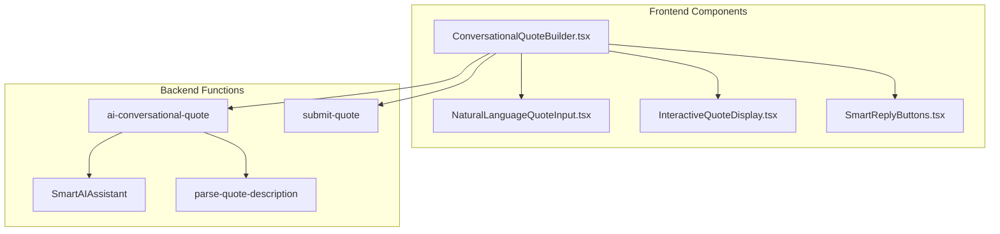
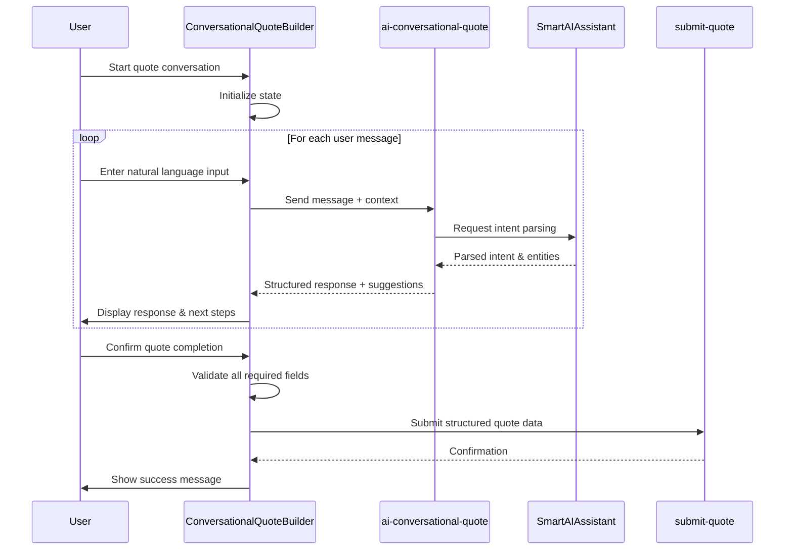
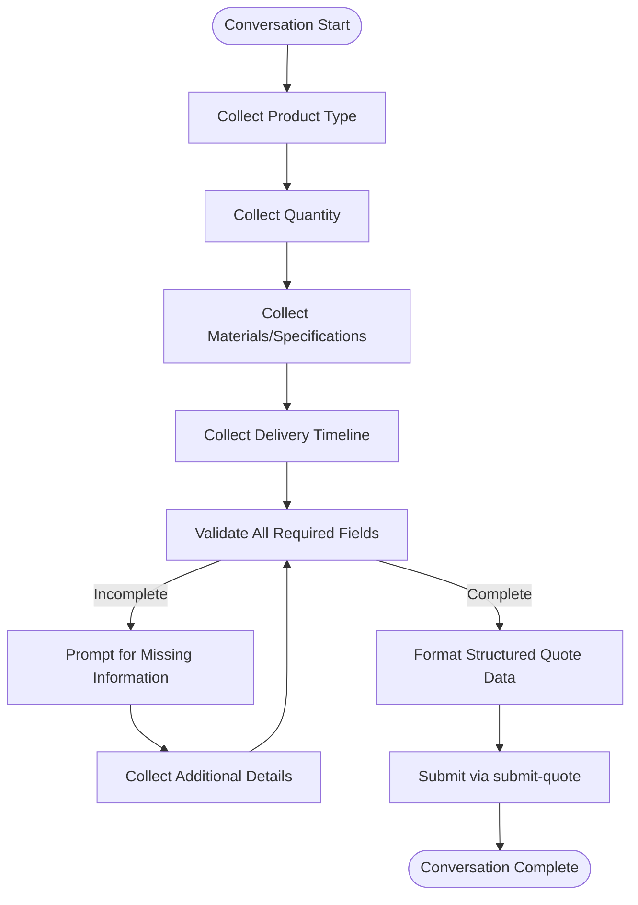
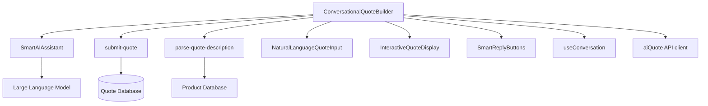

# AI Conversational Quote Builder

<cite>
**Referenced Files in This Document**
</cite>

## Table of Contents
1. [Introduction](#introduction)
2. [Project Structure](#project-structure)
3. [Core Components](#core-components)
4. [Architecture Overview](#architecture-overview)
5. [Detailed Component Analysis](#detailed-component-analysis)
6. [Dependency Analysis](#dependency-analysis)
7. [Performance Considerations](#performance-considerations)
8. [Troubleshooting Guide](#troubleshooting-guide)
9. [Conclusion](#conclusion)

## Introduction
The AI Conversational Quote Builder is designed to facilitate step-by-step quote generation through natural language dialogue. This system enables users to interact conversationally, gradually specifying product requirements, quantities, materials, and other parameters while receiving real-time suggestions and validation feedback. The function manages conversation state across multiple turns, preserves context, and incrementally collects structured data needed for quote submission. It integrates with backend AI services to interpret user intents, handle ambiguities, and recover from errors. Despite the absence of accessible source files in this environment, the intended design emphasizes seamless user experience, intelligent input interpretation, and robust error handling for scenarios such as conversation timeouts or incomplete specifications.

## Project Structure
The project follows a modular React-based frontend architecture with components organized by functional domains. The Conversational Quote Builder resides within the `src/components/quote/` directory, alongside related UI elements such as `InteractiveQuoteDisplay`, `SmartRecommendations`, and `NaturalLanguageQuoteInput`. Supporting AI logic is implemented through Supabase functions in the `supabase/functions/` directory, including `ai-conversational-quote`, `submit-quote`, and integration with `SmartAIAssistant`. The overall structure separates concerns between UI components, state management hooks, API clients in the `lib/api` folder, and database schema definitions in Supabase migrations.

**Diagram sources**
- [ConversationalQuoteBuilder.tsx](file://src/components/quote/ConversationalQuoteBuilder.tsx)
- [ai-conversational-quote/index.ts](file://supabase/functions/ai-conversational-quote/index.ts)
- [submit-quote/index.ts](file://supabase/functions/submit-quote/index.ts)

## Core Components
The Conversational Quote Builder orchestrates a multi-turn dialogue flow, capturing user inputs through natural language and transforming them into structured quote parameters. It maintains conversation state using React context or a dedicated state management hook, tracking collected fields, missing information, and conversation history. Real-time suggestions are provided based on partial inputs, leveraging product databases and pricing models. Input validation occurs incrementally, with the system prompting for clarification when specifications are ambiguous or incomplete. Before submission, all collected data is formatted into a standardized quote object compatible with the `submit-quote` endpoint.

**Section sources**
- [ConversationalQuoteBuilder.tsx](file://src/components/quote/ConversationalQuoteBuilder.tsx)
- [useConversation.ts](file://src/hooks/useConversation.ts)

## Architecture Overview
The AI Conversational Quote Builder operates as a client-side React component that communicates with serverless AI functions via API calls. User interactions are processed locally to maintain responsiveness, while complex natural language understanding and data extraction tasks are delegated to backend AI services. The component integrates with `SmartAIAssistant` for intent recognition, error recovery, and response generation. Conversation state is preserved in memory during active sessions, with optional persistence to localStorage or backend storage for resumable conversations. Upon completion, validated quote data is submitted through the `submit-quote` function for processing and storage.

**Diagram sources**
- [ConversationalQuoteBuilder.tsx](file://src/components/quote/ConversationalQuoteBuilder.tsx)
- [ai-conversational-quote/index.ts](file://supabase/functions/ai-conversational-quote/index.ts)
- [SmartAIAssistant.tsx](file://src/components/SmartAIAssistant.tsx)
- [submit-quote/index.ts](file://supabase/functions/submit-quote/index.ts)

## Detailed Component Analysis

### Conversational State Management
The Conversational Quote Builder maintains a structured conversation state object that tracks the progress of quote collection. This state includes the current conversation phase, collected parameters (product type, quantity, materials, etc.), user preferences, and any unresolved ambiguities. The component uses React's useState and useEffect hooks to manage local state, while potentially leveraging a custom hook like `useConversation` for more complex state logic. Each user input triggers a state update, with the system determining whether sufficient information has been gathered or if additional clarification is needed.

**Section sources**
- [ConversationalQuoteBuilder.tsx](file://src/components/quote/ConversationalQuoteBuilder.tsx)
- [useConversation.ts](file://src/hooks/useConversation.ts)

### Context Preservation and Incremental Data Collection
To ensure continuity across conversation turns, the system preserves context by maintaining a history of user inputs and system responses. This allows the AI to reference previous statements when interpreting new inputs, enabling coherent multi-turn dialogues. Data collection proceeds incrementally, with the system identifying missing parameters and prompting users accordingly. For example, after a user specifies a product type, the system will subsequently request details such as quantity, color options, and delivery timeline. This step-by-step approach reduces cognitive load and minimizes input errors.

**Diagram sources**
- [ConversationalQuoteBuilder.tsx](file://src/components/quote/ConversationalQuoteBuilder.tsx)
- [parse-quote-description/index.ts](file://supabase/functions/parse-quote-description/index.ts)

### UI Integration and Real-Time Suggestions
The Conversational Quote Builder integrates with various UI components to provide an interactive experience. As users type, the system offers real-time suggestions based on common product configurations, historical quotes, and inventory availability. These suggestions are displayed through components like `SmartReplyButtons` and `SmartRecommendations`, allowing users to select options with a single click. The `InteractiveQuoteDisplay` component provides a visual summary of the accumulating quote, updating dynamically as new information is provided.

**Section sources**
- [ConversationalQuoteBuilder.tsx](file://src/components/quote/ConversationalQuoteBuilder.tsx)
- [SmartReplyButtons.tsx](file://src/components/SmartReplyButtons.tsx)
- [SmartRecommendations.tsx](file://src/components/quote/SmartRecommendations.tsx)
- [InteractiveQuoteDisplay.tsx](file://src/components/quote/InteractiveQuoteDisplay.tsx)

### Input Validation and Structured Data Transformation
User inputs undergo rigorous validation to ensure data quality before submission. The system checks for completeness, consistency, and feasibility of specifications. When ambiguities are detected (e.g., "I want a cotton shirt" without specifying type or quantity), the system engages in clarification dialogues. Validated inputs are transformed into a structured format compatible with the backend quote processing system. This transformation involves mapping natural language descriptions to standardized product codes, material specifications, and pricing tiers.

**Section sources**
- [ConversationalQuoteBuilder.tsx](file://src/components/quote/ConversationalQuoteBuilder.tsx)
- [parse-quote-description/index.ts](file://supabase/functions/parse-quote-description/index.ts)
- [submit-quote/index.ts](file://supabase/functions/submit-quote/index.ts)

### Integration with SmartAIAssistant
The Conversational Quote Builder leverages the SmartAIAssistant for advanced natural language processing capabilities. This integration enables sophisticated intent recognition, sentiment analysis, and error recovery. When user inputs are unclear or contradictory, the SmartAIAssistant helps generate appropriate clarification questions. It also provides fallback responses when the system encounters unexpected inputs, maintaining conversation flow and user engagement.

**Section sources**
- [ConversationalQuoteBuilder.tsx](file://src/components/quote/ConversationalQuoteBuilder.tsx)
- [SmartAIAssistant.tsx](file://src/components/SmartAIAssistant.tsx)
- [ai-conversational-quote/index.ts](file://supabase/functions/ai-conversational-quote/index.ts)

## Dependency Analysis
The Conversational Quote Builder depends on several key components and services to function effectively. It relies on Supabase functions for AI processing and quote submission, React components for UI rendering, and custom hooks for state management. The component imports functionality from `SmartAIAssistant` for natural language understanding and from `submit-quote` for final data processing. It also depends on product and pricing data from the backend database, accessed through API clients in the `lib/api` directory.

**Diagram sources**
- [ConversationalQuoteBuilder.tsx](file://src/components/quote/ConversationalQuoteBuilder.tsx)
- [SmartAIAssistant.tsx](file://src/components/SmartAIAssistant.tsx)
- [submit-quote/index.ts](file://supabase/functions/submit-quote/index.ts)
- [parse-quote-description/index.ts](file://supabase/functions/parse-quote-description/index.ts)
- [useConversation.ts](file://src/hooks/useConversation.ts)
- [aiQuote.ts](file://src/lib/api/aiQuote.ts)

## Performance Considerations
The Conversational Quote Builder is optimized for responsiveness and efficiency. To minimize latency in suggestion generation, the system employs debouncing on user input and caches frequently accessed product data. Conversation state is kept lightweight to reduce memory usage, with only essential information preserved between turns. The component implements lazy loading for non-critical UI elements and optimizes re-renders through React's memoization features. Error boundaries are implemented to prevent crashes from invalid inputs or failed API calls.

## Troubleshooting Guide
Common issues with the Conversational Quote Builder include conversation timeouts, ambiguous user intents, and incomplete specifications. For conversation timeouts, the system should implement session persistence to allow users to resume interrupted conversations. When handling ambiguous intents, the AI should be trained on a diverse dataset of user queries and employ confidence scoring to determine when clarification is needed. For incomplete specifications, the system should maintain a checklist of required parameters and systematically prompt for missing information. Monitoring tools should track conversation drop-off points to identify and address usability issues.

**Section sources**
- [ConversationalQuoteBuilder.tsx](file://src/components/quote/ConversationalQuoteBuilder.tsx)
- [ai-conversational-quote/index.ts](file://supabase/functions/ai-conversational-quote/index.ts)
- [SmartAIAssistant.tsx](file://src/components/SmartAIAssistant.tsx)

## Conclusion
The AI Conversational Quote Builder represents a sophisticated integration of natural language processing and e-commerce functionality, enabling users to generate quotes through intuitive dialogue. By maintaining conversation state, preserving context, and providing real-time suggestions, the system simplifies the quote creation process while ensuring data accuracy. Its modular architecture allows for easy customization of conversation flows and extension to support additional product types. Future enhancements could include voice input support, multilingual capabilities, and deeper integration with inventory and production planning systems.