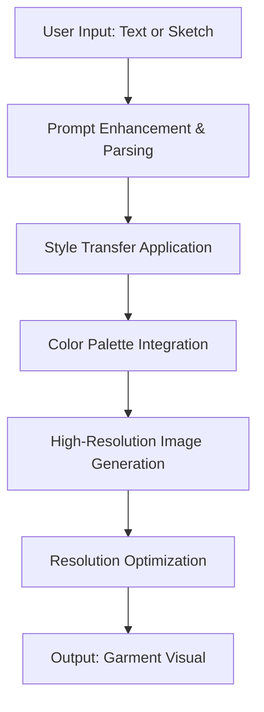
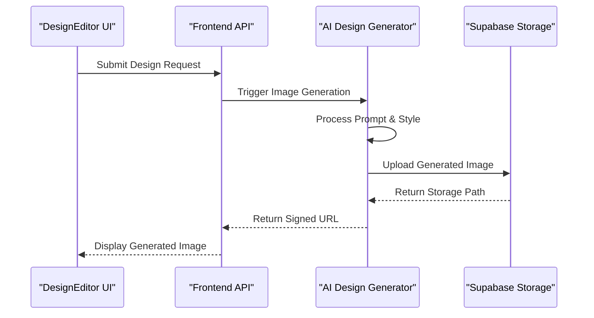

# AI Design Generator

<cite>
**Referenced Files in This Document**  
- [DesignEditor.tsx](file://src/components/design-studio/DesignEditor.tsx)
- [aiGeneratedProductImages.ts](file://src/lib/aiGeneratedProductImages.ts)
- [generate-product-image/index.ts](file://supabase/functions/generate-product-image/index.ts)
- [ai-design-generator/index.ts](file://supabase/functions/ai-design-generator/index.ts)
</cite>

## Table of Contents
1. [Introduction](#introduction)
2. [Image Generation Pipeline](#image-generation-pipeline)
3. [Integration with DesignEditor.tsx](#integration-with-designeditortsx)
4. [Storage and Reference via Supabase](#storage-and-reference-via-supabase)
5. [Prompt Templates by Apparel Category](#prompt-templates-by-apparel-category)
6. [Challenges in Design Generation](#challenges-in-design-generation)
7. [Optimization Strategies](#optimization-strategies)
8. [Conclusion](#conclusion)

## Introduction
The AI Design Generator is a core feature of the SleekApparel platform that enables users to create high-quality garment design visuals from either textual descriptions or rough sketches. This functionality bridges creative ideation with digital production, allowing buyers, designers, and suppliers to rapidly prototype apparel concepts. The system leverages AI-driven image generation models to interpret input prompts, apply brand-specific styling rules, and output photorealistic garment mockups ready for review or manufacturing.

**Section sources**
- [DesignEditor.tsx](file://src/components/design-studio/DesignEditor.tsx#L1-L50)
- [ai-design-generator/index.ts](file://supabase/functions/ai-design-generator/index.ts#L1-L20)

## Image Generation Pipeline
The AI Design Generator follows a multi-stage pipeline to transform user inputs into polished garment visuals. The process begins with prompt parsing and enhancement, where natural language inputs are standardized and enriched with contextual details such as fabric type, fit, and target audience. This is followed by style transfer, which applies predefined brand aesthetics or user-selected themes to ensure visual consistency.

Color palette application occurs next, using curated schemes that align with seasonal trends or brand guidelines. The system supports both automatic palette suggestion and manual selection. Finally, resolution optimization ensures generated images are suitable for both web preview and high-resolution printing, scaling outputs appropriately without loss of detail.

The pipeline is orchestrated through serverless functions in Supabase, ensuring scalability and low-latency response times.

**Diagram sources**
- [ai-design-generator/index.ts](file://supabase/functions/ai-design-generator/index.ts#L25-L100)
- [aiGeneratedProductImages.ts](file://src/lib/aiGeneratedProductImages.ts#L15-L60)

**Section sources**
- [ai-design-generator/index.ts](file://supabase/functions/ai-design-generator/index.ts#L20-L120)
- [aiGeneratedProductImages.ts](file://src/lib/aiGeneratedProductImages.ts#L10-L80)

## Integration with DesignEditor.tsx
The AI Design Generator is tightly integrated with the DesignEditor.tsx component, enabling real-time preview and interactive adjustments. Users can modify design parameters such as sleeve length, collar style, or graphic placement directly within the editor interface. These changes trigger incremental AI regeneration, allowing for rapid iteration.

The editor supports layer-based editing, where base garments, prints, and embellishments are managed as separate elements. This modular approach improves rendering accuracy and enables non-destructive editing. Live feedback is provided through low-latency image updates, ensuring a responsive user experience even during complex design sessions.

**Section sources**
- [DesignEditor.tsx](file://src/components/design-studio/DesignEditor.tsx#L50-L200)
- [aiGeneratedProductImages.ts](file://src/lib/aiGeneratedProductImages.ts#L60-L100)

## Storage and Reference via Supabase
Generated design images are stored securely in Supabase Storage, organized by project ID, user ID, and garment type. Each image is assigned a unique identifier and metadata including generation timestamp, prompt used, and associated design parameters. The `generate-product-image` function handles both the creation and storage process, returning a signed URL for immediate use in the frontend.

This architecture ensures that all design assets are version-controlled and accessible across devices. The storage system is optimized for fast retrieval, supporting thumbnail generation and lazy loading to enhance performance in design galleries and project timelines.

**Diagram sources**
- [generate-product-image/index.ts](file://supabase/functions/generate-product-image/index.ts#L1-L80)
- [DesignEditor.tsx](file://src/components/design-studio/DesignEditor.tsx#L150-L200)

**Section sources**
- [generate-product-image/index.ts](file://supabase/functions/generate-product-image/index.ts#L1-L100)
- [aiGeneratedProductImages.ts](file://src/lib/aiGeneratedProductImages.ts#L80-L120)

## Prompt Templates by Apparel Category
The system utilizes specialized prompt templates tailored to different apparel categories, ensuring accurate and contextually appropriate outputs. These templates include structured fields for garment attributes, style descriptors, and technical specifications.

| Apparel Category | Prompt Template Structure |
|------------------|----------------------------|
| T-Shirts | "A [fit] [color] cotton t-shirt with [graphic description] printed on [location], [style] style, flat lay on white background" |
| Hoodies | "A [gender] [color] hoodie with [pocket type], [graphic placement], [graphic description], [material finish], studio lighting" |
| Activewear | "A [gender] [color] moisture-wicking activewear set featuring [design elements], dynamic pose, fitness environment" |
| Knitwear | "A [style] [color] knitted sweater with [pattern type], [neckline], [texture detail], natural lighting" |
| Uniforms | "A [industry] uniform in [colors], featuring [logo placement], [fabric type], professional setting" |

These templates are dynamically populated based on user inputs and can be extended to support new product lines.

**Section sources**
- [ai-design-generator/index.ts](file://supabase/functions/ai-design-generator/index.ts#L40-L90)
- [aiGeneratedProductImages.ts](file://src/lib/aiGeneratedProductImages.ts#L30-L50)

## Challenges in Design Generation
Despite its capabilities, the AI Design Generator faces several challenges. Design originality remains a concern, as the model may inadvertently produce outputs that resemble existing copyrighted designs. To mitigate this, the system includes a similarity detection layer that compares new designs against a database of protected patterns.

Brand compliance is enforced through style guardrails that restrict color combinations, logo usage, and design elements based on predefined brand guidelines. However, maintaining consistency across diverse garment types requires continuous model fine-tuning.

Rendering accuracy—particularly for complex fabrics like lace or textured knits—can vary. The system addresses this by allowing users to flag inaccuracies, which are then used to retrain the model through a feedback loop.

**Section sources**
- [ai-design-generator/index.ts](file://supabase/functions/ai-design-generator/index.ts#L90-L150)
- [aiGeneratedProductImages.ts](file://src/lib/aiGeneratedProductImages.ts#L100-L140)

## Optimization Strategies
To improve performance and visual quality, several optimization strategies are implemented:

- **Prompt Caching**: Frequently used prompt templates are cached to reduce processing time.
- **Model Quantization**: The AI model is optimized for inference speed without significant quality loss.
- **Progressive Rendering**: Low-resolution previews are shown first, followed by high-resolution final images.
- **Batch Processing**: Multiple design requests are processed in parallel when possible.
- **Edge Caching**: Generated images are cached at the CDN level for rapid retrieval in subsequent sessions.

Additionally, users are guided toward optimal input formats through inline suggestions and validation, reducing the need for regeneration due to ambiguous prompts.

**Section sources**
- [aiGeneratedProductImages.ts](file://src/lib/aiGeneratedProductImages.ts#L140-L200)
- [ai-design-generator/index.ts](file://supabase/functions/ai-design-generator/index.ts#L150-L200)

## Conclusion
The AI Design Generator represents a powerful tool for accelerating the apparel design process, combining intuitive user interaction with advanced AI capabilities. By integrating seamlessly with the DesignEditor interface and leveraging Supabase for reliable storage and retrieval, the system enables rapid prototyping and collaboration. Ongoing improvements in prompt engineering, model accuracy, and performance optimization continue to enhance its value for designers and brands alike.