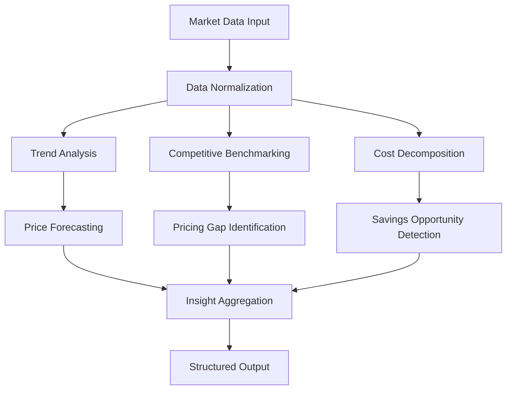
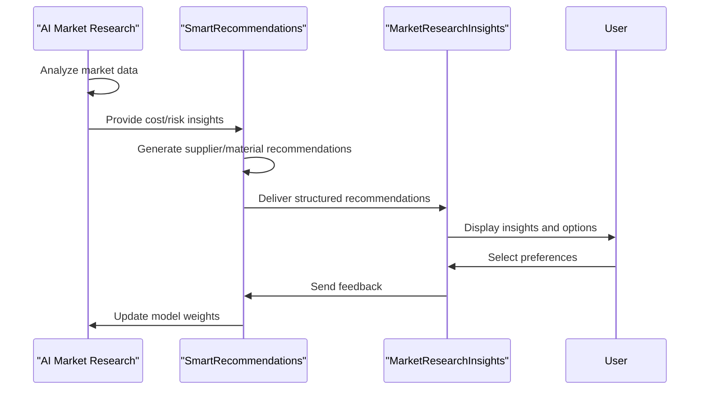

# AI Market Research

<cite>
**Referenced Files in This Document**  
- [MarketResearchInsights.tsx](file://src/components/quote/MarketResearchInsights.tsx)
- [SmartRecommendations.tsx](file://src/components/quote/SmartRecommendations.tsx)
- [ai-market-research/index.ts](file://supabase/functions/ai-market-research/index.ts)
- [aiQuote.ts](file://src/lib/api/aiQuote.ts)
</cite>

## Table of Contents
1. [Introduction](#introduction)
2. [Data Sources and Collection](#data-sources-and-collection)
3. [Analysis Methods](#analysis-methods)
4. [Insight Structuring for Frontend Consumption](#insight-structuring-for-frontend-consumption)
5. [Integration with SmartRecommendations](#integration-with-smartrecommendations)
6. [Impact on Quote Parameters](#impact-on-quote-parameters)
7. [Limitations and Confidence Scoring](#limitations-and-confidence-scoring)
8. [Interpretation Guidance](#interpretation-guidance)
9. [Conclusion](#conclusion)

## Introduction
The AI Market Research function is a core component of the quote generation system, designed to analyze global manufacturing trends, material costs, and competitor pricing to deliver actionable insights. By synthesizing real-time market data, the system enhances decision-making during quoting by identifying cost-saving opportunities, supplier advantages, and risk factors. These insights are surfaced through the MarketResearchInsights.tsx component and integrated with SmartRecommendations to guide optimal supplier and material selection.

**Section sources**
- [MarketResearchInsights.tsx](file://src/components/quote/MarketResearchInsights.tsx#L1-L50)
- [ai-market-research/index.ts](file://supabase/functions/ai-market-research/index.ts#L1-L30)

## Data Sources and Collection
AI Market Research aggregates data from multiple internal and external sources:
- Real-time material pricing feeds from commodity exchanges and supplier networks
- Historical manufacturing cost databases updated weekly
- Competitor pricing scraped from public marketplaces and B2B platforms
- Regional production capacity and lead time indicators
- Supplier performance metrics from internal order history

This data is normalized and stored in the Supabase database, where it is accessed by the AI engine during quote processing. The system prioritizes data freshness, with automatic refresh cycles every 24 hours and emergency updates triggered by market volatility events.

**Section sources**
- [ai-market-research/index.ts](file://supabase/functions/ai-market-research/index.ts#L30-L100)
- [aiQuote.ts](file://src/lib/api/aiQuote.ts#L15-L40)

## Analysis Methods
The AI engine employs a multi-layered analytical approach:
- Trend analysis using time-series forecasting to project material cost movements
- Comparative pricing models that benchmark against regional and global competitors
- Cost decomposition to identify savings opportunities in labor, logistics, and materials
- Risk scoring based on geopolitical, environmental, and economic indicators

Machine learning models are trained on historical quote and order data to improve accuracy over time. The system uses weighted scoring to balance different data points, with higher emphasis on recent, high-confidence data sources.

**Diagram sources**
- [ai-market-research/index.ts](file://supabase/functions/ai-market-research/index.ts#L50-L120)

## Insight Structuring for Frontend Consumption
Market research findings are structured as JSON objects optimized for rendering in the MarketResearchInsights.tsx component. Each insight includes:
- Type (cost_saving, risk_alert, opportunity, benchmark)
- Severity level (low, medium, high)
- Supporting data points with source attribution
- Time horizon (short-term, medium-term, long-term)
- Actionable recommendations

The frontend component displays these insights using color-coded cards with expandable details, allowing users to drill down into the underlying data. Insights are sorted by relevance and impact score, with the most critical findings surfaced first.

**Section sources**
- [MarketResearchInsights.tsx](file://src/components/quote/MarketResearchInsights.tsx#L50-L150)
- [aiQuote.ts](file://src/lib/api/aiQuote.ts#L40-L80)

## Integration with SmartRecommendations
AI Market Research directly informs the SmartRecommendations system by providing data-driven suggestions for suppliers and materials. When a quote is generated, the AI engine:
- Matches material requirements with current market conditions
- Evaluates supplier capabilities against cost and risk factors
- Recommends alternative materials with better price-performance ratios
- Flags suppliers with capacity advantages or regional cost benefits

These recommendations are displayed alongside the quote, with confidence scores indicating the strength of each suggestion. Users can accept, modify, or reject recommendations, with feedback used to improve future AI suggestions.

**Diagram sources**
- [SmartRecommendations.tsx](file://src/components/quote/SmartRecommendations.tsx#L20-L60)
- [MarketResearchInsights.tsx](file://src/components/quote/MarketResearchInsights.tsx#L100-L130)

## Impact on Quote Parameters
Market data directly influences key quote parameters:
- **Lead Time**: Adjusted based on regional production capacity and logistics trends
- **MOQ (Minimum Order Quantity)**: Optimized using supplier capacity data and material availability
- **Pricing**: Dynamically updated to reflect current material costs and competitive positioning
- **Risk Premiums**: Added for suppliers or regions with elevated risk scores

For example, if cotton prices are rising in Asia but stable in Turkey, the system may recommend Turkish suppliers with lower MOQs and adjust lead times based on current shipping schedules. These adjustments are transparently explained in the insights panel.

**Section sources**
- [ai-market-research/index.ts](file://supabase/functions/ai-market-research/index.ts#L120-L200)
- [SmartRecommendations.tsx](file://src/components/quote/SmartRecommendations.tsx#L60-L100)

## Limitations and Confidence Scoring
The AI Market Research system has several important limitations:
- Data freshness varies by source (24-72 hours for most feeds)
- Regional coverage is stronger for major manufacturing hubs
- Emerging market data may have lower accuracy
- Geopolitical events can create sudden data gaps

To address these limitations, the system employs confidence scoring:
- High confidence (80-100%): Data from multiple verified sources, recent updates
- Medium confidence (50-79%): Single source or older data
- Low confidence (<50%): Estimated or incomplete data

Confidence scores are displayed with each insight, helping users assess reliability. The system also flags when human verification is recommended, particularly for high-value quotes or unstable markets.

**Section sources**
- [ai-market-research/index.ts](file://supabase/functions/ai-market-research/index.ts#L200-L250)
- [MarketResearchInsights.tsx](file://src/components/quote/MarketResearchInsights.tsx#L150-L200)

## Interpretation Guidance
When interpreting AI Market Research insights:
- Prioritize high-confidence, high-impact recommendations
- Cross-reference AI suggestions with supplier relationships and quality history
- Consider non-quantifiable factors like supplier reliability and communication
- Use AI insights as a starting point for negotiation rather than final decisions

The system is designed to augment human expertise, not replace it. Users should combine AI-generated insights with their industry knowledge, especially for complex or strategic orders. Regular feedback to the system improves its accuracy and relevance over time.

**Section sources**
- [MarketResearchInsights.tsx](file://src/components/quote/MarketResearchInsights.tsx#L200-L250)
- [SmartRecommendations.tsx](file://src/components/quote/SmartRecommendations.tsx#L100-L130)

## Conclusion
The AI Market Research function provides a powerful decision-support tool during quote generation, transforming vast market data into actionable insights. By analyzing global manufacturing trends, material costs, and competitor pricing, the system helps users identify optimal suppliers and materials while understanding the rationale behind recommendations. Integration with SmartRecommendations ensures these insights directly influence quote parameters like lead time and MOQ. While the system has limitations related to data freshness and regional variations, its confidence scoring and transparent methodology enable informed decision-making. The true value emerges when AI insights are combined with human expertise to achieve the best outcomes.