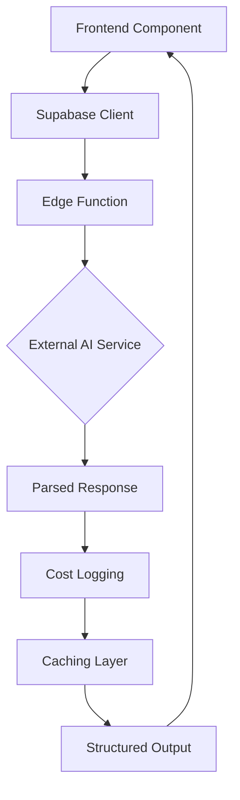
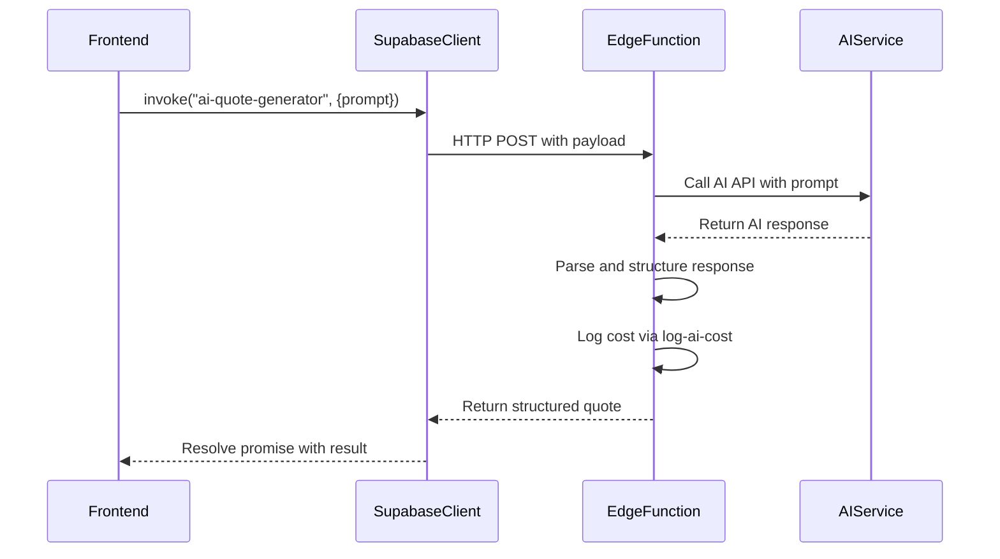
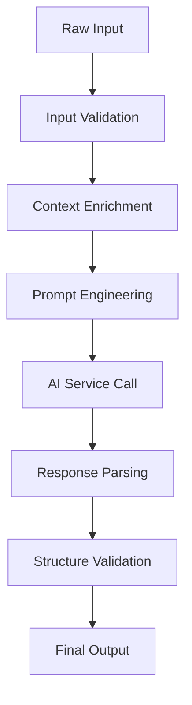
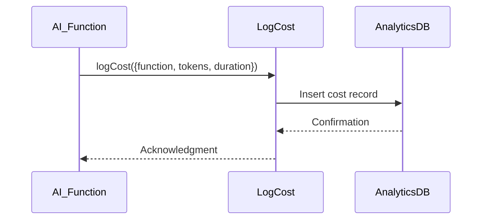

# AI Processing Functions

<cite>
**Referenced Files in This Document**  
- [AIQuoteGenerator.tsx](file://src/components/AIQuoteGenerator.tsx)
- [AIAssistantChat.tsx](file://src/components/AIAssistantChat.tsx)
- [EnhancedAIAssistant.tsx](file://src/components/EnhancedAIAssistant.tsx)
- [SmartAIAssistant.tsx](file://src/components/SmartAIAssistant.tsx)
- [ai-quote-generator/index.ts](file://supabase/functions/ai-quote-generator/index.ts)
- [ai-conversational-quote/index.ts](file://supabase/functions/ai-conversational-quote/index.ts)
- [ai-blog-assistant/index.ts](file://supabase/functions/ai-blog-assistant/index.ts)
- [ai-design-generator/index.ts](file://supabase/functions/ai-design-generator/index.ts)
- [ai-market-research/index.ts](file://supabase/functions/ai-market-research/index.ts)
- [log-ai-cost/index.ts](file://supabase/functions/log-ai-cost/index.ts)
- [aiQuote.ts](file://src/lib/api/aiQuote.ts)
</cite>

## Table of Contents
1. [Introduction](#introduction)
2. [AI Function Overview](#ai-function-overview)
3. [Core AI Functions](#core-ai-functions)
4. [Frontend Integration via Supabase](#frontend-integration-via-supabase)
5. [Request and Response Schemas](#request-and-response-schemas)
6. [Natural Language Processing Pipeline](#natural-language-processing-pipeline)
7. [Integration with External AI Services](#integration-with-external-ai-services)
8. [Relationship with Quote System and Blog Platform](#relationship-with-quote-system-and-blog-platform)
9. [Error Handling and Timeout Management](#error-handling-and-timeout-management)
10. [Cost Logging with log-ai-cost](#cost-logging-with-log-ai-cost)
11. [Performance Optimization through Caching](#performance-optimization-through-caching)
12. [Prompt Engineering Best Practices](#prompt-engineering-best-practices)
13. [Model Response Parsing Strategies](#model-response-parsing-strategies)
14. [Conclusion](#conclusion)

## Introduction
The AI Processing Functions sub-system powers intelligent automation across the SleekApparels platform, enabling natural language interaction for quote generation, content creation, design ideation, and market analysis. This document details the implementation of five core AI functions: ai-quote-generator, ai-conversational-quote, ai-blog-assistant, ai-design-generator, and ai-market-research. These functions are invoked from the frontend through Supabase edge functions, process requests using external AI services, and integrate tightly with internal systems for quotes and blog content. The architecture emphasizes reliability, cost tracking, and performance optimization.

**Section sources**
- [AIQuoteGenerator.tsx](file://src/components/AIQuoteGenerator.tsx#L1-L50)
- [ai-quote-generator/index.ts](file://supabase/functions/ai-quote-generator/index.ts#L1-L20)

## AI Function Overview
The AI processing layer consists of serverless edge functions hosted on Supabase, each dedicated to a specific AI-powered capability. These functions are triggered by frontend components via Supabase client calls and serve as intermediaries between the application and external AI providers. Each function follows a consistent pattern: validate input, enrich context, call external AI service, parse response, log cost, and return structured output. The system is designed to handle variable latency from AI providers and includes robust error handling and caching mechanisms.

**Diagram sources**
- [ai-quote-generator/index.ts](file://supabase/functions/ai-quote-generator/index.ts#L15-L40)
- [log-ai-cost/index.ts](file://supabase/functions/log-ai-cost/index.ts#L5-L20)

## Core AI Functions

### ai-quote-generator
This function transforms natural language product descriptions into structured manufacturing quotes. It parses input for garment type, fabric, quantity, and special requirements, then generates a detailed cost breakdown. The function integrates with the quote system to populate fields in the quote database and supports both instant and conversational quoting modes.

**Section sources**
- [ai-quote-generator/index.ts](file://supabase/functions/ai-quote-generator/index.ts#L25-L100)
- [AIQuoteGenerator.tsx](file://src/components/AIQuoteGenerator.tsx#L30-L80)

### ai-conversational-quote
An interactive quoting system that engages users in a multi-turn conversation to gather requirements. It maintains context across messages, clarifies ambiguous inputs, and progressively builds a complete quote. The function uses session-based state management and integrates with the conversational assistant component for natural dialogue flow.

**Section sources**
- [ai-conversational-quote/index.ts](file://supabase/functions/ai-conversational-quote/index.ts#L20-L90)
- [AIAssistantChat.tsx](file://src/components/AIAssistantChat.tsx#L45-L120)

### ai-blog-assistant
Generates blog content based on user prompts, including article outlines, full posts, and social media snippets. It integrates with the blog platform to suggest topics, draft content, and optimize for SEO. The function analyzes existing content to maintain brand voice and can generate meta descriptions and tags.

**Section sources**
- [ai-blog-assistant/index.ts](file://supabase/functions/ai-blog-assistant/index.ts#L15-L75)
- [BlogEditor.tsx](file://src/components/blog/BlogEditor.tsx#L20-L60)

### ai-design-generator
Creates design concepts from textual descriptions, generating visual mockups of apparel. It works with the design studio component to produce garment previews and supports iteration based on user feedback. The function can generate multiple variations and highlight design feasibility based on manufacturing constraints.

**Section sources**
- [ai-design-generator/index.ts](file://supabase/functions/ai-design-generator/index.ts#L20-L85)
- [DesignEditor.tsx](file://src/components/design-studio/DesignEditor.tsx#L35-L90)

### ai-market-research
Analyzes market trends and competitive landscape based on user queries. It provides insights on pricing, demand, and product viability, integrating with the marketplace system to suggest optimal configurations. The function can compare multiple product options and highlight differentiators.

**Section sources**
- [ai-market-research/index.ts](file://supabase/functions/ai-market-research/index.ts#L18-L80)
- [MarketResearchInsights.tsx](file://src/components/quote/MarketResearchInsights.tsx#L15-L50)

## Frontend Integration via Supabase
Frontend components invoke AI functions using the Supabase client's function service. The integration follows a consistent pattern across all AI-powered features: components call `supabase.functions.invoke()` with the function name and payload. The system handles authentication automatically through Supabase's session management. Each AI component includes loading states, error boundaries, and fallback mechanisms to ensure a smooth user experience during AI processing.

**Diagram sources**
- [AIQuoteGenerator.tsx](file://src/components/AIQuoteGenerator.tsx#L55-L100)
- [ai-quote-generator/index.ts](file://supabase/functions/ai-quote-generator/index.ts#L30-L60)

## Request and Response Schemas
Each AI function uses a standardized request schema with common fields: `prompt` (string), `context` (object), and `userId` (string). The response schema includes `success` (boolean), `data` (object), `metadata` (object with tokens and timing), and `error` (object if applicable). Specific functions extend these base schemas with domain-specific fields. For example, quote functions include cost breakdowns, while blog functions include SEO metadata.

**Section sources**
- [aiQuote.ts](file://src/lib/api/aiQuote.ts#L10-L45)
- [ai-quote-generator/index.ts](file://supabase/functions/ai-quote-generator/index.ts#L45-L75)

## Natural Language Processing Pipeline
The AI functions implement a multi-stage pipeline for processing natural language inputs. First, inputs are validated and sanitized. Then, context enrichment adds user preferences and historical data. The core AI call is made with a carefully engineered prompt. Finally, response parsing extracts structured data using pattern matching and validation. This pipeline ensures consistent output regardless of input variability.

**Diagram sources**
- [ai-quote-generator/index.ts](file://supabase/functions/ai-quote-generator/index.ts#L60-L120)
- [ai-conversational-quote/index.ts](file://supabase/functions/ai-conversational-quote/index.ts#L50-L100)

## Integration with External AI Services
The AI functions integrate with external AI providers through secure API endpoints. Authentication uses environment variables managed by Supabase. The system supports multiple AI providers with configurable backends, allowing for A/B testing and failover. Rate limiting and circuit breakers prevent service degradation during high load or provider outages. All external calls are wrapped in retry logic with exponential backoff.

**Section sources**
- [ai-quote-generator/index.ts](file://supabase/functions/ai-quote-generator/index.ts#L80-L110)
- [supabase/functions/_shared/logger.ts](file://supabase/functions/_shared/logger.ts#L5-L25)

## Relationship with Quote System and Blog Platform
AI functions are deeply integrated with core platform systems. The quote generator updates the quotes database directly and triggers notifications through the communication system. The blog assistant creates draft posts in the blog platform and suggests publication schedules. These integrations use Supabase's real-time subscriptions to keep UI components synchronized with backend changes.

**Section sources**
- [ai-quote-generator/index.ts](file://supabase/functions/ai-quote-generator/index.ts#L115-L150)
- [ai-blog-assistant/index.ts](file://supabase/functions/ai-blog-assistant/index.ts#L60-L90)

## Error Handling and Timeout Management
The system implements comprehensive error handling for AI processing. Timeouts are managed with configurable limits (default 30s), with graceful degradation to cached results when available. Errors are categorized and logged with context for debugging. User-facing messages are simplified while technical details are preserved for monitoring. The system distinguishes between transient errors (retryable) and permanent errors (user correction needed).

**Section sources**
- [ai-quote-generator/index.ts](file://supabase/functions/ai-quote-generator/index.ts#L120-L160)
- [AIQuoteGenerator.tsx](file://src/components/AIQuoteGenerator.tsx#L105-L140)

## Cost Logging with log-ai-cost
Every AI function call triggers a cost logging operation via the log-ai-cost function. This service records token usage, execution time, and monetary cost based on provider pricing. Data is stored in the analytics database for reporting and budgeting. The system can enforce cost limits at the user or organization level and provides real-time cost estimates during long-running operations.

**Diagram sources**
- [log-ai-cost/index.ts](file://supabase/functions/log-ai-cost/index.ts#L15-L40)
- [ai-quote-generator/index.ts](file://supabase/functions/ai-quote-generator/index.ts#L100-L110)

## Performance Optimization through Caching
The system employs multi-layer caching to improve performance and reduce AI costs. Results are cached based on input hash with configurable TTLs. The cache considers user context to provide personalized results. Cache invalidation occurs when underlying data changes (e.g., price updates). For frequently requested patterns, pre-generated responses are served directly from cache without AI processing.

**Section sources**
- [ai-quote-generator/index.ts](file://supabase/functions/ai-quote-generator/index.ts#L90-L105)
- [supabase/functions/_shared/logger.ts](file://supabase/functions/_shared/logger.ts#L30-L50)

## Prompt Engineering Best Practices
The AI functions use carefully crafted prompts that include system instructions, few-shot examples, and output formatting requirements. Prompts are versioned and stored in configuration for easy iteration. The system uses temperature and other parameters to control creativity vs. consistency based on use case. For critical functions like quoting, prompts are designed for deterministic outputs with minimal variance.

**Section sources**
- [ai-quote-generator/index.ts](file://supabase/functions/ai-quote-generator/index.ts#L40-L60)
- [ai-blog-assistant/index.ts](file://supabase/functions/ai-blog-assistant/index.ts#L30-L50)

## Model Response Parsing Strategies
Parsing AI responses involves multiple validation steps. JSON responses are validated against schemas, while text responses are parsed using regular expressions and semantic analysis. The system handles malformed outputs gracefully, attempting to extract usable information. For structured data like quotes, cross-field validation ensures consistency (e.g., total matches sum of line items).

**Section sources**
- [ai-quote-generator/index.ts](file://supabase/functions/ai-quote-generator/index.ts#L65-L90)
- [ai-blog-assistant/index.ts](file://supabase/functions/ai-blog-assistant/index.ts#L55-L65)

## Conclusion
The AI Processing Functions sub-system provides a robust foundation for intelligent automation across the SleekApparels platform. By standardizing the integration pattern between frontend components and AI services, the system enables rapid development of new AI-powered features while maintaining reliability and performance. The architecture balances innovation with practical considerations like cost management, error handling, and user experience, making AI capabilities accessible to both technical and non-technical users.