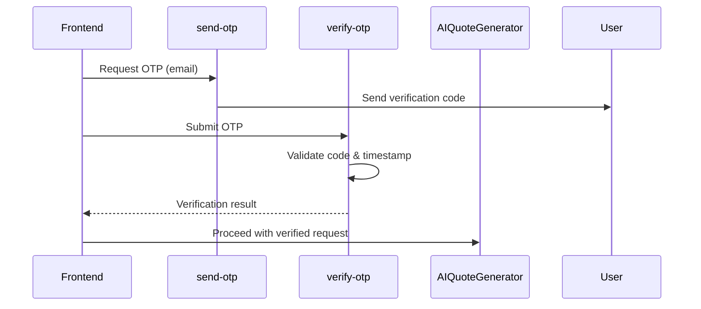
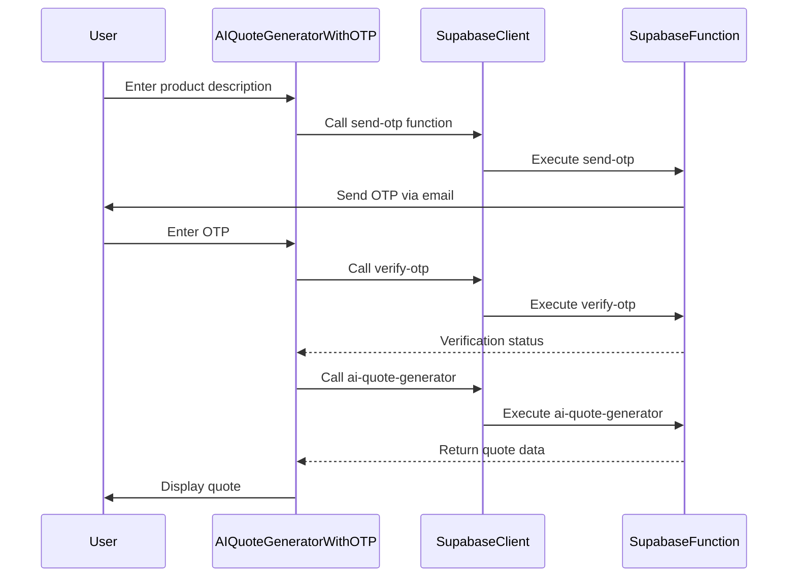
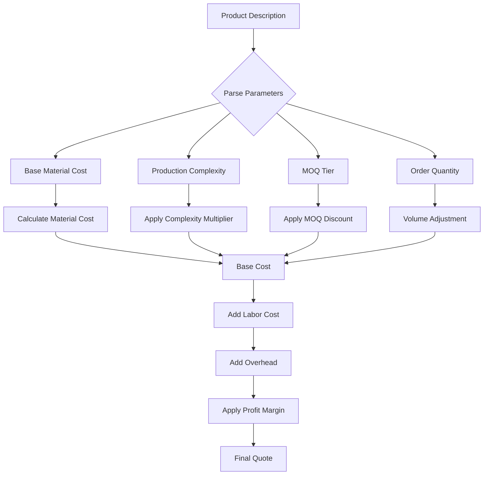

# AI Quote Generator

<cite>
**Referenced Files in This Document**  
- [AIQuoteGeneratorWithOTP.tsx](file://src/components/AIQuoteGeneratorWithOTP.tsx)
- [ai-quote-generator/index.ts](file://supabase/functions/ai-quote-generator/index.ts)
- [parse-quote-description/index.ts](file://supabase/functions/parse-quote-description/index.ts)
- [send-otp/index.ts](file://supabase/functions/send-otp/index.ts)
- [verify-otp/index.ts](file://supabase/functions/verify-otp/index.ts)
- [log-ai-cost/index.ts](file://supabase/functions/log-ai-cost/index.ts)
</cite>

## Table of Contents
1. [Introduction](#introduction)
2. [Core Functionality](#core-functionality)
3. [Request/Response Schema](#requestresponse-schema)
4. [OTP Verification Integration](#otp-verification-integration)
5. [Cost Tracking with log-ai-cost](#cost-tracking-with-log-ai-cost)
6. [Frontend Invocation Example](#frontend-invocation-example)
7. [Natural Language Parsing Logic](#natural-language-parsing-logic)
8. [Material Alternatives Handling](#material-alternatives-handling)
9. [Pricing Logic Based on MOQ and Complexity](#pricing-logic-based-on-moq-and-complexity)
10. [Error Handling and Common Issues](#error-handling-and-common-issues)
11. [Performance Optimization Strategies](#performance-optimization-strategies)
12. [Conclusion](#conclusion)

## Introduction
The AI Quote Generator is a core feature of the SleekApparels platform that enables users to generate manufacturing quotes by inputting natural language product descriptions. This system leverages AI models to interpret unstructured text, extract relevant manufacturing parameters, and produce structured, accurate cost estimates. The process is secured through OTP verification and includes comprehensive cost tracking for AI usage.

## Core Functionality
The AI Quote Generator processes user-submitted product descriptions through a multi-stage pipeline:
1. Natural language input parsing
2. Parameter extraction and validation
3. Manufacturing complexity assessment
4. Cost calculation based on materials, MOQ, and production factors
5. Quote generation and formatting

This functionality is implemented through a combination of frontend components and backend Supabase functions that work together to deliver a seamless quoting experience.

**Section sources**
- [AIQuoteGeneratorWithOTP.tsx](file://src/components/AIQuoteGeneratorWithOTP.tsx)
- [ai-quote-generator/index.ts](file://supabase/functions/ai-quote-generator/index.ts)

## Request/Response Schema
The AI Quote Generator uses a standardized JSON schema for communication between frontend and backend:

```json
{
  "description": "string",
  "material": "string",
  "quantity": "number",
  "complexity": "low|medium|high",
  "deadline": "string (ISO date)",
  "email": "string"
}
```

The response schema includes:
```json
{
  "quoteId": "string",
  "estimatedCost": "number",
  "currency": "string",
  "breakdown": {
    "materials": "number",
    "labor": "number",
    "overhead": "number",
    "profitMargin": "number"
  },
  "validUntil": "string",
  "estimatedProductionTime": "string"
}
```

**Section sources**
- [ai-quote-generator/index.ts](file://supabase/functions/ai-quote-generator/index.ts)

## OTP Verification Integration
The quote generation process is protected by a two-step OTP verification system using `send-otp` and `verify-otp` functions:

1. User submits quote request with email
2. `send-otp` function generates and sends a time-limited verification code
3. User enters received OTP
4. `verify-otp` function validates the code before quote processing continues

This security measure prevents abuse and ensures contact information validity.



**Diagram sources**
- [send-otp/index.ts](file://supabase/functions/send-otp/index.ts)
- [verify-otp/index.ts](file://supabase/functions/verify-otp/index.ts)

**Section sources**
- [send-otp/index.ts](file://supabase/functions/send-otp/index.ts)
- [verify-otp/index.ts](file://supabase/functions/verify-otp/index.ts)

## Cost Tracking with log-ai-cost
Each AI quote generation is tracked for cost accounting using the `log-ai-cost` function, which records:
- Model inference time
- Token usage (input and output)
- Computational resources consumed
- Associated user and quote identifiers

This data enables accurate cost monitoring and helps optimize AI model usage across the platform.

**Section sources**
- [log-ai-cost/index.ts](file://supabase/functions/log-ai-cost/index.ts)

## Frontend Invocation Example
The AIQuoteGeneratorWithOTP component demonstrates how the Supabase client is used to invoke the quote generation workflow:



**Diagram sources**
- [AIQuoteGeneratorWithOTP.tsx](file://src/components/AIQuoteGeneratorWithOTP.tsx)

**Section sources**
- [AIQuoteGeneratorWithOTP.tsx](file://src/components/AIQuoteGeneratorWithOTP.tsx)

## Natural Language Parsing Logic
The `parse-quote-description` function analyzes natural language inputs to extract structured manufacturing parameters. The parsing logic includes:
- Material identification and standardization
- Quantity and unit extraction
- Feature and embellishment detection
- Quality requirement interpretation
- Deadline and timeline parsing

The system uses pattern matching and semantic analysis to convert free-form text into structured data for quote calculation.

**Section sources**
- [parse-quote-description/index.ts](file://supabase/functions/parse-quote-description/index.ts)

## Material Alternatives Handling
When primary materials are unavailable or cost-prohibitive, the system suggests alternatives based on:
- Similar physical properties
- Availability in the supplier network
- Cost differentials
- Sustainability metrics
- Production compatibility

The alternative recommendation engine considers both technical suitability and business requirements to provide viable substitution options.

**Section sources**
- [ai-quote-generator/index.ts](file://supabase/functions/ai-quote-generator/index.ts)

## Pricing Logic Based on MOQ and Complexity
The pricing algorithm calculates costs based on multiple factors:



Complexity levels are determined by factors such as:
- Number of components
- Sewing difficulty
- Embellishment requirements
- Quality tolerances

MOQ-based pricing includes tiered discounts for larger orders.

**Diagram sources**
- [ai-quote-generator/index.ts](file://supabase/functions/ai-quote-generator/index.ts)

**Section sources**
- [ai-quote-generator/index.ts](file://supabase/functions/ai-quote-generator/index.ts)

## Error Handling and Common Issues
The system addresses several common issues:

### Malformed Inputs
- Input validation with real-time feedback
- Contextual suggestions for clarification
- Fallback to guided form entry when parsing fails

### Rate Limiting
- Per-user request throttling
- Burst allowance with sustained rate limits
- Exponential backoff recommendations

### Model Latency
- Loading state indicators
- Progress tracking
- Timeout handling with retry options

Error responses follow a standardized format with actionable messages to guide users toward successful quote generation.

**Section sources**
- [AIQuoteGeneratorWithOTP.tsx](file://src/components/AIQuoteGeneratorWithOTP.tsx)
- [ai-quote-generator/index.ts](file://supabase/functions/ai-quote-generator/index.ts)

## Performance Optimization Strategies
To ensure responsive quote generation, the system implements several optimization techniques:

### Caching Strategies
- Response caching for identical or similar descriptions
- Material cost caching with TTL-based invalidation
- Regional pricing cache for faster lookup

### Fallback Mechanisms
- Secondary AI models for redundancy
- Rule-based estimation when AI generation fails
- Human-in-the-loop escalation for complex cases

### Resource Management
- Connection pooling for database access
- Efficient memory usage during processing
- Parallel processing of independent quote components

These optimizations maintain system reliability and responsiveness even under heavy load.

**Section sources**
- [ai-quote-generator/index.ts](file://supabase/functions/ai-quote-generator/index.ts)
- [log-ai-cost/index.ts](file://supabase/functions/log-ai-cost/index.ts)

## Conclusion
The AI Quote Generator provides a sophisticated yet user-friendly interface for obtaining manufacturing quotes through natural language input. By combining AI-powered parsing with robust security measures, comprehensive cost tracking, and intelligent pricing logic, the system delivers accurate estimates while maintaining platform integrity. The integration of OTP verification ensures data quality, while performance optimizations guarantee reliable operation at scale.