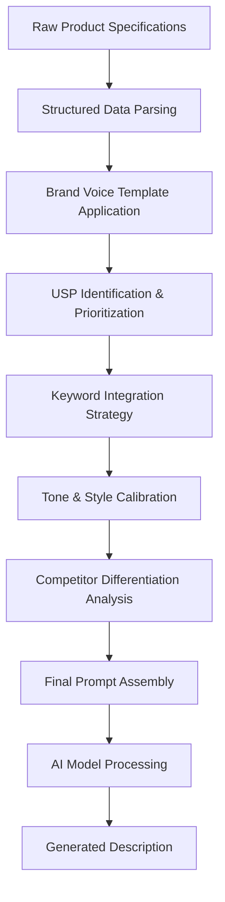
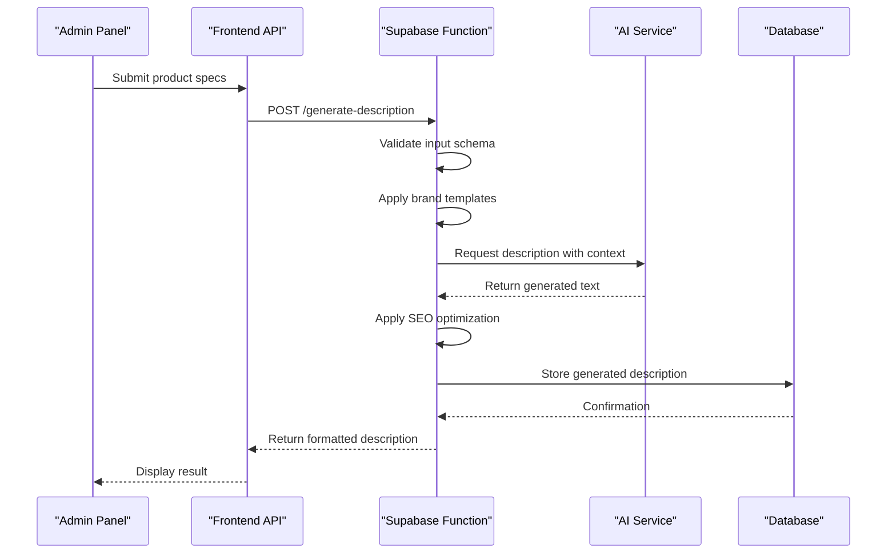
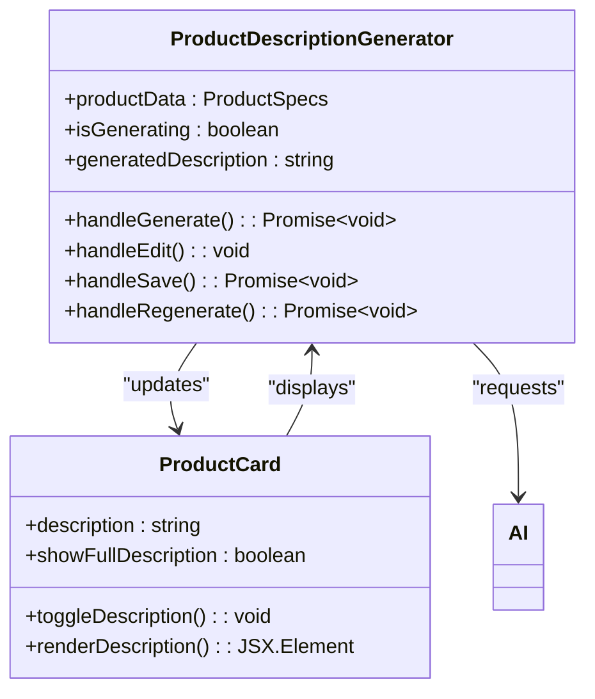
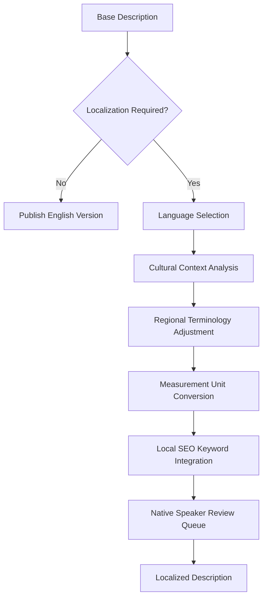
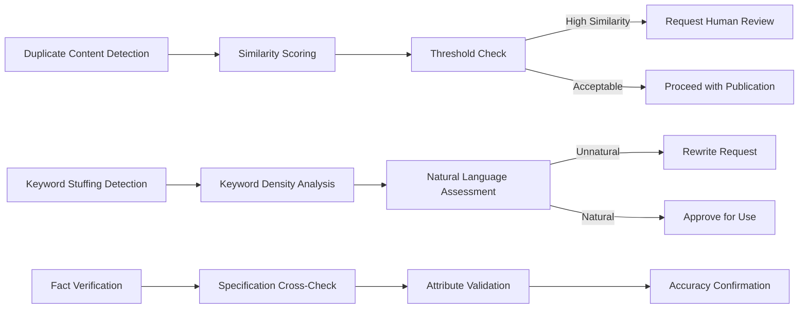
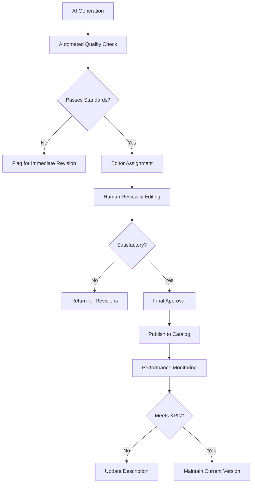

# Generate Product Description

<cite>
**Referenced Files in This Document**  
- [ProductDescriptionGenerator.tsx](file://src/components/admin/ProductDescriptionGenerator.tsx)
- [ProductCard.tsx](file://src/components/products/ProductCard.tsx)
- [generate-product-description/index.ts](file://supabase/functions/generate-product-description/index.ts)
- [aiGeneratedProductImages.ts](file://src/lib/aiGeneratedProductImages.ts)
- [seo.ts](file://src/lib/seo.ts)
- [utils.ts](file://src/lib/utils.ts)
- [database.ts](file://src/types/database.ts)
</cite>

## Table of Contents
1. [Introduction](#introduction)
2. [Function Overview](#function-overview)
3. [Input Schema](#input-schema)
4. [AI Prompt Engineering](#ai-prompt-engineering)
5. [Output Formatting](#output-formatting)
6. [Backend Implementation](#backend-implementation)
7. [Frontend Integration](#frontend-integration)
8. [SEO Optimization](#seo-optimization)
9. [Localization Strategy](#localization-strategy)
10. [Content Quality Challenges](#content-quality-challenges)
11. [Review and Editing Workflow](#review-and-editing-workflow)
12. [Best Practices](#best-practices)

## Introduction
The Generate Product Description feature leverages artificial intelligence to transform technical product specifications into compelling, marketing-ready descriptions optimized for e-commerce platforms. This system enables rapid content creation while maintaining brand consistency and SEO effectiveness across the product catalog.

## Function Overview
The product description generation system creates high-quality, unique product descriptions by processing technical specifications through AI models with carefully engineered prompts. The function integrates with both the admin interface for content creation and the storefront for customer-facing presentation.

**Section sources**
- [ProductDescriptionGenerator.tsx](file://src/components/admin/ProductDescriptionGenerator.tsx#L1-L150)
- [generate-product-description/index.ts](file://supabase/functions/generate-product-description/index.ts#L1-L80)

## Input Schema
The system accepts structured product data through a standardized schema that captures essential attributes for effective description generation:

```json
{
  "material": {
    "primary": "organic cotton",
    "blend": "95% cotton, 5% spandex",
    "texture": "soft brushed",
    "weight": "280gsm"
  },
  "style": {
    "category": "streetwear",
    "fit": "oversized",
    "sleeve": "drop shoulder",
    "neck": "crew neck"
  },
  "features": [
    "reinforced stitching",
    "double-lined hood",
    "kangaroo pocket",
    "ribbed cuffs and hem"
  ],
  "brand_attributes": {
    "voice": "casual and confident",
    "values": ["sustainability", "comfort", "urban style"],
    "target_audience": "young professionals"
  }
}
```

**Section sources**
- [database.ts](file://src/types/database.ts#L150-L200)
- [ProductDescriptionGenerator.tsx](file://src/components/admin/ProductDescriptionGenerator.tsx#L45-L75)

## AI Prompt Engineering
The system employs sophisticated prompt engineering techniques to ensure descriptions align with brand voice and highlight unique selling propositions:



**Diagram sources**
- [generate-product-description/index.ts](file://supabase/functions/generate-product-description/index.ts#L20-L60)
- [utils.ts](file://src/lib/utils.ts#L100-L150)

**Section sources**
- [generate-product-description/index.ts](file://supabase/functions/generate-product-description/index.ts#L15-L70)

## Output Formatting
Generated descriptions follow a standardized format optimized for e-commerce conversion and readability:

```html
<div class="product-description">
  <h3 class="description-title">Premium Comfort, Elevated Style</h3>
  <p class="key-benefit">Experience unmatched comfort with our signature organic cotton blend that gets softer with every wash.</p>
  <ul class="feature-bullets">
    <li>95% certified organic cotton, 5% spandex for perfect stretch</li>
    <li>280gsm heavyweight fabric provides year-round versatility</li>
    <li>Reinforced triple-stitching at stress points for lasting durability</li>
  </ul>
  <div class="lifestyle-context">Ideal for casual Fridays or weekend adventures, this piece transitions seamlessly from day to night.</div>
</div>
```

**Section sources**
- [ProductCard.tsx](file://src/components/products/ProductCard.tsx#L30-L80)
- [seo.ts](file://src/lib/seo.ts#L25-L45)

## Backend Implementation
The serverless function processes description requests with comprehensive validation and optimization:



**Diagram sources**
- [generate-product-description/index.ts](file://supabase/functions/generate-product-description/index.ts#L1-L80)
- [ProductDescriptionGenerator.tsx](file://src/components/admin/ProductDescriptionGenerator.tsx#L80-L120)

**Section sources**
- [generate-product-description/index.ts](file://supabase/functions/generate-product-description/index.ts#L1-L80)

## Frontend Integration
The admin interface provides a seamless workflow for generating and managing product descriptions:



**Diagram sources**
- [ProductDescriptionGenerator.tsx](file://src/components/admin/ProductDescriptionGenerator.tsx#L1-L150)
- [ProductCard.tsx](file://src/components/products/ProductCard.tsx#L1-L100)

**Section sources**
- [ProductDescriptionGenerator.tsx](file://src/components/admin/ProductDescriptionGenerator.tsx#L1-L150)
- [ProductCard.tsx](file://src/components/products/ProductCard.tsx#L1-L100)

## SEO Optimization
The system incorporates multiple SEO best practices to maximize search visibility:


**Diagram sources**
- [seo.ts](file://src/lib/seo.ts#L1-L60)
- [generate-product-description/index.ts](file://supabase/functions/generate-product-description/index.ts#L30-L50)

**Section sources**
- [seo.ts](file://src/lib/seo.ts#L1-L60)

## Localization Strategy
The system supports multi-language product descriptions with cultural adaptation:



**Diagram sources**
- [utils.ts](file://src/lib/utils.ts#L200-L250)
- [generate-product-description/index.ts](file://supabase/functions/generate-product-description/index.ts#L40-L60)

## Content Quality Challenges
The system addresses common AI-generated content issues through multiple safeguards:



**Diagram sources**
- [generate-product-description/index.ts](file://supabase/functions/generate-product-description/index.ts#L50-L75)
- [utils.ts](file://src/lib/utils.ts#L150-L190)

**Section sources**
- [generate-product-description/index.ts](file://supabase/functions/generate-product-description/index.ts#L50-L75)

## Review and Editing Workflow
The system incorporates a comprehensive review process before publication:



**Diagram sources**
- [ProductDescriptionGenerator.tsx](file://src/components/admin/ProductDescriptionGenerator.tsx#L100-L140)
- [utils.ts](file://src/lib/utils.ts#L80-L100)

**Section sources**
- [ProductDescriptionGenerator.tsx](file://src/components/admin/ProductDescriptionGenerator.tsx#L100-L150)

## Best Practices
Key recommendations for effective use of the product description generation system:

1. **Input Quality**: Provide comprehensive, accurate product specifications to ensure high-quality output
2. **Brand Consistency**: Regularly update brand voice templates to maintain consistent messaging
3. **Human Oversight**: Always include human review in the publication workflow
4. **Performance Tracking**: Monitor conversion rates and engagement metrics for generated descriptions
5. **SEO Balance**: Focus on natural language rather than keyword density
6. **Unique Content**: Verify originality across the product catalog to avoid duplicate content penalties
7. **Localization**: Adapt descriptions for cultural relevance in target markets
8. **Continuous Improvement**: Use performance data to refine prompt engineering and templates

**Section sources**
- [ProductDescriptionGenerator.tsx](file://src/components/admin/ProductDescriptionGenerator.tsx#L1-L150)
- [generate-product-description/index.ts](file://supabase/functions/generate-product-description/index.ts#L1-L80)
- [seo.ts](file://src/lib/seo.ts#L1-L60)