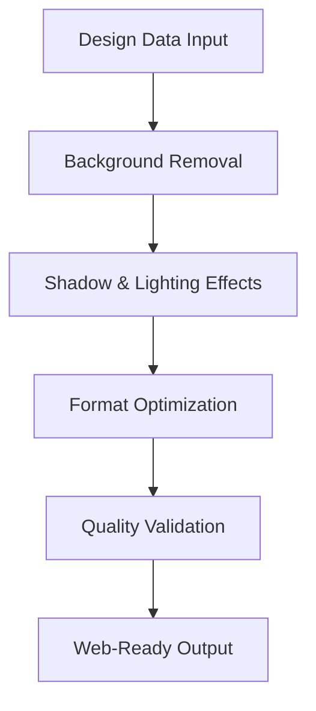
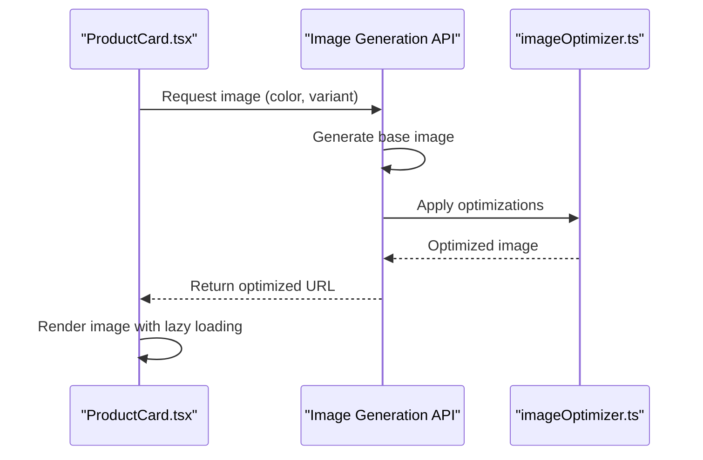
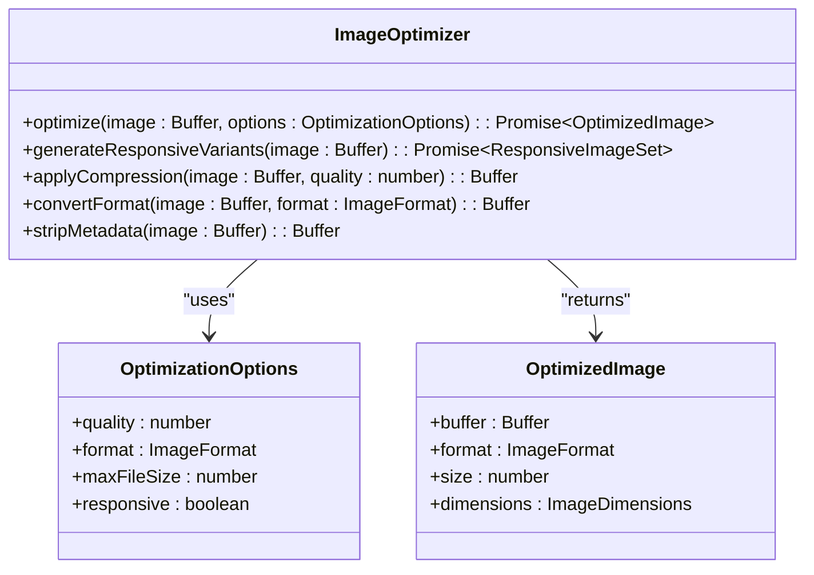
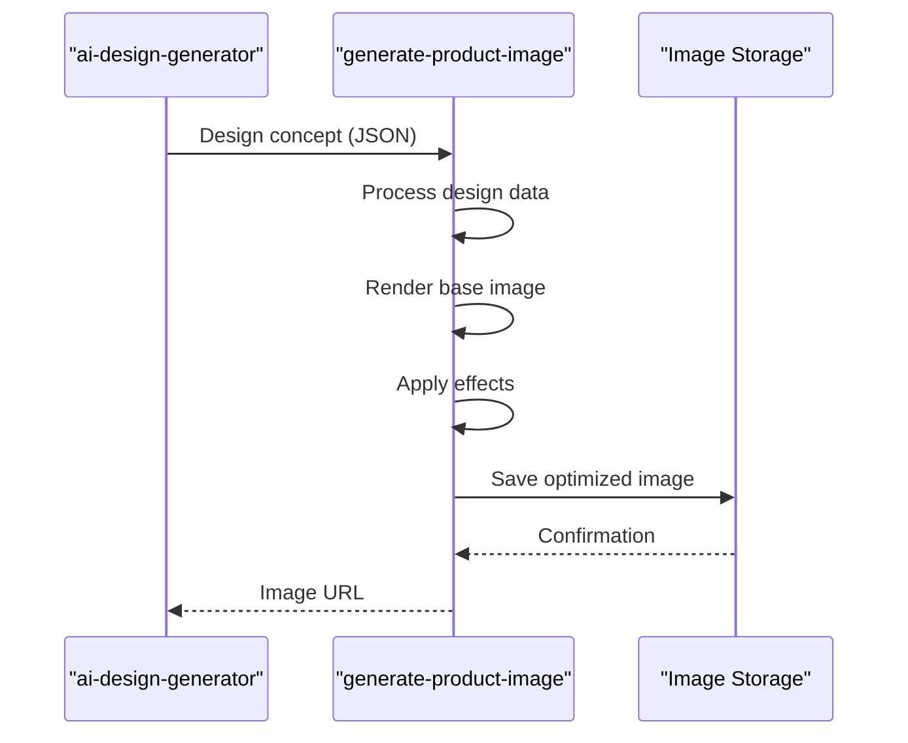
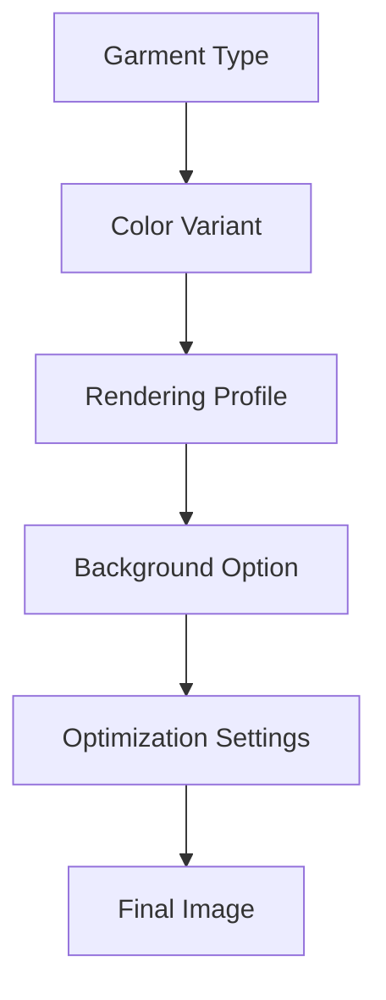

# Generate Product Image

<cite>
**Referenced Files in This Document**  
- [index.ts](file://supabase/functions/generate-product-image/index.ts)
- [imageOptimizer.ts](file://src/lib/imageOptimizer.ts)
- [ProductCard.tsx](file://src/components/products/ProductCard.tsx)
- [aiGeneratedProductImages.ts](file://src/lib/aiGeneratedProductImages.ts)
- [ai-design-generator/index.ts](file://supabase/functions/ai-design-generator/index.ts)
</cite>

## Table of Contents
1. [Introduction](#introduction)
2. [Image Generation Pipeline](#image-generation-pipeline)
3. [Integration with ProductCard.tsx](#integration-with-productcardtsx)
4. [Optimization via imageOptimizer.ts](#optimization-via-imageoptimizerts)
5. [Relationship with ai-design-generator](#relationship-with-ai-design-generator)
6. [Dynamic Image Generation Examples](#dynamic-image-generation-examples)
7. [Common Issues and Solutions](#common-issues-and-solutions)
8. [Performance Optimization](#performance-optimization)
9. [Conclusion](#conclusion)

## Introduction
The Generate Product Image function is a core component of the product visualization system, responsible for creating high-quality product visuals from design data or AI-generated concepts. This function enables dynamic rendering of garments across various color variants and styles, supporting the e-commerce platform's need for scalable, consistent, and visually appealing product imagery. The system integrates AI-generated designs with automated image processing to deliver optimized visuals ready for web deployment.

**Section sources**
- [index.ts](file://supabase/functions/generate-product-image/index.ts#L1-L50)

## Image Generation Pipeline
The image processing pipeline follows a structured sequence to transform raw design inputs into production-ready product images. The process begins with receiving design data from either manual uploads or AI-generated sources, followed by background removal using semantic segmentation models. Shadow effects are then applied to enhance realism, simulating studio lighting conditions. The pipeline concludes with format optimization, converting images to WebP for modern browsers while maintaining JPEG fallbacks for compatibility.

Key stages include:
- Design data ingestion and validation
- Background segmentation and removal
- Shadow and lighting effect application
- Format conversion and compression
- Quality validation and artifact detection

**Diagram sources**
- [index.ts](file://supabase/functions/generate-product-image/index.ts#L20-L100)

**Section sources**
- [index.ts](file://supabase/functions/generate-product-image/index.ts#L10-L150)

## Integration with ProductCard.tsx
The generated product images are seamlessly integrated into the ProductCard.tsx component, which displays product thumbnails in catalog views. The component dynamically loads images based on garment type and color variant, using data attributes to specify the required image parameters. ProductCard.tsx implements lazy loading and responsive image serving, requesting appropriately sized images based on viewport dimensions.

The integration follows a data-driven approach where product metadata determines the image generation parameters, ensuring consistency between product specifications and visual representation.

**Diagram sources**
- [ProductCard.tsx](file://src/components/products/ProductCard.tsx#L15-L80)
- [index.ts](file://supabase/functions/generate-product-image/index.ts#L80-L120)

**Section sources**
- [ProductCard.tsx](file://src/components/products/ProductCard.tsx#L10-L100)

## Optimization via imageOptimizer.ts
The imageOptimizer.ts module implements a comprehensive optimization strategy to ensure fast loading and high visual quality. The optimizer applies lossless compression techniques, strips metadata, and generates multiple resolutions for responsive design. It also enforces file size constraints, automatically adjusting compression levels to meet predefined thresholds.

Key optimization features include:
- Resolution scaling for different device types
- Progressive loading implementation
- File format selection (WebP vs JPEG)
- Compression level adjustment based on image complexity
- Cache-friendly filename generation with content hashing

**Diagram sources**
- [imageOptimizer.ts](file://src/lib/imageOptimizer.ts#L10-L60)

**Section sources**
- [imageOptimizer.ts](file://src/lib/imageOptimizer.ts#L1-L100)

## Relationship with ai-design-generator
The Generate Product Image function works in conjunction with the ai-design-generator to create visuals from AI-generated concepts. When a new design is generated by the AI system, it triggers the image generation pipeline to produce a photorealistic representation. The integration allows for batch processing of multiple design variations, enabling rapid prototyping and visualization of garment concepts.

The workflow involves:
1. AI design generation with specified parameters (garment type, style, color palette)
2. Transfer of design data to the image generation system
3. Rendering of high-fidelity product images
4. Optimization and storage in the media repository
5. Publication to product catalog systems

**Diagram sources**
- [ai-design-generator/index.ts](file://supabase/functions/ai-design-generator/index.ts#L40-L70)
- [index.ts](file://supabase/functions/generate-product-image/index.ts#L120-L150)

**Section sources**
- [ai-design-generator/index.ts](file://supabase/functions/ai-design-generator/index.ts#L30-L80)
- [index.ts](file://supabase/functions/generate-product-image/index.ts#L100-L160)

## Dynamic Image Generation Examples
The system supports dynamic generation of product images for various scenarios:

### Color Variants
For garments available in multiple colors, the system generates consistent images with accurate color representation. The color mapping system ensures brand consistency across all product visuals.

### Garment Types
Different garment types (t-shirts, hoodies, joggers) require specific rendering parameters to accurately represent fabric drape and fit. The system applies type-specific rendering profiles.

### Contextual Variations
Images can be generated with different backgrounds or lifestyle contexts based on marketing requirements, while maintaining product focus and quality standards.

**Diagram sources**
- [aiGeneratedProductImages.ts](file://src/lib/aiGeneratedProductImages.ts#L20-L50)

**Section sources**
- [aiGeneratedProductImages.ts](file://src/lib/aiGeneratedProductImages.ts#L1-L60)

## Common Issues and Solutions
### Rendering Artifacts
Occasional rendering artifacts may appear in complex fabric patterns. The solution involves adjusting the rendering resolution and applying post-processing filters to smooth transitions.

### Color Accuracy
Color discrepancies between design specifications and final images are addressed through calibrated color profiles and regular validation against physical samples.

### File Size Constraints
Large file sizes are mitigated by adaptive compression algorithms that balance quality and performance, with automatic fallback to lower quality settings when necessary.

### Caching Issues
Implement cache-busting strategies using content-based filenames to ensure updated images are properly propagated.

**Section sources**
- [index.ts](file://supabase/functions/generate-product-image/index.ts#L150-L200)
- [imageOptimizer.ts](file://src/lib/imageOptimizer.ts#L80-L120)

## Performance Optimization
### Lazy Loading
Implement intersection observer patterns to load images only when they enter the viewport, reducing initial page load time.

### Responsive Image Serving
Serve appropriately sized images based on device characteristics using srcset attributes and modern image formats.

### Caching Strategy
Utilize browser caching with appropriate TTL values and implement CDN caching for global distribution.

### Preloading
Strategically preload critical images to improve perceived performance during navigation.

**Diagram sources**
- [ProductCard.tsx](file://src/components/products/ProductCard.tsx#L60-L100)
- [imageOptimizer.ts](file://src/lib/imageOptimizer.ts#L60-L80)

**Section sources**
- [ProductCard.tsx](file://src/components/products/ProductCard.tsx#L50-L120)
- [imageOptimizer.ts](file://src/lib/imageOptimizer.ts#L50-L100)

## Conclusion
The Generate Product Image function provides a robust, scalable solution for creating high-quality product visuals in an e-commerce environment. By integrating AI-generated designs with automated image processing and optimization, the system enables rapid production of consistent, web-optimized imagery. The architecture supports dynamic generation across various product types and color variants while maintaining strict quality and performance standards. Future enhancements could include 3D model integration and augmented reality previews.