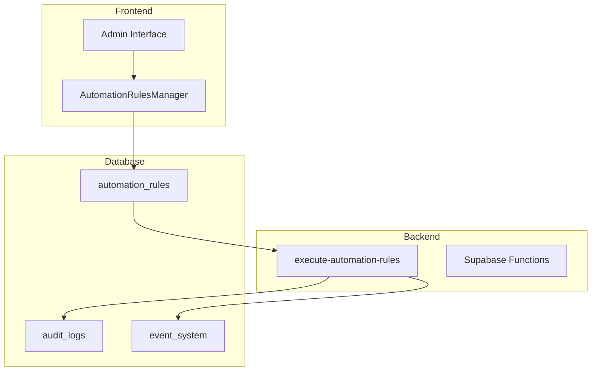
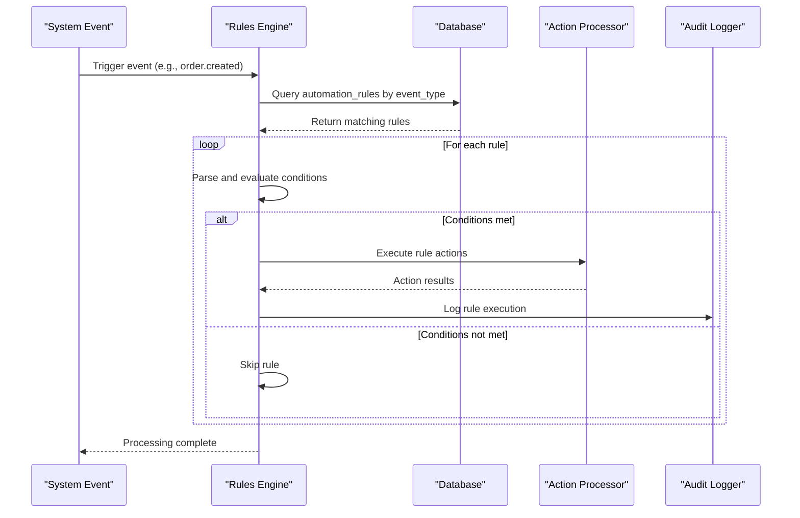
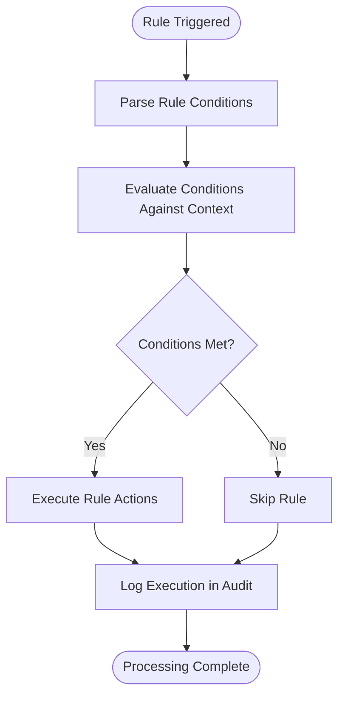
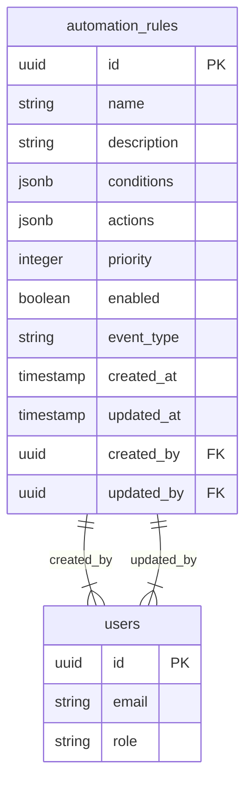
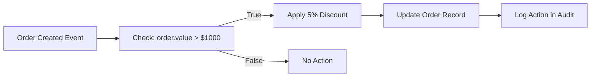
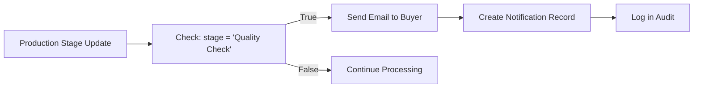
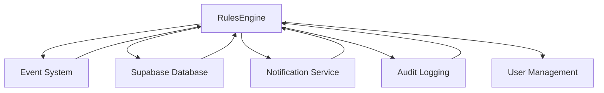

# Automation Rules Engine

<cite>
**Referenced Files in This Document**  
- [AutomationRulesManager.tsx](file://src/components/admin/AutomationRulesManager.tsx)
- [execute-automation-rules/index.ts](file://supabase/functions/execute-automation-rules/index.ts)
- [20251115150759_remix_migration_from_pg_dump.sql](file://supabase/migrations/20251115150759_remix_migration_from_pg_dump.sql)
- [database.ts](file://src/types/database.ts)
- [config.toml](file://supabase/config.toml)
- [auditLog.ts](file://src/lib/auditLog.ts)
- [enhancedAuditLog.ts](file://src/lib/enhancedAuditLog.ts)
</cite>

## Table of Contents
1. [Introduction](#introduction)
2. [Project Structure](#project-structure)
3. [Core Components](#core-components)
4. [Architecture Overview](#architecture-overview)
5. [Detailed Component Analysis](#detailed-component-analysis)
6. [Dependency Analysis](#dependency-analysis)
7. [Performance Considerations](#performance-considerations)
8. [Troubleshooting Guide](#troubleshooting-guide)
9. [Conclusion](#conclusion)

## Introduction
The Automation Rules Engine in SleekApp is a powerful system designed to automate business workflows across order processing, notifications, status updates, and supplier management. This document provides a comprehensive analysis of the rule evaluation and execution system, including condition parsing, action processing, priority-based execution, and integration with the admin interface, event system, and audit logging. The engine enables administrators to define complex automation rules that respond to system events, streamline operations, and reduce manual intervention.

## Project Structure
The Automation Rules Engine is implemented across multiple layers of the application, with components in the frontend admin interface, backend Supabase functions, and database schema. The system follows a modular architecture with clear separation between rule definition, execution logic, and monitoring interfaces.

**Diagram sources**
- [AutomationRulesManager.tsx](file://src/components/admin/AutomationRulesManager.tsx)
- [execute-automation-rules/index.ts](file://supabase/functions/execute-automation-rules/index.ts)
- [20251115150759_remix_migration_from_pg_dump.sql](file://supabase/migrations/20251115150759_remix_migration_from_pg_dump.sql)

**Section sources**
- [AutomationRulesManager.tsx](file://src/components/admin/AutomationRulesManager.tsx)
- [execute-automation-rules/index.ts](file://supabase/functions/execute-automation-rules/index.ts)

## Core Components
The Automation Rules Engine consists of three primary components: the rule definition interface, the rule execution engine, and the monitoring and audit system. The rule definition interface allows administrators to create and manage automation rules through a visual editor. The execution engine processes rules in response to system events, evaluating conditions and executing actions. The monitoring system provides visibility into rule execution and maintains audit trails for compliance and debugging.

**Section sources**
- [AutomationRulesManager.tsx](file://src/components/admin/AutomationRulesManager.tsx)
- [execute-automation-rules/index.ts](file://supabase/functions/execute-automation-rules/index.ts)

## Architecture Overview
The Automation Rules Engine follows an event-driven architecture where system events trigger rule evaluation. When an event occurs (such as order creation or status change), the system queries the automation_rules table for applicable rules, evaluates their conditions, and executes actions for rules that match. The architecture prioritizes reliability, scalability, and observability, with comprehensive logging and error handling.

**Diagram sources**
- [execute-automation-rules/index.ts](file://supabase/functions/execute-automation-rules/index.ts)
- [20251115150759_remix_migration_from_pg_dump.sql](file://supabase/migrations/20251115150759_remix_migration_from_pg_dump.sql)

## Detailed Component Analysis

### Rule Evaluation System
The rule evaluation system processes automation rules by first identifying relevant rules for a given event, then evaluating their conditions, and finally executing actions for rules that match. The system uses a priority-based execution model where rules with higher priority are evaluated first, allowing administrators to control the order of operations.

#### Condition Parsing

**Diagram sources**
- [execute-automation-rules/index.ts](file://supabase/functions/execute-automation-rules/index.ts)

#### Action Processing
The action processing component handles the execution of rule actions, which can include updating records, sending notifications, creating related entities, or invoking external services. Actions are processed sequentially within a rule, and the system supports both synchronous and asynchronous action types.

**Section sources**
- [execute-automation-rules/index.ts](file://supabase/functions/execute-automation-rules/index.ts)

### Data Model
The automation_rules table stores all automation rules with fields for conditions, actions, and metadata. The table structure supports complex rule definitions with flexible condition and action configurations.

**Diagram sources**
- [20251115150759_remix_migration_from_pg_dump.sql](file://supabase/migrations/20251115150759_remix_migration_from_pg_dump.sql)
- [database.ts](file://src/types/database.ts)

### Sample Rules Implementation
The system supports various automation scenarios including order processing, notification triggering, and status updates. Sample rules demonstrate the flexibility of the condition-action pattern.

#### Order Processing Rule

**Diagram sources**
- [execute-automation-rules/index.ts](file://supabase/functions/execute-automation-rules/index.ts)

#### Notification Triggering Rule

**Diagram sources**
- [execute-automation-rules/index.ts](file://supabase/functions/execute-automation-rules/index.ts)

## Dependency Analysis
The Automation Rules Engine depends on several core systems within SleekApp, including the event system, database, notification service, and audit logging. These dependencies enable the engine to respond to system events, persist rule definitions, execute actions, and maintain execution records.

**Diagram sources**
- [execute-automation-rules/index.ts](file://supabase/functions/execute-automation-rules/index.ts)
- [enhancedAuditLog.ts](file://src/lib/enhancedAuditLog.ts)

**Section sources**
- [execute-automation-rules/index.ts](file://supabase/functions/execute-automation-rules/index.ts)
- [enhancedAuditLog.ts](file://src/lib/enhancedAuditLog.ts)

## Performance Considerations
The Automation Rules Engine is designed with performance in mind, using efficient database queries, caching where appropriate, and asynchronous processing for non-critical actions. The system implements several optimizations to handle high volumes of events and rules without impacting overall application performance.

- **Indexing Strategy**: The automation_rules table is indexed on event_type and priority fields to enable fast rule lookup
- **Batch Processing**: Multiple rules for the same event are processed in a single execution context to minimize overhead
- **Condition Caching**: Frequently used condition expressions are cached to avoid repeated parsing
- **Rate Limiting**: The system implements rate limiting to prevent abuse and ensure fair resource allocation

## Troubleshooting Guide
Common issues with the Automation Rules Engine include infinite loops, rule conflicts, and performance bottlenecks. This section provides guidance on identifying and resolving these issues.

### Infinite Loop Prevention
Infinite loops can occur when rules trigger events that cause the same rules to execute repeatedly. The system prevents this through:

- **Execution Depth Tracking**: The system tracks the depth of rule execution and limits recursive calls
- **Event Suppression**: Rules can be configured to suppress events they generate to prevent feedback loops
- **Cycle Detection**: The system detects circular dependencies between rules and alerts administrators

**Section sources**
- [execute-automation-rules/index.ts](file://supabase/functions/execute-automation-rules/index.ts)

### Rule Conflict Resolution
When multiple rules apply to the same event, conflicts can arise. The system resolves conflicts through:

- **Priority-Based Execution**: Rules with higher priority values are executed first
- **Explicit Ordering**: Administrators can specify the order of rule execution
- **Mutual Exclusion**: Rules can be configured to exclude other rules from execution

### Performance Bottleneck Identification
Performance issues in rule evaluation can be identified through:

- **Execution Time Monitoring**: The system logs execution time for each rule
- **Query Optimization**: Database queries are optimized with appropriate indexes
- **Resource Usage Tracking**: The system monitors CPU and memory usage during rule execution

## Conclusion
The Automation Rules Engine in SleekApp provides a robust framework for automating business workflows across the platform. By combining a flexible rule definition interface with a reliable execution engine and comprehensive monitoring, the system enables administrators to streamline operations and reduce manual intervention. The engine's modular architecture, event-driven design, and emphasis on performance and reliability make it a powerful tool for workflow automation and system orchestration.