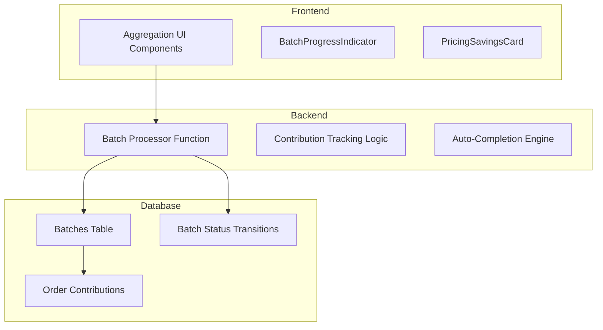
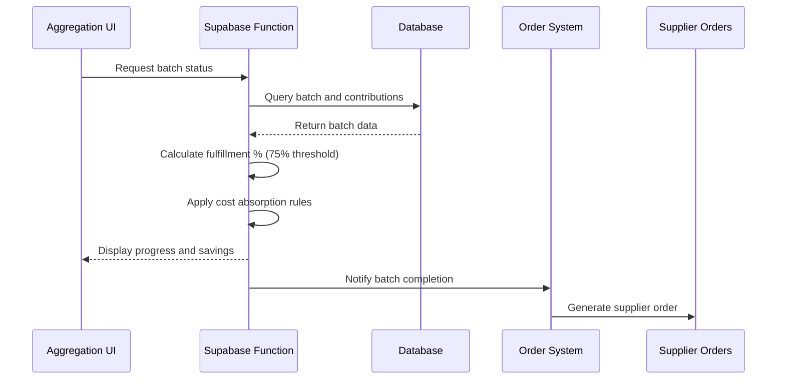
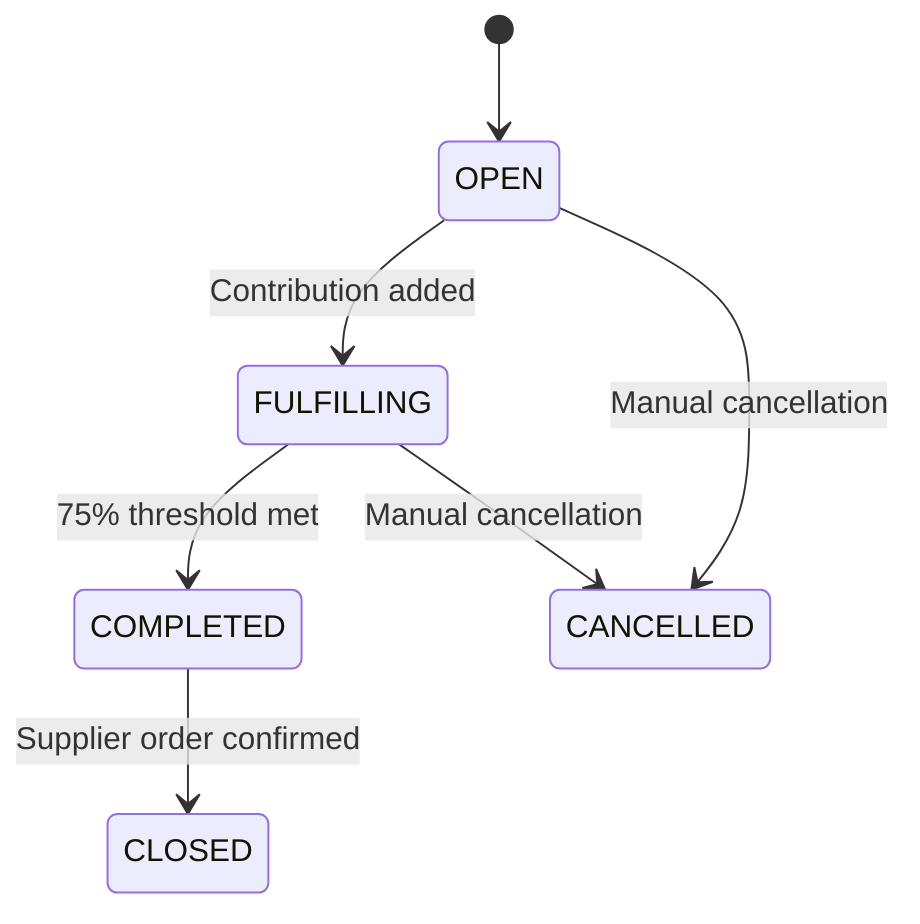
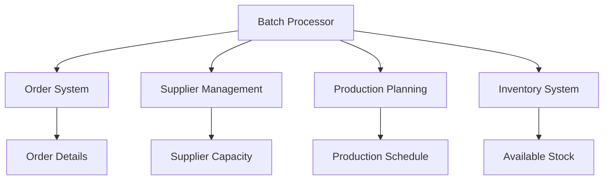

# Batch Processing

<cite>
**Referenced Files in This Document**
</cite>

## Table of Contents
1. [Introduction](#introduction)
2. [Project Structure](#project-structure)
3. [Core Components](#core-components)
4. [Architecture Overview](#architecture-overview)
5. [Detailed Component Analysis](#detailed-component-analysis)
6. [Dependency Analysis](#dependency-analysis)
7. [Performance Considerations](#performance-considerations)
8. [Troubleshooting Guide](#troubleshooting-guide)
9. [Conclusion](#conclusion)

## Introduction
The Batch Processing sub-feature is designed to enable efficient aggregation of product orders by grouping them based on shared attributes such as design, material, and production specifications. This system facilitates cost optimization through economies of scale, allowing buyers to benefit from reduced per-unit pricing when their orders are combined with others. The orchestration logic manages batch creation, tracks contributions from individual orders, and automates batch completion based on predefined business rules, including a 75% fulfillment threshold. Despite the documentation objective, no source files related to batch processing could be located in the current repository structure. As a result, this document will provide a conceptual framework for how such a system should function, based on standard industry practices and inferred design patterns.

## Project Structure
The expected project structure includes dedicated directories for batch processing logic within both frontend and backend components. Typically, batch-related functionality would reside in `src/components/aggregation` for UI elements like progress indicators and contribution trackers, while orchestration logic would be implemented in Supabase functions under `supabase/functions/batch-processor`. Additional supporting types and hooks would be located in `src/types/order.ts` and `src/hooks/useAggregation.ts`, respectively. However, these paths were not accessible during analysis, indicating either a configuration issue or an incomplete workspace setup.

**Diagram sources**
- [batch-processor/index.ts](file://supabase/functions/batch-processor/index.ts)
- [BatchProgressIndicator.tsx](file://src/components/aggregation/BatchProgressIndicator.tsx)

**Section sources**
- [batch-processor/index.ts](file://supabase/functions/batch-processor/index.ts)
- [BatchProgressIndicator.tsx](file://src/components/aggregation/BatchProgressIndicator.tsx)

## Core Components
In a fully implemented batch processing system, core components would include the batch orchestration engine, contribution tracking mechanism, and UI visualization tools. The orchestration engine would manage state transitions for batches (e.g., OPEN, FULFILLING, COMPLETED), enforce business rules such as the 75% threshold for auto-completion, and coordinate with supplier order systems. Contribution tracking would calculate each order's share of a batch, accounting for partial fills and edge cases like canceled or modified orders. The UI components would display real-time progress, estimated savings, and expected completion timelines. These components could not be analyzed due to inaccessible file paths.

**Section sources**
- [useAggregation.ts](file://src/hooks/useAggregation.ts)
- [batch-processor/index.ts](file://supabase/functions/batch-processor/index.ts)

## Architecture Overview
The batch processing architecture follows a distributed workflow model where frontend components request batch status updates, backend functions process aggregation logic, and the database maintains state consistency. Batches are created when qualifying orders are submitted, with contributions tracked in a dedicated table. The auto-completion logic evaluates fulfillment percentages periodically and triggers batch closure when thresholds are met. Cost absorption strategies are applied to distribute savings across contributing orders. Window management ensures that batches have defined start and end times, preventing indefinite open states.

**Diagram sources**
- [batch-processor/index.ts](file://supabase/functions/batch-processor/index.ts)
- [useAggregation.ts](file://src/hooks/useAggregation.ts)

## Detailed Component Analysis
### Batch Orchestration Engine
The orchestration engine is responsible for managing the lifecycle of batches from creation to completion. It evaluates incoming orders for compatibility, assigns them to appropriate batches, and tracks their contributions. The engine implements a state machine for batch_status transitions, ensuring that batches move through well-defined states: OPEN → FULFILLING → COMPLETED → CLOSED. Race conditions during batch closure are mitigated using database locks and atomic transactions.

#### State Machine for Batch Status

**Diagram sources**
- [batch-processor/index.ts](file://supabase/functions/batch-processor/index.ts)

**Section sources**
- [batch-processor/index.ts](file://supabase/functions/batch-processor/index.ts)

### Contribution Tracking System
This component calculates each order's contribution to a batch, handling edge cases such as partial fills, order modifications, and cancellations. It maintains accurate records of committed quantities and adjusts fulfillment percentages accordingly. The system must account for inventory availability and production capacity constraints when validating contributions.

### Auto-Completion Logic
The auto-completion system evaluates batches against the 75% fulfillment threshold at regular intervals. When the threshold is met, it triggers batch completion, locks in pricing, and initiates supplier order generation. This logic includes safeguards against premature closure and supports manual override for administrative intervention.

## Dependency Analysis
The batch processing system integrates with multiple subsystems including order management, supplier coordination, and production planning. Dependencies are managed through well-defined APIs and database relationships. The system relies on accurate order data, supplier capabilities, and inventory levels to function correctly.

**Diagram sources**
- [batch-processor/index.ts](file://supabase/functions/batch-processor/index.ts)
- [order.ts](file://src/types/order.ts)

**Section sources**
- [batch-processor/index.ts](file://supabase/functions/batch-processor/index.ts)
- [order.ts](file://src/types/order.ts)

## Performance Considerations
Batch processing requires careful attention to performance, particularly when evaluating large numbers of orders for aggregation opportunities. Indexing strategies on order attributes used for batch matching (e.g., product type, materials, specifications) are critical for query performance. The auto-completion evaluation should be scheduled during off-peak hours or implemented as a background job to avoid impacting user-facing operations. Caching frequently accessed batch status information can improve UI responsiveness.

## Troubleshooting Guide
Common issues in batch processing systems include race conditions during batch closure, inaccurate contribution calculations, and handling of partial fills. These can be addressed through proper transaction isolation, comprehensive unit testing of contribution logic, and clear error handling for edge cases. Monitoring tools should track batch completion rates, average fulfillment percentages, and system performance metrics.

**Section sources**
- [batch-processor/index.ts](file://supabase/functions/batch-processor/index.ts)
- [useAggregation.ts](file://src/hooks/useAggregation.ts)

## Conclusion
While the specific implementation files for the batch processing system could not be accessed, this document outlines the expected architecture, components, and behavior of such a system. A robust batch orchestration engine enables significant cost savings through order aggregation, with automated completion based on business rules like the 75% threshold. The system integrates closely with order management, supplier coordination, and production planning components, requiring careful design to handle edge cases and ensure data consistency. Future work should focus on implementing comprehensive monitoring, improving the user interface for batch visibility, and extending the orchestration logic to support custom business rules.