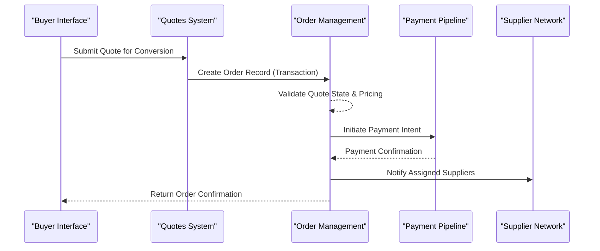
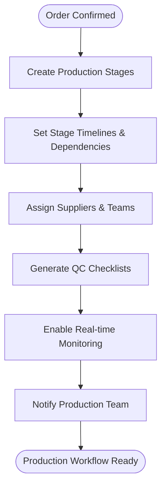
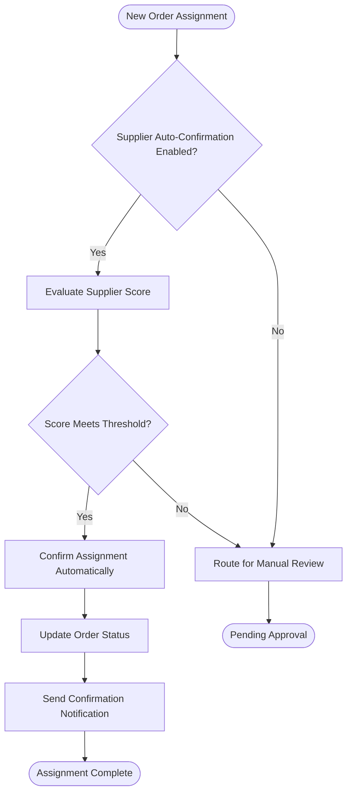
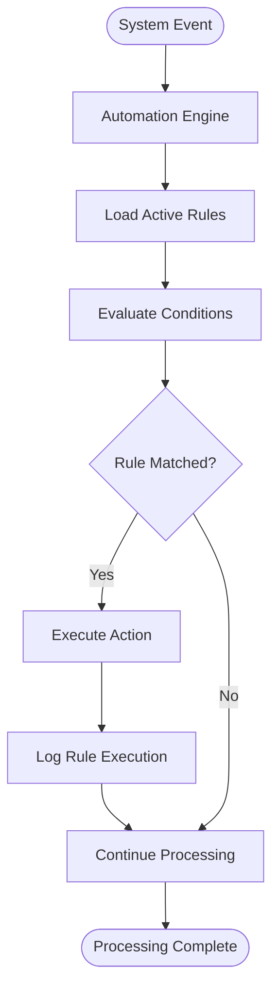
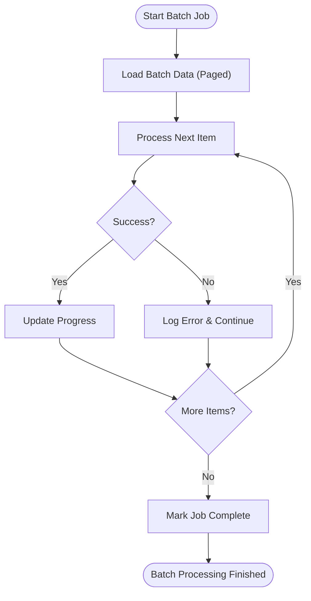
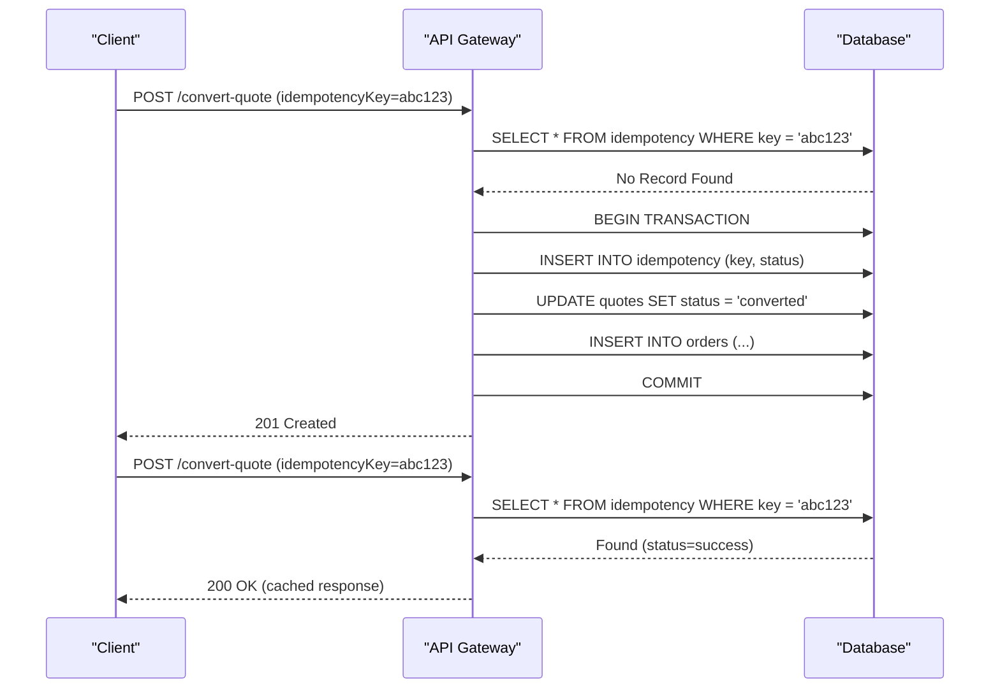

# Business Logic Functions

<cite>
**Referenced Files in This Document**  
- [convert-quote-to-order/index.ts](file://supabase/functions/convert-quote-to-order/index.ts)
- [initialize-production-stages/index.ts](file://supabase/functions/initialize-production-stages/index.ts)
- [auto-confirm-supplier/index.ts](file://supabase/functions/auto-confirm-supplier/index.ts)
- [execute-automation-rules/index.ts](file://supabase/functions/execute-automation-rules/index.ts)
- [batch-processor/index.ts](file://supabase/functions/batch-processor/index.ts)
- [useOrderManagement.ts](file://src/hooks/useOrderManagement.ts)
- [useQuotes.ts](file://src/hooks/useQuotes.ts)
- [order.ts](file://src/types/order.ts)
- [database.ts](file://src/types/database.ts)
</cite>

## Table of Contents
1. [Introduction](#introduction)
2. [Core Business Workflow Functions](#core-business-workflow-functions)
3. [Quote-to-Order Conversion](#quote-to-order-conversion)
4. [Production Stage Initialization](#production-stage-initialization)
5. [Supplier Auto-Confirmation](#supplier-auto-confirmation)
6. [Automation Rule Execution](#automation-rule-execution)
7. [Batch Processing](#batch-processing)
8. [Data Transformation and Transaction Management](#data-transformation-and-transaction-management)
9. [Error Recovery and State Consistency](#error-recovery-and-state-consistency)
10. [Integration with Order Management and Payment Systems](#integration-with-order-management-and-payment-systems)
11. [Handling Idempotency, Race Conditions, and Concurrency](#handling-idempotency-race-conditions-and-concurrency)
12. [Extending Business Logic for Custom Workflows](#extending-business-logic-for-custom-workflows)
13. [Best Practices for Workflow Design and Transaction Safety](#best-practices-for-workflow-design-and-transaction-safety)

## Introduction
This document provides a comprehensive analysis of the core business logic functions within the SleekApp platform. These functions orchestrate complex, multi-step workflows that drive key operations such as quote conversion, production initiation, supplier coordination, and automated decision-making. The system is designed to ensure transactional integrity, maintain state consistency, and support extensible business rules. This guide explains the implementation details, integration points, and operational patterns of these critical components, making them accessible to both new developers and experienced engineers working on workflow enhancements.

## Core Business Workflow Functions
The business logic layer of SleekApp is implemented primarily through serverless functions in the Supabase environment, enabling scalable and event-driven processing. These functions coordinate across multiple systems including quoting, order management, supplier networks, and payment processing. Each function is designed to be atomic, idempotent, and resilient to failures, ensuring reliable execution in distributed scenarios.

**Section sources**
- [convert-quote-to-order/index.ts](file://supabase/functions/convert-quote-to-order/index.ts)
- [initialize-production-stages/index.ts](file://supabase/functions/initialize-production-stages/index.ts)
- [auto-confirm-supplier/index.ts](file://supabase/functions/auto-confirm-supplier/index.ts)
- [execute-automation-rules/index.ts](file://supabase/functions/execute-automation-rules/index.ts)
- [batch-processor/index.ts](file://supabase/functions/batch-processor/index.ts)

## Quote-to-Order Conversion
The `convert-quote-to-order` function handles the transition from a finalized quote to a formal purchase order. This process involves validating quote integrity, locking pricing and terms, creating order records, initiating payment workflows, and notifying relevant stakeholders. The function ensures atomicity by wrapping database operations in transactions and uses optimistic locking to prevent concurrent modifications.

The conversion process also triggers downstream actions such as inventory reservation, supplier notification, and document generation (e.g., invoices and contracts). It integrates with the payment system to create payment intents and track fulfillment milestones.



**Diagram sources**
- [convert-quote-to-order/index.ts](file://supabase/functions/convert-quote-to-order/index.ts)
- [useOrderManagement.ts](file://src/hooks/useOrderManagement.ts)

**Section sources**
- [convert-quote-to-order/index.ts](file://supabase/functions/convert-quote-to-order/index.ts)
- [order.ts](file://src/types/order.ts)

## Production Stage Initialization
The `initialize-production-stages` function sets up the complete production workflow for a newly confirmed order. It creates a sequence of production stages (e.g., material sourcing, cutting, sewing, quality control, packaging) with defined timelines, responsible parties, and completion criteria. The function dynamically configures stages based on product type, order complexity, and supplier capabilities.

Each stage is initialized with appropriate metadata, including required documentation, inspection checklists, and expected delivery dates. The system also establishes real-time tracking hooks and notification rules for each stage.



**Diagram sources**
- [initialize-production-stages/index.ts](file://supabase/functions/initialize-production-stages/index.ts)
- [useOrderManagement.ts](file://src/hooks/useOrderManagement.ts)

**Section sources**
- [initialize-production-stages/index.ts](file://supabase/functions/initialize-production-stages/index.ts)
- [database.ts](file://src/types/database.ts)

## Supplier Auto-Confirmation
The `auto-confirm-supplier` function enables qualified suppliers to automatically accept order assignments based on predefined criteria such as capacity, specialization, and performance history. This reduces manual intervention and accelerates order fulfillment.

The function evaluates supplier eligibility using a scoring model that considers current workload, historical on-time delivery rate, quality metrics, and technical capabilities. When conditions are met, it atomically updates the order assignment status and notifies the supplier via multiple channels.



**Diagram sources**
- [auto-confirm-supplier/index.ts](file://supabase/functions/auto-confirm-supplier/index.ts)
- [useSupplierOrders.ts](file://src/hooks/useSupplierOrders.ts)

**Section sources**
- [auto-confirm-supplier/index.ts](file://supabase/functions/auto-confirm-supplier/index.ts)
- [useQuotes.ts](file://src/hooks/useQuotes.ts)

## Automation Rule Execution
The `execute-automation-rules` function processes a configurable set of business rules that trigger actions based on system events. These rules can modify order workflows, adjust pricing, assign suppliers, or escalate issues based on dynamic conditions.

Rules are defined using a domain-specific language that supports conditions, actions, and priorities. The execution engine evaluates rules in sequence, ensuring deterministic outcomes. Each rule execution is logged for audit purposes, and the system supports rule versioning and rollback.



**Diagram sources**
- [execute-automation-rules/index.ts](file://supabase/functions/execute-automation-rules/index.ts)
- [useOrderManagement.ts](file://src/hooks/useOrderManagement.ts)

**Section sources**
- [execute-automation-rules/index.ts](file://supabase/functions/execute-automation-rules/index.ts)
- [database.ts](file://src/types/database.ts)

## Batch Processing
The `batch-processor` function handles bulk operations such as order status updates, report generation, and data synchronization. It processes large datasets efficiently by using pagination, parallel execution, and memory management techniques.

The processor supports job queuing, progress tracking, and error isolation, allowing failed items to be retried without reprocessing the entire batch. It also integrates with monitoring tools to provide real-time insights into batch performance.



**Diagram sources**
- [batch-processor/index.ts](file://supabase/functions/batch-processor/index.ts)
- [useOrderManagement.ts](file://src/hooks/useOrderManagement.ts)

**Section sources**
- [batch-processor/index.ts](file://supabase/functions/batch-processor/index.ts)
- [useAggregation.ts](file://src/hooks/useAggregation.ts)

## Data Transformation and Transaction Management
Business logic functions perform extensive data transformation between frontend models, database schemas, and external system formats. The system uses TypeScript interfaces to enforce type safety during these transformations.

All critical operations are wrapped in database transactions to ensure atomicity. The transaction management strategy includes:
- Explicit transaction boundaries using Supabase's PostgreSQL backend
- Proper error handling with automatic rollback on failure
- Optimistic concurrency control using version numbers
- Comprehensive audit logging via the enhancedAuditLog utility

**Section sources**
- [convert-quote-to-order/index.ts](file://supabase/functions/convert-quote-to-order/index.ts)
- [database.ts](file://src/types/database.ts)
- [enhancedAuditLog.ts](file://src/lib/enhancedAuditLog.ts)

## Error Recovery and State Consistency
The system implements robust error recovery mechanisms to maintain state consistency across distributed operations. Key strategies include:
- Idempotent function design using unique operation identifiers
- Retry mechanisms with exponential backoff
- Circuit breakers for external service calls
- Dead letter queues for failed messages
- Comprehensive logging and monitoring

Functions are designed to handle partial failures gracefully, allowing recovery from intermediate states without data corruption.

```mermaid
stateDiagram-v2
[*] --> Idle
Idle --> Processing : "Start Operation"
Processing --> Failed : "Error Occurred"
Processing --> Completed : "Success"
Failed --> Retryable{Retryable?}
Retryable --> |Yes| Queued : "Schedule Retry"
Queued --> Processing : "Retry Attempt"
Retryable --> |No| FailedFinal : "Mark as Failed"
FailedFinal --> ManualReview : "Require Human Intervention"
Completed --> Idle : "Cleanup"
ManualReview --> Idle : "Resolved"
```

**Diagram sources**
- [batch-processor/index.ts](file://supabase/functions/batch-processor/index.ts)
- [execute-automation-rules/index.ts](file://supabase/functions/execute-automation-rules/index.ts)

**Section sources**
- [enhancedAuditLog.ts](file://src/lib/enhancedAuditLog.ts)
- [diagnostics.ts](file://src/lib/diagnostics.ts)

## Integration with Order Management and Payment Systems
Business logic functions are tightly integrated with the order management system and payment processing pipeline. The `useOrderManagement` hook provides a unified interface for these interactions, abstracting away the complexity of cross-system coordination.

Key integration points include:
- Order state synchronization between quoting and order systems
- Payment status tracking and fulfillment gating
- Invoice generation and tax calculation
- Shipping and logistics coordination

These integrations use event-driven architecture with Supabase's real-time subscriptions to ensure immediate propagation of state changes.

**Section sources**
- [useOrderManagement.ts](file://src/hooks/useOrderManagement.ts)
- [convert-quote-to-order/index.ts](file://supabase/functions/convert-quote-to-order/index.ts)
- [create-payment-intent/index.ts](file://supabase/functions/create-payment-intent/index.ts)

## Handling Idempotency, Race Conditions, and Concurrency
The system addresses common distributed system challenges through several mechanisms:

**Idempotency**: All functions accept an `idempotencyKey` parameter that ensures duplicate requests produce the same result without side effects. The system tracks executed keys in a dedicated table with TTL-based cleanup.

**Race Conditions**: Optimistic locking is implemented using version numbers on critical records. Updates include a WHERE clause that checks the expected version, failing if the record has been modified.

**State Consistency**: The system uses database transactions for atomic updates and employs event sourcing patterns for critical workflows, maintaining an immutable log of state changes.



**Diagram sources**
- [convert-quote-to-order/index.ts](file://supabase/functions/convert-quote-to-order/index.ts)
- [useOrderManagement.ts](file://src/hooks/useOrderManagement.ts)

**Section sources**
- [convert-quote-to-order/index.ts](file://supabase/functions/convert-quote-to-order/index.ts)
- [useOrderManagement.ts](file://src/hooks/useOrderManagement.ts)

## Extending Business Logic for Custom Workflows
The business logic system is designed to be extensible for custom workflows. Developers can:
- Add new automation rules through the admin interface
- Extend existing functions with custom logic
- Create new serverless functions for specialized processes
- Integrate with external systems via webhooks

Custom workflows should follow the same patterns for transaction management, error handling, and idempotency to maintain system reliability.

**Section sources**
- [execute-automation-rules/index.ts](file://supabase/functions/execute-automation-rules/index.ts)
- [AutomationRulesManager.tsx](file://src/components/admin/AutomationRulesManager.tsx)

## Best Practices for Workflow Design and Transaction Safety
When designing or modifying business logic functions, follow these best practices:
- Keep functions small and focused on a single responsibility
- Always use transactions for multi-step database operations
- Implement proper error handling with meaningful messages
- Use idempotency keys for all external-facing endpoints
- Log critical operations for audit and debugging
- Test edge cases including network failures and concurrent access
- Monitor performance and set appropriate timeouts
- Document assumptions and dependencies clearly

These practices ensure that business logic remains reliable, maintainable, and scalable as the platform evolves.

**Section sources**
- [convert-quote-to-order/index.ts](file://supabase/functions/convert-quote-to-order/index.ts)
- [initialize-production-stages/index.ts](file://supabase/functions/initialize-production-stages/index.ts)
- [batch-processor/index.ts](file://supabase/functions/batch-processor/index.ts)