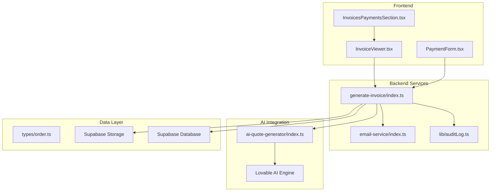
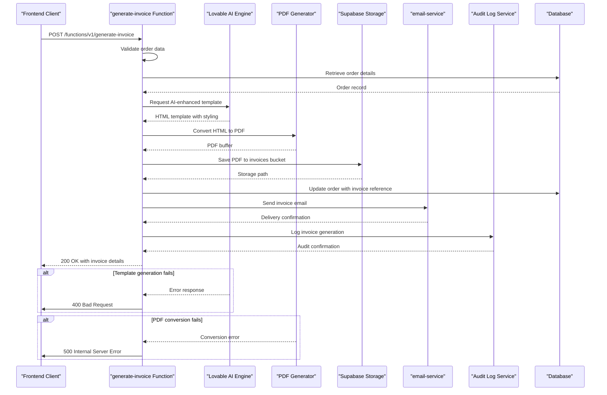
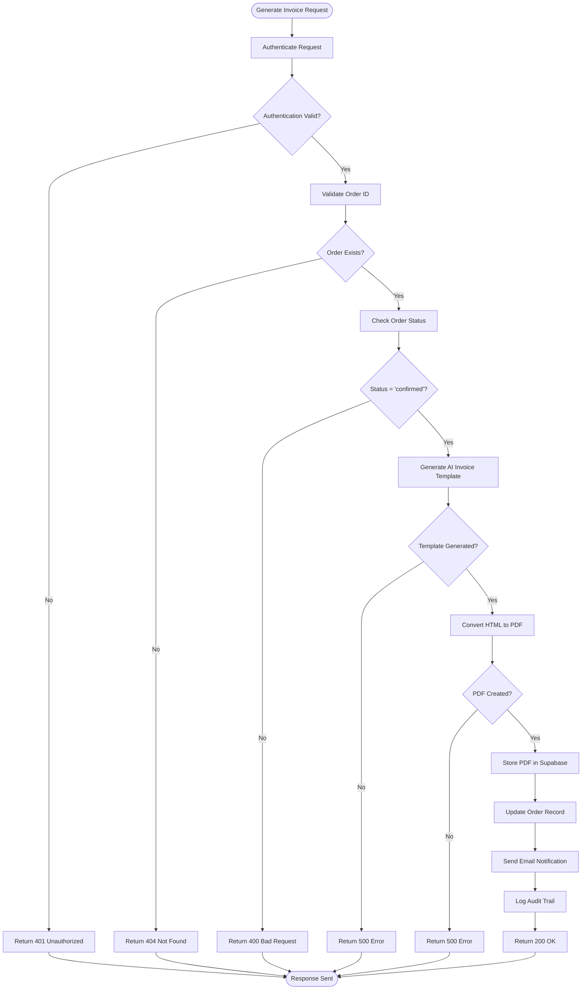
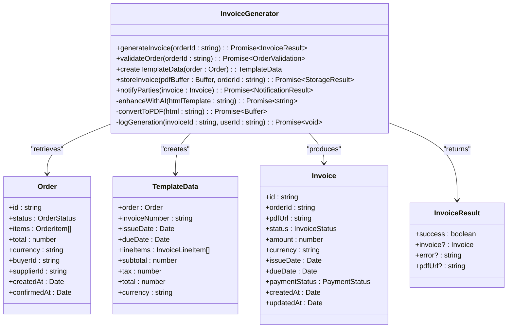
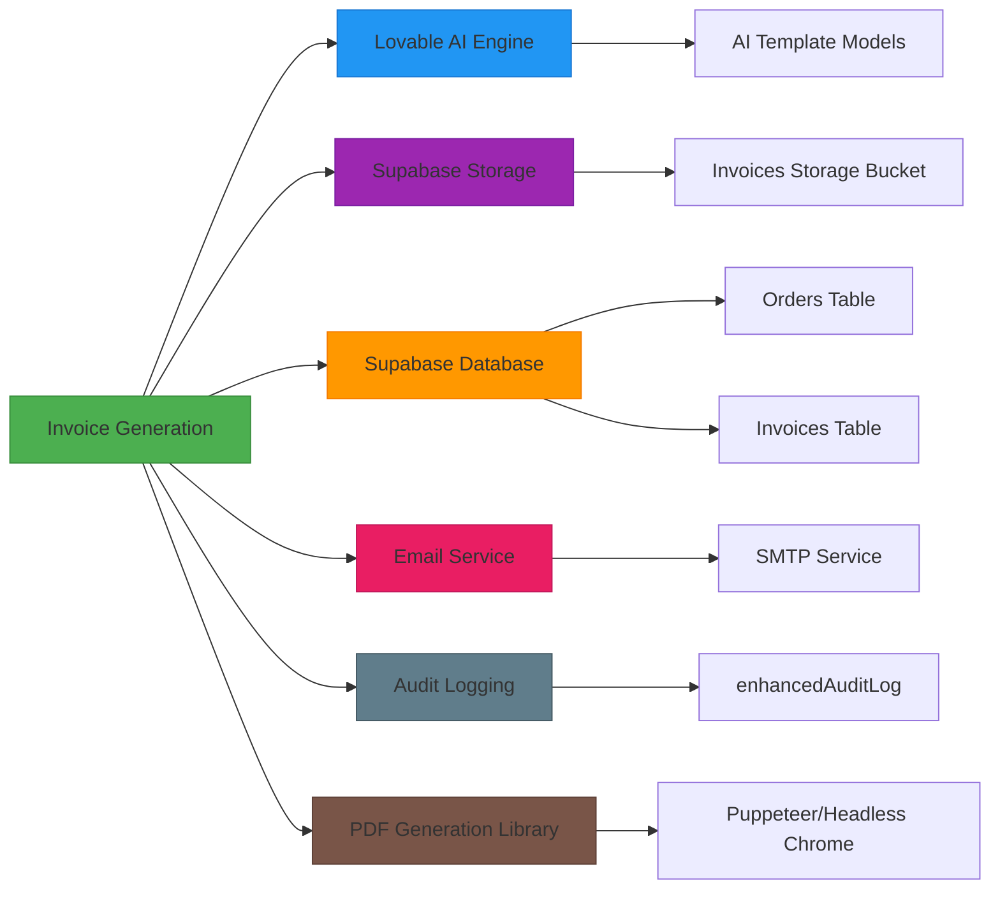

# Invoice Generation

<cite>
**Referenced Files in This Document**  
- [generate-invoice/index.ts](file://supabase/functions/generate-invoice/index.ts)
- [InvoiceViewer.tsx](file://src/components/payment/InvoiceViewer.tsx)
- [PaymentForm.tsx](file://src/components/payment/PaymentForm.tsx)
- [InvoicesPaymentsSection.tsx](file://src/components/buyer/InvoicesPaymentsSection.tsx)
- [email-service/index.ts](file://supabase/functions/email-service/index.ts)
- [ai-quote-generator/index.ts](file://supabase/functions/ai-quote-generator/index.ts)
- [types/order.ts](file://src/types/order.ts)
- [lib/auditLog.ts](file://src/lib/auditLog.ts)
- [lib/enhancedAuditLog.ts](file://src/lib/enhancedAuditLog.ts)
</cite>

## Table of Contents
1. [Introduction](#introduction)
2. [Project Structure](#project-structure)
3. [Core Components](#core-components)
4. [Architecture Overview](#architecture-overview)
5. [Detailed Component Analysis](#detailed-component-analysis)
6. [Dependency Analysis](#dependency-analysis)
7. [Performance Considerations](#performance-considerations)
8. [Troubleshooting Guide](#troubleshooting-guide)
9. [Conclusion](#conclusion)

## Introduction
The Invoice Generation system in SleekApparels is an AI-powered document automation solution designed to create professional, compliant invoices for fashion manufacturing orders. This system integrates with the Lovable AI engine to generate visually appealing invoice layouts while maintaining strict financial controls and audit trails. The implementation covers the complete lifecycle from order conversion to PDF generation, secure storage, and email delivery. The system is tightly integrated with payment processing, accounting workflows, and order management systems to ensure data consistency across the platform.

## Project Structure
The invoice generation functionality is distributed across multiple layers of the application architecture. The core logic resides in Supabase edge functions, while the frontend components provide user interfaces for viewing and managing invoices. The system follows a microservices-inspired pattern with clear separation between generation, storage, notification, and audit functions.

**Diagram sources**
- [generate-invoice/index.ts](file://supabase/functions/generate-invoice/index.ts#L1-L150)
- [InvoiceViewer.tsx](file://src/components/payment/InvoiceViewer.tsx#L1-L80)
- [email-service/index.ts](file://supabase/functions/email-service/index.ts#L1-L60)

**Section sources**
- [generate-invoice/index.ts](file://supabase/functions/generate-invoice/index.ts#L1-L200)
- [src/components/payment](file://src/components/payment#L1-L100)

## Core Components
The invoice generation system consists of several key components that work together to create, process, and deliver invoices. The core functionality is implemented in the `generate-invoice` Supabase function, which orchestrates the entire process. This function is triggered when a quote is converted to an order or when manual invoice generation is requested. The system uses AI to enhance invoice templates with professional layouts and formatting, ensuring brand consistency across all financial documents.

The frontend components provide interfaces for buyers and suppliers to view their invoices, make payments, and track payment status. The `InvoiceViewer` component renders invoices in a user-friendly format, while the `PaymentForm` component handles payment processing integration. The `InvoicesPaymentsSection` provides a comprehensive dashboard for managing multiple invoices and payments.

**Section sources**
- [generate-invoice/index.ts](file://supabase/functions/generate-invoice/index.ts#L25-L100)
- [InvoiceViewer.tsx](file://src/components/payment/InvoiceViewer.tsx#L15-L80)
- [PaymentForm.tsx](file://src/components/payment/PaymentForm.tsx#L20-L90)

## Architecture Overview
The invoice generation architecture follows a serverless, event-driven design pattern. When an invoice generation request is received, the system follows a sequential workflow that ensures data integrity and proper error handling. The process begins with validation of the order data, followed by AI-powered template generation, PDF creation, storage, and notification.

**Diagram sources**
- [generate-invoice/index.ts](file://supabase/functions/generate-invoice/index.ts#L30-L120)
- [email-service/index.ts](file://supabase/functions/email-service/index.ts#L15-L40)
- [lib/auditLog.ts](file://src/lib/auditLog.ts#L10-L30)

## Detailed Component Analysis

### Invoice Generation Process
The invoice generation process is implemented as a Supabase edge function that handles the complete workflow from request to delivery. The function is designed to be idempotent, ensuring that duplicate requests do not create multiple invoices for the same order.

#### Request Processing Flow

**Diagram sources**
- [generate-invoice/index.ts](file://supabase/functions/generate-invoice/index.ts#L45-L150)
- [types/order.ts](file://src/types/order.ts#L50-L80)

**Section sources**
- [generate-invoice/index.ts](file://supabase/functions/generate-invoice/index.ts#L1-L200)
- [types/order.ts](file://src/types/order.ts#L1-L100)

### AI-Powered Template Generation
The system leverages the Lovable AI engine to create professional invoice templates that match the brand identity of SleekApparels. The AI generator enhances basic HTML templates with appropriate styling, layout, and branding elements.

**Diagram sources**
- [generate-invoice/index.ts](file://supabase/functions/generate-invoice/index.ts#L20-L80)
- [types/order.ts](file://src/types/order.ts#L1-L50)

**Section sources**
- [generate-invoice/index.ts](file://supabase/functions/generate-invoice/index.ts#L1-L100)
- [types/order.ts](file://src/types/order.ts#L1-L80)

## Dependency Analysis
The invoice generation system has several critical dependencies that enable its functionality. These dependencies are managed through the Supabase platform and external AI services.

**Diagram sources**
- [generate-invoice/index.ts](file://supabase/functions/generate-invoice/index.ts#L1-L200)
- [email-service/index.ts](file://supabase/functions/email-service/index.ts#L1-L50)
- [lib/auditLog.ts](file://src/lib/auditLog.ts#L1-L20)

**Section sources**
- [generate-invoice/index.ts](file://supabase/functions/generate-invoice/index.ts#L1-L200)
- [email-service/index.ts](file://supabase/functions/email-service/index.ts#L1-L60)
- [lib/auditLog.ts](file://src/lib/auditLog.ts#L1-L30)

## Performance Considerations
The invoice generation system is designed with performance and reliability in mind. The serverless architecture allows for automatic scaling based on demand, ensuring that the system can handle peak loads during high-volume ordering periods. The use of Supabase edge functions minimizes latency by processing requests close to the data storage layer.

The AI template generation process is optimized to reduce response times while maintaining high-quality output. Template caching strategies are employed to avoid redundant AI processing for similar invoice types. PDF generation is performed asynchronously to prevent blocking the main request thread, with appropriate error handling to manage conversion failures.

For high-volume scenarios, the system supports batch invoice generation through the `BulkGenerationTrigger` component. This allows administrators to generate multiple invoices simultaneously, with progress tracking and error reporting for each individual invoice in the batch.

## Troubleshooting Guide
Common issues with the invoice generation system typically fall into three categories: template rendering failures, email delivery problems, and PDF generation quality issues.

### Template Rendering Failures
When AI-powered template generation fails, check the following:
- Verify that the Lovable AI service is accessible and responding
- Ensure that the order data contains all required fields for template population
- Check for proper authentication between the invoice generator and AI service
- Review AI service rate limits and quotas

### Email Delivery Problems
For issues with invoice email delivery:
- Confirm that the recipient email address is valid and properly formatted
- Check the email service configuration and SMTP credentials
- Verify that the email template contains the correct invoice link
- Review spam filtering settings that might block automated emails

### PDF Generation Quality Issues
When PDF output quality is suboptimal:
- Ensure that the HTML template uses web-safe fonts and appropriate styling
- Check image resolution in the template to prevent pixelation
- Verify that all CSS is properly inlined for consistent rendering
- Test with different PDF generation configurations for optimal results

**Section sources**
- [generate-invoice/index.ts](file://supabase/functions/generate-invoice/index.ts#L100-L200)
- [email-service/index.ts](file://supabase/functions/email-service/index.ts#L30-L60)
- [lib/auditLog.ts](file://src/lib/auditLog.ts#L20-L50)

## Conclusion
The Invoice Generation system in SleekApparels provides a robust, AI-powered solution for creating professional financial documents. By integrating with the Lovable AI engine, the system produces visually appealing invoices that enhance the brand experience while maintaining strict financial controls. The architecture ensures reliable delivery through automated workflows, secure storage, and comprehensive audit trails. The system is designed to be extensible, allowing for customization of templates and integration with additional data fields as business needs evolve. With proper monitoring and troubleshooting practices, the system provides a reliable foundation for financial document automation in the fashion manufacturing industry.