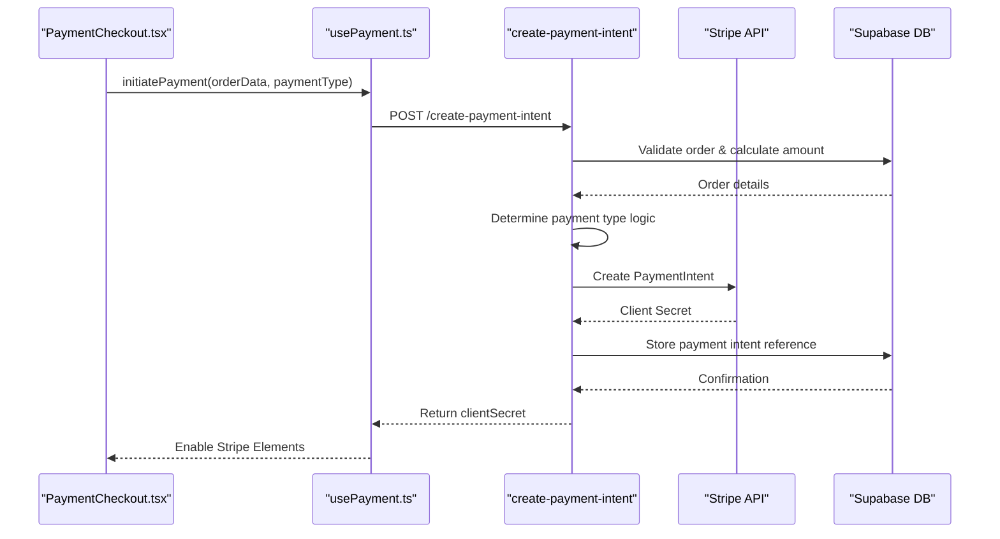
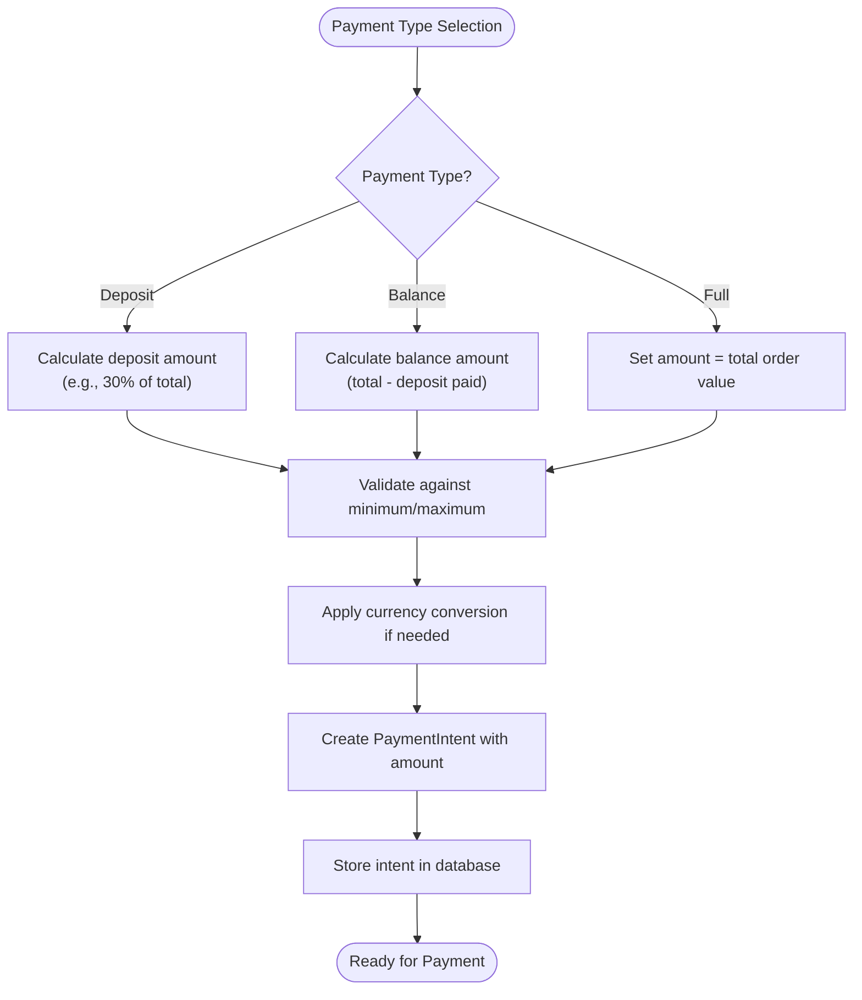
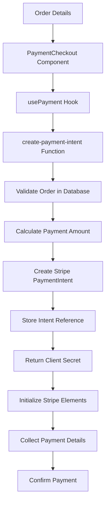
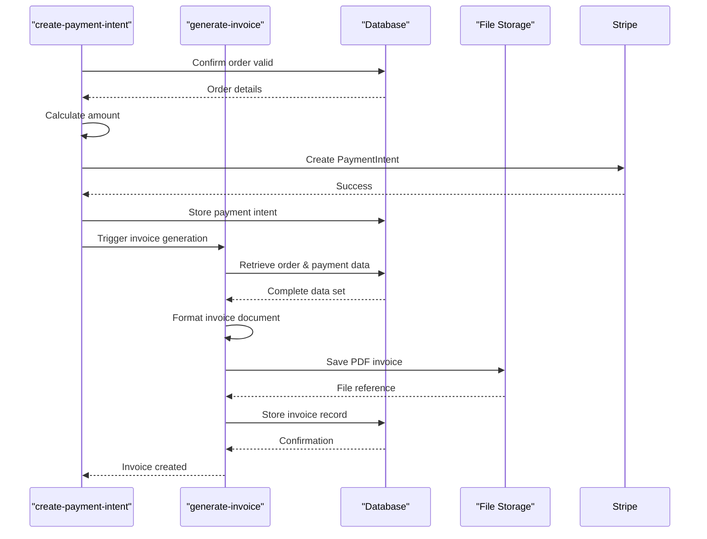
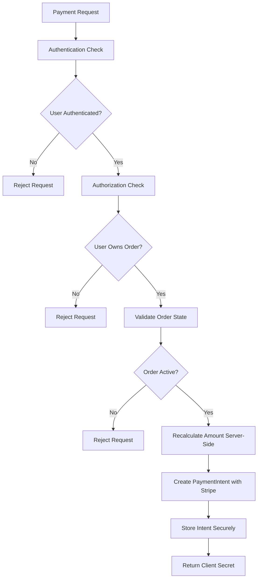
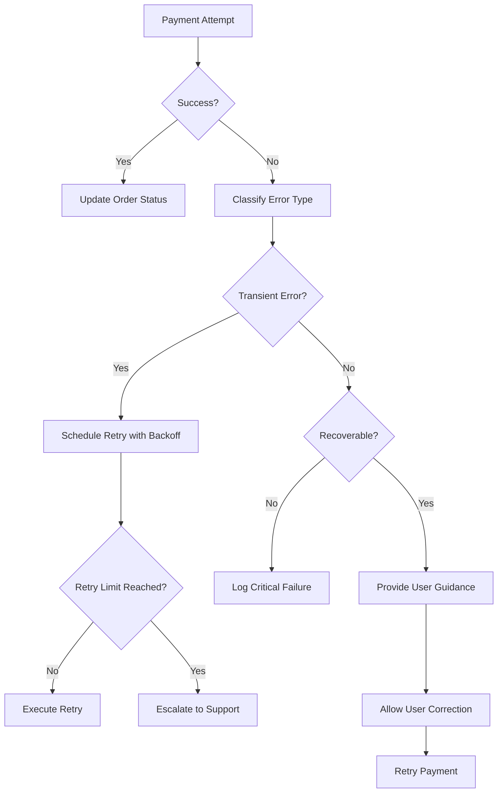
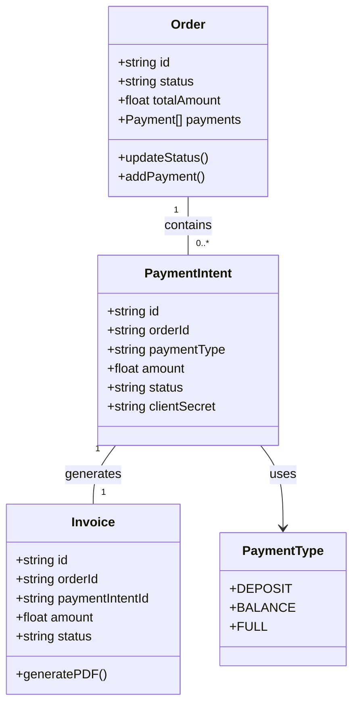

# Payment Intent Creation

<cite>
**Referenced Files in This Document**  
- [create-payment-intent/index.ts](file://supabase/functions/create-payment-intent/index.ts)
- [PaymentForm.tsx](file://src/components/payment/PaymentForm.tsx)
- [PaymentCheckout.tsx](file://src/pages/PaymentCheckout.tsx)
- [usePayment.ts](file://src/hooks/usePayment.ts)
- [order.ts](file://src/types/order.ts)
- [generate-invoice/index.ts](file://supabase/functions/generate-invoice/index.ts)
</cite>

## Table of Contents
1. [Introduction](#introduction)
2. [Payment Intent Overview](#payment-intent-overview)
3. [Payment Types and Amount Calculation](#payment-types-and-amount-calculation)
4. [Data Flow from Order to Payment Intent](#data-flow-from-order-to-payment-intent)
5. [Invoice Generation Process](#invoice-generation-process)
6. [Security Considerations](#security-considerations)
7. [Error Handling and Recovery](#error-handling-and-recovery)
8. [Integration with Order Management System](#integration-with-order-management-system)
9. [Common Issues and Reconciliation](#common-issues-and-reconciliation)
10. [Extensibility and Future Enhancements](#extensibility-and-future-enhancements)

## Introduction
The Payment Intent Creation system in SleekApparels orchestrates financial transactions between buyers and suppliers through Stripe integration. This document details the implementation of payment intent creation, covering payment type handling, amount calculation, invoice generation, and integration with the order management system. The system supports multiple payment types including deposit, balance, and full payments, ensuring financial data integrity across internal records and Stripe.

**Section sources**
- [create-payment-intent/index.ts](file://supabase/functions/create-payment-intent/index.ts)
- [PaymentCheckout.tsx](file://src/pages/PaymentCheckout.tsx)

## Payment Intent Overview
The payment intent system serves as the core mechanism for initiating and managing payments in the SleekApparels platform. Built on Stripe's Payment Intents API, it enables secure transaction processing while maintaining synchronization between frontend checkout experiences and backend financial records. The system creates payment intents based on order details, handles various payment types, and ensures proper state management throughout the payment lifecycle.

**Diagram sources**
- [create-payment-intent/index.ts](file://supabase/functions/create-payment-intent/index.ts)
- [usePayment.ts](file://src/hooks/usePayment.ts)
- [PaymentCheckout.tsx](file://src/pages/PaymentCheckout.tsx)

**Section sources**
- [create-payment-intent/index.ts](file://supabase/functions/create-payment-intent/index.ts)
- [usePayment.ts](file://src/hooks/usePayment.ts)

## Payment Types and Amount Calculation
The system supports three primary payment types: deposit, balance, and full payment. Each type follows specific business rules for amount calculation based on order value, supplier requirements, and buyer preferences. The payment type is determined during checkout and validated server-side to prevent manipulation.

Deposit payments typically represent a percentage of the total order value, calculated according to supplier-defined terms. Balance payments cover the remaining amount after a deposit has been processed. Full payments settle the entire order value in a single transaction.

**Diagram sources**
- [create-payment-intent/index.ts](file://supabase/functions/create-payment-intent/index.ts)
- [order.ts](file://src/types/order.ts)

**Section sources**
- [create-payment-intent/index.ts](file://supabase/functions/create-payment-intent/index.ts)
- [order.ts](file://src/types/order.ts)

## Data Flow from Order to Payment Intent
The data flow from order details to Stripe payment intent involves multiple system components working in concert. When a buyer initiates payment, order information flows from the frontend through a custom hook to a Supabase function that orchestrates the payment intent creation process.

The process begins with the PaymentCheckout component collecting order details and payment preferences. This data is passed to the usePayment hook, which communicates with the create-payment-intent Supabase function. The function validates the order state, calculates the appropriate amount based on payment type, and creates a payment intent with Stripe. Upon successful creation, the client secret is returned to the frontend to initialize Stripe Elements for secure payment collection.

**Diagram sources**
- [PaymentCheckout.tsx](file://src/pages/PaymentCheckout.tsx)
- [usePayment.ts](file://src/hooks/usePayment.ts)
- [create-payment-intent/index.ts](file://supabase/functions/create-payment-intent/index.ts)

**Section sources**
- [PaymentCheckout.tsx](file://src/pages/PaymentCheckout.tsx)
- [usePayment.ts](file://src/hooks/usePayment.ts)
- [create-payment-intent/index.ts](file://supabase/functions/create-payment-intent/index.ts)

## Invoice Generation Process
Invoice generation is tightly coupled with payment intent creation, ensuring financial documentation is created at the appropriate stage of the transaction. The system triggers invoice generation based on payment type and order status, maintaining consistency between payment records and billing documents.

For deposit payments, a preliminary invoice is generated showing the deposit amount and indicating that additional payments will follow. Balance payments trigger updates to existing invoices, reflecting payment application against outstanding balances. Full payments result in complete invoices that close the billing cycle for the order.

The generate-invoice Supabase function is called after successful payment intent creation, receiving order details, payment type, and amount information to create properly formatted invoices stored in the system.

**Diagram sources**
- [create-payment-intent/index.ts](file://supabase/functions/create-payment-intent/index.ts)
- [generate-invoice/index.ts](file://supabase/functions/generate-invoice/index.ts)

**Section sources**
- [create-payment-intent/index.ts](file://supabase/functions/create-payment-intent/index.ts)
- [generate-invoice/index.ts](file://supabase/functions/generate-invoice/index.ts)

## Security Considerations
The payment intent creation system implements multiple security layers to protect financial data and prevent unauthorized transactions. All payment operations occur through secure server-side functions, preventing client-side manipulation of payment amounts or order details.

Sensitive operations are protected by authentication and authorization checks, ensuring only authorized users can initiate payments for their orders. The system validates order ownership before processing any payment request, preventing cross-user access to payment functionality.

Payment amounts are recalculated server-side using trusted order data, eliminating the risk of client-provided amount tampering. All communication with Stripe occurs through secure HTTPS connections, and sensitive data like payment intent IDs are stored securely in the database with appropriate access controls.

**Diagram sources**
- [create-payment-intent/index.ts](file://supabase/functions/create-payment-intent/index.ts)
- [usePayment.ts](file://src/hooks/usePayment.ts)

**Section sources**
- [create-payment-intent/index.ts](file://supabase/functions/create-payment-intent/index.ts)

## Error Handling and Recovery
The system implements comprehensive error handling to manage various failure scenarios during payment intent creation. Errors are categorized and handled appropriately, providing meaningful feedback to users while maintaining system integrity.

Common error scenarios include insufficient funds, network connectivity issues, invalid order states, and Stripe API failures. The system distinguishes between client errors (e.g., invalid payment details) and server errors (e.g., database connectivity), implementing appropriate recovery strategies for each.

Transient errors trigger automatic retry mechanisms with exponential backoff, while permanent errors are logged and reported to the user with clear guidance. Failed payment attempts are recorded in the audit log, and partial payment states are managed to prevent duplicate charges or data inconsistencies.

**Diagram sources**
- [create-payment-intent/index.ts](file://supabase/functions/create-payment-intent/index.ts)
- [usePayment.ts](file://src/hooks/usePayment.ts)

**Section sources**
- [create-payment-intent/index.ts](file://supabase/functions/create-payment-intent/index.ts)

## Integration with Order Management System
The payment intent creation process is deeply integrated with the order management system, ensuring financial and operational data remain synchronized. Payment events trigger updates to order status, production planning, and supplier notifications.

When a payment intent is successfully created, the order management system updates the order's financial status, reflecting the payment type and amount. For deposit payments, the system schedules balance payment reminders based on supplier terms. Full payments trigger order fulfillment workflows, while partial payments update production milestones accordingly.

The integration maintains a complete audit trail of payment activities, linking payment intents to specific orders, users, and timestamps. This enables comprehensive financial reporting and reconciliation between Stripe records and internal accounting.

**Diagram sources**
- [order.ts](file://src/types/order.ts)
- [create-payment-intent/index.ts](file://supabase/functions/create-payment-intent/index.ts)
- [generate-invoice/index.ts](file://supabase/functions/generate-invoice/index.ts)

**Section sources**
- [order.ts](file://src/types/order.ts)
- [create-payment-intent/index.ts](file://supabase/functions/create-payment-intent/index.ts)

## Common Issues and Reconciliation
The system addresses several common issues in payment processing, particularly around currency conversion, partial payments, and reconciliation between Stripe and internal records.

Currency conversion is handled by retrieving current exchange rates through the get-exchange-rates function, ensuring accurate amount calculations for international transactions. The system stores both the original and converted amounts for audit purposes, maintaining transparency in cross-currency payments.

Partial payment management ensures proper tracking of deposits and balance payments, preventing overpayment or underpayment scenarios. The system validates that balance payments do not exceed the remaining order balance and that deposit amounts meet minimum requirements.

Reconciliation processes run periodically to verify consistency between Stripe records and internal payment data. Discrepancies trigger alerts for manual review, and automated correction mechanisms handle minor mismatches within acceptable tolerance thresholds.

**Section sources**
- [create-payment-intent/index.ts](file://supabase/functions/create-payment-intent/index.ts)
- [order.ts](file://src/types/order.ts)

## Extensibility and Future Enhancements
The payment intent creation system is designed with extensibility in mind, allowing for the addition of new payment types, custom pricing models, and integration with alternative payment processors.

New payment types can be added by extending the payment type enumeration and implementing corresponding business logic in the create-payment-intent function. Custom pricing models can be supported through configurable rules that calculate amounts based on order attributes, customer tiers, or promotional campaigns.

Integration with alternative payment processors can be achieved by creating adapter functions that translate the core payment intent interface to the specific API requirements of each processor. This maintains a consistent frontend experience while enabling backend flexibility.

Future enhancements could include support for installment payments, dynamic deposit percentages based on order risk assessment, and advanced reconciliation reporting with variance analysis.

**Section sources**
- [create-payment-intent/index.ts](file://supabase/functions/create-payment-intent/index.ts)
- [usePayment.ts](file://src/hooks/usePayment.ts)