# Production Stage Initialization

<cite>
**Referenced Files in This Document**
- [initialize-production-stages/index.ts](file://supabase/functions/initialize-production-stages/index.ts)
- [production/ProductionStageCard.tsx](file://src/components/production/ProductionStageCard.tsx)
- [production/ProductionStageTimeline.tsx](file://src/components/production/ProductionStageTimeline.tsx)
- [supplier/ProductionStageManager.tsx](file://src/components/supplier/ProductionStageManager.tsx)
- [types/order.ts](file://src/types/order.ts)
- [lib/utils.ts](file://src/lib/utils.ts)
- [migrations/20251121001333_f0e74faa-4a90-4b82-a0ae-86267b97afb3.sql](file://supabase/migrations/20251121001333_f0e74faa-4a90-4b82-a0ae-86267b97afb3.sql)
</cite>

## Table of Contents
1. [Introduction](#introduction)
2. [Stage Template System Architecture](#stage-template-system-architecture)
3. [Category-Based Template Selection](#category-based-template-selection)
4. [Default Stage Creation Process](#default-stage-creation-process)
5. [Target Date Calculation Logic](#target-date-calculation-logic)
6. [Data Flow from Order to Production Stages](#data-flow-from-order-to-production-stages)
7. [Error Handling and Fallback Mechanisms](#error-handling-and-fallback-mechanisms)
8. [Dynamic Stage Generation Examples](#dynamic-stage-generation-examples)
9. [Integration with Production Tracking UI](#integration-with-production-tracking-ui)
10. [Supplier Coordination Workflow](#supplier-coordination-workflow)
11. [Common Issues and Troubleshooting](#common-issues-and-troubleshooting)
12. [Custom Stage Template Configuration](#custom-stage-template-configuration)
13. [Extending Initialization Logic](#extending-initialization-logic)
14. [Conclusion](#conclusion)

## Introduction

The Production Stage Initialization system is responsible for setting up the manufacturing workflow when a new order is created. This sub-feature orchestrates the creation of production stages based on product categories, calculates target completion dates, and populates the production_stages table with the appropriate workflow. The system ensures that each order follows a standardized yet flexible production process tailored to the specific product type and manufacturing requirements.

The initialization process begins when an order is converted from a quote and triggers the `initialize-production-stages` function. This function determines the appropriate stage template based on the product category, generates the sequence of production stages, calculates realistic target dates, and establishes the foundation for production tracking and supplier coordination.

**Section sources**
- [initialize-production-stages/index.ts](file://supabase/functions/initialize-production-stages/index.ts)

## Stage Template System Architecture

The stage template system is designed to provide a flexible framework for defining production workflows across different product categories. The architecture consists of three main components: template definitions, category mapping, and dynamic instantiation.

Template definitions are stored in the database and contain the sequence of stages, duration estimates, dependencies, and required resources for each product category. The system supports hierarchical templates that can inherit from base templates while overriding specific stages for specialized products.

Category mapping establishes the relationship between product types and their corresponding stage templates. This mapping allows the system to automatically select the appropriate template when a new order is created based on the product category specified in the order details.

Dynamic instantiation occurs when the initialization function creates actual production stage records from the selected template. During this process, the system customizes the template based on order-specific factors such as quantity, complexity, and supplier capabilities.

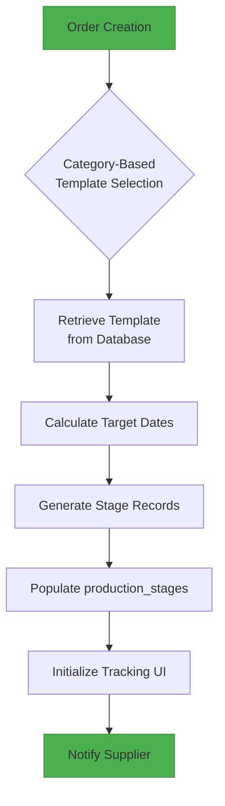

**Diagram sources**
- [initialize-production-stages/index.ts](file://supabase/functions/initialize-production-stages/index.ts)
- [migrations/20251121001333_f0e74faa-4a90-4b82-a0ae-86267b97afb3.sql](file://supabase/migrations/20251121001333_f0e74faa-4a90-4b82-a0ae-86267b97afb3.sql)

**Section sources**
- [initialize-production-stages/index.ts](file://supabase/functions/initialize-production-stages/index.ts)
- [types/order.ts](file://src/types/order.ts)

## Category-Based Template Selection

The category-based template selection mechanism is the core of the production stage initialization system. When a new order is created, the system analyzes the product category and selects the appropriate stage template from the database.

The selection process follows a hierarchical approach:
1. Primary category matching based on the main product type
2. Secondary attribute consideration (e.g., fabric type, construction method)
3. Special requirements evaluation (e.g., certifications, testing)

For example, a "T-Shirt" category might have different templates based on whether it's a basic cotton t-shirt, a performance athletic t-shirt, or an organic cotton t-shirt with eco-certification requirements. The system evaluates these attributes and selects the most appropriate template that addresses all requirements.

The template selection algorithm also considers supplier-specific templates when a supplier has been assigned to the order. Some suppliers may have optimized workflows for certain product types, and the system prioritizes these specialized templates when available.

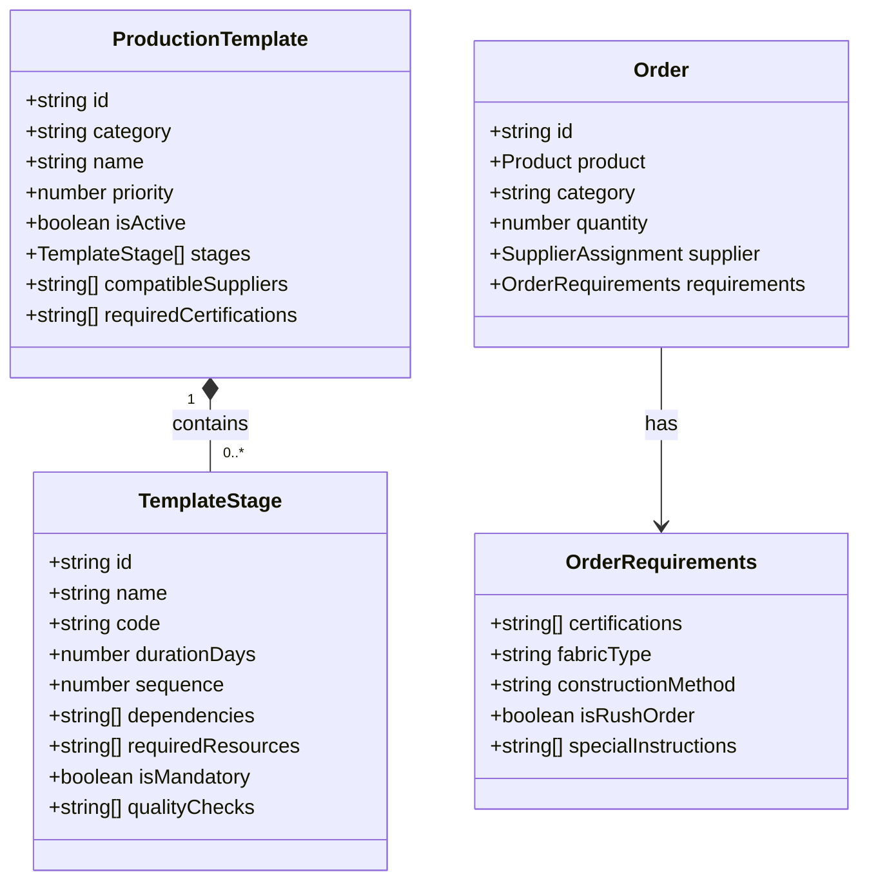

**Diagram sources**
- [initialize-production-stages/index.ts](file://supabase/functions/initialize-production-stages/index.ts)
- [types/order.ts](file://src/types/order.ts)

**Section sources**
- [initialize-production-stages/index.ts](file://supabase/functions/initialize-production-stages/index.ts)
- [types/order.ts](file://src/types/order.ts)

## Default Stage Creation Process

The default stage creation process is triggered when no specific template is found for a product category or when a template fails to load. This fallback mechanism ensures that production can proceed even in exceptional circumstances.

The default template includes a standardized sequence of stages that are applicable to most apparel manufacturing processes:
1. Pattern Making (3-5 days)
2. Material Sourcing (5-7 days)
3. Cutting (2-3 days)
4. Sewing (7-10 days)
5. Quality Control (2 days)
6. Packaging (1 day)
7. Shipping Preparation (1 day)

Each stage is created with conservative duration estimates to accommodate various product complexities. The system also adds buffer time between stages to account for potential delays. When creating default stages, the system logs a warning and notifies administrators so they can review the order and potentially create a more appropriate template.

The default creation process also considers order-specific factors such as quantity (scaling duration for larger orders) and rush status (reducing durations when possible). This ensures that even default templates provide realistic production timelines.

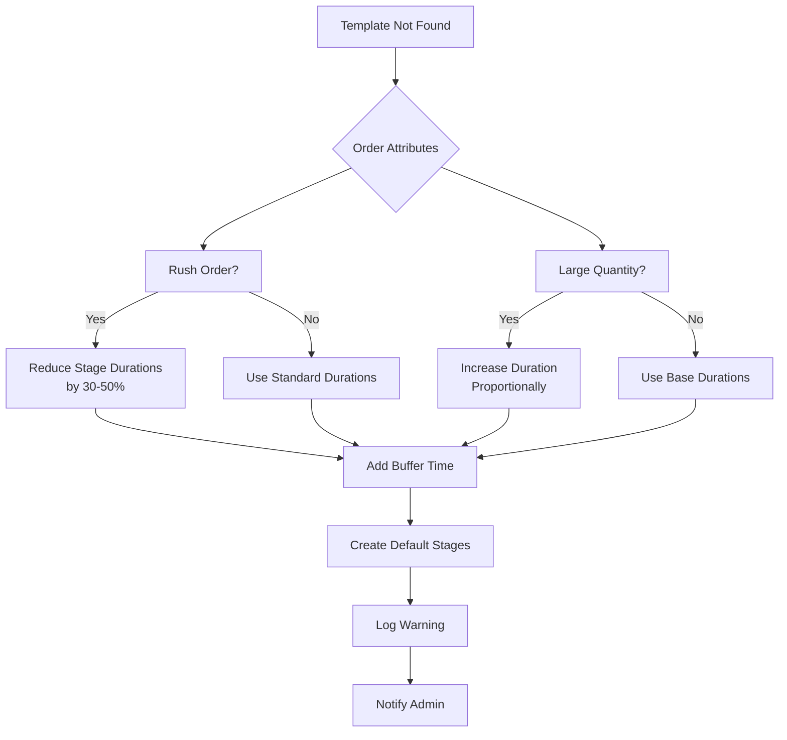

**Diagram sources**
- [initialize-production-stages/index.ts](file://supabase/functions/initialize-production-stages/index.ts)
- [lib/utils.ts](file://src/lib/utils.ts)

**Section sources**
- [initialize-production-stages/index.ts](file://supabase/functions/initialize-production-stages/index.ts)
- [lib/utils.ts](file://src/lib/utils.ts)

## Target Date Calculation Logic

The target date calculation logic determines realistic completion dates for each production stage based on multiple factors. The system uses a forward-scheduling approach, starting from the order creation date and adding the duration of each stage.

Key factors in date calculation include:
- Stage duration (from template or default)
- Working days vs. calendar days
- Supplier capacity and current workload
- Material availability
- Quality control requirements
- Shipping logistics

The calculation algorithm follows these steps:
1. Start with order creation date as the baseline
2. For each stage in sequence:
   - Add stage duration (adjusted for order size)
   - Skip weekends and holidays
   - Check for supplier capacity constraints
   - Add buffer time based on risk factors
3. Return the final completion date for the last stage

The system also calculates optimistic and pessimistic estimates to provide a range of possible completion dates. These estimates help buyers and suppliers plan accordingly and set appropriate expectations.

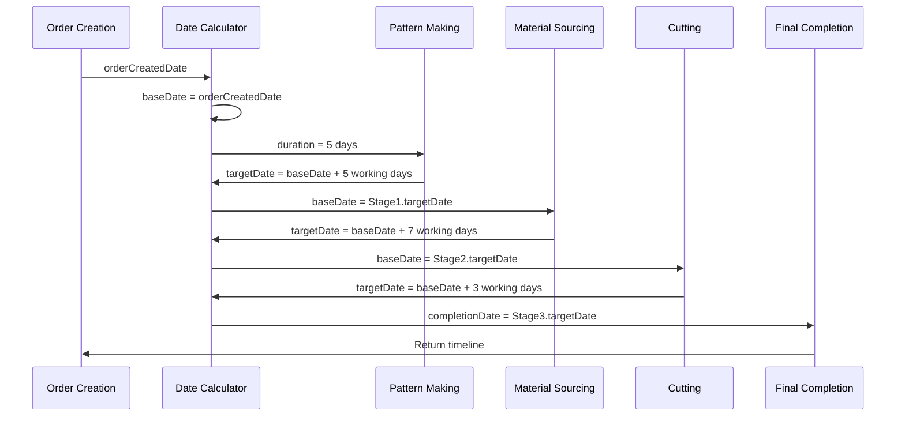

**Diagram sources**
- [initialize-production-stages/index.ts](file://supabase/functions/initialize-production-stages/index.ts)
- [lib/utils.ts](file://src/lib/utils.ts)

**Section sources**
- [initialize-production-stages/index.ts](file://supabase/functions/initialize-production-stages/index.ts)
- [lib/utils.ts](file://src/lib/utils.ts)

## Data Flow from Order to Production Stages

The data flow from order creation to production_stages table population follows a well-defined sequence of operations. This process ensures data consistency and proper initialization of the production workflow.

When a new order is created, the following steps occur:
1. The order record is inserted into the database
2. A trigger calls the `initialize-production-stages` function
3. The function retrieves order details including product category
4. The appropriate stage template is selected based on category
5. Target dates are calculated for each stage
6. Stage records are created and inserted into production_stages table
7. Success or failure status is returned

The data flow includes validation at each step to ensure data integrity. If any step fails, the system rolls back changes and triggers appropriate error handling procedures.

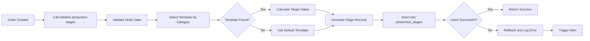

**Diagram sources**
- [initialize-production-stages/index.ts](file://supabase/functions/initialize-production-stages/index.ts)
- [migrations/20251121001333_f0e74faa-4a90-4b82-a0ae-86267b97afb3.sql](file://supabase/migrations/20251121001333_f0e74faa-4a90-4b82-a0ae-86267b97afb3.sql)

**Section sources**
- [initialize-production-stages/index.ts](file://supabase/functions/initialize-production-stages/index.ts)
- [migrations/20251121001333_f0e74faa-4a90-4b82-a0ae-86267b97afb3.sql](file://supabase/migrations/20251121001333_f0e74faa-4a90-4b82-a0ae-86267b97afb3.sql)

## Error Handling and Fallback Mechanisms

The system implements comprehensive error handling and fallback mechanisms to ensure reliability during production stage initialization. These mechanisms address various failure scenarios while maintaining data consistency.

Key error handling strategies include:
- Template retrieval failures
- Database connection issues
- Invalid order data
- Date calculation errors
- Race conditions during order setup

For template retrieval failures, the system first attempts to find alternative templates with similar categories before falling back to the default template. Database operations use transactions to ensure atomicity, rolling back all changes if any step fails.

Race conditions are prevented through database-level locking mechanisms that ensure only one initialization process can run per order at a time. This prevents duplicate stage creation when multiple systems attempt to initialize the same order simultaneously.

The system also implements exponential backoff for retryable errors and sends alerts to administrators for critical failures that require manual intervention.

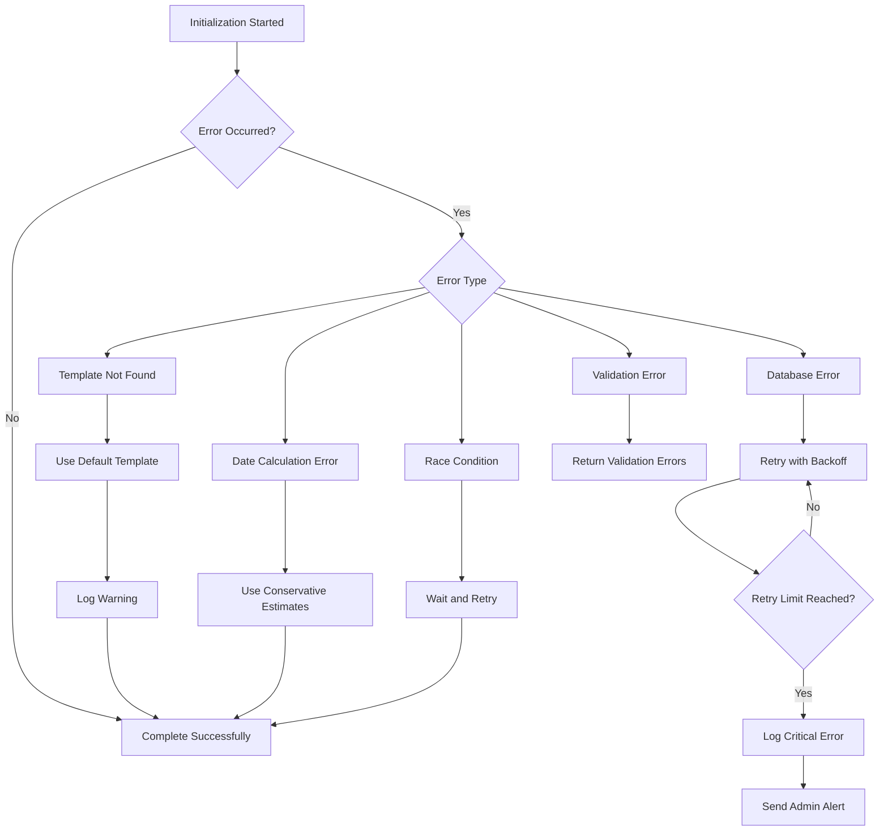

**Diagram sources**
- [initialize-production-stages/index.ts](file://supabase/functions/initialize-production-stages/index.ts)
- [lib/utils.ts](file://src/lib/utils.ts)

**Section sources**
- [initialize-production-stages/index.ts](file://supabase/functions/initialize-production-stages/index.ts)
- [lib/utils.ts](file://src/lib/utils.ts)

## Dynamic Stage Generation Examples

The system demonstrates dynamic stage generation through various product category examples. Each example shows how the initialization logic adapts to specific manufacturing requirements.

For a basic cotton t-shirt order:
- Pattern Making (3 days)
- Fabric Sourcing (5 days)
- Cutting (2 days)
- Sewing (7 days)
- Printing (3 days)
- Quality Control (2 days)
- Packaging (1 day)

For a performance athletic wear order:
- Technical Pattern Making (5 days)
- Performance Fabric Sourcing (7 days)
- Laser Cutting (3 days)
- Flatlock Sewing (10 days)
- Water Resistance Testing (3 days)
- Performance Quality Control (3 days)
- Specialized Packaging (2 days)

For an organic certified product:
- All standard stages plus:
- Certification Documentation (5 days)
- Organic Material Verification (3 days)
- Eco-Packaging (2 days)
- Sustainability Audit (2 days)

The system dynamically adjusts stage durations based on order quantity, with larger orders having proportionally longer durations for production stages. Rush orders trigger a separate template with compressed timelines and expedited processes.

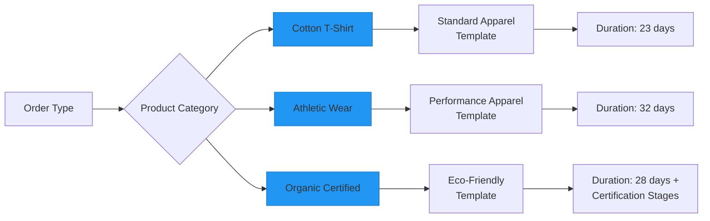

**Diagram sources**
- [initialize-production-stages/index.ts](file://supabase/functions/initialize-production-stages/index.ts)
- [types/order.ts](file://src/types/order.ts)

**Section sources**
- [initialize-production-stages/index.ts](file://supabase/functions/initialize-production-stages/index.ts)
- [types/order.ts](file://src/types/order.ts)

## Integration with Production Tracking UI

The production stage initialization system integrates seamlessly with the production tracking UI components. Once stages are created, the UI immediately reflects the production workflow, allowing buyers and suppliers to monitor progress.

Key integration points include:
- ProductionStageCard: Displays individual stage status and target dates
- ProductionStageTimeline: Visualizes the entire production workflow
- SupplierCoordinationPanel: Enables communication around specific stages
- ProductionAnalytics: Tracks stage completion metrics

The UI components subscribe to real-time updates from the production_stages table, ensuring that any changes to stage status or dates are immediately reflected. This real-time synchronization provides accurate visibility into the production process.

The initialization process also sets up the initial state for each UI component, including stage status (not started), progress (0%), and responsible parties. This ensures a consistent starting point for production tracking.

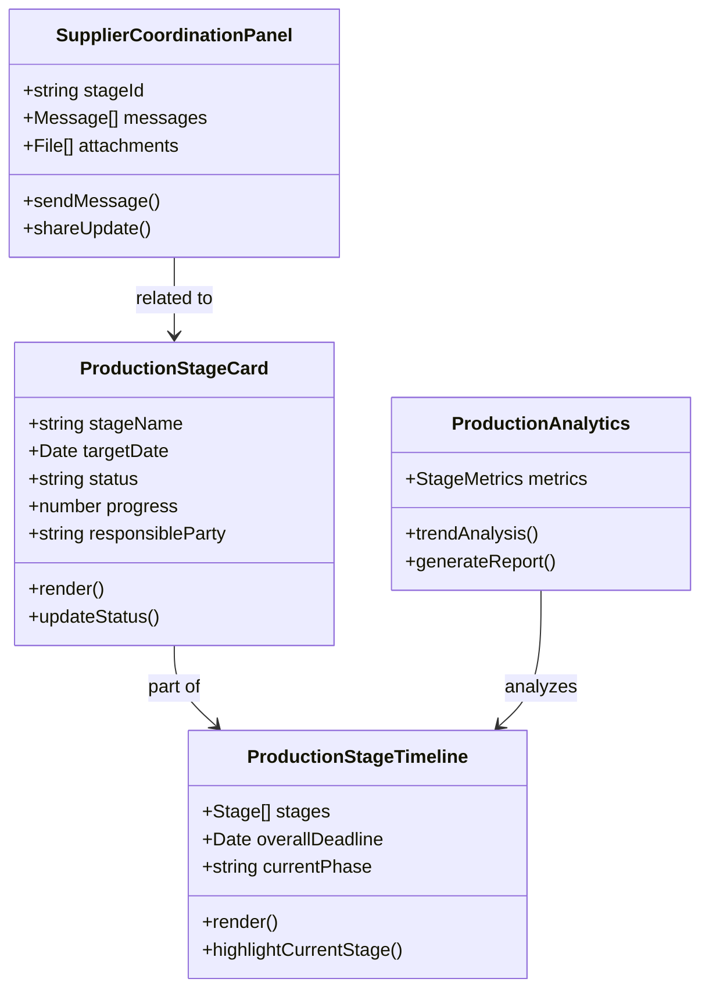

**Diagram sources**
- [production/ProductionStageCard.tsx](file://src/components/production/ProductionStageCard.tsx)
- [production/ProductionStageTimeline.tsx](file://src/components/production/ProductionStageTimeline.tsx)
- [supplier/ProductionStageManager.tsx](file://src/components/supplier/ProductionStageManager.tsx)

**Section sources**
- [production/ProductionStageCard.tsx](file://src/components/production/ProductionStageCard.tsx)
- [production/ProductionStageTimeline.tsx](file://src/components/production/ProductionStageTimeline.tsx)
- [supplier/ProductionStageManager.tsx](file://src/components/supplier/ProductionStageManager.tsx)

## Supplier Coordination Workflow

The supplier coordination workflow is initiated as part of the production stage initialization process. Once stages are created, the system notifies the assigned supplier and provides them with access to the production workflow.

The workflow includes:
1. Supplier notification via email and in-app message
2. Access provisioning to the production stages
3. Initial status confirmation request
4. Regular progress update requirements
5. Quality checkpoint notifications
6. Completion verification process

Suppliers are required to confirm receipt of the production order within 24 hours and provide an initial assessment of the timeline. The system then expects regular updates at key stage transitions, with automated reminders for overdue updates.

The workflow also includes escalation procedures for delayed stages, enabling buyers to intervene when necessary. This structured approach ensures accountability and transparency throughout the production process.

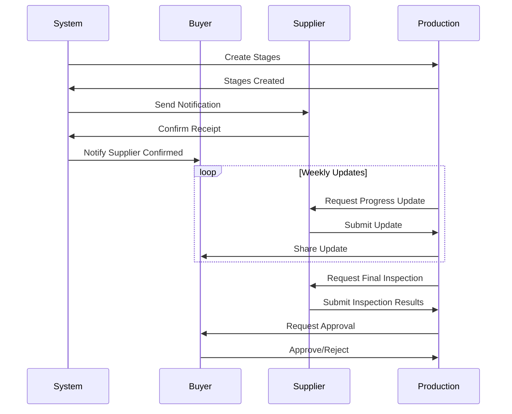

**Diagram sources**
- [supplier/ProductionStageManager.tsx](file://src/components/supplier/ProductionStageManager.tsx)
- [initialize-production-stages/index.ts](file://supabase/functions/initialize-production-stages/index.ts)

**Section sources**
- [supplier/ProductionStageManager.tsx](file://src/components/supplier/ProductionStageManager.tsx)
- [initialize-production-stages/index.ts](file://supabase/functions/initialize-production-stages/index.ts)

## Common Issues and Troubleshooting

Several common issues can occur during production stage initialization, each with specific troubleshooting procedures.

**Template Mismatches**: Occur when the wrong template is selected for a product category.
- *Solution*: Verify category mapping in the database and ensure product categories are correctly classified. Implement template validation rules to prevent inappropriate template assignments.

**Date Calculation Errors**: Result from incorrect duration estimates or holiday calendar issues.
- *Solution*: Review and update stage duration benchmarks regularly. Ensure holiday calendars are maintained for all supplier locations. Implement date validation checks before saving.

**Race Conditions**: Happen when multiple processes attempt to initialize the same order.
- *Solution*: Implement database-level locking to ensure only one initialization process runs at a time. Use unique constraints on order-stage relationships to prevent duplicates.

**Data Consistency Issues**: Arise from partial failures during stage creation.
- *Solution*: Use database transactions to ensure atomic operations. Implement reconciliation processes to detect and fix inconsistent states.

**Performance Bottlenecks**: Occur with complex templates or large orders.
- *Solution*: Optimize database queries and indexing. Implement caching for frequently used templates. Consider asynchronous processing for large initialization jobs.

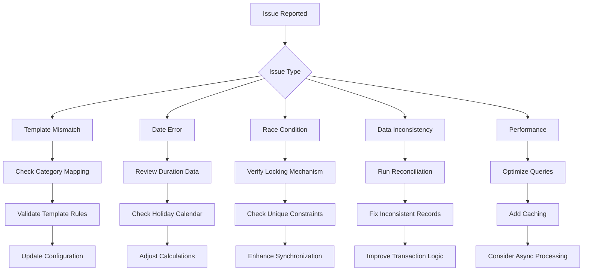

**Section sources**
- [initialize-production-stages/index.ts](file://supabase/functions/initialize-production-stages/index.ts)
- [lib/utils.ts](file://src/lib/utils.ts)

## Custom Stage Template Configuration

Configuring custom stage templates for different product categories involves several steps. Administrators can create and manage templates through the admin interface or directly in the database.

To create a custom template:
1. Define the product category or subcategory
2. Specify the sequence of production stages
3. Set duration estimates for each stage
4. Define dependencies between stages
5. Identify required resources and quality checks
6. Specify compatible suppliers (optional)
7. Set activation status and priority

Templates can inherit from base templates to avoid duplication. For example, a "Premium T-Shirt" template might inherit from the standard "T-Shirt" template but add additional quality control stages and extend sewing duration for higher craftsmanship standards.

The system validates templates before activation, checking for:
- Complete stage sequences
- Realistic duration estimates
- Proper dependency ordering
- Valid supplier assignments
- Required field completion

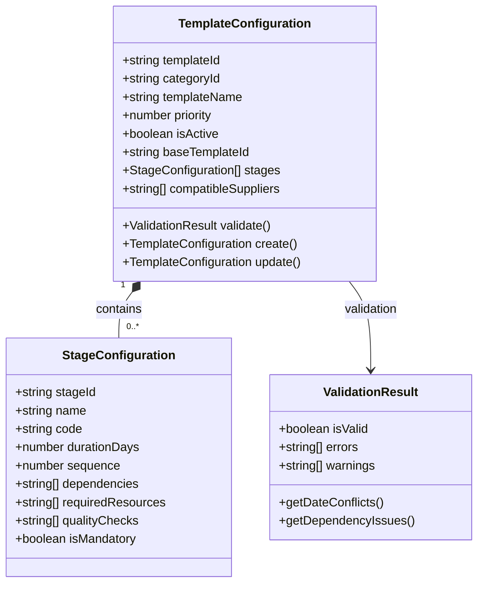

**Section sources**
- [initialize-production-stages/index.ts](file://supabase/functions/initialize-production-stages/index.ts)
- [types/order.ts](file://src/types/order.ts)

## Extending Initialization Logic

The initialization logic can be extended to support specialized manufacturing processes through several mechanisms.

Custom initialization rules can be implemented using the system's extensibility framework. These rules can:
- Modify stage sequences based on specific product attributes
- Adjust duration estimates for unique materials or construction methods
- Add specialized quality control stages
- Integrate with external systems for certification requirements
- Support custom packaging and labeling processes

The extension system supports both configuration-based and code-based extensions. Configuration extensions use JSON rules to define modifications, while code-based extensions allow developers to implement custom logic in TypeScript.

For highly specialized processes, the system can be extended to support:
- Multi-factory production workflows
- Distributed manufacturing across locations
- Complex material traceability requirements
- Regulatory compliance stages
- Customer-specific quality protocols

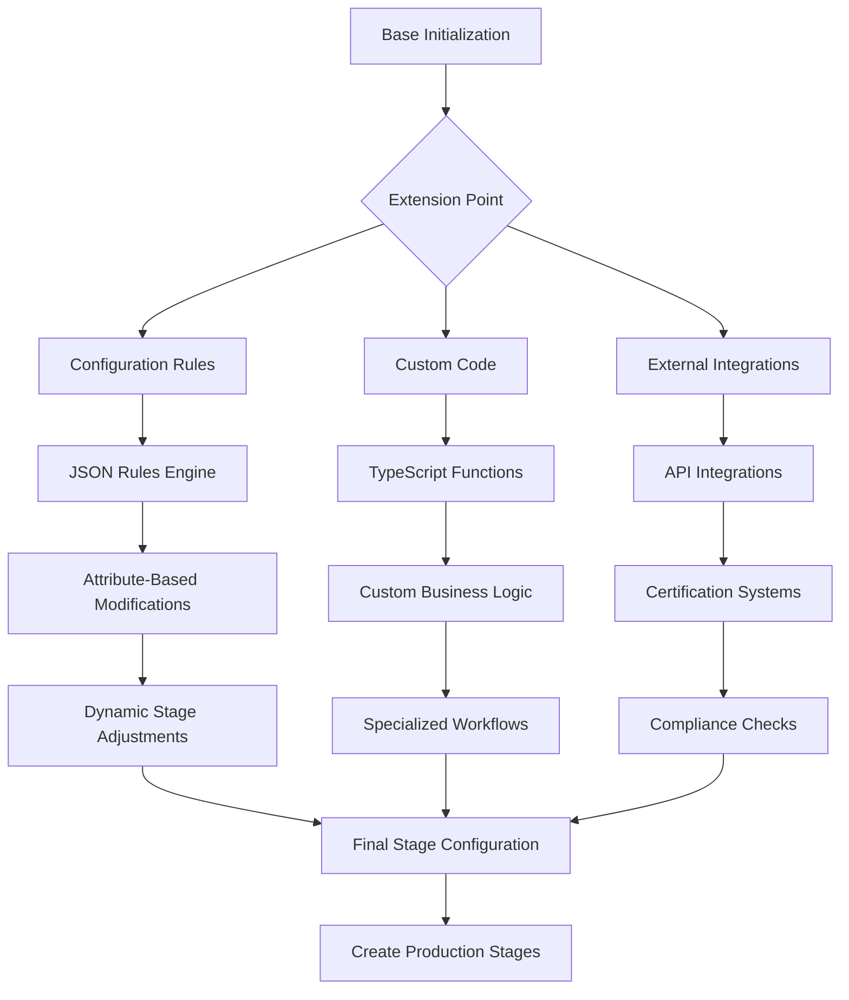

**Section sources**
- [initialize-production-stages/index.ts](file://supabase/functions/initialize-production-stages/index.ts)
- [lib/utils.ts](file://src/lib/utils.ts)

## Conclusion

The Production Stage Initialization system provides a robust foundation for managing apparel manufacturing workflows. By leveraging category-based template selection, intelligent date calculation, and comprehensive error handling, the system ensures that each order follows an appropriate production process tailored to its specific requirements.

The integration with production tracking UI components and supplier coordination workflows creates a seamless experience for all stakeholders, from buyers to suppliers. The system's flexibility allows for both standardized processes and specialized manufacturing requirements, making it adaptable to a wide range of product types and business needs.

For developers, the extensible architecture provides opportunities to customize and enhance the initialization logic for specialized use cases. The comprehensive error handling and fallback mechanisms ensure reliability even in exceptional circumstances.

By understanding the detailed implementation of this sub-feature, teams can effectively configure, maintain, and extend the production stage initialization system to meet evolving business requirements while maintaining data consistency and operational efficiency.