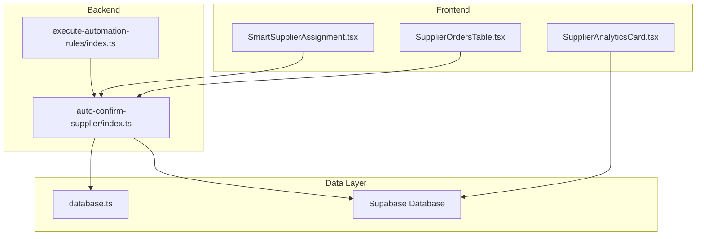
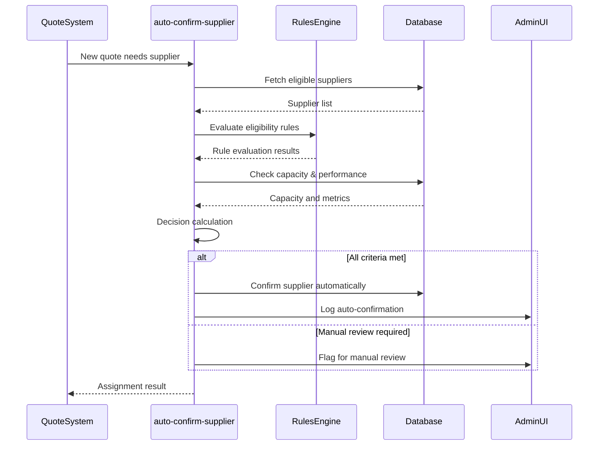
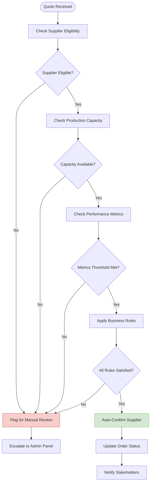
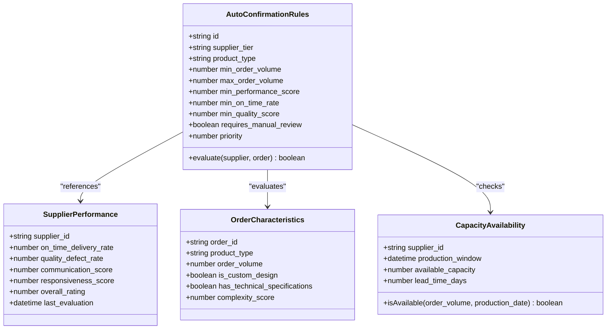
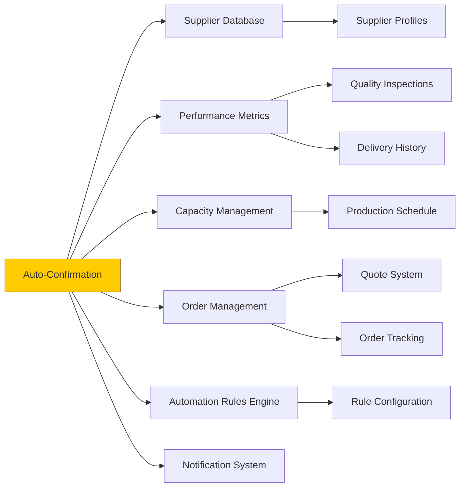

# Supplier Auto-Confirmation

<cite>
**Referenced Files in This Document**  
- [index.ts](file://supabase/functions/auto-confirm-supplier/index.ts)
- [useSmartSupplierAssignment.ts](file://src/hooks/useSmartSupplierAssignment.ts)
- [SmartSupplierAssignment.tsx](file://src/components/admin/SmartSupplierAssignment.tsx)
- [SupplierOrdersTable.tsx](file://src/components/admin/SupplierOrdersTable.tsx)
- [SupplierAnalyticsCard.tsx](file://src/components/admin/SupplierAnalyticsCard.tsx)
- [database.ts](file://src/types/database.ts)
- [execute-automation-rules/index.ts](file://supabase/functions/execute-automation-rules/index.ts)
</cite>

## Table of Contents
1. [Introduction](#introduction)
2. [Project Structure](#project-structure)
3. [Core Components](#core-components)
4. [Architecture Overview](#architecture-overview)
5. [Detailed Component Analysis](#detailed-component-analysis)
6. [Dependency Analysis](#dependency-analysis)
7. [Performance Considerations](#performance-considerations)
8. [Troubleshooting Guide](#troubleshooting-guide)
9. [Conclusion](#conclusion)

## Introduction
The Supplier Auto-Confirmation feature enables automated supplier selection and confirmation based on predefined eligibility criteria, capacity availability, performance metrics, and business rules. This system reduces manual intervention in the supplier assignment process while maintaining quality control and risk mitigation. The feature integrates with supplier performance tracking, order management, and verification workflows to ensure reliable and scalable operations.

## Project Structure
The Supplier Auto-Confirmation functionality is distributed across frontend components, backend functions, and data models. Key components are organized in the Supabase functions directory for serverless execution and within the React component hierarchy for UI interaction and monitoring.

**Diagram sources**
- [SmartSupplierAssignment.tsx](file://src/components/admin/SmartSupplierAssignment.tsx)
- [auto-confirm-supplier/index.ts](file://supabase/functions/auto-confirm-supplier/index.ts)
- [database.ts](file://src/types/database.ts)

**Section sources**
- [SmartSupplierAssignment.tsx](file://src/components/admin/SmartSupplierAssignment.tsx)
- [auto-confirm-supplier/index.ts](file://supabase/functions/auto-confirm-supplier/index.ts)

## Core Components
The Supplier Auto-Confirmation system consists of a serverless function that evaluates supplier eligibility, checks capacity, validates performance metrics, and updates order status accordingly. The decision logic is driven by configurable rules that consider supplier tier, product specialization, historical performance, and current workload.

The frontend provides monitoring and management interfaces for administrators to view auto-confirmed suppliers, override decisions when necessary, and adjust automation rules. Integration with analytics components allows for continuous assessment of auto-confirmation accuracy and supplier performance trends.

**Section sources**
- [auto-confirm-supplier/index.ts](file://supabase/functions/auto-confirm-supplier/index.ts)
- [SmartSupplierAssignment.tsx](file://src/components/admin/SmartSupplierAssignment.tsx)

## Architecture Overview
The auto-confirmation process follows a rule-based decision pipeline triggered when a new quote requires supplier assignment. The system evaluates multiple dimensions including supplier capabilities, capacity, performance history, and business rules before determining whether automatic confirmation is appropriate.

**Diagram sources**
- [auto-confirm-supplier/index.ts](file://supabase/functions/auto-confirm-supplier/index.ts)
- [execute-automation-rules/index.ts](file://supabase/functions/execute-automation-rules/index.ts)

## Detailed Component Analysis

### Auto-Confirmation Logic
The core auto-confirmation logic resides in the Supabase function that evaluates multiple criteria to determine if a supplier can be automatically confirmed. The system checks supplier eligibility based on product type compatibility, verifies available production capacity, and assesses performance metrics such as on-time delivery rate and quality scores.

The decision engine applies configurable business rules that can be adjusted based on supplier tier, order volume, or product complexity. High-tier suppliers with excellent performance records may be automatically confirmed for standard orders, while new suppliers or complex custom orders require manual review.

**Diagram sources**
- [auto-confirm-supplier/index.ts](file://supabase/functions/auto-confirm-supplier/index.ts)
- [execute-automation-rules/index.ts](file://supabase/functions/execute-automation-rules/index.ts)

**Section sources**
- [auto-confirm-supplier/index.ts](file://supabase/functions/auto-confirm-supplier/index.ts)
- [execute-automation-rules/index.ts](file://supabase/functions/execute-automation-rules/index.ts)

### Business Rule Configuration
The system supports configurable rules for auto-confirmation based on various factors including supplier tier, product type, and order characteristics. Rules are evaluated in priority order, with more specific rules taking precedence over general ones.

Supplier tiers (Standard, Preferred, Premium) have different auto-confirmation thresholds based on their proven reliability and performance history. Product types may have specialized requirements that affect auto-confirmation eligibility, such as technical specifications or compliance certifications.

Order volume and complexity also influence the decision, with larger or more complex orders typically requiring manual review regardless of supplier tier.

**Diagram sources**
- [database.ts](file://src/types/database.ts)
- [execute-automation-rules/index.ts](file://supabase/functions/execute-automation-rules/index.ts)

**Section sources**
- [execute-automation-rules/index.ts](file://supabase/functions/execute-automation-rules/index.ts)
- [database.ts](file://src/types/database.ts)

## Dependency Analysis
The Supplier Auto-Confirmation feature depends on several core systems within the application, including the supplier database, performance tracking system, capacity management, and order management workflow.

**Diagram sources**
- [auto-confirm-supplier/index.ts](file://supabase/functions/auto-confirm-supplier/index.ts)
- [database.ts](file://src/types/database.ts)

**Section sources**
- [auto-confirm-supplier/index.ts](file://supabase/functions/auto-confirm-supplier/index.ts)
- [database.ts](file://src/types/database.ts)

## Performance Considerations
The auto-confirmation process is designed to execute efficiently within serverless function constraints. The system implements caching for frequently accessed supplier performance data and uses optimized database queries to minimize latency.

For high-volume scenarios, the system can process multiple quote assignments in parallel while maintaining data consistency through transactional updates. Error handling and retry mechanisms ensure reliability even during temporary service disruptions.

The rule evaluation engine is optimized to short-circuit when possible, avoiding unnecessary checks once a decision threshold has been met or failed.

## Troubleshooting Guide
Common issues in the auto-confirmation system include false positives (inappropriate automatic confirmations), edge cases in capacity calculation, and configuration errors in business rules.

When investigating auto-confirmation issues, administrators should:
1. Review the audit log for decision rationale
2. Verify supplier performance metrics are up to date
3. Check capacity calculations against actual production schedules
4. Validate rule configurations for the specific supplier tier and product type
5. Examine recent changes to supplier profiles or capabilities

The system logs detailed decision traces that can be used to diagnose and resolve issues with the auto-confirmation logic.

**Section sources**
- [auto-confirm-supplier/index.ts](file://supabase/functions/auto-confirm-supplier/index.ts)
- [SmartSupplierAssignment.tsx](file://src/components/admin/SmartSupplierAssignment.tsx)

## Conclusion
The Supplier Auto-Confirmation system provides a robust, rule-based approach to automating supplier assignments while maintaining quality control and risk management. By leveraging supplier performance data, capacity information, and configurable business rules, the system reduces manual workload while ensuring reliable order fulfillment.

The modular architecture allows for continuous improvement of the decision logic and easy adaptation to changing business requirements. With proper configuration and monitoring, the auto-confirmation system can significantly enhance operational efficiency in supplier management.