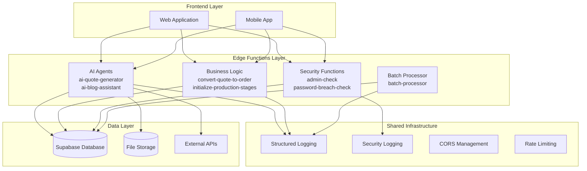
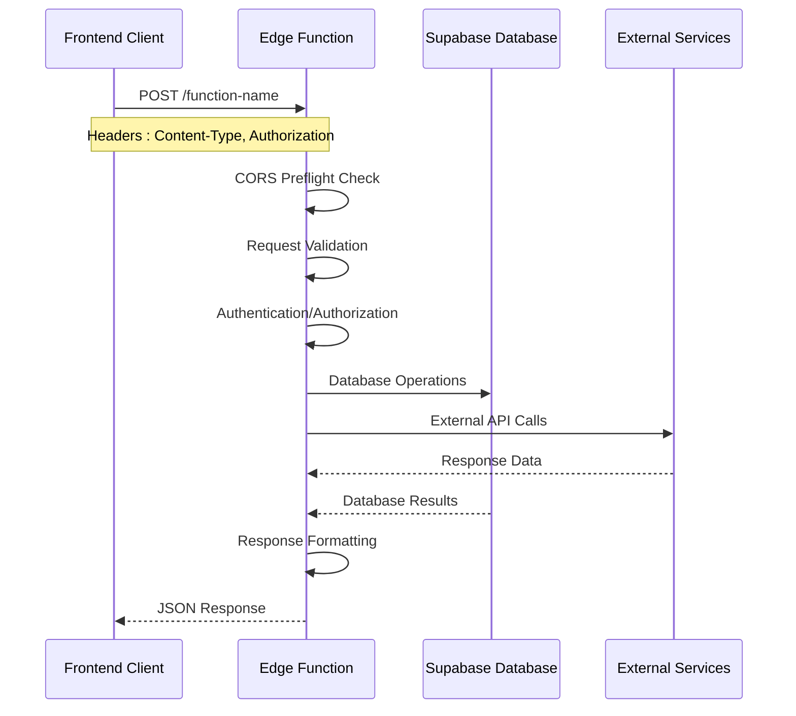

# Edge Functions Architecture

<cite>
**Referenced Files in This Document**
- [config.toml](file://supabase/config.toml)
- [batch-processor/index.ts](file://supabase/functions/batch-processor/index.ts)
- [admin-check/index.ts](file://supabase/functions/admin-check/index.ts)
- [password-breach-check/index.ts](file://supabase/functions/password-breach-check/index.ts)
- [ai-quote-generator/index.ts](file://supabase/functions/ai-quote-generator/index.ts)
- [ai-blog-assistant/index.ts](file://supabase/functions/ai-blog-assistant/index.ts)
- [convert-quote-to-order/index.ts](file://supabase/functions/convert-quote-to-order/index.ts)
- [initialize-production-stages/index.ts](file://supabase/functions/initialize-production-stages/index.ts)
- [logger.ts](file://supabase/functions/_shared/logger.ts)
- [securityLogger.ts](file://supabase/functions/shared/securityLogger.ts)
- [diagnostics.ts](file://src/lib/diagnostics.ts)
- [useAdminAuth.ts](file://src/hooks/useAdminAuth.ts)
- [aiQuote.ts](file://src/lib/api/aiQuote.ts)
</cite>

## Table of Contents
1. [Introduction](#introduction)
2. [Architecture Overview](#architecture-overview)
3. [Function Organization by Domain](#function-organization-by-domain)
4. [Request/Response Patterns](#requestresponse-patterns)
5. [Security Implementation](#security-implementation)
6. [Shared Utilities](#shared-utilities)
7. [Frontend Integration](#frontend-integration)
8. [Performance Considerations](#performance-considerations)
9. [Debugging Strategies](#debugging-strategies)
10. [Deployment and Monitoring](#deployment-and-monitoring)

## Introduction

The Supabase Edge Functions architecture in sleekapp-v100 represents a sophisticated serverless computing solution that powers the application's core business logic, AI capabilities, and security mechanisms. Built on Deno runtime, these functions provide scalable, secure, and efficient backend processing for the entire application ecosystem.

The architecture follows a domain-driven approach, organizing functions into distinct categories based on their primary responsibilities: AI processing, business logic, and security. Each function is designed as a stateless, horizontally scalable unit that can handle high-throughput operations while maintaining strict security boundaries.

## Architecture Overview

The edge functions architecture consists of several interconnected layers that work together to provide a comprehensive backend solution:



**Diagram sources**
- [batch-processor/index.ts](file://supabase/functions/batch-processor/index.ts#L1-L50)
- [admin-check/index.ts](file://supabase/functions/admin-check/index.ts#L1-L30)
- [ai-quote-generator/index.ts](file://supabase/functions/ai-quote-generator/index.ts#L1-L50)

**Section sources**
- [batch-processor/index.ts](file://supabase/functions/batch-processor/index.ts#L1-L346)
- [admin-check/index.ts](file://supabase/functions/admin-check/index.ts#L1-L74)

## Function Organization by Domain

The edge functions are organized into three primary domains, each serving specific business requirements:

### AI Processing Functions

AI processing functions leverage advanced machine learning capabilities to provide intelligent business solutions:

#### ai-quote-generator
The flagship AI quote generation system that creates market-researched manufacturing quotes with real-time pricing intelligence.

**Key Features:**
- Multi-modal AI analysis supporting both text and image inputs
- Dynamic pricing calculation based on Bangladesh manufacturing standards
- Comprehensive timeline prediction with production stage breakdowns
- Intelligent rate limiting with tiered quotas for authenticated vs. anonymous users
- Real-time cost tracking and optimization suggestions

**Technical Implementation:**
- Uses Google Gemini 2.5 Flash for text-only quotes and Gemini 2.5 Pro for image analysis
- Implements sophisticated input sanitization and prompt engineering
- Provides detailed manufacturing insights and cost optimization recommendations
- Supports file uploads for design analysis with automatic image processing

#### ai-blog-assistant
Automated content creation system for generating comprehensive blog posts and marketing materials.

**Capabilities:**
- Outline generation for various apparel manufacturing topics
- Full-content writing with SEO optimization
- Content customization based on specific requirements
- Model selection optimization (Flash for outlines, Pro for full content)

### Business Logic Functions

Business logic functions handle core operational processes and workflow automation:

#### convert-quote-to-order
Seamless conversion system that transforms AI-generated quotes into production-ready orders.

**Process Flow:**
1. Quote validation and verification
2. User account creation or identification
3. Order number generation and tracking token assignment
4. Production stage initialization
5. Email notification delivery
6. Database synchronization and status updates

**Integration Points:**
- Resend API for transactional email delivery
- Supabase authentication for user management
- Production stage template system for manufacturing workflows

#### initialize-production-stages
Automated production workflow initialization based on product type and manufacturing requirements.

**Template System:**
- Category-specific stage templates (casualwear, activewear, knitwear)
- Default fallback stages for unknown product types
- Dynamic stage creation with estimated timelines
- Supplier order integration for manufacturing coordination

#### batch-processor
High-volume processing system for managing production batches and optimizing manufacturing efficiency.

**Processing Modes:**
- **Orchestration Mode:** Automated batch management and completion decisions
- **Order Processing Mode:** Individual order batching and supplier assignment

**Business Logic:**
- Fill percentage thresholds (75% auto-completion, 50-75% admin review, <50% cancellation)
- Window closure handling with cost absorption strategies
- Style compatibility checking for batch consolidation
- Supplier optimization based on MOQ and pricing criteria

### Security Functions

Security functions provide comprehensive protection and access control mechanisms:

#### admin-check
Centralized administrative access validation system.

**Authentication Flow:**
1. JWT token extraction from Authorization header
2. Supabase authentication verification
3. Role-based access control (user_roles table)
4. Real-time permission validation

**Security Features:**
- CORS preflight handling for cross-origin requests
- Secure token validation with error handling
- Role-based authorization with database-backed permissions

#### password-breach-check
Advanced password security validation using Have I Been Pwned API with k-anonymity protection.

**Security Measures:**
- SHA-1 hashing with k-anonymity to protect user privacy
- Origin validation for production environments
- Rate limiting and abuse prevention
- Fail-safe operation during external service unavailability

**Section sources**
- [ai-quote-generator/index.ts](file://supabase/functions/ai-quote-generator/index.ts#L1-L753)
- [convert-quote-to-order/index.ts](file://supabase/functions/convert-quote-to-order/index.ts#L1-L223)
- [initialize-production-stages/index.ts](file://supabase/functions/initialize-production-stages/index.ts#L1-L133)
- [batch-processor/index.ts](file://supabase/functions/batch-processor/index.ts#L1-L346)
- [admin-check/index.ts](file://supabase/functions/admin-check/index.ts#L1-L74)
- [password-breach-check/index.ts](file://supabase/functions/password-breach-check/index.ts#L1-L142)

## Request/Response Patterns

The edge functions implement consistent request/response patterns that ensure reliability, security, and developer-friendly interfaces:

### Standard Request Structure

All edge functions follow a standardized request pattern with consistent headers and error handling:



**Diagram sources**
- [batch-processor/index.ts](file://supabase/functions/batch-processor/index.ts#L29-L55)
- [admin-check/index.ts](file://supabase/functions/admin-check/index.ts#L8-L20)

### CORS Configuration

Functions implement comprehensive CORS handling to support cross-origin requests:

**Standard CORS Headers:**
```typescript
const corsHeaders = {
  'Access-Control-Allow-Origin': '*',
  'Access-Control-Allow-Headers': 'authorization, x-client-info, apikey, content-type',
};
```

**Implementation Pattern:**
- OPTIONS request handling for preflight checks
- Automatic CORS header injection for all responses
- Flexible origin support for development and production environments
- Content-type validation for security

### Error Handling Patterns

Robust error handling ensures graceful degradation and meaningful error reporting:

**Error Categories:**
1. **Validation Errors:** Input sanitization and schema validation failures
2. **Authentication Errors:** JWT validation and authorization failures
3. **Business Logic Errors:** Application-specific validation failures
4. **System Errors:** Database connectivity and external service failures

**Response Format:**
```typescript
{
  success: boolean,
  error?: string,
  details?: any,
  code?: string,
  requestId?: string
}
```

**Section sources**
- [batch-processor/index.ts](file://supabase/functions/batch-processor/index.ts#L4-L8)
- [admin-check/index.ts](file://supabase/functions/admin-check/index.ts#L3-L6)
- [ai-quote-generator/index.ts](file://supabase/functions/ai-quote-generator/index.ts#L4-L8)

## Security Implementation

The edge functions implement multiple layers of security to protect against various attack vectors and ensure data integrity:

### JWT Verification Strategy

JWT verification is implemented consistently across all security-sensitive functions:

**Authentication Flow:**
1. Token extraction from Authorization header
2. Supabase authentication service validation
3. User context establishment for database operations
4. Role-based access control enforcement

**Implementation Details:**
- Service role keys for internal database operations
- Client-side JWT validation for user-facing operations
- Automatic token refresh and expiration handling
- Comprehensive error logging for security events

### Origin Validation

Production functions implement strict origin validation to prevent unauthorized access:

**Allowed Origins Configuration:**
- Production domains (sleekapparels.com variants)
- Development environments (localhost ports)
- Preview deployments (lovable.app domains)
- Deployment platforms (netlify.app, vercel.app)

**Validation Logic:**
- Protocol-agnostic domain matching
- Port-specific validation for localhost
- Wildcard subdomain support
- Referer header validation for additional security

### Rate Limiting Implementation

Sophisticated rate limiting prevents abuse while accommodating legitimate usage patterns:

**Tiered Rate Limiting:**
- **IP-based:** 15 quotes per IP per day (global limit)
- **User-based:** 20 quotes per user per day (authenticated users)
- **Session-based:** 3 quotes per session per day (anonymous users)

**Implementation Features:**
- Redis-based counter storage for persistence
- Daily window reset with UTC alignment
- Configurable limits per function
- Detailed rate limit headers in responses

### Data Sanitization

Comprehensive data sanitization protects against injection attacks and maintains data integrity:

**Sanitization Levels:**
- **PII Redaction:** Email, phone, and personal identification masking
- **Input Validation:** Schema-based validation with Zod
- **Output Sanitization:** HTML and script tag removal
- **Logging Protection:** Automatic sensitive data redaction in logs

**Section sources**
- [admin-check/index.ts](file://supabase/functions/admin-check/index.ts#L14-L73)
- [password-breach-check/index.ts](file://supabase/functions/password-breach-check/index.ts#L36-L95)
- [ai-quote-generator/index.ts](file://supabase/functions/ai-quote-generator/index.ts#L38-L121)

## Shared Utilities

The edge functions leverage shared utilities that provide consistent functionality across all serverless operations:

### Logger Utility

The structured logging system ensures comprehensive monitoring and debugging capabilities:

**Logger Features:**
- **Structured Output:** JSON-formatted logs with timestamps and context
- **PII Protection:** Automatic sanitization of sensitive data
- **Multiple Levels:** INFO, WARN, ERROR, SUCCESS categorization
- **Context Tracking:** Function-specific context identification

**Sanitization Functions:**
- **Email Sanitization:** Partial masking with domain preservation
- **Phone Number Sanitization:** Prefix and suffix retention
- **Order ID Sanitization:** Partial UUID masking
- **Token Protection:** Complete redaction of authentication tokens

**Usage Pattern:**
```typescript
const logger = createLogger('ai-quote-generator');
logger.info('Quote generation started', { productId, quantity });
logger.error('Quote generation failed', error, { userId });
```

### Security Logger

Dedicated security event logging provides comprehensive audit trails:

**Security Event Types:**
- **Captcha Failures:** Bot detection and mitigation
- **Rate Limit Violations:** Abuse prevention tracking
- **Suspicious Patterns:** Anomalous behavior detection
- **Cost Alerts:** AI usage monitoring and budget control

**Cost Tracking:**
- **Token Estimation:** Per-million-token cost calculation
- **Model-Specific Rates:** Different pricing for various AI models
- **Usage Monitoring:** Real-time cost tracking and alerts
- **Budget Control:** Spending limit enforcement

**Section sources**
- [logger.ts](file://supabase/functions/_shared/logger.ts#L1-L173)
- [securityLogger.ts](file://supabase/functions/shared/securityLogger.ts#L1-L88)

## Frontend Integration

The frontend integration demonstrates seamless communication between React applications and edge functions:

### supabase.functions.invoke Pattern

The primary method for invoking edge functions from the frontend:

**Basic Invocation:**
```typescript
const { data, error } = await supabase.functions.invoke('function-name', {
  body: { /* request parameters */ },
  headers: { /* optional headers */ }
});
```

**Authentication Integration:**
The `useAdminAuth` hook demonstrates authentication-aware function calls:

**Implementation Details:**
- **Session Management:** Automatic JWT token extraction and validation
- **Error Handling:** Comprehensive error catching and user feedback
- **Loading States:** Proper UI state management during function calls
- **Retry Logic:** Automatic retry mechanisms for transient failures

### AI Quote Generation Workflow

The AI quote generation demonstrates a complete end-to-end workflow:

**Frontend Components:**
- **Conversational Interface:** Interactive quote builder with real-time feedback
- **File Upload Support:** Image and document upload for design analysis
- **Progress Indication:** Loading states and success notifications
- **Result Presentation:** Comprehensive quote details with timeline visualization

**Backend Integration:**
- **Session Management:** Persistent user sessions across function calls
- **Rate Limiting:** User-specific quota enforcement
- **AI Processing:** Multi-model AI analysis with fallback strategies
- **Database Integration:** Seamless quote storage and retrieval

### Diagnostics and Monitoring

Comprehensive diagnostic tools ensure reliable function operation:

**Diagnostic Features:**
- **Connection Testing:** Supabase connectivity validation
- **Function Availability:** Edge function deployment verification
- **Configuration Checking:** Environment variable and database schema validation
- **End-to-End Testing:** Complete workflow validation

**Monitoring Capabilities:**
- **Real-time Status:** Live function health monitoring
- **Error Tracking:** Comprehensive error reporting and categorization
- **Performance Metrics:** Response time and throughput monitoring
- **Automated Alerts:** Proactive issue detection and notification

**Section sources**
- [useAdminAuth.ts](file://src/hooks/useAdminAuth.ts#L1-L47)
- [aiQuote.ts](file://src/lib/api/aiQuote.ts#L1-L209)
- [diagnostics.ts](file://src/lib/diagnostics.ts#L1-L269)

## Performance Considerations

The edge functions architecture incorporates numerous performance optimization strategies:

### Timeout Management

**Function Timeouts:**
- **Standard Functions:** 10-second timeout for typical operations
- **AI Processing:** Extended timeouts (30-60 seconds) for complex AI operations
- **Batch Processing:** Variable timeouts based on batch size and complexity

**Optimization Strategies:**
- **Async Operations:** Non-blocking database and external API calls
- **Connection Pooling:** Efficient database connection management
- **Caching Layers:** Intelligent caching for frequently accessed data
- **Parallel Processing:** Concurrent execution of independent operations

### Memory Management

**Memory Optimization:**
- **Stateless Design:** Functions maintain minimal state between invocations
- **Garbage Collection:** Automatic memory cleanup after function execution
- **Resource Limits:** Controlled resource usage to prevent memory leaks
- **Streaming Responses:** Large data processing with streaming capabilities

### Scalability Patterns

**Horizontal Scaling:**
- **Auto-scaling:** Automatic function scaling based on demand
- **Load Distribution:** Intelligent load balancing across function instances
- **Queue Processing:** Asynchronous processing for long-running operations
- **Circuit Breakers:** Failure isolation and graceful degradation

### Cost Optimization

**Resource Efficiency:**
- **Cold Start Mitigation:** Function warm-up strategies and optimization
- **AI Cost Control:** Model selection based on complexity requirements
- **Database Optimization:** Efficient queries and indexing strategies
- **Storage Management:** Optimized file storage and CDN integration

## Debugging Strategies

Comprehensive debugging capabilities ensure rapid issue resolution and system reliability:

### Logging Strategies

**Structured Logging:**
- **Request Tracing:** Unique request IDs for end-to-end tracing
- **Context Preservation:** Function-specific context in all log entries
- **Error Correlation:** Automatic error correlation across function calls
- **Performance Metrics:** Timing and resource usage tracking

**Log Levels:**
- **DEBUG:** Detailed execution tracing for development
- **INFO:** Operational events and state changes
- **WARN:** Recoverable issues and performance warnings
- **ERROR:** Critical failures and system errors

### Monitoring and Alerting

**Real-time Monitoring:**
- **Function Health:** Continuous health check and availability monitoring
- **Error Rates:** Automated error rate tracking and alerting
- **Performance Metrics:** Response time and throughput monitoring
- **Resource Usage:** CPU and memory utilization tracking

**Alert Mechanisms:**
- **Threshold-Based Alerts:** Automated notifications for threshold breaches
- **Anomaly Detection:** Machine learning-based anomaly detection
- **Escalation Procedures:** Multi-tier alert escalation systems
- **Incident Response:** Automated incident response triggers

### Development Tools

**Local Development:**
- **Function Emulation:** Local function testing and debugging
- **Mock Services:** Mock external API responses for development
- **Test Coverage:** Comprehensive unit and integration testing
- **CI/CD Integration:** Automated testing and deployment pipelines

**Production Debugging:**
- **Live Debugging:** Remote debugging capabilities for production issues
- **Performance Profiling:** Detailed performance analysis tools
- **Error Investigation:** Advanced error investigation and root cause analysis
- **Rollback Procedures:** Quick rollback mechanisms for problematic deployments

## Deployment and Monitoring

The edge functions deployment follows industry best practices for reliability and maintainability:

### Deployment Pipeline

**Automated Deployment:**
- **CI/CD Integration:** Automated testing and deployment pipelines
- **Environment Management:** Separate staging and production environments
- **Blue-Green Deployment:** Zero-downtime deployment strategies
- **Rollback Capabilities:** Quick rollback mechanisms for failed deployments

**Configuration Management:**
- **Environment Variables:** Secure configuration management
- **Secret Management:** Encrypted secret storage and rotation
- **Feature Flags:** Gradual rollout and feature toggles
- **A/B Testing:** Controlled experimentation and feature evaluation

### Monitoring and Observability

**Comprehensive Monitoring:**
- **APM Integration:** Application performance monitoring and tracing
- **Log Aggregation:** Centralized log collection and analysis
- **Metric Collection:** Real-time metrics and dashboard visualization
- **Alert Management:** Intelligent alerting and incident management

**Quality Assurance:**
- **Automated Testing:** Comprehensive test suites for all functions
- **Performance Testing:** Load testing and performance benchmarking
- **Security Scanning:** Regular security vulnerability assessments
- **Compliance Monitoring:** Regulatory compliance and audit trail maintenance

**Section sources**
- [diagnostics.ts](file://src/lib/diagnostics.ts#L150-L269)