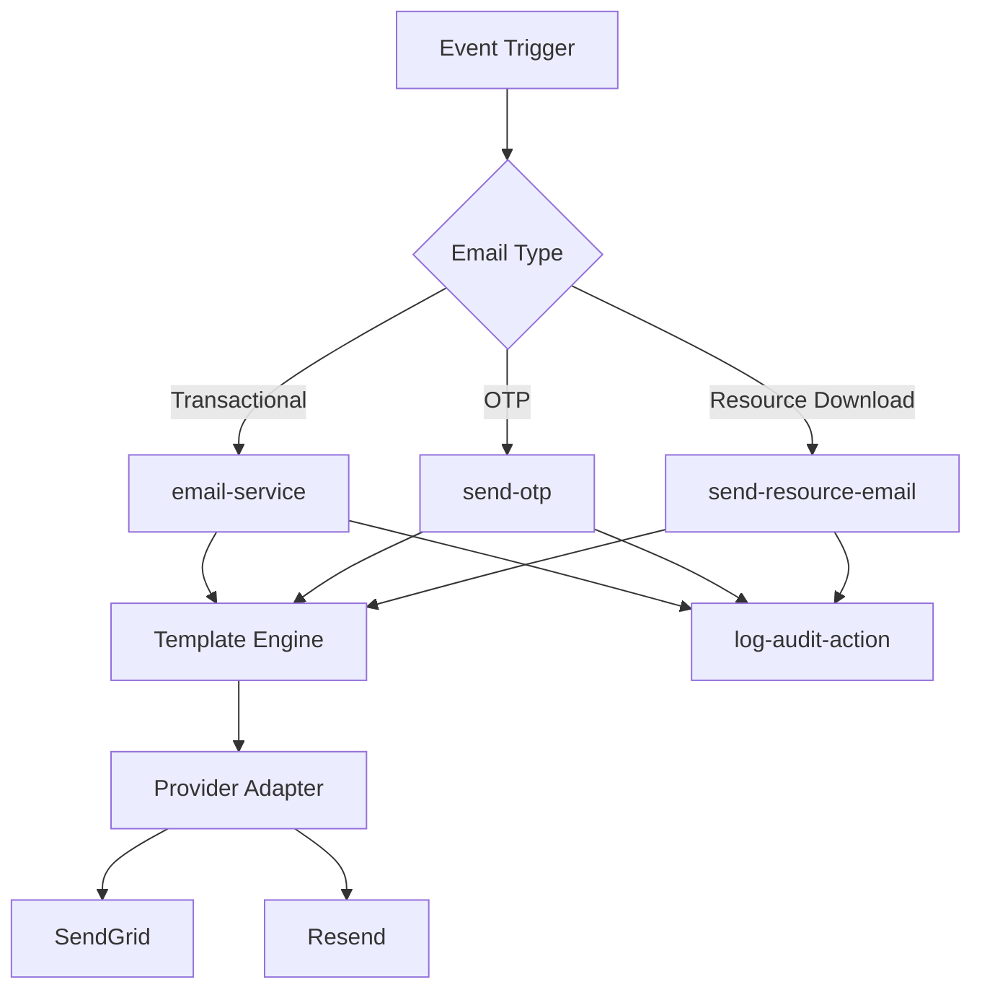
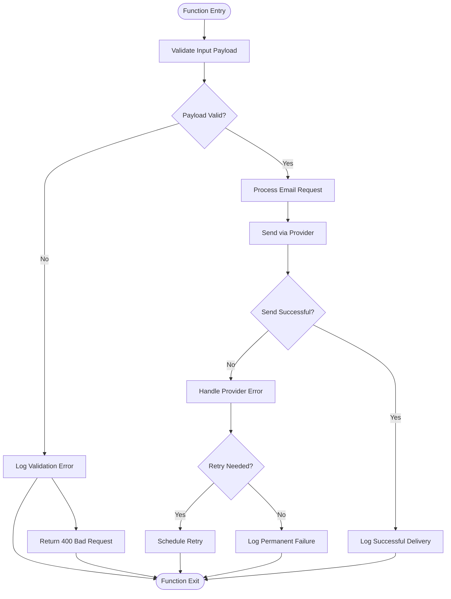

# Email Service Triggers

<cite>
**Referenced Files in This Document**
- [email-service/index.ts](file://supabase/functions/email-service/index.ts)
- [send-otp/index.ts](file://supabase/functions/send-otp/index.ts)
- [send-resource-email/index.ts](file://supabase/functions/send-resource-email/index.ts)
- [log-audit-action/index.ts](file://supabase/functions/log-audit-action/index.ts)
- [OrderConfirmation.tsx](file://src/pages/OrderConfirmation.tsx)
- [BrochureDownload.tsx](file://src/components/BrochureDownload.tsx)
- [ResourceDownloadModal.tsx](file://src/components/ResourceDownloadModal.tsx)
</cite>

## Table of Contents
1. [Introduction](#introduction)
2. [Email Service Architecture](#email-service-architecture)
3. [Transactional and Marketing Email Dispatch](#transactional-and-marketing-email-dispatch)
4. [Event-Driven Email Triggers](#event-driven-email-triggers)
5. [Template Rendering and Personalization](#template-rendering-and-personalization)
6. [Third-Party Email Provider Integration](#third-party-email-provider-integration)
7. [Payload Validation and Error Handling](#payload-validation-and-error-handling)
8. [Retry Mechanisms and Deliverability Monitoring](#retry-mechanisms-and-deliverability-monitoring)
9. [Audit Logging and Security](#audit-logging-and-security)
10. [Common Issues and Best Practices](#common-issues-and-best-practices)

## Introduction
The Email Service Triggers sub-component manages automated email communications within the SleekApp platform. This system handles both transactional emails (order confirmations, OTPs) and marketing emails (resource downloads, supplier onboarding) through a serverless function architecture. The implementation leverages event-driven patterns to trigger emails based on user actions and system events, ensuring timely and relevant communication across the platform.

## Email Service Architecture
The email service is implemented as a collection of serverless functions within the Supabase ecosystem, designed to be scalable and resilient. The architecture follows a microservices pattern where each email type is handled by a dedicated function, allowing for independent deployment and monitoring.

**Diagram sources**
- [email-service/index.ts](file://supabase/functions/email-service/index.ts)
- [send-otp/index.ts](file://supabase/functions/send-otp/index.ts)
- [send-resource-email/index.ts](file://supabase/functions/send-resource-email/index.ts)
- [log-audit-action/index.ts](file://supabase/functions/log-audit-action/index.ts)

**Section sources**
- [email-service/index.ts](file://supabase/functions/email-service/index.ts)
- [send-otp/index.ts](file://supabase/functions/send-otp/index.ts)
- [send-resource-email/index.ts](file://supabase/functions/send-resource-email/index.ts)

## Transactional and Marketing Email Dispatch
The email-service function serves as the primary entry point for both transactional and marketing emails. Transactional emails include order confirmations, password resets, and account verifications, while marketing emails encompass resource downloads, onboarding sequences, and promotional content.

The dispatch mechanism differentiates between these email types through payload metadata, applying appropriate templates, delivery priorities, and tracking mechanisms. Transactional emails are prioritized for immediate delivery with higher reliability requirements, while marketing emails may be batched and optimized for engagement metrics.

**Section sources**
- [email-service/index.ts](file://supabase/functions/email-service/index.ts)

## Event-Driven Email Triggers
Emails are triggered by specific events throughout the application lifecycle. The system implements a publish-subscribe pattern where various components emit events that are captured and processed by the email service functions.

Key event triggers include:
- Order confirmation events from OrderConfirmation.tsx
- OTP generation requests from authentication flows
- Resource download requests from BrochureDownload.tsx and ResourceDownloadModal.tsx
- Supplier onboarding completions from supplier management workflows

Each event contains a structured payload with recipient information, template variables, and metadata that guides the email generation process.

**Section sources**
- [OrderConfirmation.tsx](file://src/pages/OrderConfirmation.tsx)
- [BrochureDownload.tsx](file://src/components/BrochureDownload.tsx)
- [ResourceDownloadModal.tsx](file://src/components/ResourceDownloadModal.tsx)

## Template Rendering and Personalization
The email service implements a dynamic template rendering system that supports both transactional and marketing use cases. Templates are stored in a version-controlled repository and retrieved based on the email type specified in the event payload.

Personalization is achieved through a data binding mechanism that merges recipient-specific data with template placeholders. The system supports advanced personalization features including:
- Name and company personalization
- Dynamic content blocks based on user preferences
- Behavioral targeting using interaction history
- A/B testing variants for marketing emails

Template security is enforced through input sanitization and context-aware escaping to prevent template injection attacks.

**Section sources**
- [email-service/index.ts](file://supabase/functions/email-service/index.ts)

## Third-Party Email Provider Integration
The system integrates with multiple third-party email providers, primarily SendGrid and Resend, to ensure deliverability and provide redundancy. The integration is abstracted through a provider adapter pattern that normalizes API differences and enables seamless switching between providers.

Provider selection is determined by:
- Email type (transactional vs. marketing)
- Destination domain reputation
- Current deliverability metrics
- Cost optimization rules

The adapter handles provider-specific authentication, rate limiting, and error responses, presenting a unified interface to the email service core.

**Section sources**
- [email-service/index.ts](file://supabase/functions/email-service/index.ts)

## Payload Validation and Error Handling
Robust payload validation is implemented at the entry point of each email function to ensure data integrity and security. The validation process includes:
- Schema validation using JSON Schema
- Email address format and domain validation
- Content length and type checking
- Blacklist filtering for prohibited content

Error handling follows a comprehensive strategy with:
- Detailed error classification (validation, provider, transient, permanent)
- Structured error responses with diagnostic information
- Graceful degradation when primary providers fail
- Comprehensive logging for troubleshooting

**Diagram sources**
- [email-service/index.ts](file://supabase/functions/email-service/index.ts)
- [send-otp/index.ts](file://supabase/functions/send-otp/index.ts)

**Section sources**
- [email-service/index.ts](file://supabase/functions/email-service/index.ts)
- [send-otp/index.ts](file://supabase/functions/send-otp/index.ts)

## Retry Mechanisms and Deliverability Monitoring
The system implements intelligent retry mechanisms for transient failures with:
- Exponential backoff strategy
- Maximum retry limits based on error type
- Dead letter queue for unprocessable messages
- Circuit breaker pattern to prevent provider overload

Deliverability is monitored through:
- Provider webhooks for delivery, open, and click events
- Bounce and complaint tracking
- Spam trap detection
- Domain reputation monitoring

These metrics are aggregated and used to optimize provider selection and email content strategies.

**Section sources**
- [email-service/index.ts](file://supabase/functions/email-service/index.ts)

## Audit Logging and Security
All email operations are logged through the log-audit-action function to ensure accountability and facilitate troubleshooting. Audit logs capture:
- Timestamp and initiator information
- Recipient details (with PII masking)
- Email type and template used
- Provider selection and response
- Delivery status and error details

Security measures include:
- Rate limiting to prevent abuse
- Content scanning for malicious links
- SPF, DKIM, and DMARC enforcement
- Encryption of sensitive data in transit and at rest

**Section sources**
- [log-audit-action/index.ts](file://supabase/functions/log-audit-action/index.ts)
- [email-service/index.ts](file://supabase/functions/email-service/index.ts)

## Common Issues and Best Practices

### Common Issues
**Spam Filtering**: Emails may be flagged by recipient filters due to content patterns, sending reputation, or authentication issues. The system addresses this through proper email authentication, content optimization, and sender reputation monitoring.

**Template Injection Risks**: User-provided data in templates could potentially execute malicious code. This is mitigated through strict input validation, context-aware escaping, and sandboxed template rendering.

**Rate Limiting**: Email providers enforce rate limits that can disrupt service. The system handles this through provider-specific rate limit awareness, queuing mechanisms, and fallback providers.

### Best Practices
**Template Management**:
- Maintain templates in version control
- Implement template review and approval workflows
- Use modular template components for consistency
- Test templates across email clients and devices

**Delivery Testing**:
- Implement pre-production testing with staging providers
- Use seed lists to verify content and rendering
- Monitor deliverability metrics continuously
- Conduct regular spam score evaluations

**Performance Optimization**:
- Cache frequently used templates
- Batch non-urgent marketing emails
- Optimize image sizes and attachments
- Implement connection pooling with providers

**Section sources**
- [email-service/index.ts](file://supabase/functions/email-service/index.ts)
- [send-otp/index.ts](file://supabase/functions/send-otp/index.ts)
- [send-resource-email/index.ts](file://supabase/functions/send-resource-email/index.ts)
- [log-audit-action/index.ts](file://supabase/functions/log-audit-action/index.ts)