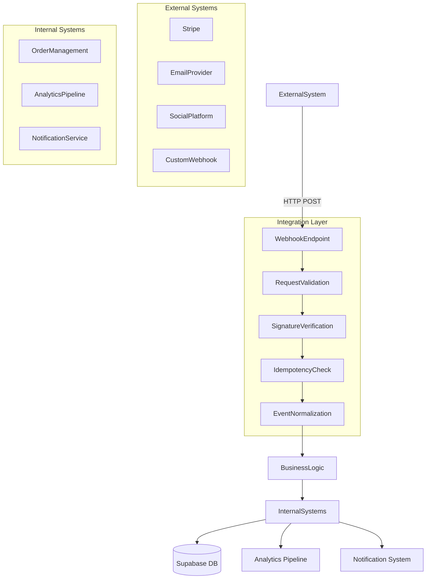
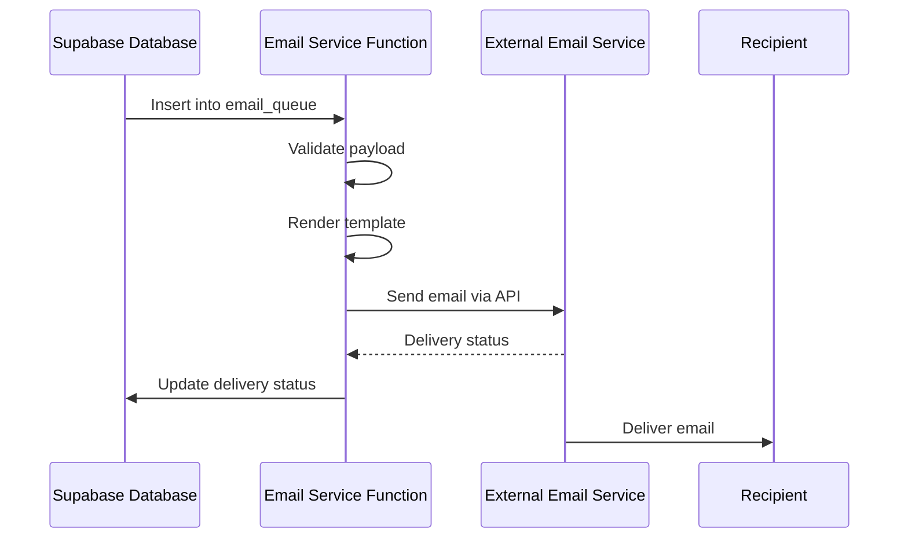
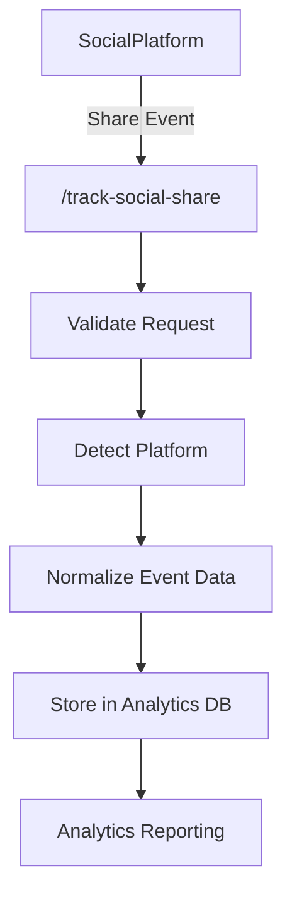
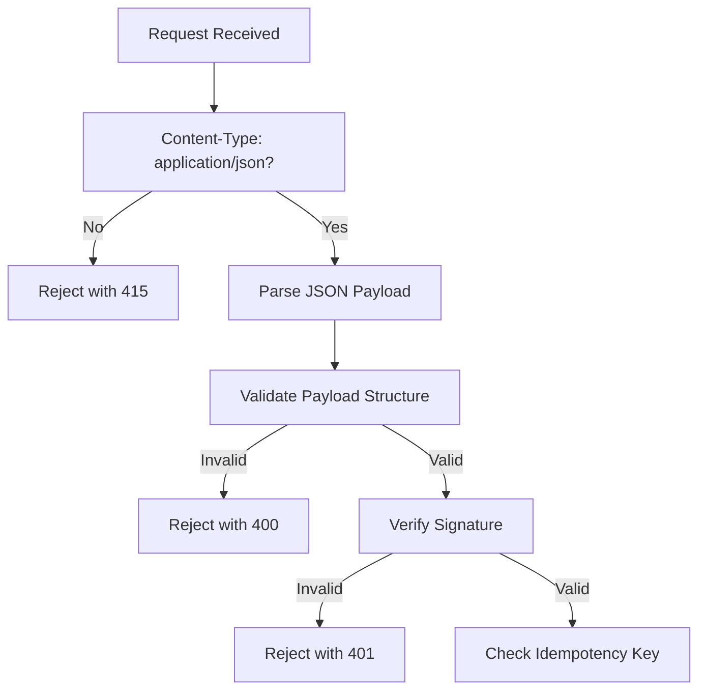
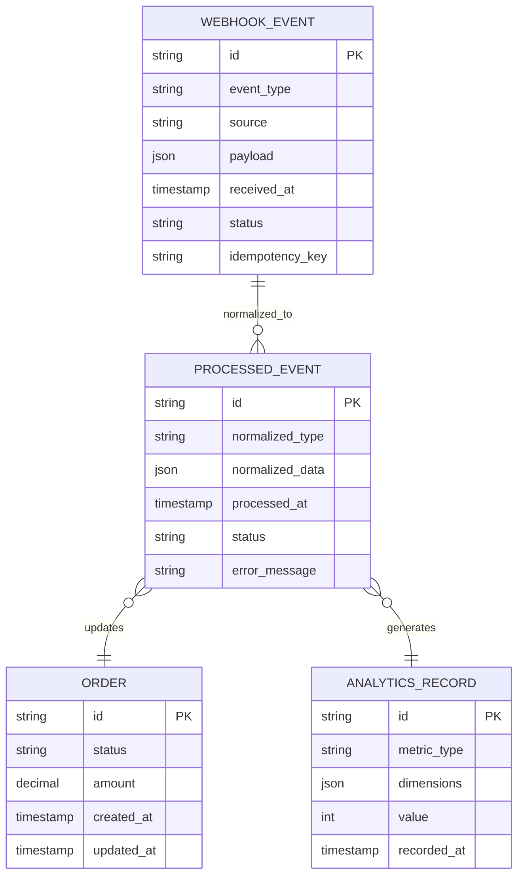

# Integration & Webhook Functions

<cite>
**Referenced Files in This Document**  
- [stripe-webhook/index.ts](file://supabase/functions/stripe-webhook/index.ts)
- [email-service/index.ts](file://supabase/functions/email-service/index.ts)
- [track-social-share/index.ts](file://supabase/functions/track-social-share/index.ts)
- [analytics-service/index.ts](file://supabase/functions/analytics-service/index.ts)
- [resend-webhook/index.ts](file://supabase/functions/resend-webhook/index.ts)
- [shared/securityLogger.ts](file://supabase/functions/shared/securityLogger.ts)
- [lib/analytics/tracker.ts](file://src/lib/analytics/tracker.ts)
- [lib/utils.ts](file://src/lib/utils.ts)
- [types/order.ts](file://src/types/order.ts)
- [integrations/supabase/client.ts](file://src/integrations/supabase/client.ts)
</cite>

## Table of Contents
1. [Introduction](#introduction)
2. [Core Integration Architecture](#core-integration-architecture)
3. [Stripe Webhook Implementation](#stripe-webhook-implementation)
4. [Email Service Triggers](#email-service-triggers)
5. [Social Sharing Tracking](#social-sharing-tracking)
6. [External Webhook Forwarding](#external-webhook-forwarding)
7. [Request Validation and Security](#request-validation-and-security)
8. [Idempotency Key Handling](#idempotency-key-handling)
9. [Event Normalization and Processing](#event-normalization-and-processing)
10. [Integration with Internal Systems](#integration-with-internal-systems)
11. [Common Issues and Mitigation Strategies](#common-issues-and-mitigation-strategies)
12. [Configuration and Testing Guidelines](#configuration-and-testing-guidelines)

## Introduction
This document provides a comprehensive analysis of the integration and webhook functions within the SleekApp platform. It details the implementation of third-party integration points including payment processing via Stripe, email service triggers, social sharing tracking, and external webhook forwarding. The documentation covers security patterns, data consistency mechanisms, and operational best practices for maintaining reliable external integrations.

## Core Integration Architecture
The integration architecture is built around Supabase Functions, which serve as serverless endpoints for handling external events. These functions act as adapters between external systems and the internal application context, normalizing incoming data and triggering appropriate business logic.

**Diagram sources**
- [stripe-webhook/index.ts](file://supabase/functions/stripe-webhook/index.ts#L1-L100)
- [analytics-service/index.ts](file://supabase/functions/analytics-service/index.ts#L1-L50)

**Section sources**
- [stripe-webhook/index.ts](file://supabase/functions/stripe-webhook/index.ts#L1-L150)
- [analytics-service/index.ts](file://supabase/functions/analytics-service/index.ts#L1-L80)

## Stripe Webhook Implementation
The Stripe webhook handler processes payment events from Stripe's API, including payment intents, subscription changes, and invoice updates. The implementation follows Stripe's recommended security practices, including signature verification and idempotency key handling.

The function validates incoming requests by verifying the Stripe signature using the platform's webhook signing secret. Each event type is processed according to its specific business logic, with payment successes triggering order confirmation workflows and failures initiating customer notification sequences.

**Section sources**
- [stripe-webhook/index.ts](file://supabase/functions/stripe-webhook/index.ts#L20-L200)
- [lib/utils.ts](file://src/lib/utils.ts#L150-L200)

## Email Service Triggers
Email service triggers are implemented as Supabase Functions that respond to database changes and user actions. These functions generate and send transactional emails for order confirmations, password resets, quote submissions, and other critical user communications.

The email service integrates with third-party email providers through API calls, using templates stored in the database. Each email trigger includes retry logic and delivery status tracking to ensure reliable message delivery.

**Diagram sources**
- [email-service/index.ts](file://supabase/functions/email-service/index.ts#L10-L120)
- [lib/analytics/tracker.ts](file://src/lib/analytics/tracker.ts#L20-L40)

**Section sources**
- [email-service/index.ts](file://supabase/functions/email-service/index.ts#L1-L150)
- [types/order.ts](file://src/types/order.ts#L50-L80)

## Social Sharing Tracking
Social sharing events are captured through dedicated webhook endpoints that track when users share products or content on social media platforms. The tracking system records the share event, platform type, and associated metadata for analytics purposes.

The implementation normalizes data from different social platforms into a consistent format before storing it in the analytics database. This enables cross-platform comparison of sharing behavior and effectiveness.

**Diagram sources**
- [track-social-share/index.ts](file://supabase/functions/track-social-share/index.ts#L5-L60)
- [analytics-service/index.ts](file://supabase/functions/analytics-service/index.ts#L30-L70)

**Section sources**
- [track-social-share/index.ts](file://supabase/functions/track-social-share/index.ts#L1-L80)
- [analytics-service/index.ts](file://supabase/functions/analytics-service/index.ts#L1-L100)

## External Webhook Forwarding
The platform supports forwarding relevant events to external webhook endpoints configured by users or partners. The resend-webhook function handles this capability, allowing selective forwarding of events based on subscription rules.

Forwarded events include order updates, production stage changes, and quality control results. The system implements retry mechanisms with exponential backoff for failed deliveries and maintains delivery logs for troubleshooting.

**Section sources**
- [resend-webhook/index.ts](file://supabase/functions/resend-webhook/index.ts#L1-L120)
- [shared/securityLogger.ts](file://supabase/functions/shared/securityLogger.ts#L5-L30)

## Request Validation and Security
All webhook endpoints implement rigorous request validation to prevent unauthorized access and data injection. The validation process includes:

- Content-Type verification
- Payload structure validation
- Required field checks
- Size limits enforcement

For Stripe webhooks, signature verification is performed using the official Stripe library, validating the signature header against the webhook signing secret. This prevents spoofing of payment events.

**Diagram sources**
- [stripe-webhook/index.ts](file://supabase/functions/stripe-webhook/index.ts#L40-L100)
- [shared/securityLogger.ts](file://supabase/functions/shared/securityLogger.ts#L10-L40)

**Section sources**
- [stripe-webhook/index.ts](file://supabase/functions/stripe-webhook/index.ts#L20-L150)
- [shared/securityLogger.ts](file://supabase/functions/shared/securityLogger.ts#L1-L50)

## Idempotency Key Handling
The system implements idempotency key handling to prevent duplicate processing of webhook events. Each incoming request is checked for an idempotency key, typically provided in the `Idempotency-Key` header or within the event payload.

When a request with a previously seen idempotency key is received, the system returns the original response without reprocessing the event. This protects against network retries and ensures data consistency across systems.

**Section sources**
- [stripe-webhook/index.ts](file://supabase/functions/stripe-webhook/index.ts#L80-L120)
- [resend-webhook/index.ts](file://supabase/functions/resend-webhook/index.ts#L40-L70)

## Event Normalization and Processing
Incoming webhook events are normalized into a consistent internal format before processing. This normalization layer translates external event schemas into the platform's internal data model, enabling uniform handling across different integration types.

The normalization process includes:
- Field mapping and transformation
- Data type conversion
- Default value assignment
- Context enrichment

Normalized events are then processed according to their type, triggering appropriate workflows and updating relevant systems.

**Section sources**
- [analytics-service/index.ts](file://supabase/functions/analytics-service/index.ts#L20-L60)
- [lib/utils.ts](file://src/lib/utils.ts#L100-L180)

## Integration with Internal Systems
Webhook events are tightly integrated with internal systems including order management, analytics pipelines, and notification services. Successful payment events trigger order creation and supplier assignment workflows, while social sharing events update engagement metrics.

The integration architecture uses a publish-subscribe pattern, where normalized events are published to internal event queues that various services subscribe to. This decouples the webhook processing from business logic execution.

**Diagram sources**
- [stripe-webhook/index.ts](file://supabase/functions/stripe-webhook/index.ts#L100-L150)
- [analytics-service/index.ts](file://supabase/functions/analytics-service/index.ts#L50-L90)
- [types/order.ts](file://src/types/order.ts#L1-L100)

**Section sources**
- [stripe-webhook/index.ts](file://supabase/functions/stripe-webhook/index.ts#L1-L200)
- [analytics-service/index.ts](file://supabase/functions/analytics-service/index.ts#L1-L120)
- [types/order.ts](file://src/types/order.ts#L1-L120)

## Common Issues and Mitigation Strategies
The system addresses several common webhook integration challenges:

**Webhook Delivery Failures**: Implement retry mechanisms with exponential backoff and jitter. Failed deliveries are logged and can be manually retried through an admin interface.

**Replay Attacks**: Prevented through signature verification and idempotency key enforcement. Each request is authenticated and deduplicated.

**Data Consistency Issues**: Addressed through transactional processing and event sourcing patterns. Critical operations are wrapped in database transactions to maintain consistency.

**Rate Limiting**: The system monitors incoming webhook traffic and implements rate limiting to prevent abuse. Suspicious patterns trigger security alerts.

**Section sources**
- [stripe-webhook/index.ts](file://supabase/functions/stripe-webhook/index.ts#L120-L180)
- [resend-webhook/index.ts](file://supabase/functions/resend-webhook/index.ts#L60-L100)
- [shared/securityLogger.ts](file://supabase/functions/shared/securityLogger.ts#L1-L60)

## Configuration and Testing Guidelines
For safe and reliable integration configuration:

1. **Use Separate Environments**: Maintain distinct webhook endpoints for development, staging, and production environments.

2. **Test with Webhook Simulators**: Use tools like Stripe CLI to simulate webhook events during development.

3. **Monitor Delivery Metrics**: Track success rates, latency, and failure reasons for all webhook integrations.

4. **Implement Circuit Breakers**: Automatically disable failing integrations after repeated failures to prevent cascading issues.

5. **Regular Security Audits**: Periodically review webhook secrets and access controls.

Testing should include:
- Valid signature verification
- Invalid signature rejection
- Idempotency key reuse
- Malformed payload handling
- Rate limit testing

**Section sources**
- [stripe-webhook/index.ts](file://supabase/functions/stripe-webhook/index.ts#L1-L200)
- [email-service/index.ts](file://supabase/functions/email-service/index.ts#L1-L150)
- [shared/securityLogger.ts](file://supabase/functions/shared/securityLogger.ts#L1-L50)