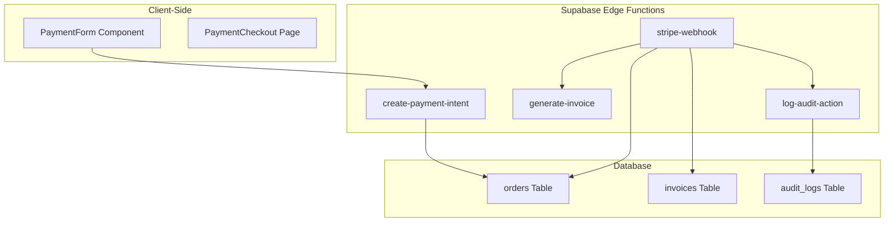
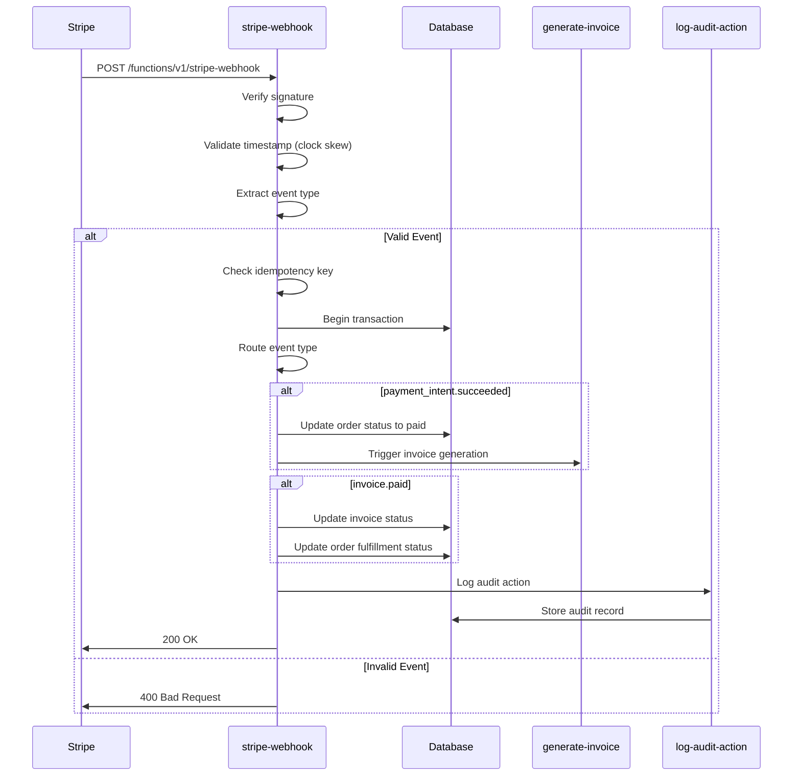
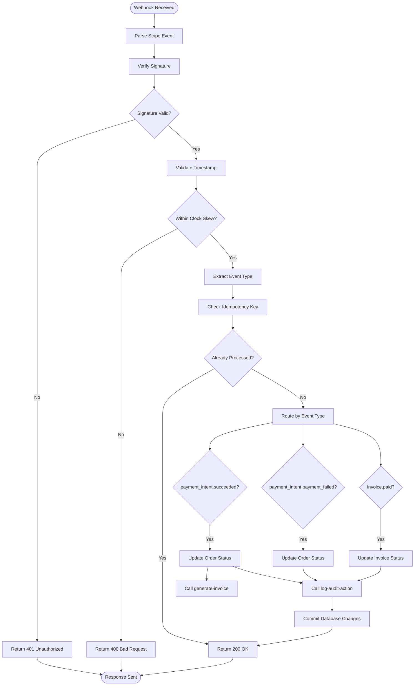
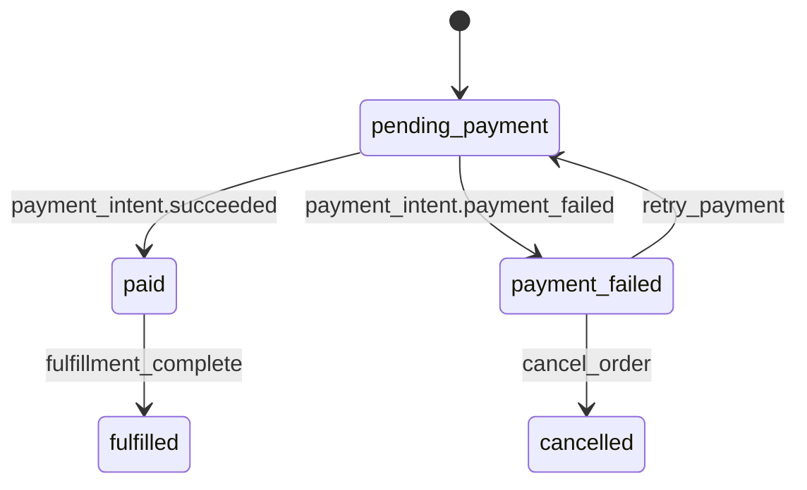
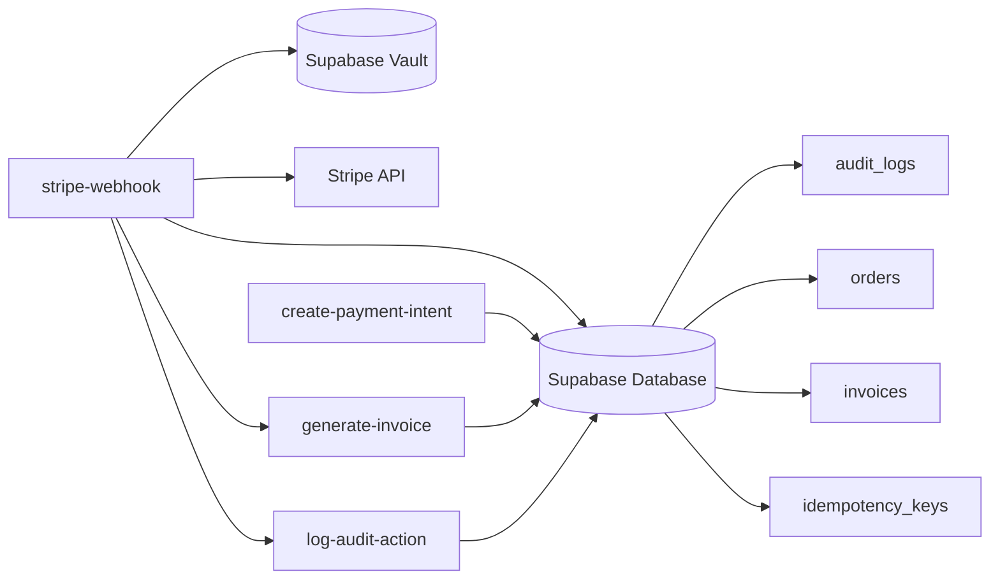

# Stripe Webhook Integration

<cite>
**Referenced Files in This Document**  
- [stripe-webhook/index.ts](file://supabase/functions/stripe-webhook/index.ts)
- [create-payment-intent/index.ts](file://supabase/functions/create-payment-intent/index.ts)
- [generate-invoice/index.ts](file://supabase/functions/generate-invoice/index.ts)
- [log-audit-action/index.ts](file://supabase/functions/log-audit-action/index.ts)
- [src/lib/auditLog.ts](file://src/lib/auditLog.ts)
- [src/lib/enhancedAuditLog.ts](file://src/lib/enhancedAuditLog.ts)
- [src/components/payment/PaymentForm.tsx](file://src/components/payment/PaymentForm.tsx)
- [src/pages/PaymentCheckout.tsx](file://src/pages/PaymentCheckout.tsx)
- [src/hooks/usePayment.ts](file://src/hooks/usePayment.ts)
</cite>

## Table of Contents
1. [Introduction](#introduction)
2. [Project Structure](#project-structure)
3. [Core Components](#core-components)
4. [Architecture Overview](#architecture-overview)
5. [Detailed Component Analysis](#detailed-component-analysis)
6. [Dependency Analysis](#dependency-analysis)
7. [Performance Considerations](#performance-considerations)
8. [Troubleshooting Guide](#troubleshooting-guide)
9. [Conclusion](#conclusion)

## Introduction
The Stripe Webhook Integration component enables secure and reliable handling of payment events in the SleekApp platform. This document details the implementation of webhook endpoint security, event routing, idempotency management, and integration with internal order and invoice systems. The system leverages Supabase Edge Functions to process Stripe events, ensuring asynchronous and scalable payment handling.

## Project Structure
The Stripe integration is implemented primarily through Supabase Edge Functions, with client-side components for payment initiation and display. The architecture separates concerns between payment intent creation, invoice generation, and webhook processing, while maintaining auditability and security.

**Diagram sources**
- [stripe-webhook/index.ts](file://supabase/functions/stripe-webhook/index.ts)
- [create-payment-intent/index.ts](file://supabase/functions/create-payment-intent/index.ts)
- [generate-invoice/index.ts](file://supabase/functions/generate-invoice/index.ts)
- [log-audit-action/index.ts](file://supabase/functions/log-audit-action/index.ts)

**Section sources**
- [stripe-webhook/index.ts](file://supabase/functions/stripe-webhook/index.ts)
- [create-payment-intent/index.ts](file://supabase/functions/create-payment-intent/index.ts)

## Core Components
The Stripe integration consists of three primary Edge Functions: `create-payment-intent` for initiating payments, `generate-invoice` for invoice creation, and `stripe-webhook` for processing incoming Stripe events. These functions are coordinated through idempotency keys and audit logging to ensure data consistency and traceability.

**Section sources**
- [stripe-webhook/index.ts](file://supabase/functions/stripe-webhook/index.ts)
- [create-payment-intent/index.ts](file://supabase/functions/create-payment-intent/index.ts)
- [generate-invoice/index.ts](file://supabase/functions/generate-invoice/index.ts)

## Architecture Overview
The payment processing architecture follows an event-driven pattern where Stripe events trigger webhook processing in Supabase. The system validates signatures, verifies event authenticity, and routes events based on type to appropriate handlers that update order and invoice states.

**Diagram sources**
- [stripe-webhook/index.ts](file://supabase/functions/stripe-webhook/index.ts)
- [generate-invoice/index.ts](file://supabase/functions/generate-invoice/index.ts)
- [log-audit-action/index.ts](file://supabase/functions/log-audit-action/index.ts)

## Detailed Component Analysis

### Webhook Endpoint Security
The `stripe-webhook` function implements multiple security layers including signature verification using the Stripe webhook secret, timestamp validation to prevent replay attacks, and strict content-type checking. The function retrieves the webhook secret from Supabase Vault for secure storage and automatic rotation.

**Section sources**
- [stripe-webhook/index.ts](file://supabase/functions/stripe-webhook/index.ts)

### Event Type Routing
The webhook handler routes events based on their type property, supporting key events such as `payment_intent.succeeded`, `payment_intent.payment_failed`, `invoice.paid`, and `invoice.payment_failed`. Each event type triggers specific business logic for order and invoice state management.

**Diagram sources**
- [stripe-webhook/index.ts](file://supabase/functions/stripe-webhook/index.ts)

**Section sources**
- [stripe-webhook/index.ts](file://supabase/functions/stripe-webhook/index.ts)

### Idempotency Key Management
To prevent duplicate processing of Stripe events, the system uses idempotency keys derived from the Stripe event ID. Before processing any event, the webhook checks a dedicated idempotency table to determine if the event has already been processed, ensuring exactly-once semantics even during retries.

**Section sources**
- [stripe-webhook/index.ts](file://supabase/functions/stripe-webhook/index.ts)

### Payment Event to Order State Mapping
Payment events are mapped to internal order states through a state transition system. A `payment_intent.succeeded` event transitions an order from "pending_payment" to "paid" status, while failed payments transition to "payment_failed". The system also handles asynchronous payment confirmations from payment methods like bank transfers.

**Diagram sources**
- [stripe-webhook/index.ts](file://supabase/functions/stripe-webhook/index.ts)

**Section sources**
- [stripe-webhook/index.ts](file://supabase/functions/stripe-webhook/index.ts)

### Integration with create-payment-intent and generate-invoice
The webhook function integrates with `create-payment-intent` during order creation and with `generate-invoice` upon successful payment. These functions are called via internal Supabase function invocation, maintaining loose coupling while ensuring transactional integrity through audit logging.

**Section sources**
- [stripe-webhook/index.ts](file://supabase/functions/stripe-webhook/index.ts)
- [create-payment-intent/index.ts](file://supabase/functions/create-payment-intent/index.ts)
- [generate-invoice/index.ts](file://supabase/functions/generate-invoice/index.ts)

### Error Handling and Retry Logic
The webhook implements robust error handling with appropriate HTTP status codes: 200 for successfully processed events (even duplicates), 400 for invalid signatures or malformed requests, and 500 only for unexpected errors. Stripe will automatically retry failed webhook deliveries according to its retry schedule.

**Section sources**
- [stripe-webhook/index.ts](file://supabase/functions/stripe-webhook/index.ts)

### Audit Logging via log-audit-action
All webhook processing activities are logged through the `log-audit-action` function, which records event type, source, timestamp, and outcome. This provides a complete audit trail for compliance and troubleshooting, with logs stored in the `audit_logs` database table.

**Section sources**
- [stripe-webhook/index.ts](file://supabase/functions/stripe-webhook/index.ts)
- [log-audit-action/index.ts](file://supabase/functions/log-audit-action/index.ts)
- [src/lib/auditLog.ts](file://src/lib/auditLog.ts)

## Dependency Analysis
The Stripe webhook integration depends on several core services within the Supabase ecosystem, including the database for state persistence, Vault for secret management, and the Edge Functions runtime for execution. It also relies on external Stripe services for payment processing and event generation.

**Diagram sources**
- [stripe-webhook/index.ts](file://supabase/functions/stripe-webhook/index.ts)
- [create-payment-intent/index.ts](file://supabase/functions/create-payment-intent/index.ts)
- [generate-invoice/index.ts](file://supabase/functions/generate-invoice/index.ts)
- [log-audit-action/index.ts](file://supabase/functions/log-audit-action/index.ts)

**Section sources**
- [supabase/functions](file://supabase/functions)
- [src/lib/auditLog.ts](file://src/lib/auditLog.ts)

## Performance Considerations
The webhook function is optimized for fast execution to meet Stripe's 5-second timeout requirement. Database operations are batched where possible, and external function calls are made asynchronously when appropriate. The idempotency check is indexed for O(1) lookup performance.

## Troubleshooting Guide
Common issues include webhook secret rotation, clock skew validation failures, and duplicate event processing. The audit logs should be checked first when investigating webhook issues. For secret rotation, ensure the new secret is updated in Supabase Vault before rotating in Stripe Dashboard. Testing with Stripe CLI is recommended before deploying changes to production.

**Section sources**
- [stripe-webhook/index.ts](file://supabase/functions/stripe-webhook/index.ts)
- [src/lib/auditLog.ts](file://src/lib/auditLog.ts)

## Conclusion
The Stripe Webhook Integration provides a secure, reliable, and auditable system for handling payment events in the SleekApp platform. By leveraging Supabase Edge Functions and following Stripe best practices, the implementation ensures payment data integrity, prevents duplicate processing, and maintains comprehensive audit trails for compliance and troubleshooting.