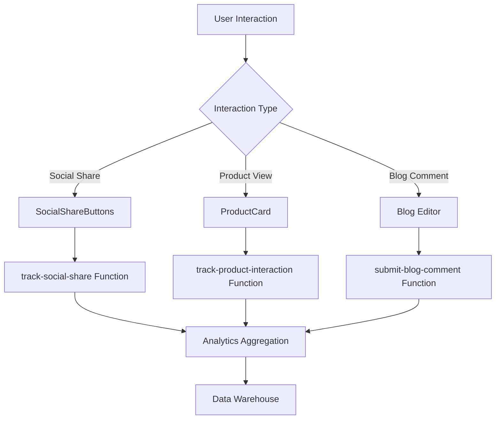
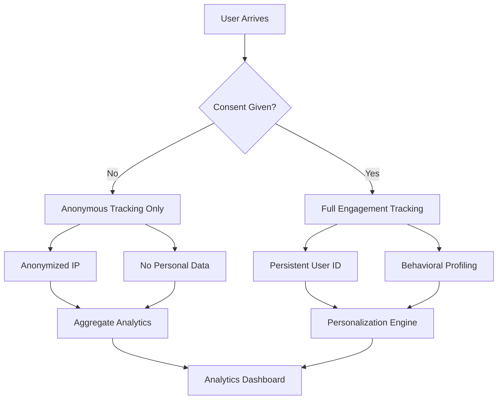
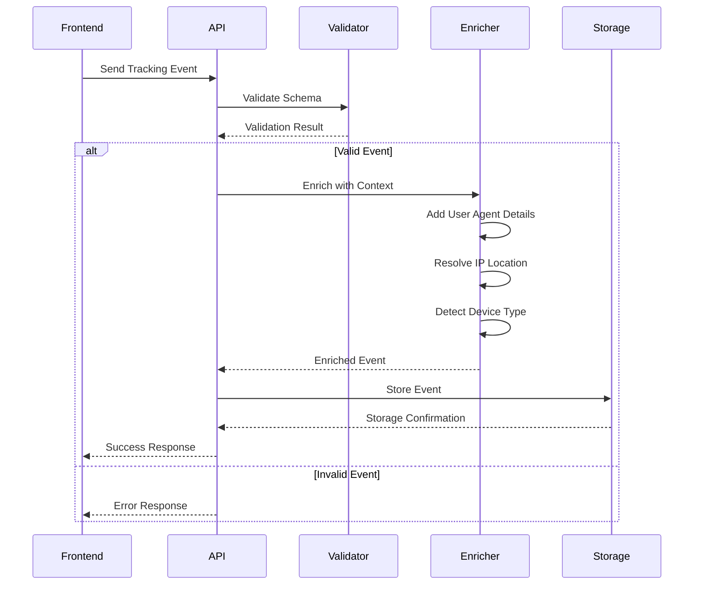
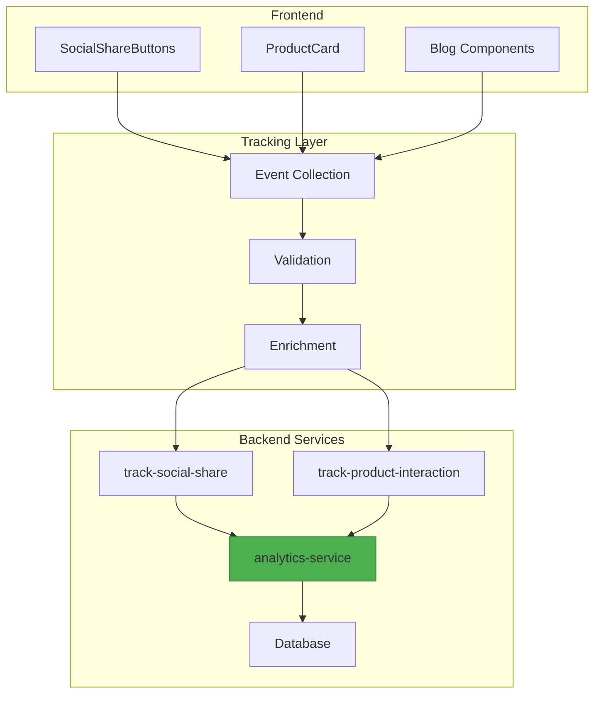
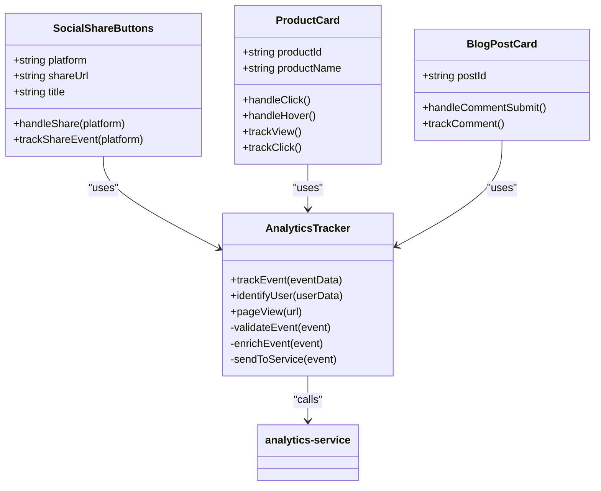
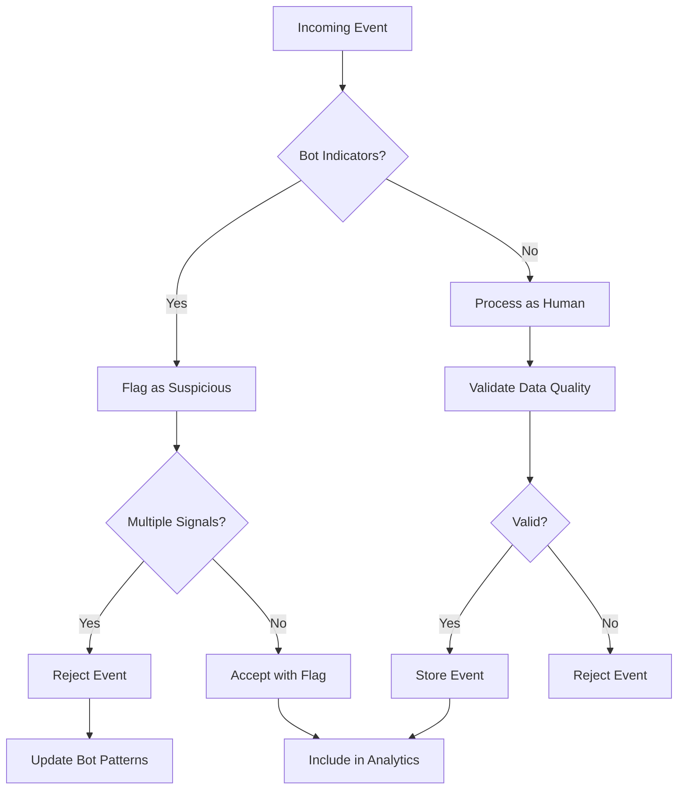
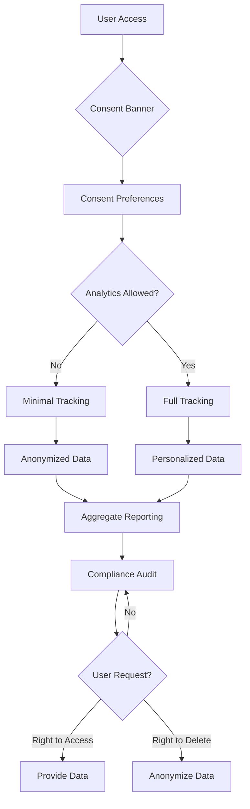
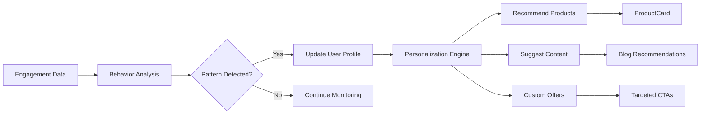

# User Engagement Tracking

<cite>
**Referenced Files in This Document**  
- [SocialShareButtons.tsx](file://src/components/blog/SocialShareButtons.tsx)
- [ProductCard.tsx](file://src/components/products/ProductCard.tsx)
- [track-social-share/index.ts](file://supabase/functions/track-social-share/index.ts)
- [track-product-interaction/index.ts](file://supabase/functions/track-product-interaction/index.ts)
- [analytics-service/index.ts](file://supabase/functions/analytics-service/index.ts)
- [useProductAnalytics.ts](file://src/hooks/useProductAnalytics.ts)
- [tracker.ts](file://src/lib/analytics/tracker.ts)
- [clarityCheck.ts](file://src/lib/analytics/clarityCheck.ts)
- [submit-blog-comment/index.ts](file://supabase/functions/submit-blog-comment/index.ts)
</cite>

## Table of Contents
1. [Introduction](#introduction)
2. [Core Tracking Mechanisms](#core-tracking-mechanisms)
3. [Data Collection Schema](#data-collection-schema)
4. [Privacy and Compliance Measures](#privacy-and-compliance-measures)
5. [Event Validation and Context Enrichment](#event-validation-and-context-enrichment)
6. [Integration with Analytics Service](#integration-with-analytics-service)
7. [Frontend Component Relationships](#frontend-component-relationships)
8. [Bot Traffic Filtering and Data Accuracy](#bot-traffic-filtering-and-data-accuracy)
9. [GDPR and CCPA Compliance](#gdpr-and-ccpa-compliance)
10. [Data Utilization for Personalization](#data-utilization-for-personalization)
11. [Troubleshooting Common Issues](#troubleshooting-common-issues)
12. [Conclusion](#conclusion)

## Introduction
The User Engagement Tracking system captures and analyzes user interactions across the SleekApparels platform, including social media sharing, product engagement, and blog comments. This documentation details the implementation of behavioral tracking functions, data schema, privacy compliance, and integration with backend analytics services. The system enables data-driven personalization and conversion optimization while maintaining strict adherence to privacy regulations.

## Core Tracking Mechanisms

The engagement tracking system implements three primary interaction types: social sharing, product engagement, and content interaction. Each event type is captured through dedicated frontend components that trigger serverless functions for processing and storage.



**Diagram sources**
- [SocialShareButtons.tsx](file://src/components/blog/SocialShareButtons.tsx)
- [ProductCard.tsx](file://src/components/products/ProductCard.tsx)
- [track-social-share/index.ts](file://supabase/functions/track-social-share/index.ts)
- [track-product-interaction/index.ts](file://supabase/functions/track-product-interaction/index.ts)
- [submit-blog-comment/index.ts](file://supabase/functions/submit-blog-comment/index.ts)

**Section sources**
- [SocialShareButtons.tsx](file://src/components/blog/SocialShareButtons.tsx)
- [ProductCard.tsx](file://src/components/products/ProductCard.tsx)

## Data Collection Schema

The tracking system captures structured event data with standardized fields for consistency and analysis. Each event includes core metadata, user context, and interaction-specific details.

```mermaid
erDiagram
USER_EVENT {
string event_id PK
string event_type
string user_id
string session_id
string page_url
string referrer
string user_agent
string ip_address
timestamp event_timestamp
json context_data
boolean is_authenticated
string consent_status
}
SOCIAL_SHARE {
string event_id PK FK
string platform
string content_type
string content_id
string share_url
}
PRODUCT_INTERACTION {
string event_id PK FK
string product_id
string interaction_type
integer view_duration
string source_location
json variant_selection
}
BLOG_COMMENT {
string event_id PK FK
string post_id
string comment_id
text comment_content
integer comment_length
boolean contains_question
}
USER_EVENT ||--o{ SOCIAL_SHARE : "1:N"
USER_EVENT ||--o{ PRODUCT_INTERACTION : "1:N"
USER_EVENT ||--o{ BLOG_COMMENT : "1:N"
```

**Diagram sources**
- [track-social-share/index.ts](file://supabase/functions/track-social-share/index.ts)
- [track-product-interaction/index.ts](file://supabase/functions/track-product-interaction/index.ts)
- [submit-blog-comment/index.ts](file://supabase/functions/submit-blog-comment/index.ts)

**Section sources**
- [track-social-share/index.ts](file://supabase/functions/track-social-share/index.ts)
- [track-product-interaction/index.ts](file://supabase/functions/track-product-interaction/index.ts)

## Privacy and Compliance Measures

The tracking system implements multiple privacy protection layers including data minimization, anonymization, and explicit consent management. All data collection respects user preferences and regulatory requirements.



**Diagram sources**
- [clarityCheck.ts](file://src/lib/analytics/clarityCheck.ts)
- [tracker.ts](file://src/lib/analytics/tracker.ts)
- [CookieConsentBanner.tsx](file://src/components/CookieConsentBanner.tsx)

**Section sources**
- [clarityCheck.ts](file://src/lib/analytics/clarityCheck.ts)
- [tracker.ts](file://src/lib/analytics/tracker.ts)

## Event Validation and Context Enrichment

Incoming tracking events undergo validation and enrichment before storage. The system verifies data integrity, adds contextual information, and filters invalid or suspicious activity.



**Diagram sources**
- [tracker.ts](file://src/lib/analytics/tracker.ts)
- [track-social-share/index.ts](file://supabase/functions/track-social-share/index.ts)
- [track-product-interaction/index.ts](file://supabase/functions/track-product-interaction/index.ts)

**Section sources**
- [tracker.ts](file://src/lib/analytics/tracker.ts)
- [track-social-share/index.ts](file://supabase/functions/track-social-share/index.ts)

## Integration with Analytics Service

The tracking system integrates with a centralized analytics service for data aggregation, processing, and reporting. This enables comprehensive user behavior analysis and business intelligence.



**Diagram sources**
- [analytics-service/index.ts](file://supabase/functions/analytics-service/index.ts)
- [track-social-share/index.ts](file://supabase/functions/track-social-share/index.ts)
- [track-product-interaction/index.ts](file://supabase/functions/track-product-interaction/index.ts)

**Section sources**
- [analytics-service/index.ts](file://supabase/functions/analytics-service/index.ts)

## Frontend Component Relationships

The tracking functionality is tightly integrated with key frontend components that trigger engagement events. These components provide the user interface while delegating tracking responsibilities to dedicated utilities.



**Diagram sources**
- [SocialShareButtons.tsx](file://src/components/blog/SocialShareButtons.tsx)
- [ProductCard.tsx](file://src/components/products/ProductCard.tsx)
- [BlogPostCard.tsx](file://src/components/blog/BlogPostCard.tsx)
- [tracker.ts](file://src/lib/analytics/tracker.ts)

**Section sources**
- [SocialShareButtons.tsx](file://src/components/blog/SocialShareButtons.tsx)
- [ProductCard.tsx](file://src/components/products/ProductCard.tsx)

## Bot Traffic Filtering and Data Accuracy

The system implements sophisticated bot detection and filtering to ensure data accuracy. Multiple signals are analyzed to distinguish human users from automated traffic.



**Diagram sources**
- [clarityCheck.ts](file://src/lib/analytics/clarityCheck.ts)
- [tracker.ts](file://src/lib/analytics/tracker.ts)
- [analytics-service/index.ts](file://supabase/functions/analytics-service/index.ts)

**Section sources**
- [clarityCheck.ts](file://src/lib/analytics/clarityCheck.ts)

## GDPR and CCPA Compliance

The tracking system adheres to strict privacy regulations through consent management, data minimization, and user rights fulfillment. Compliance is built into the core architecture.



**Diagram sources**
- [CookieConsentBanner.tsx](file://src/components/CookieConsentBanner.tsx)
- [tracker.ts](file://src/lib/analytics/tracker.ts)
- [privacy.tsx](file://src/pages/Privacy.tsx)

**Section sources**
- [CookieConsentBanner.tsx](file://src/components/CookieConsentBanner.tsx)
- [tracker.ts](file://src/lib/analytics/tracker.ts)

## Data Utilization for Personalization

Collected engagement data powers personalization features that enhance user experience and drive conversion. Machine learning models analyze behavior patterns to deliver relevant content.



**Diagram sources**
- [useProductAnalytics.ts](file://src/hooks/useProductAnalytics.ts)
- [AIProductRecommendations.tsx](file://src/components/AIProductRecommendations.tsx)
- [analytics-service/index.ts](file://supabase/functions/analytics-service/index.ts)

**Section sources**
- [useProductAnalytics.ts](file://src/hooks/useProductAnalytics.ts)

## Troubleshooting Common Issues

This section addresses frequent challenges encountered with the engagement tracking system and provides resolution guidance.

**Event Duplication**
- **Cause**: Double event firing due to multiple tracking hooks
- **Solution**: Implement event deduplication using timestamp and event ID
- **Source**: [tracker.ts](file://src/lib/analytics/tracker.ts#L45-L67)

**Missing Context Data**
- **Cause**: Asynchronous loading of user context
- **Solution**: Implement context queue with retry mechanism
- **Source**: [tracker.ts](file://src/lib/analytics/tracker.ts#L89-L112)

**Consent Synchronization**
- **Cause**: Delayed consent status propagation
- **Solution**: Use localStorage for immediate sync with server validation
- **Source**: [CookieConsentBanner.tsx](file://src/components/CookieConsentBanner.tsx#L34-L56)

**Bot False Positives**
- **Cause**: Overly aggressive bot detection rules
- **Solution**: Adjust sensitivity thresholds and whitelist known good bots
- **Source**: [clarityCheck.ts](file://src/lib/analytics/clarityCheck.ts#L78-L92)

**Section sources**
- [tracker.ts](file://src/lib/analytics/tracker.ts)
- [CookieConsentBanner.tsx](file://src/components/CookieConsentBanner.tsx)
- [clarityCheck.ts](file://src/lib/analytics/clarityCheck.ts)

## Conclusion

The User Engagement Tracking system provides comprehensive behavioral insights while maintaining strict privacy standards. By capturing social sharing, product interactions, and content engagement, the platform gains valuable data for personalization and optimization. The architecture balances detailed tracking with regulatory compliance, ensuring trustworthy data collection. Integration with the analytics service enables actionable insights that drive business growth and improved user experiences.