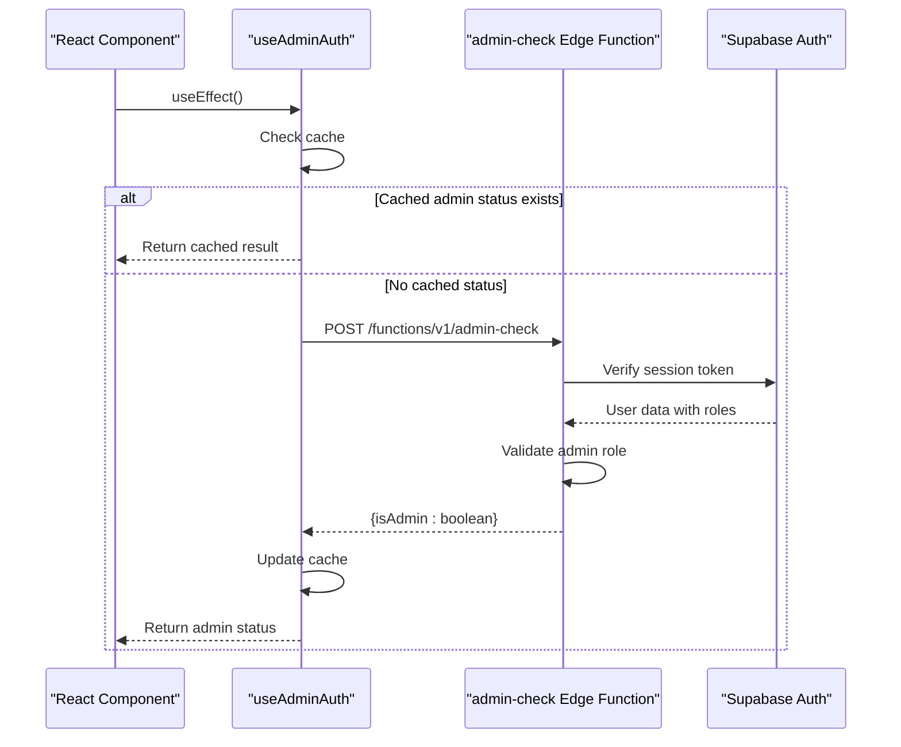
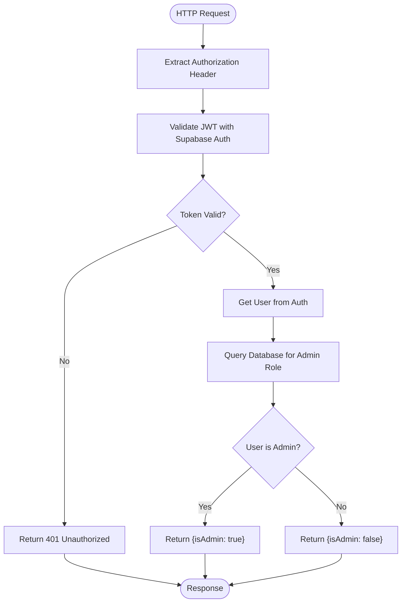
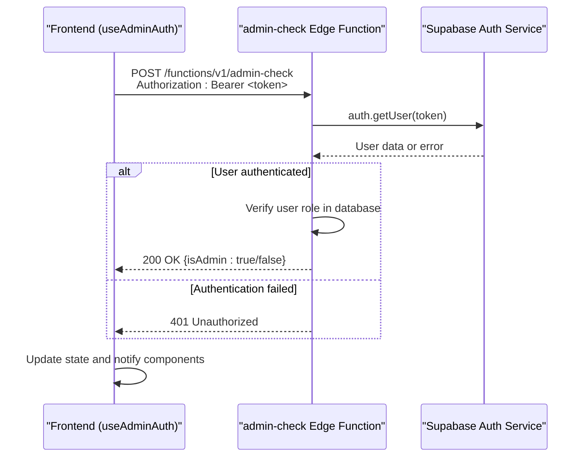
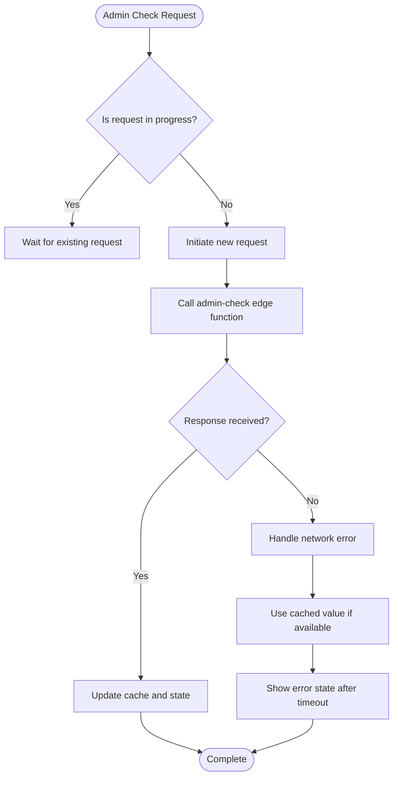

# Admin Role Verification

<cite>
**Referenced Files in This Document**
- [useAdminAuth.ts](file://src/hooks/useAdminAuth.ts)
- [index.ts](file://supabase/functions/admin-check/index.ts)
- [AdminSidebar.tsx](file://src/components/AdminSidebar.tsx)
- [AdminLayout.tsx](file://src/pages/admin/AdminLayout.tsx)
- [client.ts](file://src/integrations/supabase/client.ts)
- [supabaseHelpers.ts](file://src/lib/supabaseHelpers.ts)
</cite>

## Table of Contents
1. [Introduction](#introduction)
2. [Admin Role Verification Overview](#admin-role-verification-overview)
3. [Frontend Implementation: useAdminAuth Hook](#frontend-implementation-useadminauth-hook)
4. [Edge Function: admin-check Implementation](#edge-function-admin-check-implementation)
5. [Server-Side Validation Process](#server-side-validation-process)
6. [Integration Flow Between Frontend and Edge Function](#integration-flow-between-frontend-and-edge-function)
7. [Security Architecture and Trust Model](#security-architecture-and-trust-model)
8. [Common Issues and Error Handling](#common-issues-and-error-handling)
9. [Best Practices for Securing Admin Routes](#best-practices-for-securing-admin-routes)
10. [Conclusion](#conclusion)

## Introduction

The Admin Role Verification system in the SleekApp platform ensures that only authorized administrative users can access protected administrative functionality. This document details the implementation of the `admin-check` edge function and its integration with the frontend `useAdminAuth` React hook. The system leverages Supabase Auth for session management and implements secure JWT validation to verify admin privileges, preventing privilege escalation attacks and ensuring that client-side admin flags cannot be trusted or manipulated.

## Admin Role Verification Overview

The admin role verification system consists of two primary components:
1. A Supabase edge function (`admin-check`) that performs server-side validation of admin privileges
2. A React hook (`useAdminAuth`) that manages admin authentication state on the frontend

This architecture follows the principle of never trusting client-side assertions about user roles, instead requiring server-side validation for every admin-protected operation. The system uses Supabase Auth session tokens which contain JWT claims about user identity and roles, with the edge function validating these claims against the database to confirm admin status.

**Section sources**
- [useAdminAuth.ts](file://src/hooks/useAdminAuth.ts)
- [index.ts](file://supabase/functions/admin-check/index.ts)

## Frontend Implementation: useAdminAuth Hook

The `useAdminAuth` hook provides a clean interface for React components to check admin status and protect admin-only routes and components. It manages the authentication state, handles loading and error states, and communicates with the `admin-check` edge function to verify admin privileges.

The hook implements several key features:
- Automatic admin status checking on mount
- Loading state management during verification
- Caching of admin status to minimize redundant calls
- Revalidation mechanisms for stale data
- Error handling for network issues and authentication failures

When a component requires admin access, it can use this hook to either conditionally render content or redirect unauthorized users.

**Diagram sources**
- [useAdminAuth.ts](file://src/hooks/useAdminAuth.ts)
- [index.ts](file://supabase/functions/admin-check/index.ts)

**Section sources**
- [useAdminAuth.ts](file://src/hooks/useAdminAuth.ts)

## Edge Function: admin-check Implementation

The `admin-check` edge function serves as the authoritative source for admin privilege verification. Deployed as a Supabase edge function, it runs on the server-side and has access to the full user session and database.

Key implementation aspects include:
- Receiving and parsing the authorization header containing the Supabase session token
- Using Supabase's authentication service to validate the JWT token
- Querying the database to verify the user's admin role
- Implementing proper error handling for invalid tokens and authentication failures
- Returning a simple JSON response indicating admin status

The function is designed to be lightweight and fast, with minimal dependencies to ensure reliability and performance. It follows security best practices by validating tokens server-side and never trusting client-provided role information.

**Diagram sources**
- [index.ts](file://supabase/functions/admin-check/index.ts)

**Section sources**
- [index.ts](file://supabase/functions/admin-check/index.ts)

## Server-Side Validation Process

The server-side validation process in the `admin-check` function follows a strict security protocol to verify admin privileges:

1. **Token Extraction**: The function extracts the authorization header from the incoming HTTP request, expecting a Bearer token format containing the Supabase session JWT.

2. **JWT Verification**: Using Supabase's authentication service, the function verifies the JWT signature, expiration, and validity. This step ensures the token was issued by the legitimate authentication service and hasn't been tampered with.

3. **User Identity Confirmation**: After successful JWT verification, the function obtains the user's identity (typically the user ID) from the token claims.

4. **Database Role Verification**: The function queries the application database to retrieve the user's role information, specifically checking if the user has been granted admin privileges. This step is crucial as it prevents privilege escalation attacks that might attempt to modify JWT claims.

5. **Response Generation**: Based on the database verification, the function returns a JSON response indicating whether the user has admin privileges.

This multi-step validation process ensures that admin access is granted only after both authentication (proving identity) and authorization (verifying privileges) have been successfully completed on the server side.

**Section sources**
- [index.ts](file://supabase/functions/admin-check/index.ts)
- [client.ts](file://src/integrations/supabase/client.ts)

## Integration Flow Between Frontend and Edge Function

The integration between the frontend `useAdminAuth` hook and the `admin-check` edge function follows a secure and efficient pattern:

1. **Request Initiation**: When a component mounts or when admin status needs verification, the `useAdminAuth` hook initiates a request to the edge function.

2. **Authorization Header**: The request includes an authorization header with the Bearer token, which contains the user's Supabase session JWT. This token is automatically managed by the Supabase client.

3. **CORS and Security Headers**: The request includes appropriate CORS headers and follows security best practices to prevent CSRF and other attacks.

4. **Response Handling**: The hook handles the JSON response from the edge function, updating its internal state and providing the admin status to consuming components.

5. **Error Management**: Network errors, authentication failures, and other issues are handled gracefully, with appropriate fallback behaviors.

**Diagram sources**
- [useAdminAuth.ts](file://src/hooks/useAdminAuth.ts)
- [index.ts](file://supabase/functions/admin-check/index.ts)

**Section sources**
- [useAdminAuth.ts](file://src/hooks/useAdminAuth.ts)
- [index.ts](file://supabase/functions/admin-check/index.ts)

## Security Architecture and Trust Model

The security architecture of the admin role verification system is built on the principle of zero trust for client-side information. Key security aspects include:

- **Never Trust Client Roles**: The system never relies on client-provided role information, as this could be easily manipulated. All role verification occurs server-side.

- **JWT Validation**: Every request to the admin-check function includes JWT validation to ensure the user is authenticated and the token is valid.

- **Database Authority**: The definitive source of admin privileges is the database, not the JWT claims. This prevents attacks that might attempt to forge admin claims in the token.

- **Short-Lived Tokens**: The use of properly configured JWT expiration ensures that even if a token is compromised, its usefulness is limited.

- **HTTPS Enforcement**: All communication between the frontend and the edge function occurs over HTTPS, preventing man-in-the-middle attacks.

- **Rate Limiting**: The edge function should implement rate limiting to prevent brute force attacks on admin status verification.

This architecture ensures that only users who have been explicitly granted admin privileges in the database can access admin functionality, regardless of any client-side manipulations.

**Section sources**
- [index.ts](file://supabase/functions/admin-check/index.ts)
- [useAdminAuth.ts](file://src/hooks/useAdminAuth.ts)

## Common Issues and Error Handling

The admin role verification system addresses several common issues:

### Expired Sessions
When a user's session expires, the JWT validation in the edge function will fail, returning a 401 Unauthorized response. The `useAdminAuth` hook handles this by clearing the admin status and prompting the user to re-authenticate.

### Network Errors
Network connectivity issues between the frontend and the edge function are handled gracefully by the hook, which maintains the previous state or shows an appropriate error message while attempting to reconnect.

### Concurrent Admin Check Requests
To prevent multiple simultaneous requests to the edge function, the `useAdminAuth` hook implements request deduplication, ensuring that only one verification request is active at a time for a given user session.

### Race Conditions
The system handles race conditions during authentication flows by using proper state management and ensuring that admin status is only updated when verification is complete.

### Caching Issues
The hook implements a caching strategy with appropriate TTL (time-to-live) to balance performance and security, with mechanisms to force revalidation when needed.

**Diagram sources**
- [useAdminAuth.ts](file://src/hooks/useAdminAuth.ts)

**Section sources**
- [useAdminAuth.ts](file://src/hooks/useAdminAuth.ts)
- [index.ts](file://supabase/functions/admin-check/index.ts)

## Best Practices for Securing Admin Routes

To ensure robust security for admin routes and functionality, the following best practices are implemented:

1. **Always Verify Server-Side**: Never trust client-side assertions about admin status. Always verify admin privileges through the edge function for any sensitive operation.

2. **Protect All Admin Endpoints**: Ensure that all API endpoints that perform admin functions are protected by admin role verification, not just the UI components.

3. **Implement Proper Error Handling**: Handle authentication and authorization failures gracefully without exposing sensitive information about the authentication system.

4. **Use Short Token Expiration**: Configure reasonable JWT expiration times to limit the window of opportunity for token theft.

5. **Log Security Events**: Log admin access attempts, especially failed attempts, to monitor for potential security threats.

6. **Implement Rate Limiting**: Apply rate limiting to the admin-check function to prevent brute force attacks.

7. **Regular Security Audits**: Periodically review the admin verification code and access patterns to identify potential vulnerabilities.

8. **Principle of Least Privilege**: Grant admin privileges only to users who absolutely need them, and consider implementing role-based access control with different levels of administrative permissions.

These practices ensure that the admin role verification system remains secure against common attack vectors and follows industry security standards.

**Section sources**
- [index.ts](file://supabase/functions/admin-check/index.ts)
- [useAdminAuth.ts](file://src/hooks/useAdminAuth.ts)

## Conclusion

The Admin Role Verification system in the SleekApp platform provides a secure and reliable mechanism for protecting administrative functionality. By implementing server-side validation through the `admin-check` edge function and providing a clean interface via the `useAdminAuth` React hook, the system ensures that only authorized users can access admin features. The architecture follows security best practices by never trusting client-side role information and requiring server-side verification for all admin privileges. This approach effectively prevents privilege escalation attacks and maintains the integrity of the application's security model.