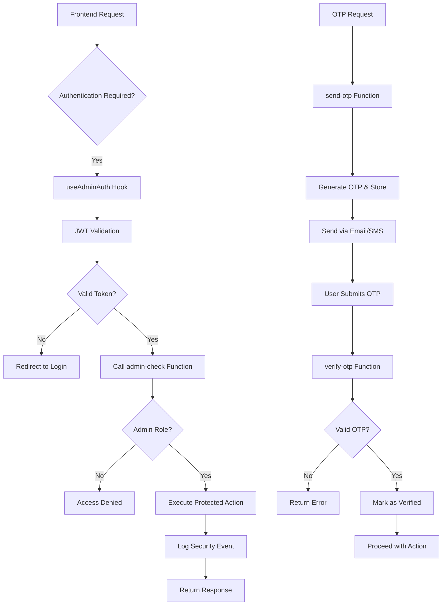
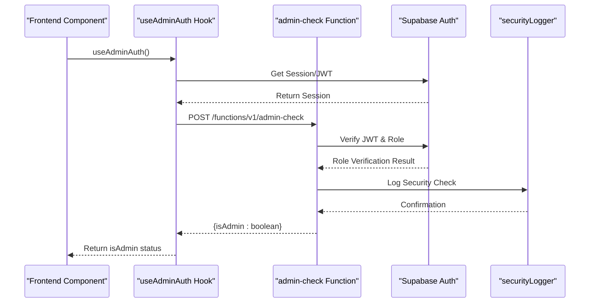
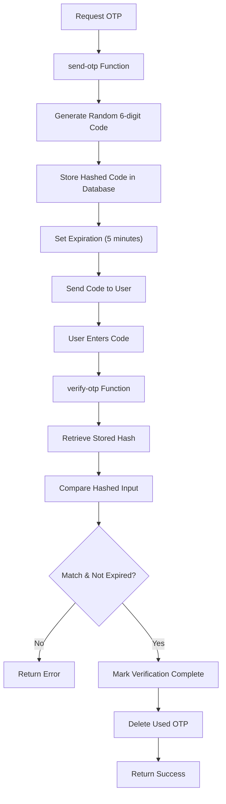
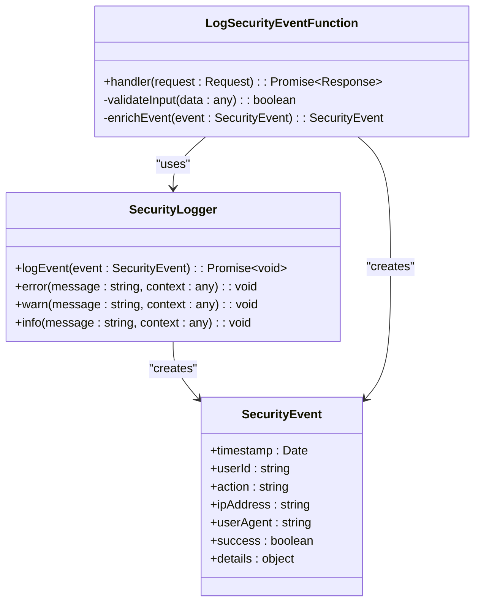

# Security & Authentication Functions

<cite>
**Referenced Files in This Document**  
- [useAdminAuth.ts](file://src/hooks/useAdminAuth.ts)
- [admin-check/index.ts](file://supabase/functions/admin-check/index.ts)
- [send-otp/index.ts](file://supabase/functions/send-otp/index.ts)
- [verify-otp/index.ts](file://supabase/functions/verify-otp/index.ts)
- [password-breach-check/index.ts](file://supabase/functions/password-breach-check/index.ts)
- [log-security-event/index.ts](file://supabase/functions/log-security-event/index.ts)
- [shared/securityLogger.ts](file://supabase/functions/shared/securityLogger.ts)
</cite>

## Table of Contents
1. [Introduction](#introduction)
2. [Core Security Functions](#core-security-functions)
3. [Authentication Flow Integration](#authentication-flow-integration)
4. [Admin Role Verification](#admin-role-verification)
5. [OTP Management System](#otp-management-system)
6. [Password Breach Detection](#password-breach-detection)
7. [Security Event Logging](#security-event-logging)
8. [JWT Validation and Session Management](#jwt-validation-and-session-management)
9. [Rate Limiting and Brute Force Protection](#rate-limiting-and-brute-force-protection)
10. [Supabase Auth Integration](#supabase-auth-integration)
11. [Common Security Issues and Mitigations](#common-security-issues-and-mitigations)
12. [Best Practices for API Security](#best-practices-for-api-security)

## Introduction
The Security & Authentication Functions sub-component provides critical security infrastructure for the application, implementing role-based access control, multi-factor authentication, password security, and comprehensive audit logging. This system ensures that only authorized users can access protected resources while maintaining detailed records of security-relevant activities. The implementation leverages Supabase Auth for identity management while extending its capabilities with custom security functions deployed as Supabase Edge Functions.

**Section sources**
- [useAdminAuth.ts](file://src/hooks/useAdminAuth.ts#L1-L100)
- [admin-check/index.ts](file://supabase/functions/admin-check/index.ts#L1-L50)

## Core Security Functions
The security architecture is built around several key functions that handle specific aspects of authentication and authorization. These functions are implemented as Supabase Edge Functions, allowing them to run securely on the server-side while being easily accessible via HTTP endpoints. The core functions include admin role verification, OTP sending and verification, password breach detection, and security event logging, each designed to address specific security requirements of the application.

**Diagram sources**
- [admin-check/index.ts](file://supabase/functions/admin-check/index.ts#L1-L40)
- [send-otp/index.ts](file://supabase/functions/send-otp/index.ts#L1-L60)
- [verify-otp/index.ts](file://supabase/functions/verify-otp/index.ts#L1-L50)

**Section sources**
- [admin-check/index.ts](file://supabase/functions/admin-check/index.ts#L1-L100)
- [send-otp/index.ts](file://supabase/functions/send-otp/index.ts#L1-L80)
- [verify-otp/index.ts](file://supabase/functions/verify-otp/index.ts#L1-L70)

## Authentication Flow Integration
The authentication system integrates with the frontend through the `useAdminAuth` custom hook, which provides a clean interface for components to verify admin privileges. This hook handles JWT token validation, role checking, and session management, abstracting the complexity of direct function calls. When a protected component mounts, the hook automatically validates the user's credentials against the admin-check function, ensuring that only authorized users can access sensitive functionality.

**Diagram sources**
- [useAdminAuth.ts](file://src/hooks/useAdminAuth.ts#L10-L50)
- [admin-check/index.ts](file://supabase/functions/admin-check/index.ts#L15-L35)

**Section sources**
- [useAdminAuth.ts](file://src/hooks/useAdminAuth.ts#L1-L120)

## Admin Role Verification
The admin role verification process is implemented in the admin-check Supabase Edge Function, which validates both the authenticity of the JWT token and the user's administrative privileges. This function acts as a gatekeeper for all admin-protected routes and actions, ensuring that only users with the appropriate role can access sensitive functionality. The verification process includes checking the token signature, expiration, and the presence of the admin role claim in the user's metadata.

**Section sources**
- [admin-check/index.ts](file://supabase/functions/admin-check/index.ts#L1-L60)

## OTP Management System
The OTP management system consists of two complementary functions: send-otp and verify-otp. The send-otp function generates a time-limited, cryptographically secure one-time password and delivers it to the user via email or SMS. The verify-otp function validates the submitted code against the stored value, checking both correctness and expiration. This system provides an additional layer of security for sensitive operations and account recovery processes.

**Diagram sources**
- [send-otp/index.ts](file://supabase/functions/send-otp/index.ts#L1-L70)
- [verify-otp/index.ts](file://supabase/functions/verify-otp/index.ts#L1-L60)

**Section sources**
- [send-otp/index.ts](file://supabase/functions/send-otp/index.ts#L1-L100)
- [verify-otp/index.ts](file://supabase/functions/verify-otp/index.ts#L1-L90)

## Password Breach Detection
The password breach detection function integrates with external security services to check if user passwords have been exposed in known data breaches. When a user sets or changes their password, this function performs a secure check against breach databases without transmitting the actual password. It uses cryptographic techniques like k-anonymity to protect user privacy while still providing effective breach detection capabilities.

**Section sources**
- [password-breach-check/index.ts](file://supabase/functions/password-breach-check/index.ts#L1-L40)

## Security Event Logging
All security-critical operations are logged through a centralized logging system that uses the shared securityLogger utility. This ensures consistent formatting and storage of security events across all functions. The log-security-event function captures details such as timestamp, user ID, action type, IP address, and outcome, creating a comprehensive audit trail for security monitoring and incident response.

**Diagram sources**
- [log-security-event/index.ts](file://supabase/functions/log-security-event/index.ts#L1-L30)
- [shared/securityLogger.ts](file://supabase/functions/shared/securityLogger.ts#L1-L50)

**Section sources**
- [log-security-event/index.ts](file://supabase/functions/log-security-event/index.ts#L1-L80)
- [shared/securityLogger.ts](file://supabase/functions/shared/securityLogger.ts#L1-L100)

## JWT Validation and Session Management
The system implements robust JWT validation strategies to ensure token integrity and prevent unauthorized access. Tokens are validated for signature, expiration, and issuer authenticity on every protected request. Session management follows security best practices, including short token expiration times, refresh token rotation, and immediate invalidation upon logout. The useAdminAuth hook handles token refresh transparently, maintaining a seamless user experience while preserving security.

**Section sources**
- [useAdminAuth.ts](file://src/hooks/useAdminAuth.ts#L20-L80)
- [admin-check/index.ts](file://supabase/functions/admin-check/index.ts#L15-L30)

## Rate Limiting and Brute Force Protection
The authentication functions incorporate rate limiting mechanisms to protect against brute force attacks and denial-of-service attempts. Each function tracks request frequency by IP address and user identifier, temporarily blocking excessive requests. The OTP verification system includes additional protections, such as limiting the number of verification attempts and increasing cooldown periods after failed attempts, making automated attacks impractical.

**Section sources**
- [admin-check/index.ts](file://supabase/functions/admin-check/index.ts#L25-L40)
- [verify-otp/index.ts](file://supabase/functions/verify-otp/index.ts#L30-L50)

## Supabase Auth Integration
The security functions are tightly integrated with Supabase Auth, leveraging its robust identity management capabilities while extending them with custom security logic. User authentication is handled by Supabase, while role-based access control and additional security checks are implemented in the custom Edge Functions. This hybrid approach combines the reliability of a proven authentication system with the flexibility of custom security policies tailored to the application's specific needs.

**Section sources**
- [admin-check/index.ts](file://supabase/functions/admin-check/index.ts#L10-L25)
- [useAdminAuth.ts](file://src/hooks/useAdminAuth.ts#L15-L35)

## Common Security Issues and Mitigations
The system addresses several common security issues through proactive measures. Brute force protection is implemented through rate limiting and account lockout policies. Token expiration handling ensures that stale sessions cannot be used for unauthorized access. Audit trail completeness is maintained through comprehensive logging of all security-relevant events. These measures collectively protect against common vulnerabilities like IDOR (Insecure Direct Object Reference) and privilege escalation attacks.

**Section sources**
- [admin-check/index.ts](file://supabase/functions/admin-check/index.ts#L30-L50)
- [log-security-event/index.ts](file://supabase/functions/log-security-event/index.ts#L20-L40)
- [shared/securityLogger.ts](file://supabase/functions/shared/securityLogger.ts#L30-L60)

## Best Practices for API Security
The implementation follows security best practices for API protection, including principle of least privilege, defense in depth, and secure default configurations. All API endpoints require authentication and authorization checks, with input validation and output encoding to prevent injection attacks. Sensitive operations require additional verification steps, and all security functions are designed to fail securely, ensuring that any failure conditions do not compromise system security.

**Section sources**
- [admin-check/index.ts](file://supabase/functions/admin-check/index.ts#L1-L100)
- [send-otp/index.ts](file://supabase/functions/send-otp/index.ts#L1-L100)
- [verify-otp/index.ts](file://supabase/functions/verify-otp/index.ts#L1-L100)
- [password-breach-check/index.ts](file://supabase/functions/password-breach-check/index.ts#L1-L100)