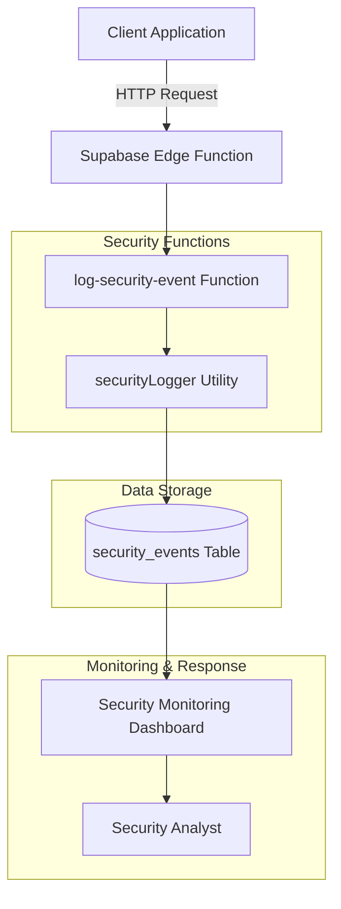
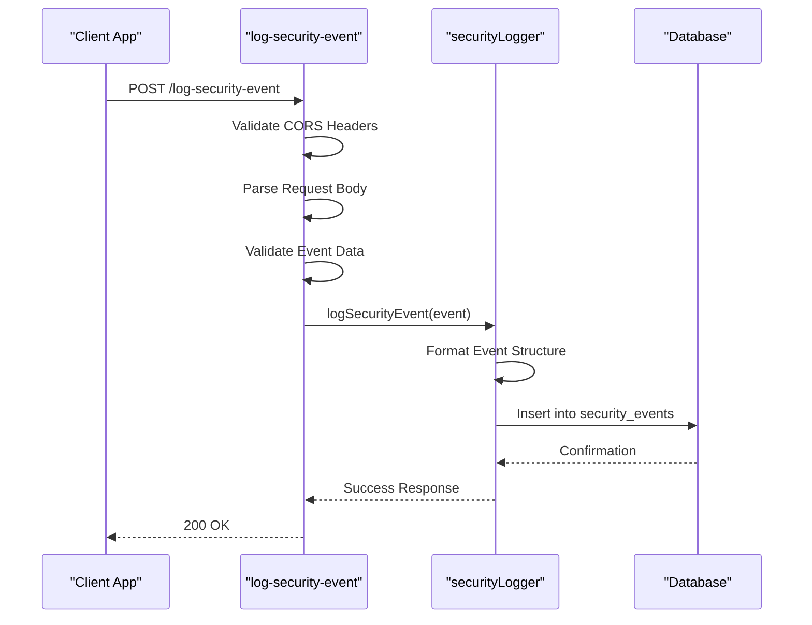
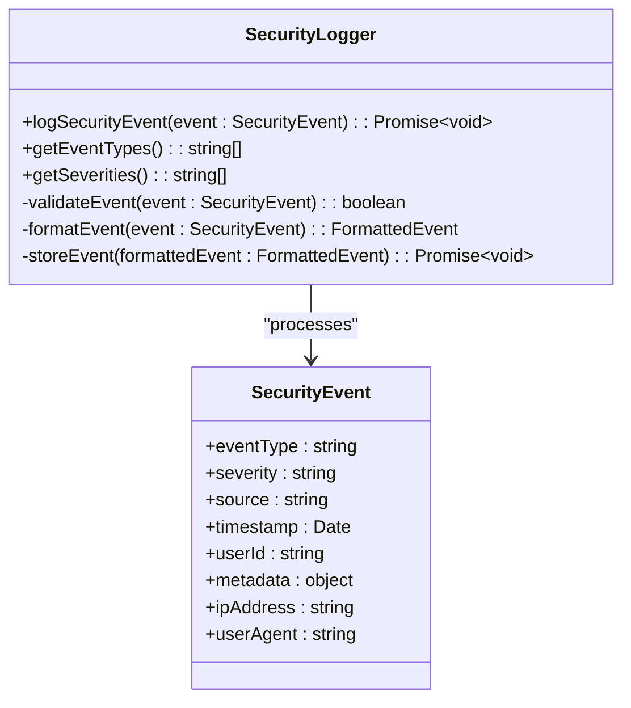
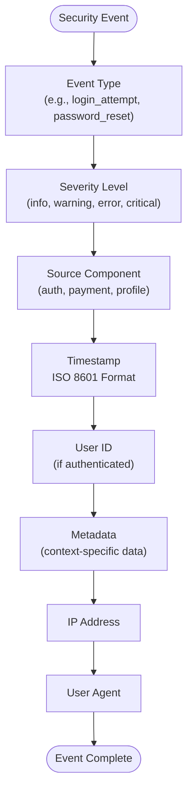
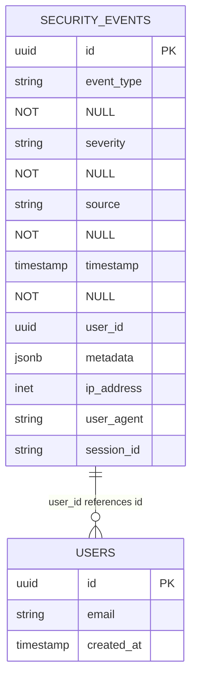
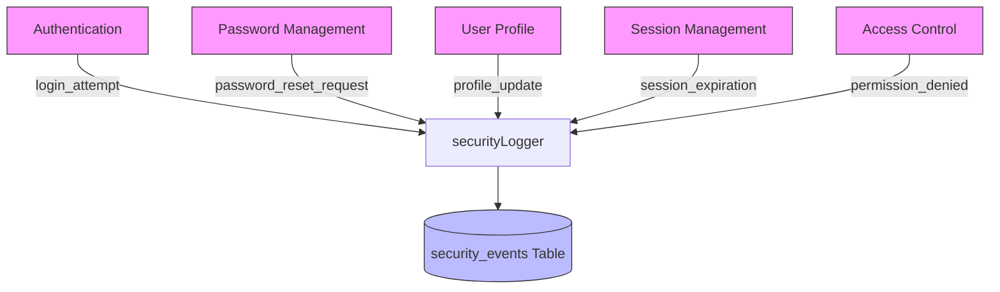
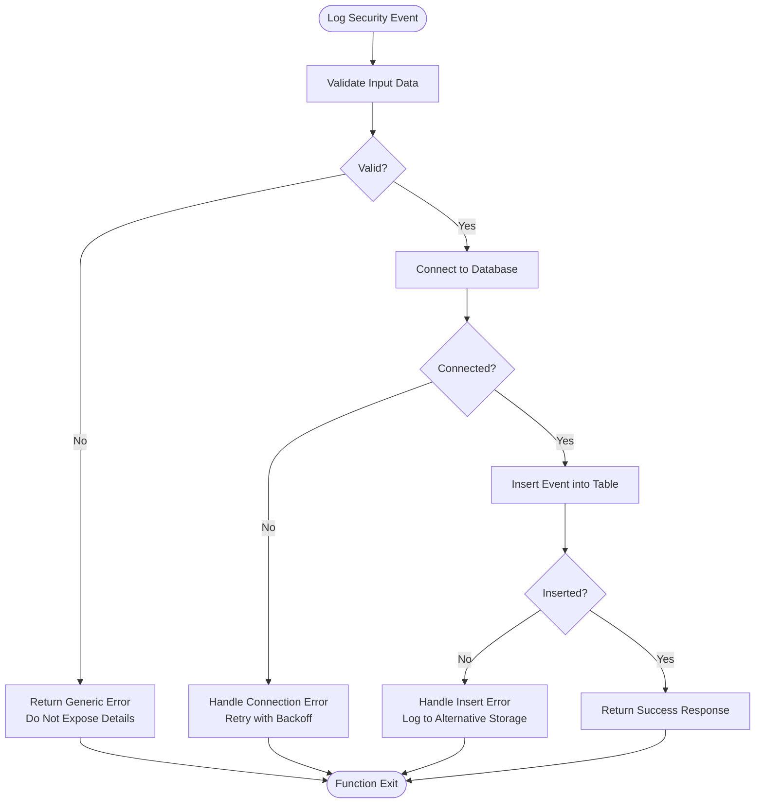
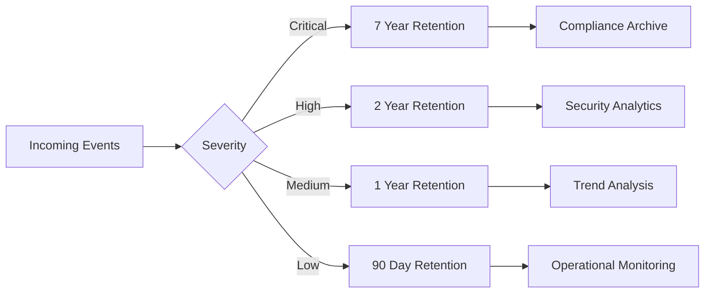

# Security Event Logging

<cite>
**Referenced Files in This Document**  
- [log-security-event/index.ts](file://supabase/functions/log-security-event/index.ts)
- [shared/securityLogger.ts](file://supabase/functions/shared/securityLogger.ts)
- [migrations/20251115150759_remix_migration_from_pg_dump.sql](file://supabase/migrations/20251115150759_remix_migration_from_pg_dump.sql)
- [src/pages/SecurityMonitoring.tsx](file://src/pages/SecurityMonitoring.tsx)
- [src/lib/auditLog.ts](file://src/lib/auditLog.ts)
- [src/lib/enhancedAuditLog.ts](file://src/lib/enhancedAuditLog.ts)
</cite>

## Table of Contents
1. [Introduction](#introduction)
2. [Core Components](#core-components)
3. [Architecture Overview](#architecture-overview)
4. [Detailed Component Analysis](#detailed-component-analysis)
5. [Structured Logging Format](#structured-logging-format)
6. [Database Storage and Schema](#database-storage-and-schema)
7. [Integration with Security Functions](#integration-with-security-functions)
8. [Error Handling and Security Considerations](#error-handling-and-security-considerations)
9. [Best Practices for Security Monitoring](#best-practices-for-security-monitoring)
10. [Conclusion](#conclusion)

## Introduction
The Security Event Logging system is a critical component of the application's security infrastructure, designed to capture, store, and analyze security-related events across the platform. This document provides a comprehensive analysis of the log-security-event edge function and its integration with the shared securityLogger utility, detailing how security events are structured, stored, and utilized for audit trails and incident response.

## Core Components
The security event logging system consists of two primary components: the log-security-event edge function that serves as the entry point for security events, and the shared securityLogger utility that provides consistent logging functionality across various security functions. These components work together to ensure comprehensive security event capture with proper formatting, error handling, and storage.

**Section sources**
- [log-security-event/index.ts](file://supabase/functions/log-security-event/index.ts)
- [shared/securityLogger.ts](file://supabase/functions/shared/securityLogger.ts)

## Architecture Overview

**Diagram sources**
- [log-security-event/index.ts](file://supabase/functions/log-security-event/index.ts)
- [shared/securityLogger.ts](file://supabase/functions/shared/securityLogger.ts)
- [migrations/20251115150759_remix_migration_from_pg_dump.sql](file://supabase/migrations/20251115150759_remix_migration_from_pg_dump.sql)

## Detailed Component Analysis

### log-security-event Edge Function
The log-security-event edge function serves as the primary interface for recording security events in the system. It receives security event data via HTTP requests, validates the input, and processes the event through the shared securityLogger utility. The function is designed to handle various security event types with appropriate CORS headers to ensure cross-origin requests are properly managed.

**Diagram sources**
- [log-security-event/index.ts](file://supabase/functions/log-security-event/index.ts)
- [shared/securityLogger.ts](file://supabase/functions/shared/securityLogger.ts)

**Section sources**
- [log-security-event/index.ts](file://supabase/functions/log-security-event/index.ts)

### shared securityLogger Utility
The shared securityLogger utility provides a consistent interface for logging security events across different functions in the application. It abstracts the database interaction and ensures that all security events follow the same structured format. This utility is imported and used by various security-related functions to maintain consistency in logging practices.

**Diagram sources**
- [shared/securityLogger.ts](file://supabase/functions/shared/securityLogger.ts)

**Section sources**
- [shared/securityLogger.ts](file://supabase/functions/shared/securityLogger.ts)

## Structured Logging Format
The security event logging system uses a standardized structure to ensure consistency and ease of analysis. Each security event contains the following key fields:

This structured format enables efficient querying, filtering, and analysis of security events. The metadata field is particularly important as it can contain context-specific information such as failed login attempts, password reset tokens, or suspicious activity patterns.

**Diagram sources**
- [shared/securityLogger.ts](file://supabase/functions/shared/securityLogger.ts)
- [log-security-event/index.ts](file://supabase/functions/log-security-event/index.ts)

**Section sources**
- [shared/securityLogger.ts](file://supabase/functions/shared/securityLogger.ts)

## Database Storage and Schema
Security events are stored in the security_events table, which is designed to efficiently store and retrieve security-related data. The table schema includes indexed fields for fast querying by event type, severity, timestamp, and user ID.

The database schema includes appropriate indexes on frequently queried fields such as timestamp, event_type, and user_id to ensure optimal performance when retrieving security events for analysis or audit purposes.

**Diagram sources**
- [migrations/20251115150759_remix_migration_from_pg_dump.sql](file://supabase/migrations/20251115150759_remix_migration_from_pg_dump.sql)

**Section sources**
- [migrations/20251115150759_remix_migration_from_pg_dump.sql](file://supabase/migrations/20251115150759_remix_migration_from_pg_dump.sql)

## Integration with Security Functions
The security event logging mechanism is integrated with various security functions throughout the application to provide comprehensive audit trails. Functions such as authentication, password management, and user profile updates all utilize the shared securityLogger utility to record relevant security events.

This integration ensures that all security-relevant actions are captured in a consistent format, enabling comprehensive monitoring and analysis of user activities and potential security threats.

**Diagram sources**
- [shared/securityLogger.ts](file://supabase/functions/shared/securityLogger.ts)
- [src/lib/auditLog.ts](file://src/lib/auditLog.ts)
- [src/lib/enhancedAuditLog.ts](file://src/lib/enhancedAuditLog.ts)

**Section sources**
- [shared/securityLogger.ts](file://supabase/functions/shared/securityLogger.ts)
- [src/lib/auditLog.ts](file://src/lib/auditLog.ts)

## Error Handling and Security Considerations
The security event logging system implements robust error handling to ensure log completeness while protecting sensitive information. When database errors occur during logging, the system follows a fail-safe approach to prevent loss of critical security information.

Key security considerations include:
- Never exposing database error details to clients
- Using generic error messages to avoid information leakage
- Implementing retry mechanisms with exponential backoff for transient failures
- Maintaining alternative logging mechanisms for critical events when primary storage is unavailable
- Ensuring all sensitive information is properly sanitized before logging

**Diagram sources**
- [log-security-event/index.ts](file://supabase/functions/log-security-event/index.ts)
- [shared/securityLogger.ts](file://supabase/functions/shared/securityLogger.ts)

**Section sources**
- [log-security-event/index.ts](file://supabase/functions/log-security-event/index.ts)
- [shared/securityLogger.ts](file://supabase/functions/shared/securityLogger.ts)

## Best Practices for Security Monitoring
Effective security monitoring requires a comprehensive approach that goes beyond simply collecting logs. The following best practices ensure the security event logging system provides maximum value for security operations:

### Log Retention and Archiving
Implement a tiered retention strategy based on event severity:
- Critical events: Retain for 7 years for compliance and forensic analysis
- High severity events: Retain for 2 years
- Medium severity events: Retain for 1 year
- Low severity events: Retain for 90 days

### Incident Response Integration
Integrate security logs with incident response workflows:
- Automated alerting for suspicious patterns (e.g., multiple failed login attempts)
- Correlation of related events across different systems
- Integration with ticketing systems for tracking security incidents
- Playbooks for common security scenarios

### Monitoring and Alerting
Implement proactive monitoring with the following guidelines:
- Real-time dashboards for security analysts
- Threshold-based alerts for abnormal activity
- Behavioral analytics to detect anomalies
- Regular audits of logging coverage and effectiveness

**Section sources**
- [src/pages/SecurityMonitoring.tsx](file://src/pages/SecurityMonitoring.tsx)
- [src/lib/auditLog.ts](file://src/lib/auditLog.ts)
- [src/lib/enhancedAuditLog.ts](file://src/lib/enhancedAuditLog.ts)

## Conclusion
The Security Event Logging system provides a robust foundation for monitoring and protecting the application against security threats. By implementing a consistent logging format, reliable storage, and comprehensive error handling, the system ensures that all security-relevant events are captured and available for audit and incident response. The integration of the log-security-event edge function with the shared securityLogger utility creates a scalable and maintainable architecture that can be extended to cover additional security use cases as needed. Following the best practices outlined in this document will help ensure the system continues to provide effective security monitoring and compliance support.