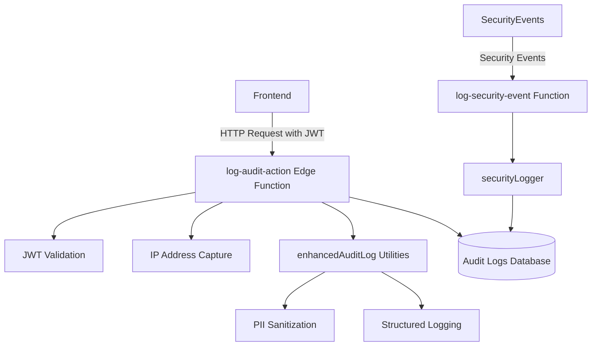
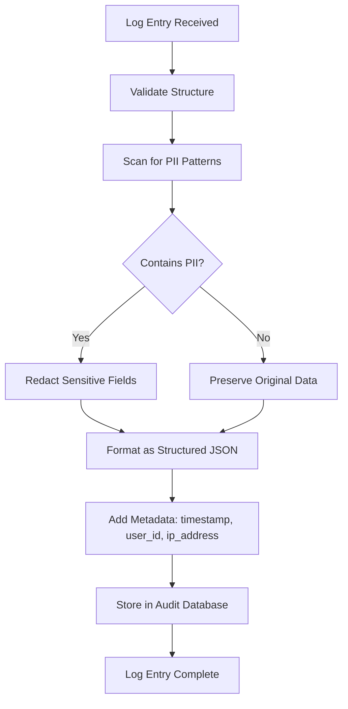

# Audit Logging

<cite>
**Referenced Files in This Document**  
- [index.ts](file://supabase/functions/log-audit-action/index.ts)
- [logger.ts](file://supabase/functions/_shared/logger.ts)
- [enhancedAuditLog.ts](file://src/lib/enhancedAuditLog.ts)
- [auditLog.ts](file://src/lib/auditLog.ts)
- [shared/securityLogger.ts](file://supabase/functions/shared/securityLogger.ts)
</cite>

## Table of Contents
1. [Introduction](#introduction)
2. [Audit Logging Architecture](#audit-logging-architecture)
3. [log-audit-action Edge Function Implementation](#log-audit-action-edge-function-implementation)
4. [Enhanced Audit Logging Utilities](#enhanced-audit-logging-utilities)
5. [Structured Logging with PII Sanitization](#structured-logging-with-pii-sanitization)
6. [Frontend to Backend Audit Flow](#frontend-to-backend-audit-flow)
7. [Common Issues and Solutions](#common-issues-and-solutions)
8. [Best Practices for Secure Audit Logging](#best-practices-for-secure-audit-logging)
9. [Conclusion](#conclusion)

## Introduction
The audit logging system in the SleekApparels platform provides comprehensive tracking of user actions, security events, and system operations. This documentation details the implementation of the audit logging sub-component, focusing on the edge function architecture, enhanced logging utilities, structured data handling, and security compliance measures. The system is designed to ensure traceability, support regulatory compliance, and enable effective security monitoring across the application ecosystem.

## Audit Logging Architecture

**Diagram sources**
- [index.ts](file://supabase/functions/log-audit-action/index.ts)
- [enhancedAuditLog.ts](file://src/lib/enhancedAuditLog.ts)
- [shared/securityLogger.ts](file://supabase/functions/shared/securityLogger.ts)

**Section sources**
- [index.ts](file://supabase/functions/log-audit-action/index.ts)
- [enhancedAuditLog.ts](file://src/lib/enhancedAuditLog.ts)

## log-audit-action Edge Function Implementation

The `log-audit-action` edge function serves as the primary entry point for audit logging in the system. It validates incoming requests by verifying JWT tokens to ensure that only authenticated users can trigger audit log entries. The function extracts the client's IP address from request headers, providing geographical and network context for each logged action. Upon successful validation, the function processes the audit event payload and inserts structured records into the audit logs database. This implementation ensures that all audit trails are associated with verified user identities and include contextual metadata for forensic analysis.

**Section sources**
- [index.ts](file://supabase/functions/log-audit-action/index.ts)

## Enhanced Audit Logging Utilities

The enhanced audit logging utilities in `enhancedAuditLog.ts` provide a comprehensive framework for categorizing and processing audit events. The system defines standardized action types such as "CREATE", "UPDATE", "DELETE", "VIEW", and "EXPORT" to maintain consistency across log entries. Resource types are similarly standardized, covering entities like "QUOTE", "ORDER", "SUPPLIER", "PRODUCT", and "USER_PROFILE". The utilities include specialized functions for security event logging, which capture high-risk operations and potential policy violations. These utilities ensure that audit logs are semantically meaningful and easily queryable for compliance reporting and security investigations.

**Section sources**
- [enhancedAuditLog.ts](file://src/lib/enhancedAuditLog.ts)

## Structured Logging with PII Sanitization

The structured logging implementation in `logger.ts` ensures consistent formatting of audit log entries with comprehensive metadata. Each log entry includes timestamp, user ID, action type, resource type, resource ID, and contextual data. A critical feature of this implementation is automatic PII (Personally Identifiable Information) sanitization, which identifies and redacts sensitive data fields before storage. The system employs pattern matching to detect email addresses, phone numbers, and other PII elements, replacing them with masked values. This approach enables detailed operational logging while maintaining compliance with data protection regulations such as GDPR and CCPA.

**Diagram sources**
- [logger.ts](file://supabase/functions/_shared/logger.ts)
- [auditLog.ts](file://src/lib/auditLog.ts)

**Section sources**
- [logger.ts](file://supabase/functions/_shared/logger.ts)
- [auditLog.ts](file://src/lib/auditLog.ts)

## Frontend to Backend Audit Flow

The audit logging system establishes a secure connection between frontend actions and server-side logging. When a user performs an auditable action in the frontend interface, the application calls the `log-audit-action` edge function with appropriate context. The frontend includes the user's JWT token in the request authorization header, which the edge function validates against the authentication system. User validation occurs both at the frontend level through role-based access controls and at the backend level through JWT claims verification. This dual-layer validation ensures that audit logs accurately reflect authorized user activities and prevents spoofing of audit trails.

**Section sources**
- [index.ts](file://supabase/functions/log-audit-action/index.ts)
- [enhancedAuditLog.ts](file://src/lib/enhancedAuditLog.ts)

## Common Issues and Solutions

The audit logging system addresses several common challenges in production environments. JWT token handling issues are mitigated through robust validation logic that checks token expiration, signature integrity, and audience claims. PII redaction challenges are addressed by maintaining an updatable pattern library that can adapt to new data formats and regional variations. Log volume management is achieved through automated retention policies, indexing strategies, and optional sampling for high-frequency events. The system also includes monitoring for audit log gaps and integrity checks to detect potential tampering or system failures.

**Section sources**
- [index.ts](file://supabase/functions/log-audit-action/index.ts)
- [logger.ts](file://supabase/functions/_shared/logger.ts)

## Best Practices for Secure Audit Logging

The implementation follows industry best practices for secure audit logging. All audit log entries are written atomically to prevent partial records. The system uses immutable storage where possible to prevent tampering with historical logs. Access to audit logs is strictly controlled through role-based permissions, with separate privileges for viewing versus exporting logs. Regular integrity checks verify the continuity and authenticity of the audit trail. The system supports export to external SIEM (Security Information and Event Management) systems for centralized monitoring. These practices ensure that the audit logging system meets compliance requirements for data protection regulations and provides reliable evidence for security investigations.

**Section sources**
- [enhancedAuditLog.ts](file://src/lib/enhancedAuditLog.ts)
- [shared/securityLogger.ts](file://supabase/functions/shared/securityLogger.ts)

## Conclusion
The audit logging sub-component provides a robust foundation for security, compliance, and operational visibility in the SleekApparels platform. By combining secure edge function implementation, enhanced logging utilities, and structured data handling with PII sanitization, the system delivers comprehensive audit trails that support both regulatory requirements and security monitoring needs. The integration between frontend actions and backend logging ensures complete coverage of user activities, while the focus on best practices guarantees the integrity and reliability of the audit data over time.