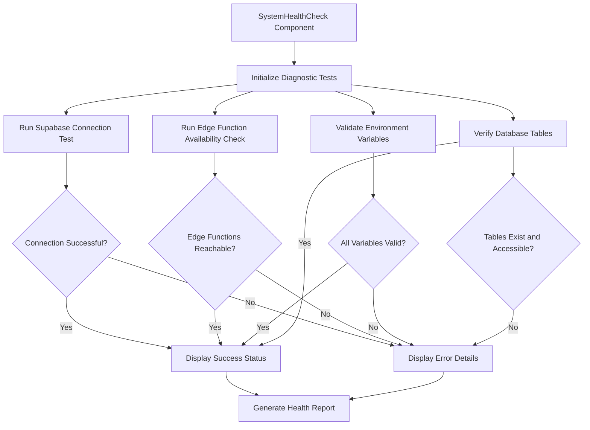
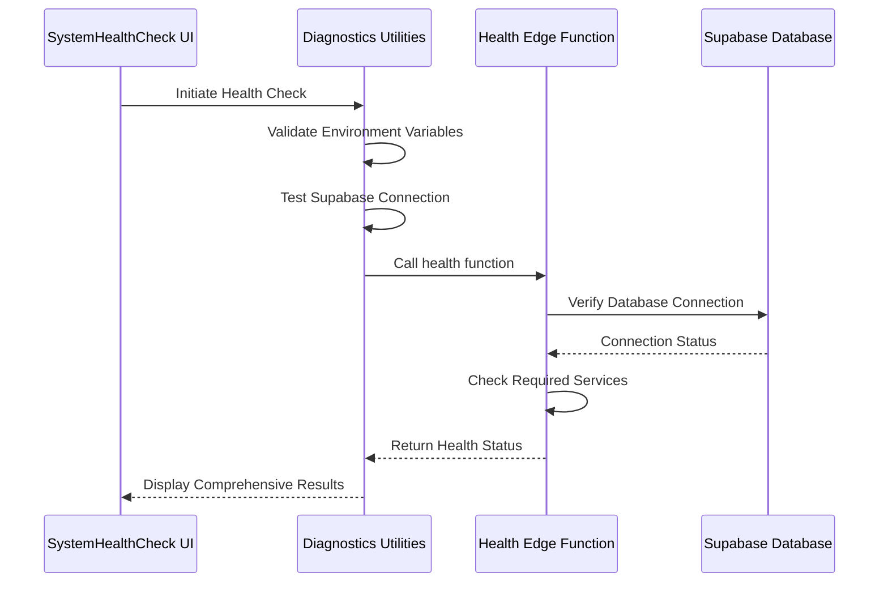

# Diagnostics Tools

<cite>
**Referenced Files in This Document**
- [diagnostics.ts](file://src/lib/diagnostics.ts)
- [SystemHealthCheck.tsx](file://src/components/SystemHealthCheck.tsx)
- [env-validator.ts](file://src/lib/env-validator.ts)
- [health/index.ts](file://supabase/functions/health/index.ts)
- [Health.tsx](file://src/pages/Health.tsx)
</cite>

## Table of Contents
1. [Introduction](#introduction)
2. [Diagnostic Utilities Implementation](#diagnostic-utilities-implementation)
3. [SystemHealthCheck UI Component](#systemhealthcheck-ui-component)
4. [Frontend-Backend Health Check Integration](#frontend-backend-health-check-integration)
5. [Common Diagnostic Issues and Solutions](#common-diagnostic-issues-and-solutions)
6. [Best Practices for Extending Diagnostics](#best-practices-for-extending-diagnostics)
7. [Integration with Monitoring Workflows](#integration-with-monitoring-workflows)
8. [Conclusion](#conclusion)

## Introduction
The Diagnostics Tools sub-component provides comprehensive system health monitoring capabilities for the SleekApp platform. This documentation details the implementation of diagnostic utilities that verify system connectivity, validate environment configurations, and ensure backend service availability. The diagnostic system combines frontend testing components with backend health checks to provide a complete picture of system health.

## Diagnostic Utilities Implementation

The diagnostic utilities in `diagnostics.ts` implement a comprehensive suite of system checks that validate various aspects of the application's infrastructure. These utilities perform Supabase connection testing, edge function availability checks, environment variable validation, and database table verification.

The diagnostic tests are composed as modular functions that return standardized result objects containing status, message, and metadata. Each test follows a consistent error handling pattern that distinguishes between expected failures (such as configuration issues) and unexpected errors (such as network failures).

**Section sources**
- [diagnostics.ts](file://src/lib/diagnostics.ts#L1-L200)
- [env-validator.ts](file://src/lib/env-validator.ts#L1-L150)

## SystemHealthCheck UI Component

The `SystemHealthCheck` component provides an interactive interface for running diagnostic tests and visualizing results. This React component renders a dashboard that displays the status of various system components using visual indicators and detailed reports.

The UI supports both manual and automated diagnostic runs, with options to refresh individual tests or perform a comprehensive system check. Results are presented with clear visual feedback, including success indicators for passing tests and detailed error information for failing components.

The component also includes report generation capabilities that allow users to export diagnostic results for troubleshooting or auditing purposes. The interface is designed to be accessible to both technical and non-technical users, with plain language explanations of technical issues.

**Diagram sources**
- [SystemHealthCheck.tsx](file://src/components/SystemHealthCheck.tsx#L25-L180)
- [diagnostics.ts](file://src/lib/diagnostics.ts#L1-L200)

**Section sources**
- [SystemHealthCheck.tsx](file://src/components/SystemHealthCheck.tsx#L1-L200)

## Frontend-Backend Health Check Integration

The diagnostic system integrates frontend and backend health checks to provide comprehensive system monitoring. The frontend diagnostics in `diagnostics.ts` coordinate with the backend health check endpoint implemented in `supabase/functions/health/index.ts`.

This integration allows the system to verify not only client-side connectivity but also server-side service availability. The frontend tests first validate local configuration and network connectivity, then invoke the backend health function to verify database connectivity, authentication services, and other server-side components.

The communication between frontend and backend follows a secure pattern that minimizes exposure of sensitive information while providing sufficient diagnostic data. Error responses are standardized to facilitate consistent handling and user feedback.

**Diagram sources**
- [diagnostics.ts](file://src/lib/diagnostics.ts#L50-L150)
- [health/index.ts](file://supabase/functions/health/index.ts#L1-L100)

**Section sources**
- [diagnostics.ts](file://src/lib/diagnostics.ts#L1-L200)
- [health/index.ts](file://supabase/functions/health/index.ts#L1-L120)

## Common Diagnostic Issues and Solutions

The diagnostic system addresses several common issues encountered in system health monitoring:

### False Negatives in Connectivity Tests
The system implements retry mechanisms and multiple verification methods to reduce false negatives in connectivity tests. Network latency or temporary outages are accounted for by implementing timeout thresholds and retry logic.

### Handling 404 Responses from Edge Functions
The diagnostic utilities include specific handling for 404 responses from edge functions, distinguishing between deployment issues (function not deployed) and routing issues (incorrect URL). The system provides clear guidance for resolving each type of issue.

### Environment-Specific Configuration
The diagnostics accommodate different environment configurations (development, staging, production) by loading appropriate configuration values and adjusting test parameters accordingly. The `env-validator.ts` utility ensures that required environment variables are present and correctly formatted for the current environment.

**Section sources**
- [diagnostics.ts](file://src/lib/diagnostics.ts#L150-L300)
- [env-validator.ts](file://src/lib/env-validator.ts#L1-L150)
- [Health.tsx](file://src/pages/Health.tsx#L1-L100)

## Best Practices for Extending Diagnostics

When extending the diagnostic system with additional system checks, follow these best practices:

1. **Modular Design**: Implement new tests as independent functions that can be run individually or as part of a comprehensive suite.
2. **Standardized Results**: Ensure all diagnostic tests return results in the same format for consistent UI rendering.
3. **Error Categorization**: Classify errors into actionable categories to guide troubleshooting efforts.
4. **Performance Considerations**: Design tests to complete quickly, especially those that involve network requests.
5. **Security**: Avoid exposing sensitive information in diagnostic outputs, especially in error messages.

New system checks should follow the existing pattern of separating test logic from presentation, allowing the same diagnostic functions to be used in both interactive UIs and automated monitoring systems.

## Integration with Monitoring Workflows

Diagnostic results can be integrated into broader monitoring workflows through several mechanisms:

1. **Automated Scheduling**: The diagnostic tests can be scheduled to run at regular intervals using background job systems.
2. **Alerting Systems**: Failed diagnostic tests can trigger alerts to operations teams via email, SMS, or messaging platforms.
3. **Logging and Auditing**: Diagnostic results are structured to be easily logged and analyzed for trend detection.
4. **CI/CD Integration**: Health checks can be incorporated into deployment pipelines to verify system integrity after updates.

The `SystemHealthCheck` component's report generation feature supports exporting results in multiple formats for integration with external monitoring tools and documentation systems.

## Conclusion
The Diagnostics Tools sub-component provides a robust framework for monitoring and troubleshooting the SleekApp platform. By combining comprehensive frontend diagnostics with backend health checks, the system offers deep visibility into application health and performance. The modular design allows for easy extension with additional system checks, while the user-friendly interface makes diagnostic information accessible to users of all technical levels.