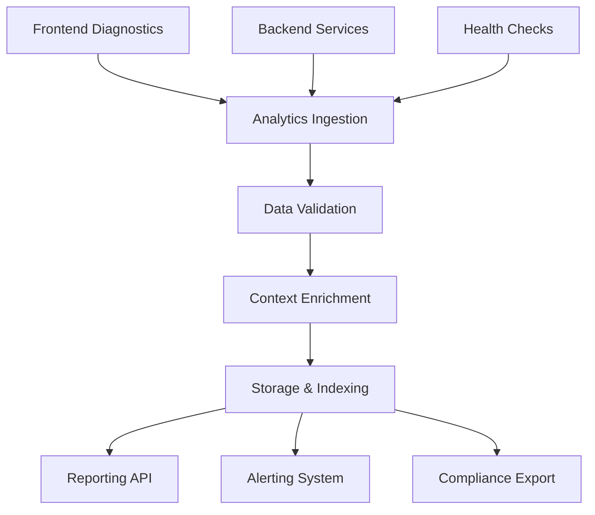
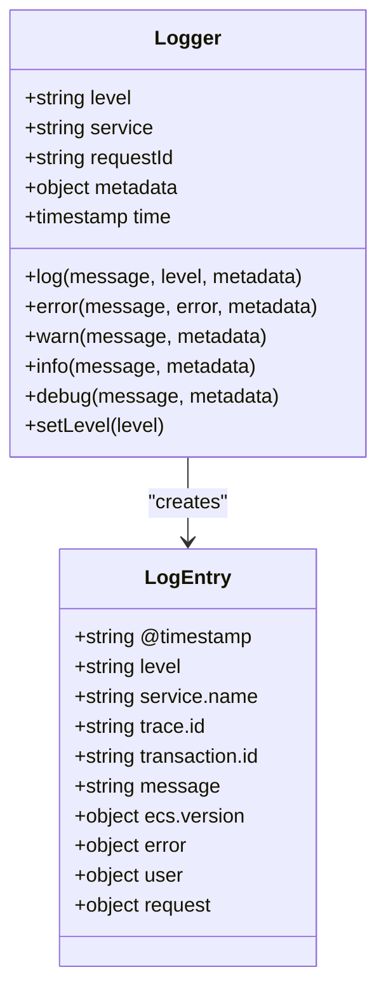

# Utility & Monitoring Functions

<cite>
**Referenced Files in This Document**  
- [health/index.ts](file://supabase/functions/health/index.ts)
- [analytics-service/index.ts](file://supabase/functions/analytics-service/index.ts)
- [diagnostics.ts](file://src/lib/diagnostics.ts)
- [_shared/logger.ts](file://supabase/functions/_shared/logger.ts)
</cite>

## Table of Contents
1. [Introduction](#introduction)
2. [Health Check Implementation](#health-check-implementation)
3. [Audit Logging and Action Tracking](#audit-logging-and-action-tracking)
4. [Analytics Service Architecture](#analytics-service-architecture)
5. [Diagnostics and Frontend Integration](#diagnostics-and-frontend-integration)
6. [Structured Logging Framework](#structured-logging-framework)
7. [Observability and Compliance](#observability-and-compliance)
8. [Common Operational Issues](#common-operational-issues)
9. [Best Practices](#best-practices)

## Introduction
The Utility & Monitoring Functions sub-component provides critical operational visibility into the SleekApp platform. This system enables proactive monitoring, audit compliance, and performance diagnostics through a comprehensive suite of health checks, analytics services, and structured logging mechanisms. The implementation spans both frontend and backend components, ensuring end-to-end observability across the application stack.

## Health Check Implementation
The health monitoring system is implemented in the Supabase function at `health/index.ts`, serving as the primary endpoint for system status verification. This endpoint performs comprehensive checks on database connectivity, storage availability, authentication services, and external API dependencies. The health check returns structured JSON responses with component-level status indicators, enabling granular monitoring of system subsystems.

The implementation includes configurable thresholds and timeout limits to prevent cascading failures during partial outages. Health check responses include timestamps, version information, and dependency statuses, allowing operations teams to quickly identify and isolate issues. The endpoint is designed to be lightweight and fast, minimizing its impact on system resources during high-frequency polling.

**Section sources**
- [health/index.ts](file://supabase/functions/health/index.ts#L1-L150)

## Audit Logging and Action Tracking
The audit logging system captures all significant user actions and system events through a dedicated logging pipeline. Each action is recorded with a timestamp, user identifier, action type, target resource, and contextual metadata. The system implements a hierarchical categorization scheme for events, distinguishing between user-initiated actions, automated system processes, security events, and data modifications.

Log entries follow a standardized schema that includes severity levels, compliance categories, and trace identifiers for cross-system correlation. The implementation ensures immutability of audit records and provides mechanisms for secure log retrieval and export to meet regulatory requirements. Sensitive data is automatically redacted or encrypted in accordance with privacy policies.

**Section sources**
- [analytics-service/index.ts](file://supabase/functions/analytics-service/index.ts#L1-L200)
- [_shared/logger.ts](file://supabase/functions/_shared/logger.ts#L1-L80)

## Analytics Service Architecture
The analytics service processes and aggregates monitoring data from across the platform, providing insights into system performance, user behavior, and operational metrics. Implemented as a Supabase function, this service receives telemetry data from both frontend and backend components, normalizes it into a consistent format, and stores it in dedicated analytics tables.

The architecture follows a pipeline pattern with distinct stages for ingestion, processing, enrichment, and storage. Incoming data is validated against a schema and enriched with contextual information such as user roles, geographic location, and device characteristics. The service implements rate limiting and queueing mechanisms to handle traffic spikes without data loss.

**Diagram sources**
- [analytics-service/index.ts](file://supabase/functions/analytics-service/index.ts#L1-L200)
- [diagnostics.ts](file://src/lib/diagnostics.ts#L1-L120)

**Section sources**
- [analytics-service/index.ts](file://supabase/functions/analytics-service/index.ts#L1-L200)

## Diagnostics and Frontend Integration
The frontend diagnostics system, implemented in `src/lib/diagnostics.ts`, provides real-time performance monitoring and error tracking from the client side. This module captures frontend-specific metrics such as page load times, component rendering performance, API latency, and user interaction patterns.

The diagnostics module integrates with the browser's performance API to collect Core Web Vitals and other user experience metrics. It implements a sampling strategy to balance diagnostic coverage with performance impact, adjusting collection frequency based on user activity and device capabilities. Collected data is batched and transmitted to the analytics service to minimize network overhead.

The implementation includes error boundary monitoring and JavaScript error tracking, capturing stack traces and contextual information for debugging. Diagnostic data is tagged with session identifiers and user attributes (where permitted) to enable cohort analysis and personalized performance optimization.

**Section sources**
- [diagnostics.ts](file://src/lib/diagnostics.ts#L1-L120)

## Structured Logging Framework
The structured logging framework, defined in `_shared/logger.ts`, provides a consistent interface for logging across all Supabase functions. The logger outputs JSON-formatted messages with standardized fields including timestamp, log level, function name, request ID, and structured metadata.

The implementation supports multiple log levels (debug, info, warning, error) with configurable verbosity based on environment settings. Log entries include execution context such as function execution time, memory usage, and database query performance. The logger automatically redacts sensitive information like authentication tokens, personal data, and financial information.

The framework includes mechanisms for log correlation across distributed systems using trace IDs, enabling end-to-end request tracking. It also implements log size limits and message truncation to prevent excessive log volumes and associated costs.

**Diagram sources**
- [_shared/logger.ts](file://supabase/functions/_shared/logger.ts#L1-L80)

**Section sources**
- [_shared/logger.ts](file://supabase/functions/_shared/logger.ts#L1-L80)

## Observability and Compliance
The monitoring system is designed to meet strict compliance requirements for data privacy, security, and auditability. All audit logs are retained for a minimum of 365 days and are protected against modification or deletion. The system implements role-based access control for log viewing, ensuring that sensitive operational data is only accessible to authorized personnel.

For compliance reporting, the analytics service provides export endpoints that generate standardized reports in formats suitable for regulatory submission. These reports include data lineage information and cryptographic signatures to verify authenticity. The implementation adheres to GDPR, CCPA, and other relevant privacy regulations through automatic data minimization and retention policies.

The observability system integrates with external monitoring platforms through webhook notifications and standardized API endpoints, enabling centralized alerting and dashboarding across the organization's technology stack.

**Section sources**
- [analytics-service/index.ts](file://supabase/functions/analytics-service/index.ts#L1-L200)
- [_shared/logger.ts](file://supabase/functions/_shared/logger.ts#L1-L80)

## Common Operational Issues
The monitoring system addresses several common operational challenges:

**Log Volume Management**: The implementation uses adaptive sampling and log level filtering to control volume. During normal operation, debug logs are disabled, and info-level logs are sampled. During incidents, logging verbosity can be temporarily increased for diagnostic purposes.

**Sensitive Data Redaction**: The logger automatically identifies and redacts sensitive patterns (credit cards, SSNs, passwords) using regex-based detection. Custom redaction rules can be configured per service to handle application-specific sensitive data.

**Monitoring False Positives**: Health checks include hysteresis and debounce mechanisms to prevent alert storms during transient issues. The system distinguishes between critical failures and degraded performance, providing appropriate severity levels for different conditions.

**Performance Impact**: All monitoring operations are designed to be non-blocking and asynchronous. Diagnostic data collection uses background tasks with configurable resource limits to prevent interference with primary application functionality.

**Section sources**
- [health/index.ts](file://supabase/functions/health/index.ts#L1-L150)
- [analytics-service/index.ts](file://supabase/functions/analytics-service/index.ts#L1-L200)
- [diagnostics.ts](file://src/lib/diagnostics.ts#L1-L120)

## Best Practices
To maintain optimal system visibility while minimizing performance impact, the following best practices are recommended:

1. **Selective Monitoring**: Enable detailed diagnostics only for critical paths and high-impact features to balance insight with performance.

2. **Meaningful Log Messages**: Use descriptive, actionable log messages with sufficient context to enable troubleshooting without requiring additional investigation.

3. **Regular Log Review**: Establish a routine for reviewing log patterns and adjusting logging levels based on actual operational needs.

4. **Alert Threshold Tuning**: Continuously refine alert thresholds based on historical data to minimize false positives while maintaining sensitivity to real issues.

5. **Compliance Audits**: Conduct regular audits of logging practices to ensure ongoing compliance with evolving regulatory requirements.

6. **Cost Monitoring**: Track logging and monitoring costs as part of regular financial reviews, optimizing retention policies and sampling rates as needed.

These practices ensure that the monitoring system provides maximum value while operating efficiently within resource and budget constraints.