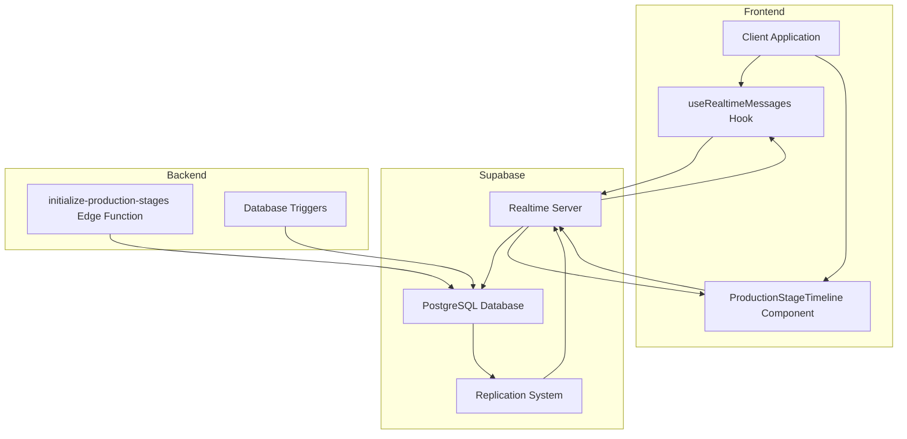
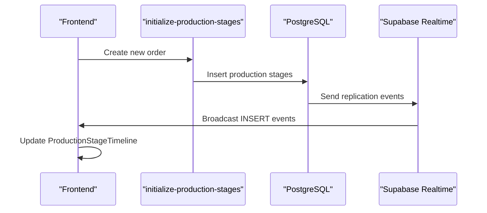
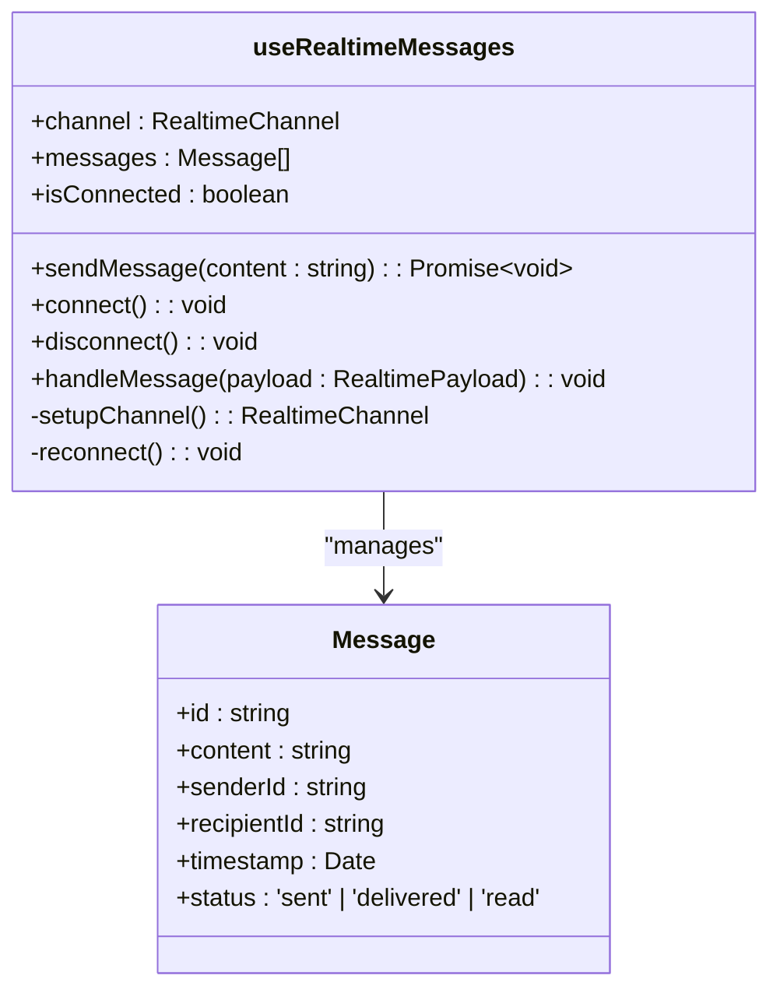

# Real-time Subscriptions

<cite>
**Referenced Files in This Document**  
- [useRealtimeMessages.ts](file://src/hooks/useRealtimeMessages.ts)
- [ProductionStageTimeline.tsx](file://src/components/production/ProductionStageTimeline.tsx)
- [initialize-production-stages/index.ts](file://supabase/functions/initialize-production-stages/index.ts)
- [client.ts](file://src/integrations/supabase/client.ts)
</cite>

## Table of Contents
1. [Introduction](#introduction)
2. [Real-time Architecture Overview](#real-time-architecture-overview)
3. [Supabase Real-time Capabilities](#supabase-real-time-capabilities)
4. [Production Stage Initialization](#production-stage-initialization)
5. [Real-time Updates in ProductionStageTimeline](#real-time-updates-in-productionstagetimeline)
6. [useRealtimeMessages Custom Hook](#userealtimemessages-custom-hook)
7. [Connection Reliability and Error Handling](#connection-reliability-and-error-handling)
8. [Performance Optimization Techniques](#performance-optimization-techniques)
9. [Conclusion](#conclusion)

## Introduction
The real-time subscription system in sleekapp-v100 enables live updates for production tracking, order status changes, and messaging between buyers and suppliers. This document details the implementation of Supabase's real-time capabilities, focusing on database change listeners, Edge Functions, and custom React hooks that facilitate seamless real-time interactions across the application.

**Section sources**
- [client.ts](file://src/integrations/supabase/client.ts#L1-L50)

## Real-time Architecture Overview
The real-time system in sleekapp-v100 leverages Supabase's PostgreSQL-backed real-time engine to deliver instant updates to clients. The architecture consists of three main components: Supabase's real-time server, database replication system, and client-side subscription handlers. This enables bidirectional communication between the frontend and backend, ensuring all users see synchronized data without requiring manual refreshes.

**Diagram sources**
- [client.ts](file://src/integrations/supabase/client.ts#L1-L50)
- [useRealtimeMessages.ts](file://src/hooks/useRealtimeMessages.ts#L1-L100)
- [ProductionStageTimeline.tsx](file://src/components/production/ProductionStageTimeline.tsx#L1-L150)

## Supabase Real-time Capabilities
sleekapp-v100 utilizes Supabase's real-time capabilities through the `supabase.channel()` API, which establishes WebSocket connections to listen for database changes. The system leverages Postgres' replication functionality to capture row-level changes in real-time, enabling immediate propagation of updates to subscribed clients. Channels are created for specific tables and filtered by primary keys or user roles to minimize unnecessary data transfer.

The implementation uses Supabase's built-in real-time protocol over WebSockets, automatically handling connection management, authentication, and message serialization. This allows the application to receive INSERT, UPDATE, and DELETE events as they occur in the database, providing true real-time synchronization across all connected clients.

**Section sources**
- [client.ts](file://src/integrations/supabase/client.ts#L25-L80)
- [useRealtimeMessages.ts](file://src/hooks/useRealtimeMessages.ts#L15-L60)

## Production Stage Initialization
The `initialize-production-stages` Edge Function is responsible for setting up the initial production timeline when a new order is created. This function runs on Supabase's serverless environment and populates the production_stages table with predefined stages for a manufacturing process. Each stage includes estimated durations, responsible parties, and completion criteria.

Upon successful initialization, the function triggers database events that are captured by real-time subscribers. This ensures that the ProductionStageTimeline component and other interested parties receive immediate notification of the newly created production schedule without requiring a page refresh or additional API calls.

**Diagram sources**
- [initialize-production-stages/index.ts](file://supabase/functions/initialize-production-stages/index.ts#L1-L45)
- [ProductionStageTimeline.tsx](file://src/components/production/ProductionStageTimeline.tsx#L30-L80)

**Section sources**
- [initialize-production-stages/index.ts](file://supabase/functions/initialize-production-stages/index.ts#L1-L50)

## Real-time Updates in ProductionStageTimeline
The ProductionStageTimeline component subscribes to real-time updates from the production_stages table using Supabase's channel API. It establishes a filtered subscription that only receives updates relevant to the current order, reducing bandwidth usage and improving performance.

When a production stage is updated (e.g., status change from "pending" to "in_progress"), the component receives the change notification through the WebSocket connection and immediately updates the UI. This provides buyers and suppliers with instant visibility into production progress without requiring manual refreshes.

The component implements optimistic updates where appropriate, providing immediate visual feedback while waiting for confirmation from the server, creating a responsive user experience even under high-latency conditions.

**Section sources**
- [ProductionStageTimeline.tsx](file://src/components/production/ProductionStageTimeline.tsx#L25-L200)

## useRealtimeMessages Custom Hook
The `useRealtimeMessages` custom hook encapsulates the logic for managing WebSocket connections and message handling between buyers and suppliers. It provides a clean, reusable interface for components to subscribe to real-time message channels with proper lifecycle management.

The hook handles connection establishment, authentication, reconnection logic, and error handling transparently. It exposes a simple API for sending and receiving messages while managing the underlying Supabase real-time channel. Message payloads are minimized to include only essential data, improving transmission efficiency.

Key features of the hook include automatic connection recovery, message queuing during offline periods, and type-safe message handling through TypeScript interfaces defined in the application's type system.

**Diagram sources**
- [useRealtimeMessages.ts](file://src/hooks/useRealtimeMessages.ts#L10-L120)

**Section sources**
- [useRealtimeMessages.ts](file://src/hooks/useRealtimeMessages.ts#L1-L150)

## Connection Reliability and Error Handling
The real-time system implements robust connection reliability features to handle unstable network conditions. Automatic reconnection strategies are employed, with exponential backoff algorithms to prevent overwhelming the server during network outages.

When a connection is lost, the system queues outgoing messages locally and synchronizes them once connectivity is restored. Error handling is implemented at multiple levels, including WebSocket connection errors, authentication failures, and message delivery issues. Users receive appropriate feedback through the ConnectionStatusIndicator component, which displays real-time connection health.

The implementation includes heartbeat monitoring to detect stale connections and proactive reconnection attempts before users notice any disruption in service. This ensures a seamless experience even on mobile networks with intermittent connectivity.

**Section sources**
- [useRealtimeMessages.ts](file://src/hooks/useRealtimeMessages.ts#L60-L150)
- [client.ts](file://src/integrations/supabase/client.ts#L30-L75)

## Performance Optimization Techniques
Several performance optimization techniques are employed in the real-time subscription system:

1. **Channel Filtering**: Subscriptions are filtered at the database level using Supabase's channel filters, ensuring clients only receive relevant updates.
2. **Payload Minimization**: Only essential data fields are included in real-time messages, reducing bandwidth consumption.
3. **Batched Updates**: Multiple related changes are batched when possible to reduce the number of individual messages.
4. **Selective Subscription**: Components subscribe only to the specific events they need, rather than listening to all table changes.
5. **Efficient State Updates**: The React components use optimized state update patterns to minimize re-renders when processing real-time updates.

These optimizations ensure the real-time system remains performant even with hundreds of concurrent users and high-frequency updates.

**Section sources**
- [useRealtimeMessages.ts](file://src/hooks/useRealtimeMessages.ts#L25-L50)
- [ProductionStageTimeline.tsx](file://src/components/production/ProductionStageTimeline.tsx#L45-L75)
- [client.ts](file://src/integrations/supabase/client.ts#L20-L40)

## Conclusion
The real-time subscription system in sleekapp-v100 provides a robust foundation for live updates across production tracking, order status changes, and buyer-supplier messaging. By leveraging Supabase's real-time capabilities and implementing thoughtful optimizations, the system delivers a responsive, reliable user experience even under challenging network conditions. The modular architecture with reusable hooks and components ensures maintainability and scalability as the application continues to evolve.