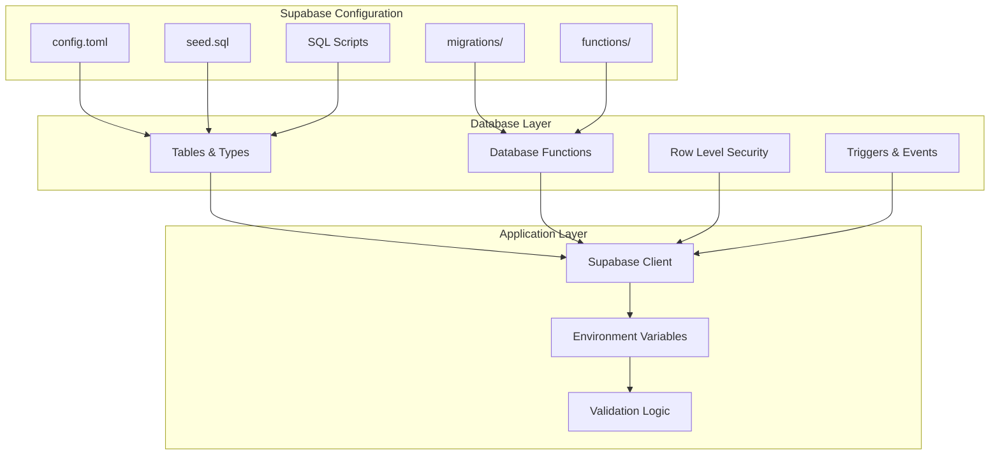
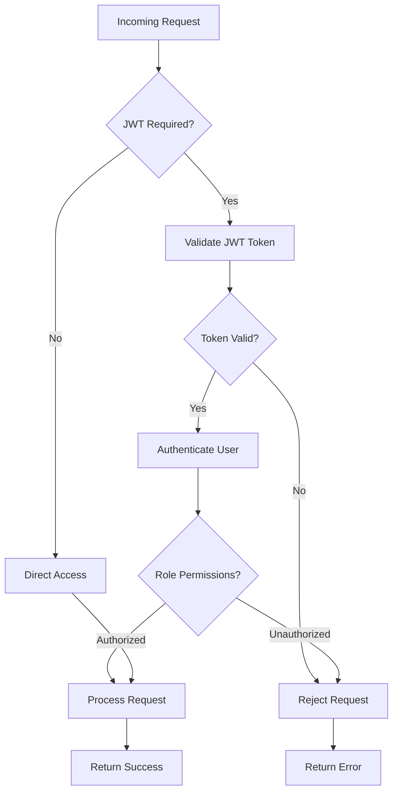
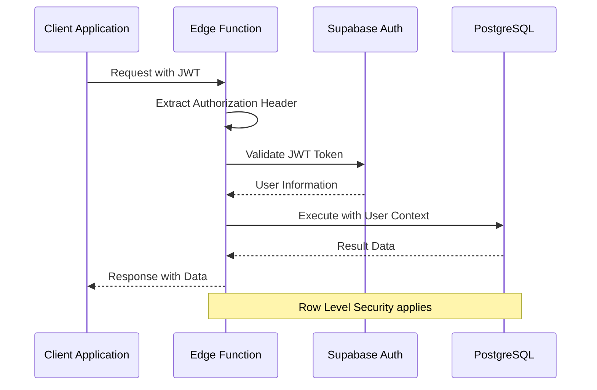
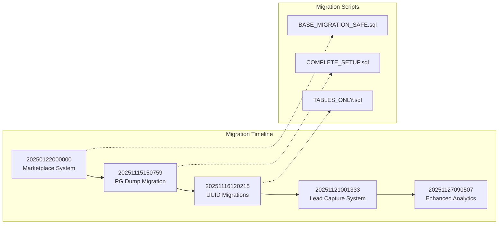
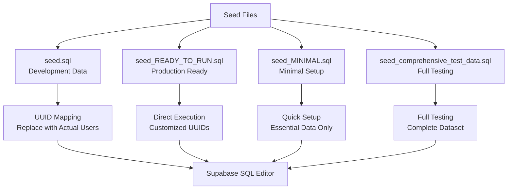
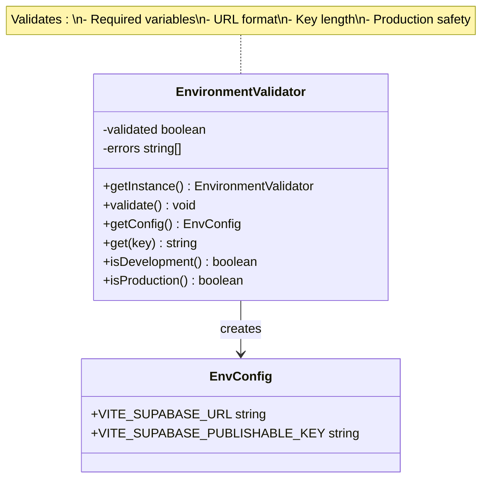
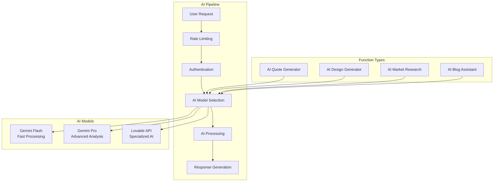

# Supabase Configuration

<cite>
**Referenced Files in This Document**
- [config.toml](file://supabase/config.toml)
- [seed.sql](file://supabase/seed.sql)
- [seed_READY_TO_RUN.sql](file://supabase/seed_READY_TO_RUN.sql)
- [client.ts](file://src/integrations/supabase/client.ts)
- [env-validator.ts](file://src/lib/env-validator.ts)
- [types.ts](file://src/integrations/supabase/types.ts)
- [package.json](file://package.json)
- [ai-quote-generator/index.ts](file://supabase/functions/ai-quote-generator/index.ts)
- [admin-check/index.ts](file://supabase/functions/admin-check/index.ts)
- [wishlist-add/index.ts](file://supabase/functions/wishlist-add/index.ts)
- [20250122000000_create_marketplace_system.sql](file://supabase/migrations/20250122000000_create_marketplace_system.sql)
- [20251115150759_remix_migration_from_pg_dump.sql](file://supabase/migrations/20251115150759_remix_migration_from_pg_dump.sql)
- [BASE_MIGRATION_SAFE.sql](file://supabase/BASE_MIGRATION_SAFE.sql)
- [COMPLETE_SETUP.sql](file://supabase/COMPLETE_SETUP.sql)
- [TABLES_ONLY.sql](file://supabase/TABLES_ONLY.sql)
</cite>

## Table of Contents
1. [Introduction](#introduction)
2. [Project Structure](#project-structure)
3. [Core Configuration](#core-configuration)
4. [Edge Functions JWT Verification](#edge-functions-jwt-verification)
5. [Database Migration Strategy](#database-migration-strategy)
6. [Seed Data Management](#seed-data-management)
7. [Environment Configuration](#environment-configuration)
8. [Security Implications](#security-implications)
9. [AI-Powered Features](#ai-powered-features)
10. [Best Practices](#best-practices)
11. [Troubleshooting Guide](#troubleshooting-guide)
12. [Conclusion](#conclusion)

## Introduction

The sleekapp-v100 project utilizes Supabase as its primary backend infrastructure, providing a comprehensive foundation for a B2B apparel sourcing platform. This documentation covers the Supabase configuration architecture, focusing on Edge Functions JWT verification, service role keys, environment-specific parameters, and the sophisticated migration strategy that enables seamless schema evolution and version control.

The platform leverages Supabase's real-time capabilities, AI-powered features, and robust security model to deliver a scalable solution for apparel manufacturers and buyers. The configuration demonstrates enterprise-grade practices for managing production environments, AI integration, and real-time functionality.

## Project Structure

The Supabase configuration is organized within the `supabase/` directory, containing essential components for database management, Edge Functions, and environment setup:

**Diagram sources**
- [config.toml](file://supabase/config.toml#L1-L80)
- [client.ts](file://src/integrations/supabase/client.ts#L1-L20)
- [types.ts](file://src/integrations/supabase/types.ts#L1-L800)

**Section sources**
- [config.toml](file://supabase/config.toml#L1-L80)
- [client.ts](file://src/integrations/supabase/client.ts#L1-L20)

## Core Configuration

### Supabase Project Setup

The core Supabase configuration is defined in the `config.toml` file, which establishes the fundamental settings for Edge Functions JWT verification and service role access:

| Configuration Parameter | Purpose | Security Impact | Environment Usage |
|------------------------|---------|-----------------|-------------------|
| `project_id` | Unique Supabase project identifier | None (public) | Production/Staging |
| `verify_jwt` | JWT verification requirement for Edge Functions | Authentication security | All environments |
| `service_role_key` | Superuser access for administrative operations | Highest privilege level | Production only |

### Edge Function JWT Verification Settings

The configuration implements granular JWT verification controls across different Edge Functions:

**Diagram sources**
- [ai-quote-generator/index.ts](file://supabase/functions/ai-quote-generator/index.ts#L268-L282)
- [admin-check/index.ts](file://supabase/functions/admin-check/index.ts#L15-L37)

**Section sources**
- [config.toml](file://supabase/config.toml#L1-L80)
- [ai-quote-generator/index.ts](file://supabase/functions/ai-quote-generator/index.ts#L268-L282)

## Edge Functions JWT Verification

### Authentication Architecture

The Edge Functions employ a sophisticated JWT verification system that balances security with functionality:

#### Verified Functions (Require Authentication)
- **generate-invoice**: Ensures only authenticated users can generate invoices
- **ai-design-generator**: Requires user context for personalized design generation
- **admin-check**: Verifies administrative privileges for sensitive operations
- **initialize-production-stages**: Protects production workflow initiation
- **ai-supplier-assignment**: Maintains supplier assignment privacy
- **predict-quality-risks**: Secures quality prediction calculations
- **execute-automation-rules**: Controls automated business process execution

#### Unverified Functions (Public Access)
- **send-resource-email**: Public email delivery service
- **stripe-webhook**: Handles external payment notifications
- **track-product-interaction**: Tracks public product engagement
- **resend-webhook**: Manages webhook resending operations
- **auto-confirm-supplier**: Automates supplier confirmation processes
- **submit-blog-comment**: Allows public comment submission

### Security Implementation Details

The JWT verification follows enterprise security patterns:

**Diagram sources**
- [admin-check/index.ts](file://supabase/functions/admin-check/index.ts#L15-L37)
- [wishlist-add/index.ts](file://supabase/functions/wishlist-add/index.ts#L25-L32)

**Section sources**
- [config.toml](file://supabase/config.toml#L3-L80)
- [admin-check/index.ts](file://supabase/functions/admin-check/index.ts#L15-L74)
- [wishlist-add/index.ts](file://supabase/functions/wishlist-add/index.ts#L15-L121)

## Database Migration Strategy

### Timestamp-Based Migration System

The platform employs a sophisticated migration strategy using timestamped SQL files for schema evolution and version control:

**Diagram sources**
- [20250122000000_create_marketplace_system.sql](file://supabase/migrations/20250122000000_create_marketplace_system.sql#L1-L532)
- [20251115150759_remix_migration_from_pg_dump.sql](file://supabase/migrations/20251115150759_remix_migration_from_pg_dump.sql#L1-L800)

### Migration Script Categories

#### Base Migration Scripts
- **BASE_MIGRATION_SAFE.sql**: Contains core schema without functions that might fail during initial setup
- **TABLES_ONLY.sql**: Creates all tables and types without functions for safe baseline deployment
- **COMPLETE_SETUP.sql**: Comprehensive setup combining all migrations chronologically

#### Feature-Specific Migrations
- **Marketplace System**: Implements B2B marketplace functionality with product listings and supplier management
- **Lead Capture System**: Adds customer acquisition and lead management capabilities
- **Enhanced Analytics**: Introduces advanced reporting and analytics features

### Version Control Strategy

The migration system implements several key principles:

1. **Chronological Ordering**: Migrations execute in timestamp order
2. **Incremental Updates**: Each migration builds upon previous state
3. **Rollback Capability**: Well-defined rollback points through partial migrations
4. **Environment Consistency**: Identical schema across development, staging, and production

**Section sources**
- [20250122000000_create_marketplace_system.sql](file://supabase/migrations/20250122000000_create_marketplace_system.sql#L1-L532)
- [BASE_MIGRATION_SAFE.sql](file://supabase/BASE_MIGRATION_SAFE.sql#L1-L800)
- [COMPLETE_SETUP.sql](file://supabase/COMPLETE_SETUP.sql#L1-L800)

## Seed Data Management

### Multi-Environment Seed Strategy

The platform implements a sophisticated seed data management system supporting multiple deployment scenarios:

**Diagram sources**
- [seed.sql](file://supabase/seed.sql#L1-L800)
- [seed_READY_TO_RUN.sql](file://supabase/seed_READY_TO_RUN.sql#L1-L800)

### Seed Data Categories

#### Development Seed Data (`seed.sql`)
- **Test Accounts**: Five buyer and five supplier profiles with test emails
- **Sample Products**: Comprehensive product catalog with realistic pricing
- **Marketplace Listings**: Active product listings with inventory
- **Blog Content**: Industry articles and sourcing tips
- **Certifications**: Supplier certification data

#### Production Seed Data (`seed_READY_TO_RUN.sql`)
- **Customized UUIDs**: Replaced with actual user account IDs
- **Production-ready**: Ready for immediate deployment
- **Minimal overhead**: Essential data only

#### Specialized Seed Data
- **Minimal Setup**: Essential data for quick testing
- **Comprehensive Testing**: Full dataset for extensive testing
- **Marketplace Products**: Specialized product seeding

### Initialization Process

The seed data initialization follows a structured approach:

1. **User Creation**: Establish test users in Supabase Auth
2. **Profile Setup**: Create associated user profiles
3. **Role Assignment**: Assign appropriate user roles
4. **Data Population**: Populate products, suppliers, and marketplace data
5. **Verification**: Validate data integrity and relationships

**Section sources**
- [seed.sql](file://supabase/seed.sql#L1-L800)
- [seed_READY_TO_RUN.sql](file://supabase/seed_READY_TO_RUN.sql#L1-L800)

## Environment Configuration

### Environment Variable Management

The platform implements robust environment variable validation and management:

**Diagram sources**
- [env-validator.ts](file://src/lib/env-validator.ts#L1-L143)
- [client.ts](file://src/integrations/supabase/client.ts#L1-L20)

### Configuration Parameters

#### Core Supabase Variables
- **VITE_SUPABASE_URL**: Supabase project URL for database connections
- **VITE_SUPABASE_PUBLISHABLE_KEY**: Client-side authentication key

#### Security Validation
The environment validator implements comprehensive checks:
- **Required Variable Detection**: Ensures all mandatory variables exist
- **Format Validation**: Verifies URL and key format compliance
- **Production Safety**: Enforces validation in production environments
- **Error Reporting**: Provides detailed error messages for debugging

### Environment-Specific Settings

#### Development Environment
- **Relaxed Validation**: More lenient validation for local development
- **Debug Information**: Enhanced logging and error details
- **Local Database**: Connection to local Supabase instance

#### Production Environment
- **Strict Validation**: Rigorous validation with early failure
- **Security Focus**: Enhanced security checks and monitoring
- **Production Database**: Secure connection to production Supabase

**Section sources**
- [env-validator.ts](file://src/lib/env-validator.ts#L1-L143)
- [client.ts](file://src/integrations/supabase/client.ts#L1-L20)
- [package.json](file://package.json#L1-L115)

## Security Implications

### JWT Verification Security Model

The JWT verification system implements multiple security layers:

#### Authentication Security
- **Token Validation**: Cryptographic verification of JWT signatures
- **Expiration Checking**: Automatic token expiration detection
- **Scope Verification**: Ensures tokens have appropriate scopes

#### Authorization Security
- **Role-Based Access Control**: Fine-grained permission management
- **Resource Isolation**: Data access limited to authorized resources
- **Action Auditing**: Comprehensive logging of privileged operations

#### Edge Function Security
- **Selective Verification**: Different security requirements per function
- **Rate Limiting**: Protection against abuse and DDoS attacks
- **Input Validation**: Sanitization of all function inputs

### Data Protection Measures

#### Row Level Security (RLS)
The database implements comprehensive RLS policies:
- **User Isolation**: Users can only access their own data
- **Role-Based Policies**: Different access patterns for different roles
- **Administrative Overrides**: Admin users have elevated permissions
- **Supplier Data Protection**: Supplier-specific data isolation

#### Function-Level Security
- **Service Role Keys**: Protected superuser access for administrative functions
- **Function Authentication**: Separate authentication for each Edge Function
- **Parameter Validation**: Input sanitization and validation

**Section sources**
- [config.toml](file://supabase/config.toml#L3-L80)
- [ai-quote-generator/index.ts](file://supabase/functions/ai-quote-generator/index.ts#L268-L282)

## AI-Powered Features

### AI Integration Architecture

The platform integrates advanced AI capabilities through Supabase Edge Functions:

**Diagram sources**
- [ai-quote-generator/index.ts](file://supabase/functions/ai-quote-generator/index.ts#L591-L624)

### AI Function Capabilities

#### Quote Generation AI
- **Price Estimation**: Dynamic pricing based on product complexity
- **Delivery Calculation**: Lead time estimation with buffer calculations
- **Alternative Options**: Multiple sourcing strategy recommendations
- **Risk Assessment**: Manufacturing risk identification and mitigation

#### Design Assistance
- **Pattern Recognition**: Image analysis for design interpretation
- **Material Recommendations**: Fabric selection based on design requirements
- **Cost Optimization**: Pricing optimization suggestions
- **Production Feasibility**: Manufacturing capability assessment

#### Content Generation
- **Blog Articles**: Automated content creation for marketing
- **Market Research**: Industry trend analysis and insights
- **Technical Documentation**: Product specification generation

### AI Security and Monitoring

#### Usage Tracking
- **Cost Monitoring**: AI API usage cost tracking and optimization
- **Rate Limiting**: Protection against excessive AI API usage
- **Audit Logging**: Comprehensive logging of AI interactions
- **Performance Metrics**: Response time and accuracy monitoring

#### Privacy Protection
- **Data Sanitization**: Input data cleaning and sanitization
- **Output Filtering**: Generated content filtering and moderation
- **User Consent**: Clear indication of AI-generated content
- **Data Retention**: Appropriate data retention policies

**Section sources**
- [ai-quote-generator/index.ts](file://supabase/functions/ai-quote-generator/index.ts#L591-L624)

## Best Practices

### Configuration Management

#### Environment Separation
- **Distinct Configurations**: Separate configurations for development, staging, and production
- **Variable Prefixing**: Consistent naming conventions for environment variables
- **Secret Management**: Secure handling of API keys and sensitive data
- **Configuration Validation**: Automated validation of configuration parameters

#### Migration Management
- **Atomic Migrations**: Ensure migrations succeed or roll back completely
- **Data Preservation**: Maintain data integrity during schema changes
- **Testing Strategy**: Comprehensive testing before production deployment
- **Rollback Planning**: Prepared rollback procedures for failed migrations

### Security Best Practices

#### Authentication and Authorization
- **Principle of Least Privilege**: Grant minimal necessary permissions
- **Regular Audit Reviews**: Periodic security audits and access reviews
- **Multi-Factor Authentication**: Enhanced security for administrative functions
- **Session Management**: Secure session handling and timeout policies

#### Data Protection
- **Encryption in Transit**: TLS encryption for all communications
- **Data Classification**: Proper classification and handling of sensitive data
- **Backup Security**: Encrypted backups with access controls
- **Incident Response**: Prepared incident response procedures

### Performance Optimization

#### Database Performance
- **Index Strategy**: Strategic indexing for frequently queried data
- **Query Optimization**: Efficient query patterns and execution plans
- **Connection Pooling**: Optimal database connection management
- **Caching Strategy**: Intelligent caching for frequently accessed data

#### Edge Function Performance
- **Cold Start Mitigation**: Strategies to minimize cold start latency
- **Resource Management**: Efficient memory and CPU usage
- **Timeout Configuration**: Appropriate timeout settings for different functions
- **Monitoring and Alerting**: Comprehensive performance monitoring

## Troubleshooting Guide

### Common Configuration Issues

#### JWT Verification Problems
**Symptom**: Edge Functions returning 401 Unauthorized errors
**Causes**: 
- Expired or invalid JWT tokens
- Incorrect JWT verification settings in config.toml
- Network connectivity issues with Supabase auth

**Solutions**:
1. Verify JWT token validity and expiration
2. Check config.toml JWT verification settings
3. Ensure network connectivity to Supabase endpoints
4. Review Edge Function authentication logic

#### Migration Failures
**Symptom**: Database migrations failing or hanging
**Causes**:
- Insufficient database permissions
- Conflicting migration timestamps
- Large data migration timeouts

**Solutions**:
1. Verify database user permissions
2. Check migration timestamp ordering
3. Increase migration timeout settings
4. Split large migrations into smaller chunks

#### Seed Data Issues
**Symptom**: Seed data not loading correctly
**Causes**:
- UUID conflicts with existing users
- Missing required dependencies
- Insufficient database space

**Solutions**:
1. Update seed files with correct UUIDs
2. Install all required dependencies
3. Verify adequate database storage
4. Check for conflicting data

### Performance Troubleshooting

#### Slow Edge Function Responses
**Symptoms**: High latency in Edge Function execution
**Common Causes**:
- Cold start delays
- Database query performance issues
- External API call timeouts
- Insufficient memory allocation

**Resolution Steps**:
1. Monitor cold start patterns
2. Analyze database query performance
3. Implement connection pooling
4. Optimize function memory allocation

#### Database Performance Issues
**Symptoms**: Slow database queries and migrations
**Diagnostic Approach**:
1. Analyze query execution plans
2. Review index effectiveness
3. Check database connection limits
4. Monitor database resource usage

### Monitoring and Debugging

#### Edge Function Monitoring
- **Execution Logs**: Comprehensive logging of function execution
- **Performance Metrics**: Response time and throughput monitoring
- **Error Tracking**: Centralized error reporting and analysis
- **Usage Analytics**: Function usage patterns and trends

#### Database Monitoring
- **Query Performance**: Slow query identification and optimization
- **Connection Monitoring**: Database connection health and capacity
- **Backup Verification**: Regular backup validation and testing
- **Security Audits**: Regular security assessments and vulnerability scanning

**Section sources**
- [ai-quote-generator/index.ts](file://supabase/functions/ai-quote-generator/index.ts#L729-L753)
- [admin-check/index.ts](file://supabase/functions/admin-check/index.ts#L67-L74)

## Conclusion

The Supabase configuration in sleekapp-v100 demonstrates enterprise-grade backend architecture with sophisticated security, AI integration, and scalability features. The comprehensive configuration management system ensures reliable operation across multiple environments while maintaining strict security standards.

Key achievements of this configuration include:

- **Robust JWT Verification**: Granular authentication controls for different Edge Functions
- **Sophisticated Migration Strategy**: Timestamp-based migrations with rollback capabilities
- **Comprehensive Seed Management**: Multi-environment seed data support
- **AI Integration**: Advanced AI capabilities with proper security and monitoring
- **Security-First Design**: Multi-layered security approach with RLS and function-level protection

The platform's architecture supports the AI-powered features and real-time functionality essential for modern apparel sourcing platforms, providing a solid foundation for future enhancements and scaling requirements.