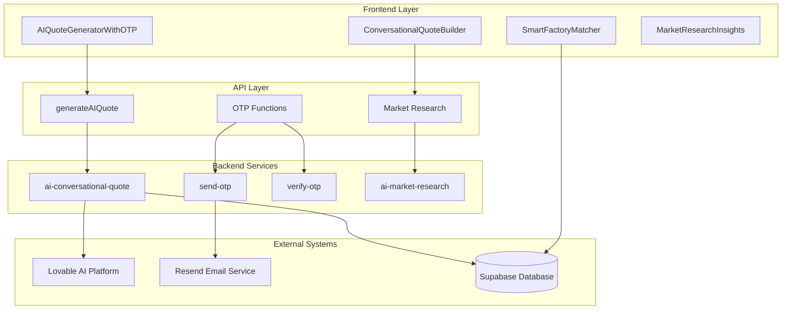
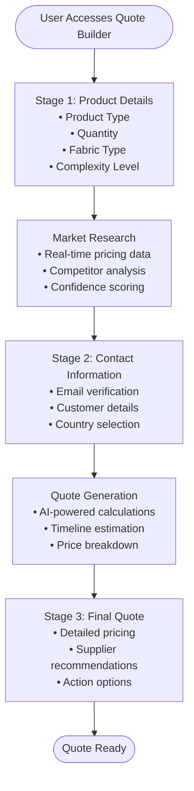
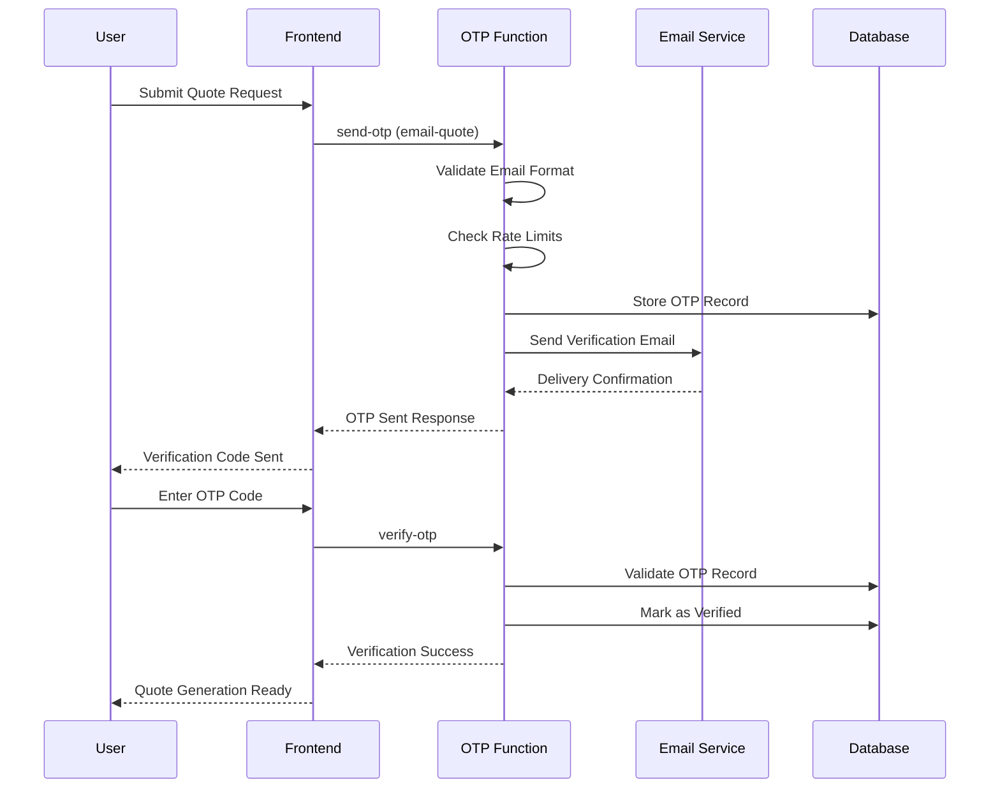
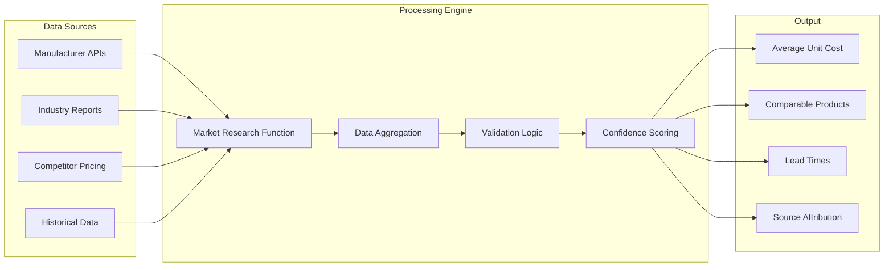
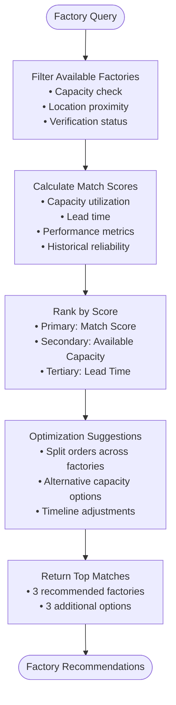
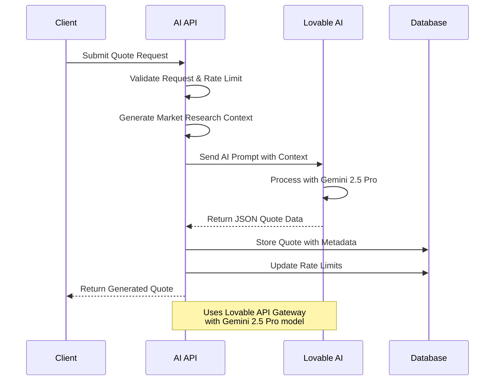
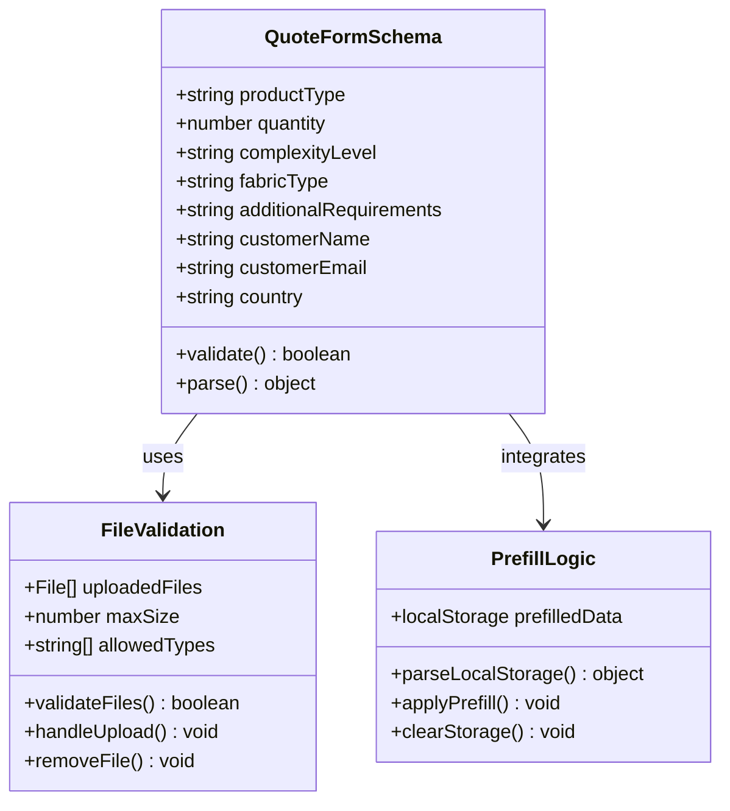

# AI Quote Generator

<cite>
**Referenced Files in This Document**
- [AIQuoteGeneratorWithOTP.tsx](file://src/components/AIQuoteGeneratorWithOTP.tsx)
- [ConversationalQuoteBuilder.tsx](file://src/components/quote/ConversationalQuoteBuilder.tsx)
- [SmartFactoryMatcher.tsx](file://src/components/quote/SmartFactoryMatcher.tsx)
- [aiQuote.ts](file://src/lib/api/aiQuote.ts)
- [MarketResearchInsights.tsx](file://src/components/quote/MarketResearchInsights.tsx)
- [useFactoryCapacity.ts](file://src/hooks/useFactoryCapacity.ts)
- [QuoteLoadingStages.tsx](file://src/components/quote/QuoteLoadingStages.tsx)
- [SmartRecommendations.tsx](file://src/components/quote/SmartRecommendations.tsx)
- [bangladeshManufacturing.ts](file://src/lib/bangladeshManufacturing.ts)
- [ai-conversational-quote/index.ts](file://supabase/functions/ai-conversational-quote/index.ts)
- [send-otp/index.ts](file://supabase/functions/send-otp/index.ts)
- [verify-otp/index.ts](file://supabase/functions/verify-otp/index.ts)
</cite>

## Table of Contents
1. [Introduction](#introduction)
2. [System Architecture](#system-architecture)
3. [Conversational Quote Builder Interface](#conversational-quote-builder-interface)
4. [OTP Verification Process](#otp-verification-process)
5. [Market Research Integration](#market-research-integration)
6. [SmartFactoryMatcher Component](#smartfactorymatcher-component)
7. [AI Processing Pipeline](#ai-processing-pipeline)
8. [Form Validation and File Handling](#form-validation-and-file-handling)
9. [Common Issues and Solutions](#common-issues-and-solutions)
10. [Performance Considerations](#performance-considerations)
11. [Security Measures](#security-measures)
12. [Troubleshooting Guide](#troubleshooting-guide)

## Introduction

The AI Quote Generator is a sophisticated B2B e-commerce feature that provides instant, AI-powered pricing for apparel manufacturing orders. Built on a modern React/TypeScript frontend with Supabase backend services, it combines conversational AI, real-time market research, and intelligent supplier matching to deliver comprehensive quotes in seconds.

The system features a guided conversational interface that walks users through product specifications, implements robust OTP verification for abuse prevention, integrates real-time market pricing data, and recommends optimal suppliers based on capacity and location. It serves as a flagship feature for Sleek Apparels' digital transformation, enabling rapid quote generation while maintaining high accuracy and security standards.

## System Architecture

The AI Quote Generator follows a microservices architecture with clear separation between frontend presentation, backend processing, and external integrations:

**Diagram sources**
- [AIQuoteGeneratorWithOTP.tsx](file://src/components/AIQuoteGeneratorWithOTP.tsx#L1-L50)
- [ai-conversational-quote/index.ts](file://supabase/functions/ai-conversational-quote/index.ts#L1-L50)

**Section sources**
- [AIQuoteGeneratorWithOTP.tsx](file://src/components/AIQuoteGeneratorWithOTP.tsx#L1-L100)
- [ai-conversational-quote/index.ts](file://supabase/functions/ai-conversational-quote/index.ts#L1-L100)

## Conversational Quote Builder Interface

The ConversationalQuoteBuilder provides an intuitive, step-by-step interface that guides users through the quote generation process. It implements a three-stage workflow that progressively gathers information and presents results.

### Three-Stage Workflow

**Diagram sources**
- [ConversationalQuoteBuilder.tsx](file://src/components/quote/ConversationalQuoteBuilder.tsx#L43-L165)

### Key Features

The conversational interface includes several sophisticated components:

- **Product Specification Collection**: Users input product type, quantity, fabric preferences, and complexity level
- **Market Research Integration**: Real-time data analysis with confidence scoring
- **Contact Information Capture**: Secure email collection with validation
- **Progressive Disclosure**: Information revealed in logical sequence
- **Real-time Feedback**: Immediate validation and suggestions

**Section sources**
- [ConversationalQuoteBuilder.tsx](file://src/components/quote/ConversationalQuoteBuilder.tsx#L43-L363)

## OTP Verification Process

The OTP (One-Time Password) verification system provides essential security measures to prevent abuse while maintaining user experience. The system supports multiple OTP types for different use cases.

### OTP Flow Architecture

**Diagram sources**
- [send-otp/index.ts](file://supabase/functions/send-otp/index.ts#L131-L489)
- [verify-otp/index.ts](file://supabase/functions/verify-otp/index.ts#L21-L356)

### Security Features

The OTP system implements comprehensive security measures:

- **Email Validation**: Regex-based format checking with disposable email detection
- **Rate Limiting**: 5 requests per hour per IP, 10 per day per email
- **Expiration Control**: 10-minute validity period
- **Attempt Monitoring**: 5 maximum attempts per OTP code
- **Retry Logic**: Automatic retry with exponential backoff for email delivery
- **Disposable Domain Blocking**: Prevents abuse from temporary email providers

### OTP Types and Use Cases

| OTP Type | Purpose | Rate Limits | Validation |
|----------|---------|-------------|------------|
| `phone` | Phone verification | 1 per 5 minutes | Phone number format |
| `email-quote` | Quote generation | 3 per day per email | Email format + disposable check |
| `email-supplier` | Supplier registration | 1 per 5 minutes | Email uniqueness + CAPTCHA |

**Section sources**
- [send-otp/index.ts](file://supabase/functions/send-otp/index.ts#L1-L489)
- [verify-otp/index.ts](file://supabase/functions/verify-otp/index.ts#L1-L356)

## Market Research Integration

The market research system provides real-time pricing intelligence by aggregating data from multiple verified sources and calculating competitive benchmarks.

### Market Research Pipeline

**Diagram sources**
- [MarketResearchInsights.tsx](file://src/components/quote/MarketResearchInsights.tsx#L1-L140)

### Research Data Structure

The market research system returns comprehensive pricing intelligence:

| Metric | Description | Calculation Method |
|--------|-------------|-------------------|
| Average Unit Cost | Industry benchmark price | Weighted average from verified sources |
| Material Cost | Fabric and material expenses | Base price + fabric multiplier |
| Lead Time | Production and shipping timeline | Sampling + production + buffer + shipping |
| Markup Percentage | Industry profit margin | (Total Price - Material Cost) / Material Cost |
| Confidence Score | Data reliability rating | Source quality + sample size + recency |
| Comparable Products | Competitive alternatives | Price ranking + supplier reputation |

### Real-time Data Updates

The system maintains cached research data with automatic refresh mechanisms:

- **Cache Duration**: 24 hours for stable products, 4 hours for volatile materials
- **Refresh Triggers**: Price changes > 10%, new source additions, weekly updates
- **Fallback Strategy**: Degraded mode with historical data when sources unavailable
- **Quality Assurance**: Multi-source validation before caching

**Section sources**
- [MarketResearchInsights.tsx](file://src/components/quote/MarketResearchInsights.tsx#L1-L140)

## SmartFactoryMatcher Component

The SmartFactoryMatcher intelligently recommends suitable suppliers based on capacity availability, location proximity, and production capabilities.

### Factory Matching Algorithm

**Diagram sources**
- [SmartFactoryMatcher.tsx](file://src/components/quote/SmartFactoryMatcher.tsx#L1-L179)

### Matching Criteria

The factory matching system evaluates suppliers across multiple dimensions:

| Criterion | Weight | Description |
|-----------|--------|-------------|
| Capacity Availability | 30% | Current factory capacity vs. order quantity |
| Location Proximity | 20% | Distance affecting shipping costs and timelines |
| Performance Score | 20% | Historical on-time delivery and quality ratings |
| Lead Time | 15% | Production and shipping timeline alignment |
| Utilization Rate | 10% | Factory current workload and efficiency |
| Specialization | 5% | Expertise with specific product types |

### Capacity Management

The system continuously monitors factory capacities:

- **Real-time Updates**: Daily capacity recalculations
- **Utilization Tracking**: Historical patterns and seasonal variations
- **Split Order Optimization**: Intelligent distribution across multiple factories
- **Availability Alerts**: Real-time notifications of capacity changes

**Section sources**
- [SmartFactoryMatcher.tsx](file://src/components/quote/SmartFactoryMatcher.tsx#L1-L179)
- [useFactoryCapacity.ts](file://src/hooks/useFactoryCapacity.ts#L92-L138)

## AI Processing Pipeline

The AI quote generation pipeline leverages advanced language models to produce accurate, context-aware pricing estimates.

### AI Quote Generation Process

**Diagram sources**
- [ai-conversational-quote/index.ts](file://supabase/functions/ai-conversational-quote/index.ts#L196-L385)

### AI Prompt Engineering

The AI system receives carefully crafted prompts that include:

- **Market Research Data**: Real-time pricing benchmarks and industry standards
- **Product Specifications**: Detailed requirements and customization options
- **Historical Context**: Previous quote patterns and customer preferences
- **Geographic Factors**: Bangladesh manufacturing cost advantages
- **Quality Guidelines**: Specific formatting requirements for JSON output

### Quote Generation Output

The AI generates comprehensive quote data:

| Field | Type | Description |
|-------|------|-------------|
| unitPrice | Number | Calculated per-unit cost |
| totalPrice | Number | Total order value |
| estimatedDeliveryDays | Number | Production + shipping timeline |
| confidenceScore | Number | AI confidence in pricing accuracy |
| priceBreakdown | Object | Material, labor, overhead, margin |
| priceJustification | String | AI-generated rationale |
| comparableProducts | Array | Competitive alternatives |
| suggestions | String | Optimization recommendations |

**Section sources**
- [ai-conversational-quote/index.ts](file://supabase/functions/ai-conversational-quote/index.ts#L196-L385)

## Form Validation and File Handling

The AIQuoteGeneratorWithOTP component implements comprehensive validation and file handling capabilities for enhanced user experience.

### Validation Schema

**Diagram sources**
- [AIQuoteGeneratorWithOTP.tsx](file://src/components/AIQuoteGeneratorWithOTP.tsx#L27-L37)

### File Upload System

The system supports multiple file types for comprehensive product specification:

- **Supported Formats**: Images (PNG, JPG, WebP), PDF documents
- **Size Limits**: Maximum 20MB per file, 3 files total
- **Validation**: Automatic format checking and size verification
- **Processing**: Base64 encoding for API transmission
- **User Feedback**: Real-time validation with helpful error messages

### Form State Management

The component maintains sophisticated form state:

- **Local Storage Integration**: Persistent form data across sessions
- **Prefill Mechanisms**: Automatic population from conversational assistant
- **Real-time Validation**: Immediate feedback on field changes
- **Error Handling**: Comprehensive error reporting with user guidance
- **Progressive Enhancement**: Graceful degradation for various browsers

**Section sources**
- [AIQuoteGeneratorWithOTP.tsx](file://src/components/AIQuoteGeneratorWithOTP.tsx#L112-L174)

## Common Issues and Solutions

### Failed OTP Verification

**Problem**: Users encounter OTP verification failures
**Causes**: 
- Expired verification codes (10-minute timeout)
- Incorrect OTP entry (must be exactly 6 digits)
- Rate limiting (5 attempts per hour)
- Email delivery issues

**Solutions**:
1. **Code Expiration**: Automatically request new OTP if previous code expired
2. **Format Validation**: Enforce strict 6-digit numeric format
3. **Rate Limiting**: Implement clear messaging about attempt limits
4. **Delivery Issues**: Offer resend functionality with cooldown periods

### Incomplete Quote Data

**Problem**: Quote generation fails due to missing information
**Causes**:
- Insufficient product specifications
- Invalid quantity ranges
- Missing required fields
- File upload failures

**Solutions**:
1. **Field Validation**: Real-time validation with immediate feedback
2. **Default Values**: Intelligent defaults for optional fields
3. **Progressive Completion**: Allow partial submissions with warnings
4. **Error Recovery**: Restore previous valid state on error

### AI Processing Latency

**Problem**: Long delays during quote generation
**Causes**:
- AI model processing times
- Network latency
- Concurrent request handling
- Rate limiting enforcement

**Solutions**:
1. **Loading Stages**: Progressive loading indicators with tips
2. **Background Processing**: Async quote generation with status updates
3. **Caching Strategy**: Intelligent caching of similar requests
4. **Fallback Options**: Degraded mode with basic pricing

**Section sources**
- [AIQuoteGeneratorWithOTP.tsx](file://src/components/AIQuoteGeneratorWithOTP.tsx#L239-L344)
- [QuoteLoadingStages.tsx](file://src/components/quote/QuoteLoadingStages.tsx#L1-L139)

## Performance Considerations

### AI Processing Latency

The system implements several strategies to manage AI processing latency:

- **Progressive Loading**: Three-stage loading process with rotating tips
- **Background Processing**: Non-blocking quote generation
- **Caching Strategy**: Intelligent caching of market research data
- **Rate Limiting**: Prevents system overload during peak usage
- **Timeout Management**: Graceful handling of slow AI responses

### High-Volume Request Handling

For handling high-volume quote requests:

- **Queue Management**: Request queuing during peak periods
- **Load Balancing**: Distribution across multiple AI processing nodes
- **Resource Optimization**: Efficient memory and CPU usage
- **Monitoring**: Real-time performance tracking and alerts
- **Scalability**: Horizontal scaling capabilities

### Database Optimization

The system employs several database optimization techniques:

- **Indexing Strategy**: Strategic indexing for frequently queried fields
- **Query Optimization**: Efficient SQL queries with proper joins
- **Connection Pooling**: Managed database connections
- **Caching Layers**: Redis caching for frequently accessed data
- **Partitioning**: Data partitioning for large datasets

**Section sources**
- [QuoteLoadingStages.tsx](file://src/components/quote/QuoteLoadingStages.tsx#L1-L139)
- [ai-conversational-quote/index.ts](file://supabase/functions/ai-conversational-quote/index.ts#L85-L146)

## Security Measures

### Anti-Abuse Protection

The system implements comprehensive anti-abuse measures:

- **CAPTCHA Integration**: Google reCAPTCHA v3 for bot detection
- **Rate Limiting**: IP-based and email-based request limits
- **Email Validation**: Disposable email detection and blocking
- **Input Sanitization**: Comprehensive input validation and sanitization
- **Security Logging**: Detailed audit trails for suspicious activities

### Data Protection

- **Encryption**: End-to-end encryption for sensitive data
- **Access Controls**: Role-based access to quote data
- **Data Retention**: Automated cleanup of old records
- **Privacy Compliance**: GDPR and CCPA compliance measures
- **Secure Transmission**: HTTPS-only communication

### OTP Security

The OTP system includes multiple security layers:

- **Cryptographic Generation**: Secure random OTP generation
- **Secure Storage**: Encrypted OTP storage with expiration
- **Attempt Monitoring**: Tracking of failed verification attempts
- **Rate Limiting**: Prevention of brute force attacks
- **Delivery Verification**: Confirmation of successful email delivery

**Section sources**
- [send-otp/index.ts](file://supabase/functions/send-otp/index.ts#L15-L82)
- [verify-otp/index.ts](file://supabase/functions/verify-otp/index.ts#L67-L88)

## Troubleshooting Guide

### Quote Generation Failures

**Issue**: Quote generation fails with error messages
**Diagnostic Steps**:
1. Check network connectivity and API availability
2. Verify user input validation
3. Review rate limiting status
4. Examine AI model response
5. Check database connectivity

**Resolution**:
- Implement retry logic with exponential backoff
- Provide clear error messages to users
- Log detailed error information for debugging
- Offer manual fallback options

### OTP Delivery Issues

**Issue**: Users don't receive verification emails
**Diagnostic Steps**:
1. Verify email format validation
2. Check disposable email filtering
3. Review rate limiting for email addresses
4. Test email service connectivity
5. Examine spam filters

**Resolution**:
- Implement email validation with user-friendly messages
- Offer alternative verification methods
- Provide clear instructions for checking spam folders
- Implement email delivery monitoring

### Performance Issues

**Issue**: Slow quote generation or interface responsiveness
**Diagnostic Steps**:
1. Monitor AI processing times
2. Check database query performance
3. Analyze network latency
4. Review client-side resource usage
5. Examine concurrent request handling

**Resolution**:
- Implement progressive loading with status updates
- Optimize database queries and indexing
- Add caching for frequently accessed data
- Implement request queuing during peak loads

### File Upload Problems

**Issue**: File uploads fail or are rejected
**Diagnostic Steps**:
1. Verify file format and size limits
2. Check browser compatibility
3. Review file processing logic
4. Examine network stability
5. Test with different file types

**Resolution**:
- Provide clear file type and size guidelines
- Implement drag-and-drop file upload
- Add progress indicators for large files
- Offer alternative upload methods

**Section sources**
- [AIQuoteGeneratorWithOTP.tsx](file://src/components/AIQuoteGeneratorWithOTP.tsx#L239-L344)
- [send-otp/index.ts](file://supabase/functions/send-otp/index.ts#L131-L489)