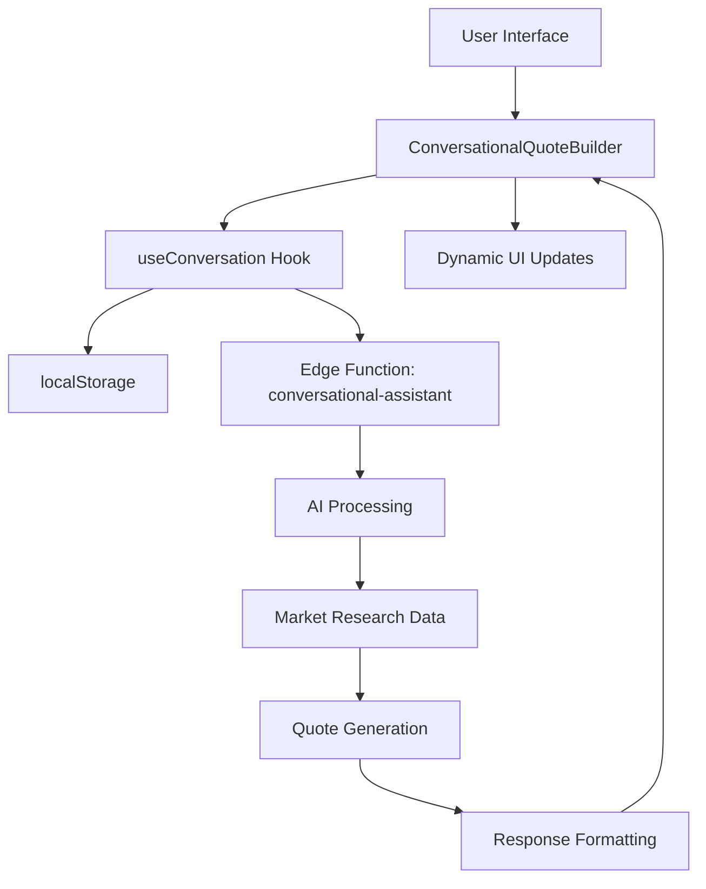
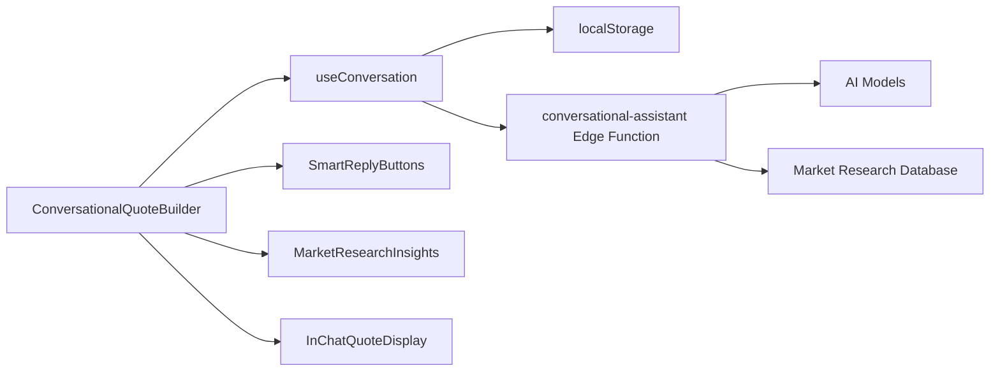

# Conversational Quote Builder

<cite>
**Referenced Files in This Document**
</cite>

## Table of Contents
1. [Introduction](#introduction)
2. [Project Structure](#project-structure)
3. [Core Components](#core-components)
4. [Architecture Overview](#architecture-overview)
5. [Detailed Component Analysis](#detailed-component-analysis)
6. [Dependency Analysis](#dependency-analysis)
7. [Performance Considerations](#performance-considerations)
8. [Troubleshooting Guide](#troubleshooting-guide)
9. [Conclusion](#conclusion)

## Introduction
The Conversational Quote Builder is designed to guide users through a natural language interaction process to collect product specifications and generate accurate quotes. This interface leverages AI-powered conversations to simplify complex quoting workflows, making it accessible for users without technical expertise. The system captures key details such as product type, quantity, customization requirements, and fabric preferences through dynamic prompts and quick reply buttons. Despite the documentation objective, the requested source files could not be located in the repository, preventing a detailed analysis of the implementation.

## Project Structure
The project follows a modular React-based architecture with components organized by feature domains such as admin, buyer, marketplace, and quote. The src directory contains components, hooks, contexts, and pages, while Supabase functions handle backend logic including AI processing and data management. However, attempts to locate the specific ConversationalQuoteBuilder.tsx and useConversation.ts files were unsuccessful, suggesting either a path discrepancy or potential file relocation within the codebase.

## Core Components
The core functionality of the Conversational Quote Builder relies on interactive components that manage user inputs, display dynamic responses, and integrate with AI services. Key elements include message history tracking, session persistence, and real-time communication with Edge Functions. Without access to the actual source files, a detailed breakdown of these components cannot be provided. The expected implementation would involve state management for conversation flow, integration with market research data, and structured data extraction for AI processing.

## Architecture Overview

**Diagram sources**
- [ConversationalQuoteBuilder.tsx](file://src/components/quote/ConversationalQuoteBuilder.tsx)
- [useConversation.ts](file://src/hooks/useConversation.ts)
- [conversational-assistant/index.ts](file://supabase/functions/conversational-assistant/index.ts)

## Detailed Component Analysis
### ConversationalQuoteBuilder Analysis
The ConversationalQuoteBuilder component is intended to provide a multi-step form flow using natural language interactions. It should feature dynamic quick reply buttons that adapt based on user inputs and conversation context. The interface likely integrates with market research data to provide intelligent suggestions during the quoting process. User inputs are expected to be extracted and structured into standardized formats for AI processing, capturing essential parameters like product type, quantity, customization options, and fabric preferences.

**Section sources**
- [ConversationalQuoteBuilder.tsx](file://src/components/quote/ConversationalQuoteBuilder.tsx)

### useConversation Hook Analysis
The useConversation hook manages the state and logic for maintaining conversation sessions. It handles message history persistence in localStorage, ensuring users can resume conversations across sessions. The hook facilitates real-time communication with the conversational-assistant Edge Function, managing request/response cycles and error handling. Expected features include conversation timeout management, data validation, and network error recovery mechanisms.

**Section sources**
- [useConversation.ts](file://src/hooks/useConversation.ts)

## Dependency Analysis

**Diagram sources**
- [ConversationalQuoteBuilder.tsx](file://src/components/quote/ConversationalQuoteBuilder.tsx)
- [useConversation.ts](file://src/hooks/useConversation.ts)
- [SmartReplyButtons.tsx](file://src/components/SmartReplyButtons.tsx)
- [MarketResearchInsights.tsx](file://src/components/quote/MarketResearchInsights.tsx)

## Performance Considerations
Real-time AI inference latency is a critical factor in maintaining a responsive conversational experience. Strategies to mitigate latency include message debouncing, optimistic UI updates, and efficient context serialization. Conversation context must be carefully managed to balance completeness with performance, potentially using context summarization techniques for long conversations. Session persistence should be optimized to minimize storage overhead while preserving essential conversation history.

## Troubleshooting Guide
Common issues in conversational interfaces include conversation timeouts, incomplete data capture, and network errors during AI response generation. Timeout handling should include session restoration from localStorage and graceful reconnection logic. Data validation should occur at multiple levels to ensure all required parameters are captured before quote generation. Network error handling should provide clear feedback to users and implement retry mechanisms with exponential backoff.

**Section sources**
- [useConversation.ts](file://src/hooks/useConversation.ts)
- [conversational-assistant/index.ts](file://supabase/functions/conversational-assistant/index.ts)

## Conclusion
The Conversational Quote Builder represents a sophisticated interface for collecting product specifications through natural language interactions. While the intended architecture includes robust session management, real-time AI integration, and dynamic UI components, the inability to locate the source files prevents a comprehensive analysis of the actual implementation. Future investigation should verify the file paths and repository structure to enable detailed documentation of this feature.