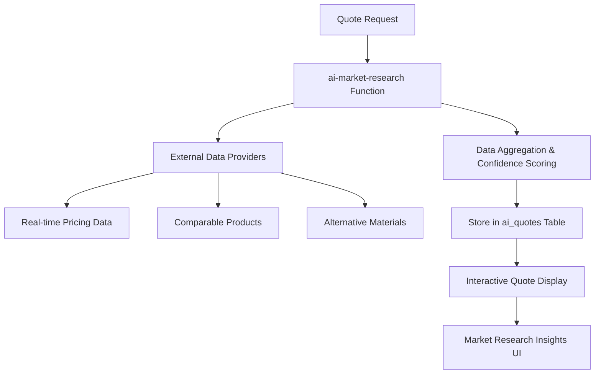
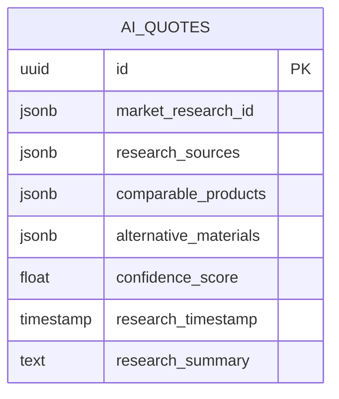
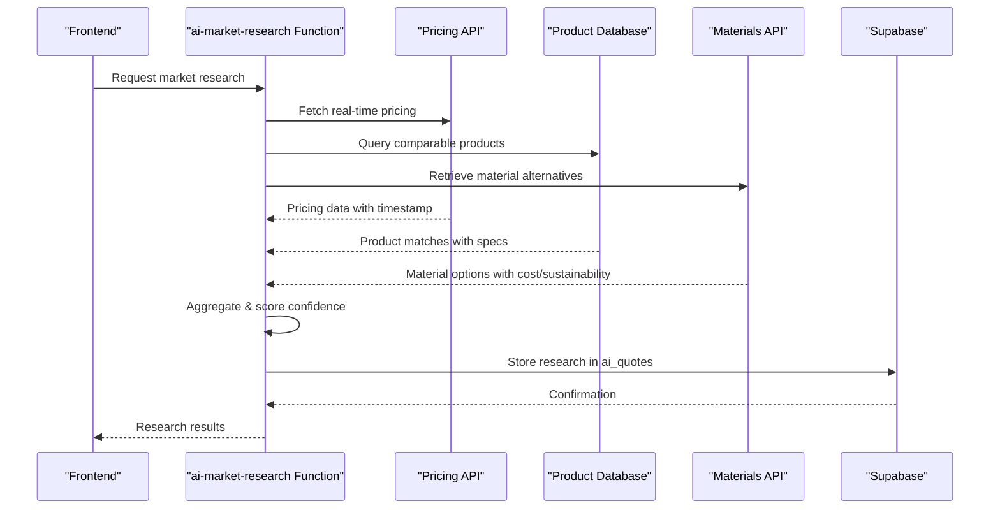
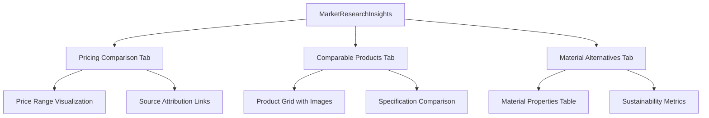
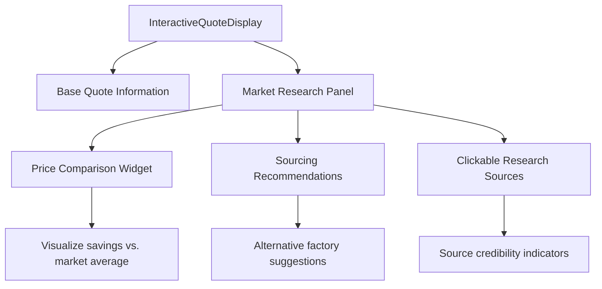
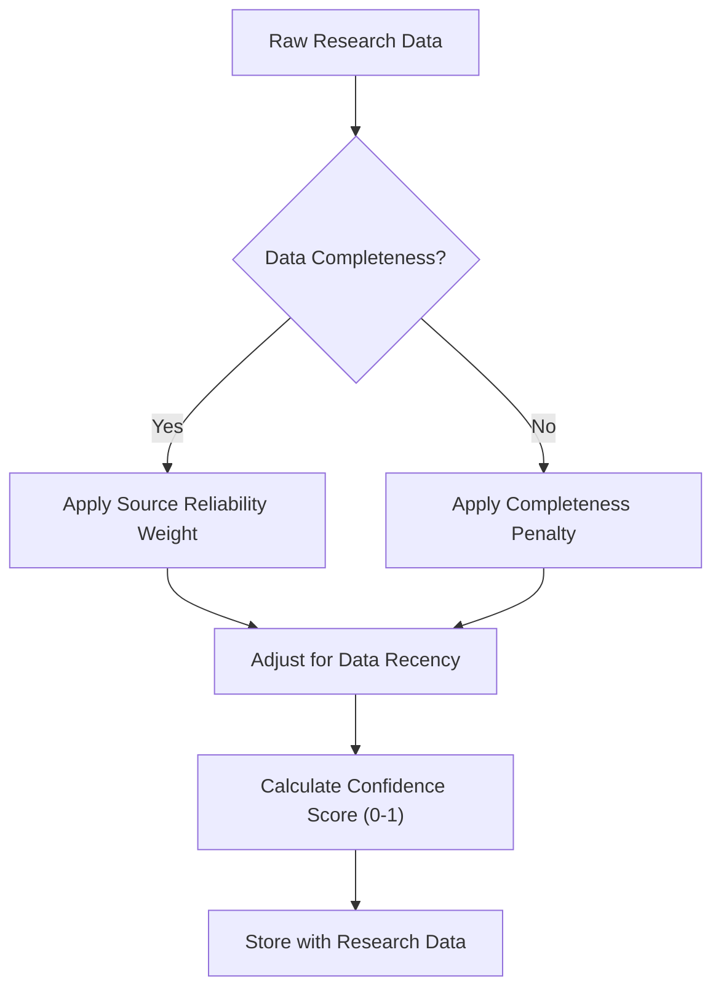
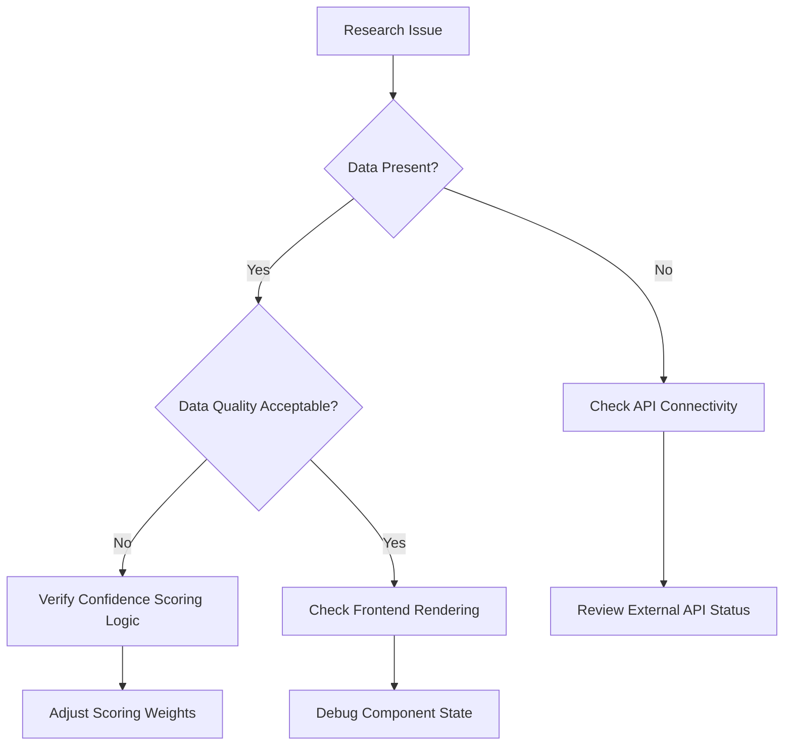
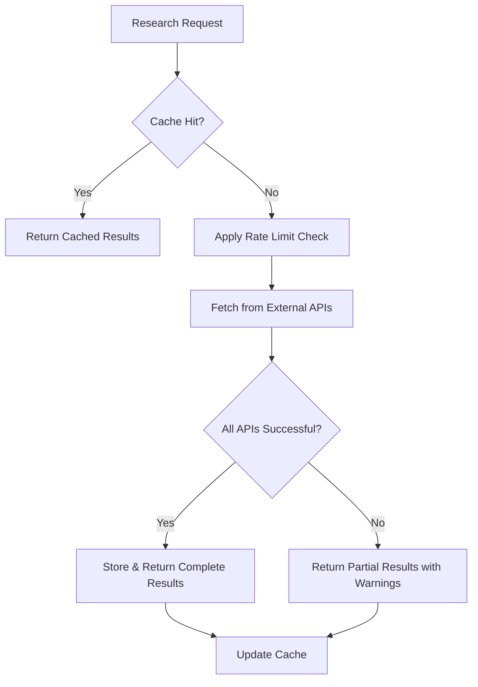

# Market Research Integration

<cite>
**Referenced Files in This Document**  
- [ai-market-research/index.ts](file://supabase/functions/ai-market-research/index.ts)
- [MarketResearchInsights.tsx](file://src/components/quote/MarketResearchInsights.tsx)
- [InteractiveQuoteDisplay.tsx](file://src/components/quote/InteractiveQuoteDisplay.tsx)
- [database.ts](file://src/types/database.ts)
- [20251121040812_6c4fea3b-d195-422d-83c9-ade0c9dc73db.sql](file://supabase/migrations/20251121040812_6c4fea3b-d195-422d-83c9-ade0c9dc73db.sql)
</cite>

## Table of Contents
1. [Introduction](#introduction)
2. [Core Functionality](#core-functionality)
3. [Database Schema Changes](#database-schema-changes)
4. [AI Market Research Edge Function](#ai-market-research-edge-function)
5. [Frontend Implementation](#frontend-implementation)
6. [Data Aggregation and Confidence Scoring](#data-aggregation-and-confidence-scoring)
7. [Research Attribution and Source Tracking](#research-attribution-and-source-tracking)
8. [Common Issues and Troubleshooting](#common-issues-and-troubleshooting)
9. [Performance Considerations](#performance-considerations)
10. [Conclusion](#conclusion)

## Introduction
The Market Research Integration feature enhances AI-generated quotes with real-time pricing data, comparable product recommendations, and alternative material suggestions. This documentation details the implementation of the ai-market-research Edge Function, database schema modifications, and frontend components that present market research insights within the quote generation process.

**Section sources**
- [ai-market-research/index.ts](file://supabase/functions/ai-market-research/index.ts)
- [20251121040812_6c4fea3b-d195-422d-83c9-ade0c9dc73db.sql](file://supabase/migrations/20251121040812_6c4fea3b-d195-422d-83c9-ade0c9dc73db.sql)

## Core Functionality
The Market Research Integration provides three key data enhancements to AI quotes:
- Real-time pricing comparisons from external market data sources
- Recommendations of comparable products based on design specifications
- Alternative material suggestions with cost and sustainability metrics

These insights are integrated into the AI quote generation process, providing buyers with comprehensive market context to inform their purchasing decisions.



**Diagram sources**
- [ai-market-research/index.ts](file://supabase/functions/ai-market-research/index.ts)
- [InteractiveQuoteDisplay.tsx](file://src/components/quote/InteractiveQuoteDisplay.tsx)

## Database Schema Changes
The implementation introduced new fields to the ai_quotes table to store market research data:



The schema additions include:
- `market_research_id`: Unique identifier for the research session
- `research_sources`: JSONB field storing metadata about data sources with attribution
- `comparable_products`: JSONB array containing product comparisons with pricing data
- `confidence_score`: Float value (0-1) representing research reliability
- `research_timestamp`: Timestamp of data collection
- `alternative_materials`: JSONB array with material substitution recommendations

**Diagram sources**
- [20251121040812_6c4fea3b-d195-422d-83c9-ade0c9dc73db.sql](file://supabase/migrations/20251121040812_6c4fea3b-d195-422d-83c9-ade0c9dc73db.sql)
- [database.ts](file://src/types/database.ts)

**Section sources**
- [20251121040812_6c4fea3b-d195-422d-83c9-ade0c9dc73db.sql](file://supabase/migrations/20251121040812_6c4fea3b-d195-422d-83c9-ade0c9dc73db.sql)

## AI Market Research Edge Function
The ai-market-research Edge Function orchestrates data collection from multiple external sources, aggregates the results, and stores them in the ai_quotes table with confidence scoring.



The function implements rate limiting, error handling for partial failures, and data validation before storage.

**Diagram sources**
- [ai-market-research/index.ts](file://supabase/functions/ai-market-research/index.ts)

**Section sources**
- [ai-market-research/index.ts](file://supabase/functions/ai-market-research/index.ts)

## Frontend Implementation
The frontend components render market research data in an interactive format within the quote display.

### MarketResearchInsights Component
The MarketResearchInsights component presents research findings in a tabbed interface:



Each tab displays confidence scores and allows users to explore source data.

**Diagram sources**
- [MarketResearchInsights.tsx](file://src/components/quote/MarketResearchInsights.tsx)

### InteractiveQuoteDisplay Integration
The InteractiveQuoteDisplay component integrates research insights with the main quote:



**Diagram sources**
- [InteractiveQuoteDisplay.tsx](file://src/components/quote/InteractiveQuoteDisplay.tsx)

**Section sources**
- [MarketResearchInsights.tsx](file://src/components/quote/MarketResearchInsights.tsx)
- [InteractiveQuoteDisplay.tsx](file://src/components/quote/InteractiveQuoteDisplay.tsx)

## Data Aggregation and Confidence Scoring
The system implements a weighted confidence scoring model based on data source reliability, recency, and completeness.



Confidence thresholds trigger warnings in the UI when research quality is low.

**Section sources**
- [ai-market-research/index.ts](file://supabase/functions/ai-market-research/index.ts)

## Research Attribution and Source Tracking
The research_sources JSONB field maintains provenance information for transparency:

```json
{
  "pricing_data": {
    "source": "GlobalTextileIndex",
    "retrieval_timestamp": "2025-11-21T10:30:00Z",
    "data_coverage": "Worldwide",
    "update_frequency": "hourly",
    "confidence_weight": 0.9
  },
  "comparable_products": {
    "source": "ApparelMarketplaceAPI",
    "retrieval_timestamp": "2025-11-21T10:30:05Z",
    "sample_size": 47,
    "confidence_weight": 0.85
  }
}
```

This enables clickable source attribution in the frontend UI.

**Section sources**
- [ai-market-research/index.ts](file://supabase/functions/ai-market-research/index.ts)
- [MarketResearchInsights.tsx](file://src/components/quote/MarketResearchInsights.tsx)

## Common Issues and Troubleshooting
### Stale Market Data
Issue: Research results contain outdated pricing information
Solution: Verify the Edge Function's cache invalidation settings and check external API update frequencies

### Missing Research Sources
Issue: Research attribution data is incomplete or missing
Solution: Check the data pipeline for source metadata preservation and validate JSONB field constraints

### Confidence Score Interpretation
Issue: Users misunderstand confidence score meaning
Solution: Implement tooltip explanations and visual indicators (color coding) in the UI



**Section sources**
- [ai-market-research/index.ts](file://supabase/functions/ai-market-research/index.ts)
- [MarketResearchInsights.tsx](file://src/components/quote/MarketResearchInsights.tsx)

## Performance Considerations
### Caching Strategies
Implement multi-layer caching to reduce external API calls:
- Client-side: Browser cache for recent research results
- Edge: Redis cache with 15-minute TTL for market data
- Database: Materialized views for frequently accessed comparisons

### API Rate Limiting
The Edge Function implements:
- Token bucket algorithm for external API requests
- Queueing for high-volume research requests
- Fallback to cached data when rate limits are reached

### Handling Incomplete Results
The system gracefully handles partial data availability:
- Display available research dimensions even if others fail
- Clear visual indicators for missing data components
- Option to refresh specific research segments



**Section sources**
- [ai-market-research/index.ts](file://supabase/functions/ai-market-research/index.ts)

## Conclusion
The Market Research Integration enhances AI quotes with valuable market context, empowering buyers with data-driven insights. By combining real-time pricing, comparable products, and material alternatives with transparent source attribution and confidence scoring, the feature provides comprehensive decision support while maintaining performance through strategic caching and error handling.

The implementation demonstrates a robust pattern for integrating external data sources into AI-generated content with proper attribution, quality assessment, and user transparency.