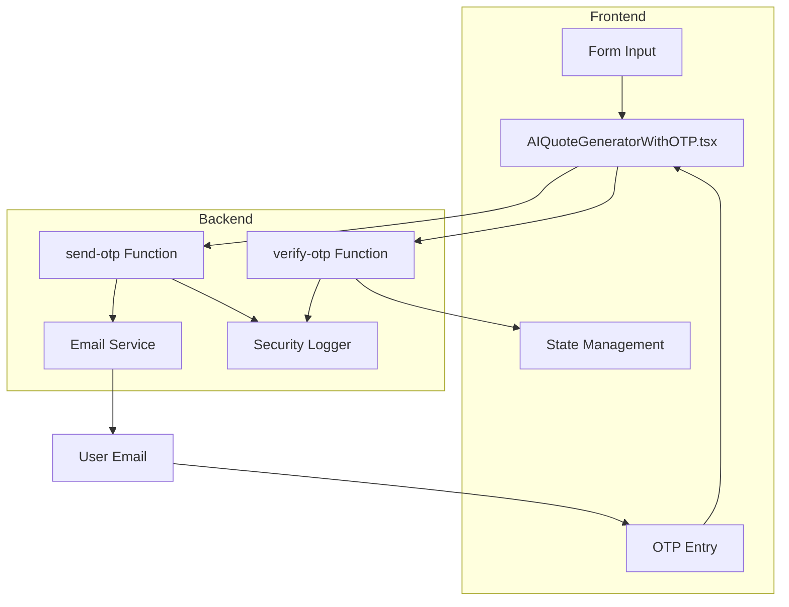
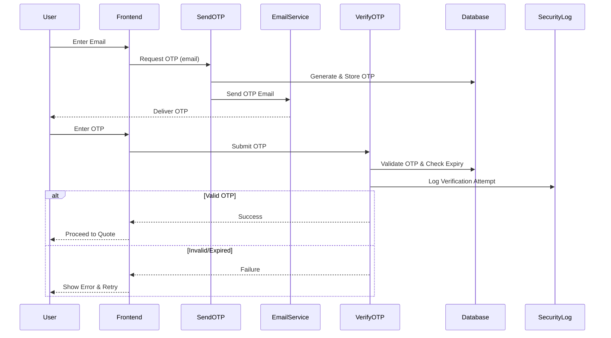
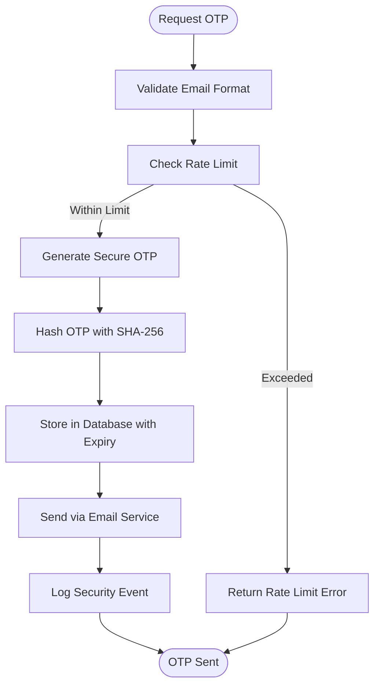
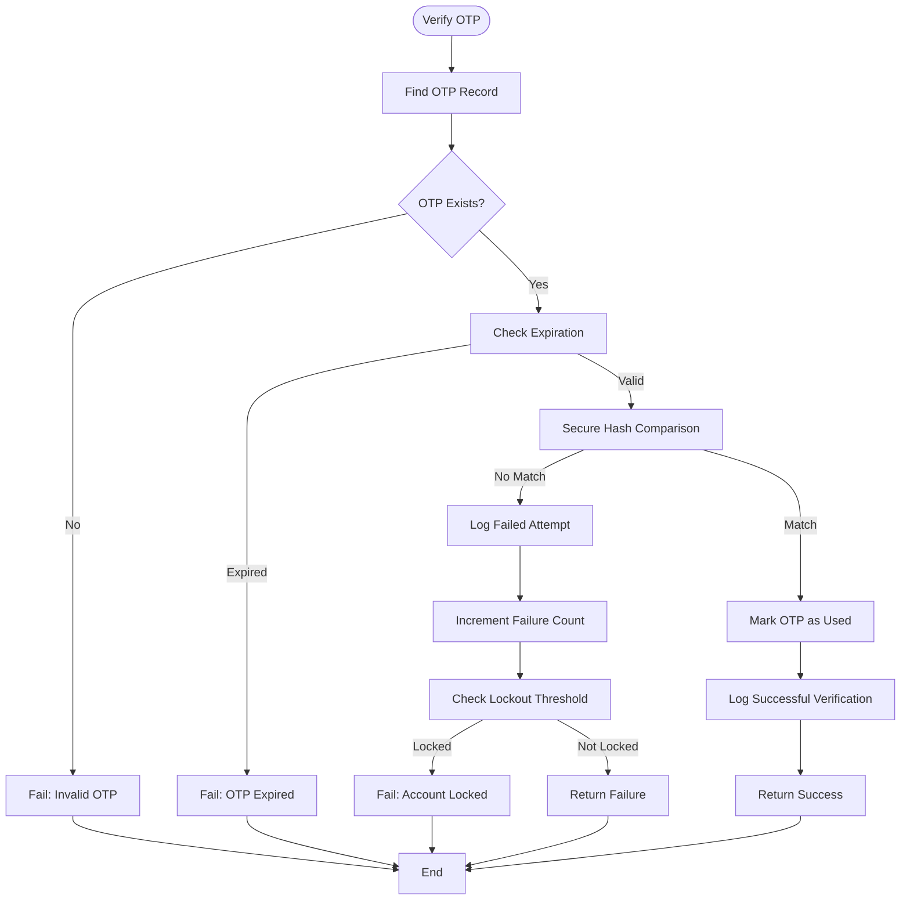
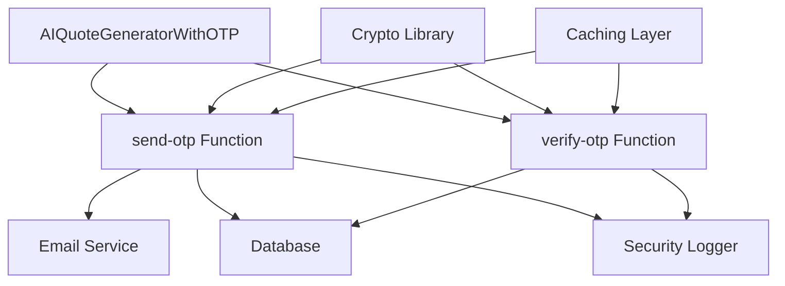

# OTP Verification Process

<cite>
**Referenced Files in This Document **

</cite>

## Table of Contents
1. [Introduction](#introduction)
2. [Project Structure](#project-structure)
3. [Core Components](#core-components)
4. [Architecture Overview](#architecture-overview)
5. [Detailed Component Analysis](#detailed-component-analysis)
6. [Dependency Analysis](#dependency-analysis)
7. [Performance Considerations](#performance-considerations)
8. [Troubleshooting Guide](#troubleshooting-guide)
9. [Conclusion](#conclusion)

## Introduction
The OTP verification process is a critical security mechanism in the AI quote generation workflow, designed to prevent abuse and ensure that quote requests originate from legitimate users. This document details the implementation of the OTP system, covering the sequence from email input to OTP delivery via the send-otp Edge Function, validation through the verify-otp function, and state management within the AIQuoteGeneratorWithOTP component. The process includes robust form validation, error handling for invalid or expired OTPs, retry mechanisms, rate limiting, token expiration policies, and protections against brute force attacks. Common issues such as email delivery failures, OTP expiration during user input, and timezone-related validation errors are also addressed, along with performance considerations for third-party email service integration and strategies to improve conversion rates while maintaining high security standards.

## Project Structure
The OTP verification system is integrated into the frontend quote generation interface and backend Edge Functions. The frontend component AIQuoteGeneratorWithOTP.tsx manages the multi-step UI flow, while the backend functions send-otp and verify-otp handle OTP generation, delivery, and validation. These components are supported by shared security logging utilities and email service integrations. The overall structure follows a modular pattern with clear separation between UI logic, API interactions, and serverless function execution.

**Diagram sources **
- [AIQuoteGeneratorWithOTP.tsx](file://src/components/AIQuoteGeneratorWithOTP.tsx)
- [send-otp/index.ts](file://supabase/functions/send-otp/index.ts)
- [verify-otp/index.ts](file://supabase/functions/verify-otp/index.ts)

**Section sources**
- [AIQuoteGeneratorWithOTP.tsx](file://src/components/AIQuoteGeneratorWithOTP.tsx)
- [send-otp/index.ts](file://supabase/functions/send-otp/index.ts)
- [verify-otp/index.ts](file://supabase/functions/verify-otp/index.ts)

## Core Components
The core components of the OTP verification process include the AIQuoteGeneratorWithOTP React component for managing the user interface and state transitions, the send-otp Edge Function responsible for generating and delivering one-time passwords via email, and the verify-otp function that validates submitted OTPs against stored tokens with proper expiration and usage checks. These components work together to create a secure, step-based verification flow that prevents automated abuse while maintaining a smooth user experience for legitimate quote requests.

**Section sources**
- [AIQuoteGeneratorWithOTP.tsx](file://src/components/AIQuoteGeneratorWithOTP.tsx)
- [send-otp/index.ts](file://supabase/functions/send-otp/index.ts)
- [verify-otp/index.ts](file://supabase/functions/verify-otp/index.ts)

## Architecture Overview
The OTP verification architecture follows a client-server pattern with stateless Edge Functions handling authentication logic. The frontend component orchestrates a multi-step process: email collection, OTP request, OTP entry, and verification. Upon email submission, the send-otp function generates a cryptographically secure token, stores it with an expiration timestamp in the database, and triggers email delivery through a third-party service. The verify-otp function then checks submitted tokens against stored values, enforcing rate limits and invalidating used tokens. All operations are logged for security monitoring.

**Diagram sources **
- [AIQuoteGeneratorWithOTP.tsx](file://src/components/AIQuoteGeneratorWithOTP.tsx)
- [send-otp/index.ts](file://supabase/functions/send-otp/index.ts)
- [verify-otp/index.ts](file://supabase/functions/verify-otp/index.ts)

## Detailed Component Analysis

### AIQuoteGeneratorWithOTP Analysis
The AIQuoteGeneratorWithOTP component implements a step-based UI that guides users through the OTP verification process. It manages state transitions between email input, OTP entry, and quote generation phases, with built-in form validation to ensure email format correctness before requesting an OTP. The component enforces cooldown periods between OTP requests to prevent spamming and displays appropriate error messages for invalid submissions or expired codes. It also handles network failures gracefully and provides clear retry options.

**Section sources**
- [AIQuoteGeneratorWithOTP.tsx](file://src/components/AIQuoteGeneratorWithOTP.tsx)

### send-otp Function Analysis
The send-otp Edge Function generates cryptographically secure one-time passwords using industry-standard randomization techniques. It implements rate limiting to prevent abuse, checking recent request counts from the same IP or email domain. Generated OTPs are stored in the database with SHA-256 hashed values and expiration timestamps (typically 10 minutes). The function integrates with a third-party email service to deliver OTPs and logs all activities for security auditing. It includes safeguards against email injection attacks and validates recipient addresses.

**Diagram sources **
- [send-otp/index.ts](file://supabase/functions/send-otp/index.ts)

### verify-otp Function Analysis
The verify-otp function performs comprehensive validation of submitted OTPs, checking existence, expiration, and usage status in the database. It compares the submitted value against the stored hash using secure comparison methods to prevent timing attacks. Upon successful verification, it marks the OTP as used and returns a success response. Failed attempts are logged and contribute to rate limiting calculations. The function also handles timezone considerations by storing all timestamps in UTC and validating against server time.

**Diagram sources **
- [verify-otp/index.ts](file://supabase/functions/verify-otp/index.ts)

## Dependency Analysis
The OTP verification system depends on several external services and internal components. The primary dependencies include the email delivery service for OTP transmission, the database for storing OTP records, and security logging infrastructure for audit trails. The system also relies on cryptographic libraries for secure token generation and hashing. Rate limiting functionality depends on caching mechanisms to track request frequencies. All dependencies are designed with fail-safe mechanisms to maintain security even during partial outages.

**Diagram sources **
- [send-otp/index.ts](file://supabase/functions/send-otp/index.ts)
- [verify-otp/index.ts](file://supabase/functions/verify-otp/index.ts)
- [AIQuoteGeneratorWithOTP.tsx](file://src/components/AIQuoteGeneratorWithOTP.tsx)

## Performance Considerations
Integrating with third-party email services introduces latency considerations for OTP delivery. The system is designed to minimize user wait times by returning immediate responses after initiating email sends, rather than waiting for delivery confirmation. Database queries for OTP validation are optimized with proper indexing on email and token fields. Caching is used for rate limiting checks to reduce database load. To improve conversion rates, the UI provides clear feedback during processing and allows reasonable retry limits while maintaining security through progressive cooldown periods.

**Section sources**
- [send-otp/index.ts](file://supabase/functions/send-otp/index.ts)
- [verify-otp/index.ts](file://supabase/functions/verify-otp/index.ts)

## Troubleshooting Guide
Common issues in the OTP verification process include failed email delivery, which can be caused by incorrect email addresses, spam filters, or temporary email service outages. OTP expiration during user input can occur if users take longer than the validity period to respond; this is mitigated by clear countdown timers in the UI. Timezone-related validation errors are prevented by using UTC timestamps consistently across all components. For debugging, security logs should be checked for failed attempt patterns, and email service delivery reports should be monitored for bounce rates.

**Section sources**
- [send-otp/index.ts](file://supabase/functions/send-otp/index.ts)
- [verify-otp/index.ts](file://supabase/functions/verify-otp/index.ts)
- [AIQuoteGeneratorWithOTP.tsx](file://src/components/AIQuoteGeneratorWithOTP.tsx)

## Conclusion
The OTP verification process in the AI quote generation workflow provides a robust security layer that effectively prevents automated abuse while maintaining a user-friendly experience for legitimate customers. By combining secure token generation, proper expiration policies, rate limiting, and comprehensive logging, the system strikes an optimal balance between security and usability. The modular architecture allows for easy maintenance and future enhancements, such as adding multi-factor authentication options or integrating with phone-based verification services.