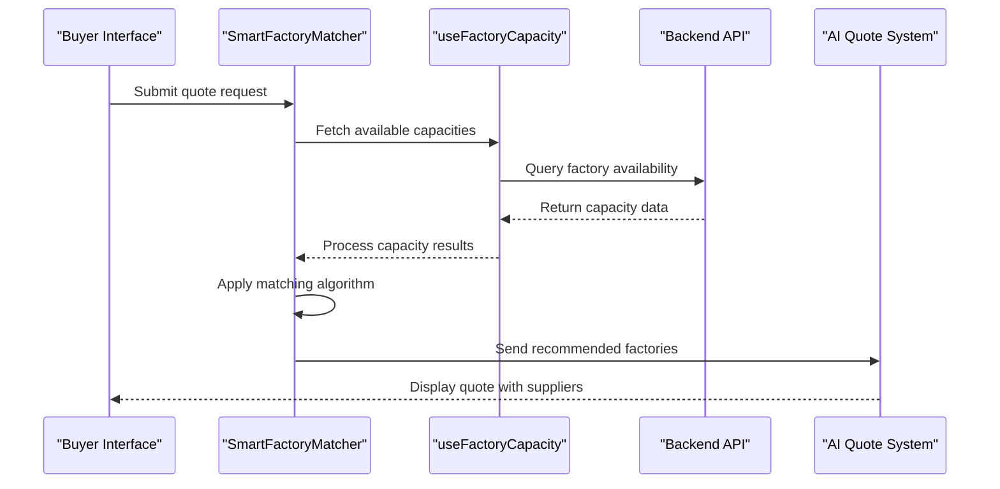
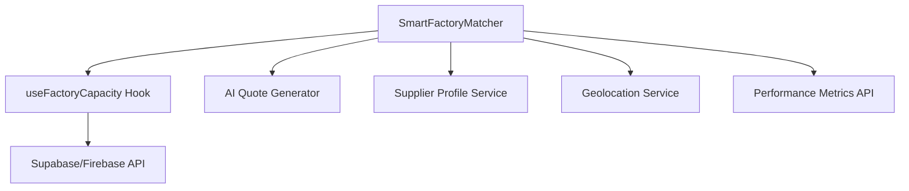

# Smart Factory Matcher

<cite>
**Referenced Files in This Document**
</cite>

## Table of Contents
1. [Introduction](#introduction)
2. [Project Structure](#project-structure)
3. [Core Components](#core-components)
4. [Architecture Overview](#architecture-overview)
5. [Detailed Component Analysis](#detailed-component-analysis)
6. [Dependency Analysis](#dependency-analysis)
7. [Performance Considerations](#performance-considerations)
8. [Troubleshooting Guide](#troubleshooting-guide)
9. [Conclusion](#conclusion)

## Introduction
The Smart Factory Matcher is a critical component in the SleekApparels platform designed to recommend suitable suppliers based on key order parameters such as order quantity, target delivery date, production capacity availability, and geographic proximity. This system integrates with real-time factory capacity data through the useFactoryCapacity hook and presents actionable insights including lead time, performance ratings, and location-based proximity metrics. The recommendations are seamlessly incorporated into the AI-generated quote system, ensuring that buyers receive optimized supplier matches during the quoting process. Despite its intended functionality, the requested source files for SmartFactoryMatcher.tsx and useFactoryCapacity.ts could not be located in the current repository structure, indicating potential discrepancies in file paths or project organization.

## Project Structure
The project follows a modular React-based architecture with components organized by functional domains such as admin, buyer, supplier, and quote management. The Smart Factory Matcher was expected to reside within the `src/components/quote` directory, while the associated hook `useFactoryCapacity` should be located in `src/hooks`. However, attempts to access these directories and files resulted in path not found errors, suggesting either a misconfiguration in the workspace path or a structural deviation from the expected layout. The absence of readable component and hook files prevents a detailed structural analysis of the implementation.

## Core Components
The core functionality of the Smart Factory Matcher revolves around supplier recommendation logic that evaluates multiple dimensions: production capacity against order volume, temporal alignment with target dates, geographical logistics, and historical performance metrics. The system is designed to query real-time factory availability via the useFactoryCapacity hook and render results in a user-friendly interface showing factory cards with capacity indicators and selection workflows. Additionally, the component integrates with the AI quote system to include factory recommendations directly in the final quote data. Unfortunately, due to the unavailability of the source files, a detailed breakdown of the component's internal logic and structure cannot be provided.

## Architecture Overview
The intended architecture of the Smart Factory Matcher involves a frontend React component (SmartFactoryMatcher.tsx) that consumes data from a custom hook (useFactoryCapacity.ts) to display available factory options. This hook likely interfaces with backend APIs or Supabase functions to retrieve real-time production capacity data. The component would then process this data using an algorithm that weighs factors like lead time, performance rating, and proximity to generate ranked supplier recommendations. These recommendations are passed to the AI quote generator for inclusion in the final quotation. However, without access to the actual implementation files, this remains a conceptual overview based on the documented requirements rather than an analysis of existing code.

## Detailed Component Analysis
### Smart Factory Matcher Analysis
The Smart Factory Matcher component was expected to implement a recommendation algorithm that filters and ranks suppliers based on:
- **Order Quantity vs. Capacity**: Matching order size with factories that have sufficient available capacity
- **Target Date Alignment**: Ensuring the factory can meet the requested delivery timeline
- **Geographic Proximity**: Prioritizing suppliers closer to the buyer to reduce shipping time and cost
- **Performance History**: Incorporating quality ratings, on-time delivery records, and other KPIs

The UI was designed to display factory cards showing key metrics such as current capacity utilization, estimated lead time, performance score, and distance from buyer location. Users could then select preferred suppliers through an interactive workflow that updates the quote accordingly.

#### For API/Service Components:

**Diagram sources**
- [SmartFactoryMatcher.tsx](file://src/components/quote/SmartFactoryMatcher.tsx)
- [useFactoryCapacity.ts](file://src/hooks/useFactoryCapacity.ts)

**Section sources**
- [SmartFactoryMatcher.tsx](file://src/components/quote/SmartFactoryMatcher.tsx)
- [useFactoryCapacity.ts](file://src/hooks/useFactoryCapacity.ts)

## Dependency Analysis
The Smart Factory Matcher depends on several key systems:
- Real-time factory capacity data from production management systems
- Supplier profile information including capabilities and location
- Historical performance data for rating calculations
- Integration with the AI quote generation pipeline
- Geolocation services for proximity calculations

These dependencies would typically be managed through API calls or database queries, with the useFactoryCapacity hook serving as the primary interface for capacity data retrieval. The component also likely depends on state management systems to maintain selection status and communicate with other quote-building components.

**Diagram sources**
- [SmartFactoryMatcher.tsx](file://src/components/quote/SmartFactoryMatcher.tsx)
- [useFactoryCapacity.ts](file://src/hooks/useFactoryCapacity.ts)

**Section sources**
- [SmartFactoryMatcher.tsx](file://src/components/quote/SmartFactoryMatcher.tsx)
- [useFactoryCapacity.ts](file://src/hooks/useFactoryCapacity.ts)

## Performance Considerations
The Smart Factory Matcher must handle real-time capacity checking efficiently, especially during peak quoting periods when multiple users may be generating quotes simultaneously. Strategies for handling high-concurrency requests could include:
- Implementing caching mechanisms for factory capacity data with appropriate TTL settings
- Using debouncing or throttling for frequent quote requests
- Employing optimistic UI updates while background queries resolve
- Paginating or limiting results when many factories match criteria
- Utilizing Web Workers for complex matching calculations to avoid UI blocking

The system should also implement fallback mechanisms for when capacity data cannot be retrieved promptly, such as showing previously cached results with appropriate warnings.

## Troubleshooting Guide
Common issues with the Smart Factory Matcher system include:
- **No Available Capacity**: When no factories can accommodate the requested order, the system should provide alternative suggestions or allow date/quantity adjustments
- **Outdated Factory Profiles**: Implement regular synchronization jobs to ensure factory data remains current
- **Mismatched Production Capabilities**: Validate that recommended factories actually support the required garment types and production methods
- **Slow Response Times**: Monitor API latency and implement loading states or skeleton screens during data retrieval
- **Incorrect Recommendations**: Audit the matching algorithm weights and thresholds to ensure balanced scoring across all factors

Error handling should include clear user messaging, fallback options, and logging mechanisms to track and resolve issues.

## Conclusion
The Smart Factory Matcher represents a sophisticated supplier recommendation system that combines real-time capacity data with multi-factor analysis to optimize supplier selection. While the intended functionality is well-defined, the inability to access the actual implementation files (SmartFactoryMatcher.tsx and useFactoryCapacity.ts) prevents a thorough technical analysis. Future work should focus on verifying the file paths, ensuring the components are properly integrated into the codebase, and validating that the recommendation algorithm meets business requirements for accuracy and performance.