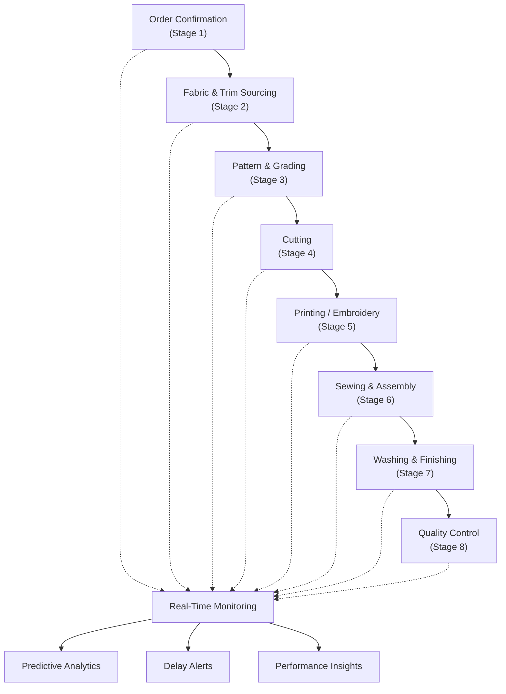
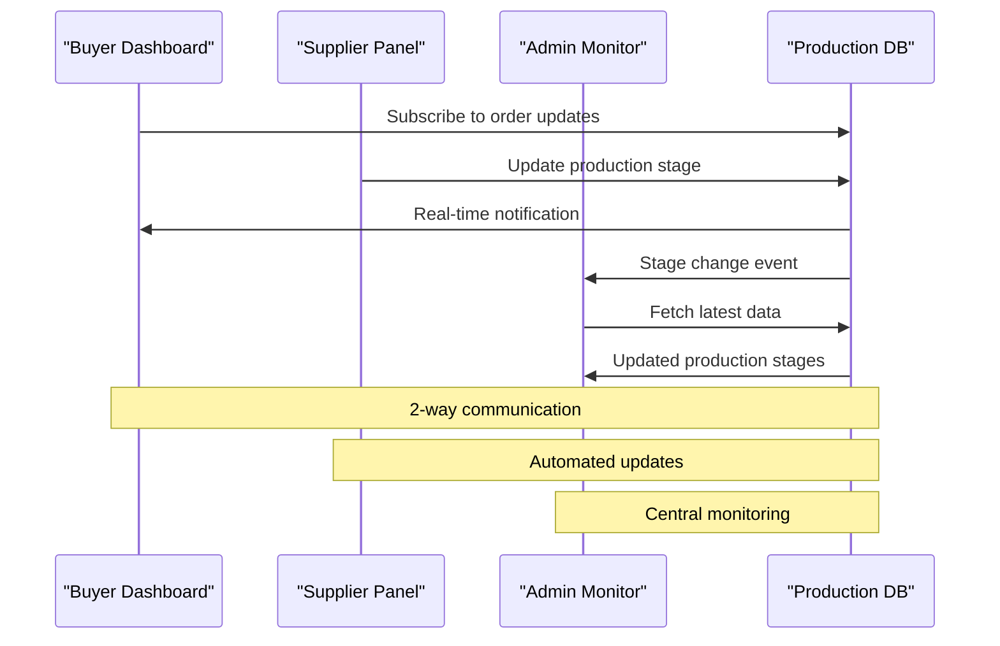
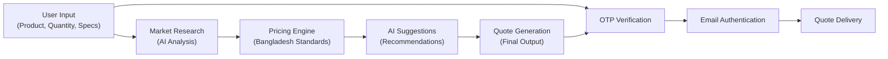
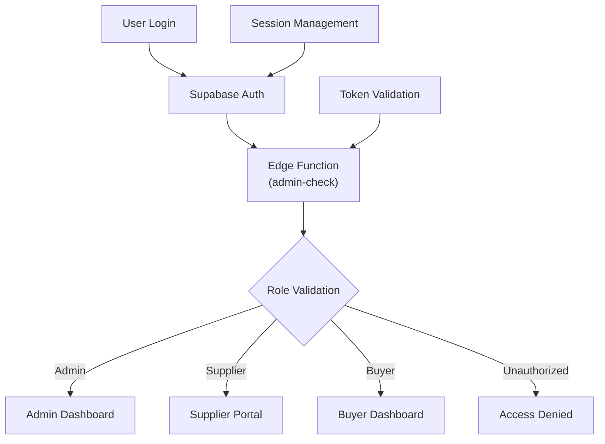
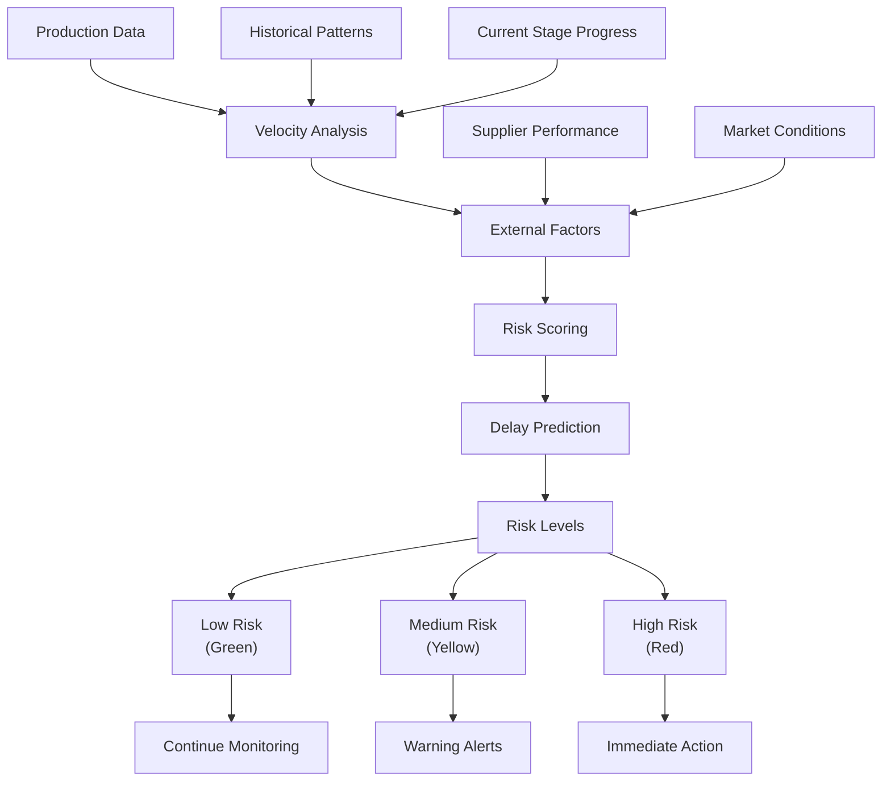
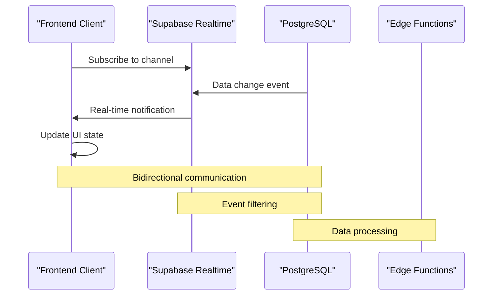
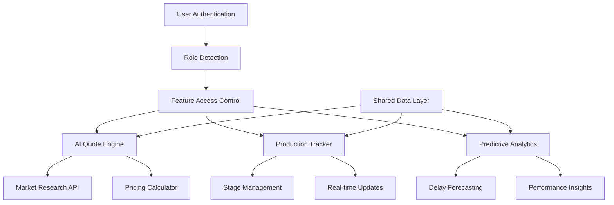

# Core Features

<cite>
**Referenced Files in This Document**
- [LoopTraceOrderTracking.tsx](file://src/components/buyer/LoopTraceOrderTracking.tsx)
- [ConversationalQuoteBuilder.tsx](file://src/components/quote/ConversationalQuoteBuilder.tsx)
- [AIQuoteGenerator.tsx](file://src/components/AIQuoteGenerator.tsx)
- [AIQuoteGeneratorWithOTP.tsx](file://src/components/AIQuoteGeneratorWithOTP.tsx)
- [LoopTraceForBuyers.tsx](file://src/pages/LoopTraceForBuyers.tsx)
- [ProductionStageCard.tsx](file://src/components/production/ProductionStageCard.tsx)
- [AdminStageMonitor.tsx](file://src/components/admin/AdminStageMonitor.tsx)
- [useAdminAuth.ts](file://src/hooks/useAdminAuth.ts)
- [PredictiveDelayAlert.tsx](file://src/components/production/PredictiveDelayAlert.tsx)
- [AIInsightsCard.tsx](file://src/components/AIInsightsCard.tsx)
- [aiQuote.ts](file://src/lib/api/aiQuote.ts)
- [MarketResearchInsights.tsx](file://src/components/quote/MarketResearchInsights.tsx)
- [useRealtimeMessages.ts](file://src/hooks/useRealtimeMessages.ts)
- [initialize-production-stages/index.ts](file://supabase/functions/initialize-production-stages/index.ts)
</cite>

## Table of Contents
1. [Introduction](#introduction)
2. [LoopTrace™ Production Tracking](#looptrace-production-tracking)
3. [AI Quote Generator](#ai-quote-generator)
4. [Role-Based Access Control](#role-based-access-control)
5. [Predictive Analytics](#predictive-analytics)
6. [Real-Time Updates](#real-time-updates)
7. [Performance Considerations](#performance-considerations)
8. [Common Issues and Solutions](#common-issues-and-solutions)
9. [Architecture Integration](#architecture-integration)
10. [Best Practices](#best-practices)

## Introduction

SleekApp v100's core features revolve around three primary pillars: LoopTrace™ Production Tracking, AI Quote Generation, and Role-Based Access Control. These features work synergistically to provide a comprehensive apparel sourcing and manufacturing platform that leverages AI, real-time data synchronization, and intelligent analytics to transform traditional manufacturing workflows.

The system implements an 8-stage manufacturing workflow that covers everything from order confirmation through final packaging, with real-time tracking and predictive analytics. The AI Quote Generator provides instant pricing with market research integration, while the RBAC system ensures secure access for buyers, suppliers, and administrators.

## LoopTrace™ Production Tracking

### 8-Stage Manufacturing Workflow

LoopTrace™ implements a comprehensive 8-stage manufacturing workflow designed specifically for apparel production in Bangladesh. This workflow ensures transparency and accountability throughout the entire production process.

**Diagram sources**
- [initialize-production-stages/index.ts](file://supabase/functions/initialize-production-stages/index.ts#L65-L102)
- [ProductionStageCard.tsx](file://src/components/production/ProductionStageCard.tsx#L27-L42)

### Real-Time Production Updates

The production tracking system provides live updates through WebSocket connections, ensuring stakeholders always have access to current production status.

**Diagram sources**
- [LoopTraceOrderTracking.tsx](file://src/components/buyer/LoopTraceOrderTracking.tsx#L58-L119)
- [useRealtimeMessages.ts](file://src/hooks/useRealtimeMessages.ts#L23-L57)

### Production Stage Management

Each production stage includes comprehensive tracking capabilities with progress indicators, photo evidence collection, and automated notifications.

**Section sources**
- [ProductionStageCard.tsx](file://src/components/production/ProductionStageCard.tsx#L52-L412)
- [AdminStageMonitor.tsx](file://src/components/admin/AdminStageMonitor.tsx#L12-L127)

## AI Quote Generator

### Conversational Builder Architecture

The AI Quote Generator features a sophisticated conversational interface that guides users through the quoting process while integrating market research and AI-powered pricing algorithms.

**Diagram sources**
- [ConversationalQuoteBuilder.tsx](file://src/components/quote/ConversationalQuoteBuilder.tsx#L43-L163)
- [AIQuoteGeneratorWithOTP.tsx](file://src/components/AIQuoteGeneratorWithOTP.tsx#L56-L345)

### Market Research Integration

The system integrates real-time market data from verified sources to provide accurate pricing benchmarks and competitive analysis.

**Section sources**
- [MarketResearchInsights.tsx](file://src/components/quote/MarketResearchInsights.tsx#L21-L140)
- [aiQuote.ts](file://src/lib/api/aiQuote.ts#L48-L84)

### OTP Verification System

For enhanced security and user authentication, the system implements OTP verification for quote generation and email communication.

**Section sources**
- [AIQuoteGeneratorWithOTP.tsx](file://src/components/AIQuoteGeneratorWithOTP.tsx#L175-L345)

## Role-Based Access Control

### User Permission Matrix

The RBAC system provides granular access control across three distinct user roles with appropriate permissions and dashboard access.

| Feature | Buyer | Supplier | Administrator |
|---------|-------|----------|---------------|
| **Order Tracking** | ✓ Full Access | ✓ Production View | ✓ System Monitor |
| **Quote Generation** | ✓ Self-service | ✓ Quote Submission | ✓ Quote Approval |
| **Production Management** | Limited | ✓ Stage Updates | ✓ System Config |
| **Financial Data** | ✓ Personal | ✓ Supplier Finance | ✓ Enterprise Analytics |
| **Supplier Directory** | ✓ Browse | ✓ Profile Management | ✓ Verification System |
| **Admin Functions** | ❌ | ❌ | ✓ User Management |

### Authentication Implementation

The authentication system uses Supabase for secure user management with role-based permissions and edge function validation.

**Diagram sources**
- [useAdminAuth.ts](file://src/hooks/useAdminAuth.ts#L5-L47)

**Section sources**
- [useAdminAuth.ts](file://src/hooks/useAdminAuth.ts#L14-L46)

## Predictive Analytics

### Delay Prediction System

The predictive analytics engine uses machine learning algorithms to forecast potential production delays and provide proactive recommendations.

**Diagram sources**
- [PredictiveDelayAlert.tsx](file://src/components/production/PredictiveDelayAlert.tsx#L35-L212)

### AI-Powered Insights

The system provides comprehensive AI-generated insights covering delivery predictions, quality forecasts, and strategic recommendations.

**Section sources**
- [PredictiveDelayAlert.tsx](file://src/components/production/PredictiveDelayAlert.tsx#L35-L212)
- [AIInsightsCard.tsx](file://src/components/AIInsightsCard.tsx#L35-L115)

## Real-Time Updates

### WebSocket Implementation

The platform utilizes Supabase Realtime for seamless, real-time data synchronization across all connected clients.

**Diagram sources**
- [useRealtimeMessages.ts](file://src/hooks/useRealtimeMessages.ts#L23-L57)
- [LoopTraceOrderTracking.tsx](file://src/components/buyer/LoopTraceOrderTracking.tsx#L58-L119)

### Notification System

The notification system provides timely alerts for production updates, quote approvals, and system events.

**Section sources**
- [useRealtimeMessages.ts](file://src/hooks/useRealtimeMessages.ts#L17-L61)

## Performance Considerations

### AI Processing Optimization

The system implements several optimization strategies for AI processing to ensure fast response times and cost efficiency.

| Optimization Strategy | Implementation | Benefit |
|----------------------|----------------|---------|
| **Model Selection** | Gemini 2.5 Flash for text-only | Reduced latency |
| **File Processing** | Max 20MB limit per file | Faster analysis |
| **Caching** | Session-based quote caching | Reduced API calls |
| **Batch Processing** | Grouped AI requests | Improved throughput |
| **Cost Tracking** | Real-time usage monitoring | Budget control |

### Real-Time Data Synchronization

The real-time system is optimized for minimal latency and maximum reliability through efficient WebSocket management and data filtering.

**Section sources**
- [aiQuote.ts](file://src/lib/api/aiQuote.ts#L48-L84)

## Common Issues and Solutions

### Production Tracking Issues

**Problem**: Stale production data not updating in real-time
**Solution**: Verify WebSocket connection and check database replication identity settings

**Problem**: Missing production stage notifications
**Solution**: Ensure proper channel subscription and event filtering configuration

### AI Quote Generation Problems

**Problem**: AI suggestions unavailable during peak load
**Solution**: Implement fallback mechanisms and cache previous successful responses

**Problem**: Market research timeouts
**Solution**: Set appropriate timeout limits and provide cached results as fallback

### Authentication Challenges

**Problem**: OTP verification failures
**Solution**: Implement rate limiting and provide clear error messaging

**Problem**: Role-based access denied
**Solution**: Verify edge function permissions and user role assignments

## Architecture Integration

### Component Relationships

The core features integrate seamlessly through shared data models and unified authentication:

**Diagram sources**
- [AIQuoteGeneratorWithOTP.tsx](file://src/components/AIQuoteGeneratorWithOTP.tsx#L56-L345)
- [LoopTraceOrderTracking.tsx](file://src/components/buyer/LoopTraceOrderTracking.tsx#L41-L120)

### Database Schema Integration

The system maintains normalized database schemas with appropriate indexing for optimal performance across all core features.

**Section sources**
- [initialize-production-stages/index.ts](file://supabase/functions/initialize-production-stages/index.ts#L65-L102)

## Best Practices

### Development Guidelines

1. **Real-time Updates**: Always implement proper cleanup for WebSocket subscriptions
2. **AI Integration**: Provide fallback mechanisms for AI service unavailability
3. **Security**: Validate all user inputs and implement proper rate limiting
4. **Performance**: Cache frequently accessed data and optimize API calls
5. **User Experience**: Provide clear feedback for long-running operations

### Deployment Considerations

1. **Scalability**: Configure appropriate database indexes for real-time queries
2. **Monitoring**: Implement comprehensive logging for AI processing costs
3. **Backup**: Ensure regular backups of production stage data
4. **Testing**: Validate real-time functionality across different network conditions

### Maintenance Procedures

1. **Regular Updates**: Keep AI models and market research databases current
2. **Performance Monitoring**: Track WebSocket connection health and API response times
3. **Security Audits**: Regularly review role-based access controls
4. **Data Integrity**: Validate production stage data consistency