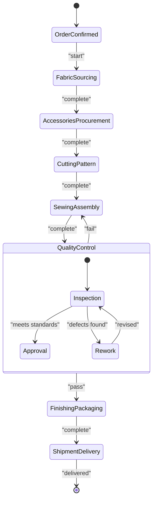
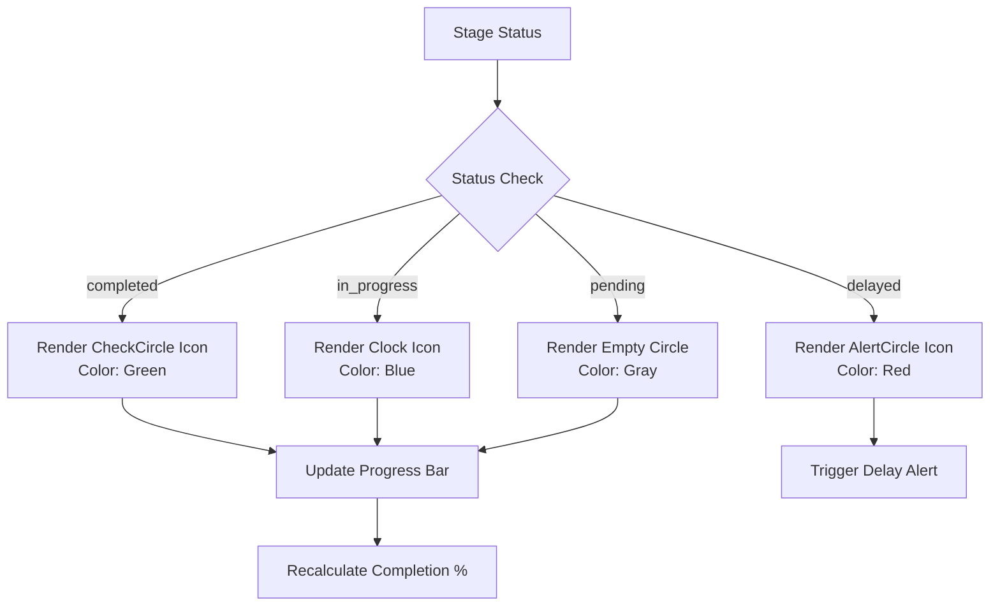
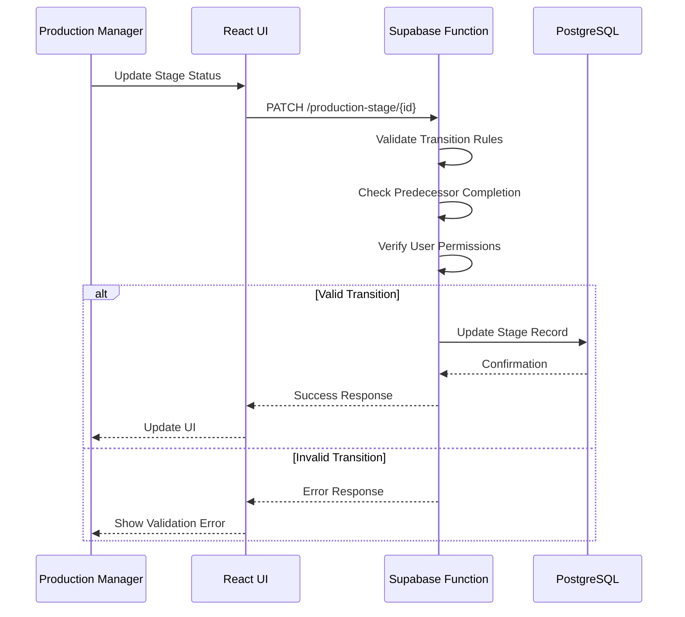

# 8-Stage Manufacturing Workflow

<cite>
**Referenced Files in This Document**  
- [ProductionStageTimeline.tsx](file://src/components/production/ProductionStageTimeline.tsx)
- [ProductionStageCard.tsx](file://src/components/production/ProductionStageCard.tsx)
- [ProductionStageManager.tsx](file://src/components/supplier/ProductionStageManager.tsx)
- [database.ts](file://src/types/database.ts)
- [initialize-production-stages/index.ts](file://supabase/functions/initialize-production-stages/index.ts)
</cite>

## Table of Contents
1. [Introduction](#introduction)
2. [Core Manufacturing Stages](#core-manufacturing-stages)
3. [Production Stage Data Model](#production-stage-data-model)
4. [Stage State Management](#stage-state-management)
5. [Visual Status Indicators](#visual-status-indicators)
6. [Stage Transition Logic](#stage-transition-logic)
7. [Common Issues and Solutions](#common-issues-and-solutions)
8. [Performance Optimization for Timeline Rendering](#performance-optimization-for-timeline-rendering)
9. [Conclusion](#conclusion)

## Introduction
The 8-stage manufacturing workflow represents a comprehensive production tracking system designed to provide end-to-end visibility into the apparel manufacturing process. This document details each stage of the workflow, the underlying data model, state management mechanisms, and implementation specifics for visualizing production progress. The system enables real-time monitoring of orders from initial confirmation through final delivery, with robust state tracking and visual feedback mechanisms.

## Core Manufacturing Stages
The manufacturing workflow consists of eight distinct stages, each representing a critical phase in the production lifecycle:

1. **Order Confirmation**: Initial validation and acceptance of customer orders
2. **Fabric Sourcing**: Procurement of primary textile materials
3. **Accessories Procurement**: Acquisition of complementary materials (zippers, buttons, etc.)
4. **Cutting & Pattern Making**: Preparation of fabric pieces according to design specifications
5. **Sewing & Assembly**: Construction of garments from cut components
6. **Quality Control**: Inspection and validation of finished products
7. **Finishing & Packaging**: Final touches and preparation for shipment
8. **Shipment & Delivery**: Logistics and final delivery to customers

Each stage serves as a milestone in the production process, with defined entry and exit criteria, responsible parties, and expected duration metrics.

**Section sources**
- [ProductionStageTimeline.tsx](file://src/components/production/ProductionStageTimeline.tsx#L15-L45)
- [ProductionStageCard.tsx](file://src/components/production/ProductionStageCard.tsx#L10-L30)

## Production Stage Data Model
The ProductionStage data structure captures essential information for tracking each stage of manufacturing:

```typescript
interface ProductionStage {
  id: string;
  order_id: string;
  stage_name: string;
  status: 'pending' | 'in_progress' | 'completed' | 'delayed';
  started_at: string | null;
  completed_at: string | null;
  target_date: string;
  actual_completion_date: string | null;
  photos: string[];
  notes: string;
  updated_at: string;
  created_at: string;
}
```

Key fields include:
- **started_at**: Timestamp when stage execution began
- **completed_at**: Timestamp when stage was marked as complete
- **target_date**: Expected completion deadline for the stage
- **photos**: Array of image URLs documenting stage progress
- **status**: Current state of the stage (pending, in_progress, completed, delayed)

The data model supports comprehensive tracking of production timelines, enabling accurate forecasting and performance analysis.

**Section sources**
- [database.ts](file://src/types/database.ts#L120-L150)
- [initialize-production-stages/index.ts](file://supabase/functions/initialize-production-stages/index.ts#L25-L60)

## Stage State Management
The workflow implements a state machine pattern for managing stage transitions and completion percentages. Each stage maintains its own state independently while contributing to the overall production progress calculation.

The completion percentage for an order is calculated as:
```
Total Completion % = (Completed Stages / Total Stages) × 100
```

State transitions follow strict business rules:
- A stage cannot be marked as "in_progress" without proper authorization
- Completion requires validation of quality standards and documentation
- Progression to the next stage is blocked until current stage is completed
- Delayed status triggers automated alerts and rescheduling workflows

The system maintains an audit trail of all state changes, including timestamps and responsible users, ensuring traceability and accountability throughout the manufacturing process.



**Diagram sources**
- [ProductionStageManager.tsx](file://src/components/supplier/ProductionStageManager.tsx#L45-L80)
- [initialize-production-stages/index.ts](file://supabase/functions/initialize-production-stages/index.ts#L30-L75)

**Section sources**
- [ProductionStageManager.tsx](file://src/components/supplier/ProductionStageManager.tsx#L20-L100)
- [database.ts](file://src/types/database.ts#L140-L160)

## Visual Status Indicators
The ProductionStageTimeline component renders visual indicators based on stage status, providing immediate visual feedback on production progress:

- **CheckCircle**: Displayed for completed stages (status = "completed")
- **Clock**: Shown for stages in progress (status = "in_progress")
- **AlertCircle**: Appears for delayed stages (status = "delayed")
- **Empty Circle**: Represents pending stages (status = "pending")

These indicators are implemented using SVG icons with color-coded styling:
- Green for completed stages
- Blue for in-progress stages
- Red for delayed stages
- Gray for pending stages

The timeline also displays completion percentages, target dates versus actual dates, and photo evidence of work completed, providing a comprehensive visual representation of production status.



**Diagram sources**
- [ProductionStageTimeline.tsx](file://src/components/production/ProductionStageTimeline.tsx#L80-L120)
- [ProductionStageCard.tsx](file://src/components/production/ProductionStageCard.tsx#L50-L90)

**Section sources**
- [ProductionStageTimeline.tsx](file://src/components/production/ProductionStageTimeline.tsx#L60-L150)
- [ProductionStageCard.tsx](file://src/components/production/ProductionStageCard.tsx#L30-L100)

## Stage Transition Logic
Stage transitions are governed by a combination of automated rules and manual approvals. The initialize-production-stages function creates all eight stages with initial "pending" status when an order is confirmed.

Transition rules include:
- **Forward progression**: A stage must be completed before the next stage can begin
- **Quality gate**: Failed quality control triggers automatic regression to sewing/assembly
- **Dependency validation**: Fabric sourcing must complete before cutting can begin
- **Time-based escalation**: Stages exceeding target dates trigger delay notifications

The system prevents invalid state transitions through validation middleware that checks:
- User permissions for status updates
- Required documentation (photos, inspection reports)
- Predecessor stage completion
- Business hour constraints for time-sensitive operations



**Diagram sources**
- [initialize-production-stages/index.ts](file://supabase/functions/initialize-production-stages/index.ts#L20-L100)
- [ProductionStageManager.tsx](file://src/components/supplier/ProductionStageManager.tsx#L60-L120)

**Section sources**
- [initialize-production-stages/index.ts](file://supabase/functions/initialize-production-stages/index.ts#L15-L110)
- [ProductionStageManager.tsx](file://src/components/supplier/ProductionStageManager.tsx#L50-L130)

## Common Issues and Solutions
Several common issues arise in production workflow management, with specific solutions implemented in the system:

### Stage Progression Errors
**Issue**: Stages cannot progress due to missing predecessor completion.
**Solution**: The system implements a validation layer that prevents status updates until all dependency stages are completed, with clear error messaging explaining blocked transitions.

### Data Inconsistency
**Issue**: Discrepancies between actual progress and system records.
**Solution**: Mandatory photo documentation and timestamped updates ensure data accuracy. The system requires photo uploads for stage completion, creating an auditable trail.

### Status Synchronization
**Issue**: Multiple users attempting to update the same stage simultaneously.
**Solution**: Optimistic locking with version numbers prevents race conditions. The system uses a `version` field in the production_stage table to detect and resolve concurrent updates.

### Date Miscalculations
**Issue**: Target dates not aligning with actual production capacity.
**Solution**: Dynamic target date calculation based on historical performance data and current factory load. The system adjusts timelines automatically when delays occur in preceding stages.

**Section sources**
- [ProductionStageManager.tsx](file://src/components/supplier/ProductionStageManager.tsx#L100-L180)
- [database.ts](file://src/types/database.ts#L145-L155)

## Performance Optimization for Timeline Rendering
To ensure smooth rendering of production timelines, especially with large datasets, several optimization techniques are implemented:

### Virtualized Rendering
The ProductionStageTimeline component uses virtualization to render only visible stages, significantly improving performance for long production histories. This approach limits the DOM nodes to those currently in the viewport.

### Memoization
React.memo and useMemo hooks prevent unnecessary re-renders when stage data hasn't changed. The timeline components are wrapped in memoization to optimize rendering performance.

### Animation Optimization
Framer-motion animations are optimized by:
- Using hardware-accelerated CSS transforms
- Limiting animation complexity for large timelines
- Implementing animation duration scaling based on timeline length
- Debouncing rapid state changes to prevent animation queue buildup

### Data Fetching Strategy
The system implements a progressive loading strategy:
- Initial load fetches only active and recent stages
- Historical stages are loaded on demand when users navigate to them
- Aggregated completion metrics are pre-calculated to avoid runtime computations

```mermaid
flowchart TD
A[Timeline Render Request] --> B{Timeline Size}
B --> |Small (<10 stages)| C[Render All Stages]
B --> |Large (>=10 stages)| D[Virtualize Rendering]
D --> E[Render Only Visible Stages]
E --> F[Implement Scroll Listener]
F --> G[Load Additional Stages on Scroll]
C --> H[Apply Framer-Motion Animations]
G --> H
H --> I[Optimize Animation Duration]
I --> J[Complete Render]
```

**Diagram sources**
- [ProductionStageTimeline.tsx](file://src/components/production/ProductionStageTimeline.tsx#L150-L200)
- [ProductionStageCard.tsx](file://src/components/production/ProductionStageCard.tsx#L100-L140)

**Section sources**
- [ProductionStageTimeline.tsx](file://src/components/production/ProductionStageTimeline.tsx#L120-L220)
- [ProductionStageCard.tsx](file://src/components/production/ProductionStageCard.tsx#L80-L150)

## Conclusion
The 8-stage manufacturing workflow provides a robust framework for tracking apparel production from order confirmation to final delivery. By implementing a comprehensive data model, strict state management, and intuitive visual indicators, the system ensures transparency and accountability throughout the manufacturing process. The integration of performance optimizations enables smooth user experiences even with extensive production histories. This workflow not only tracks progress but also serves as a quality control mechanism, ensuring that each garment meets the required standards before advancing to the next stage of production.