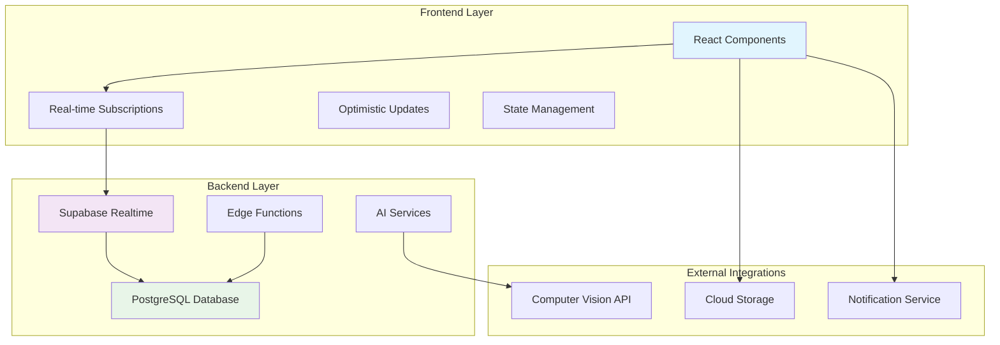
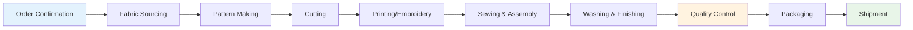
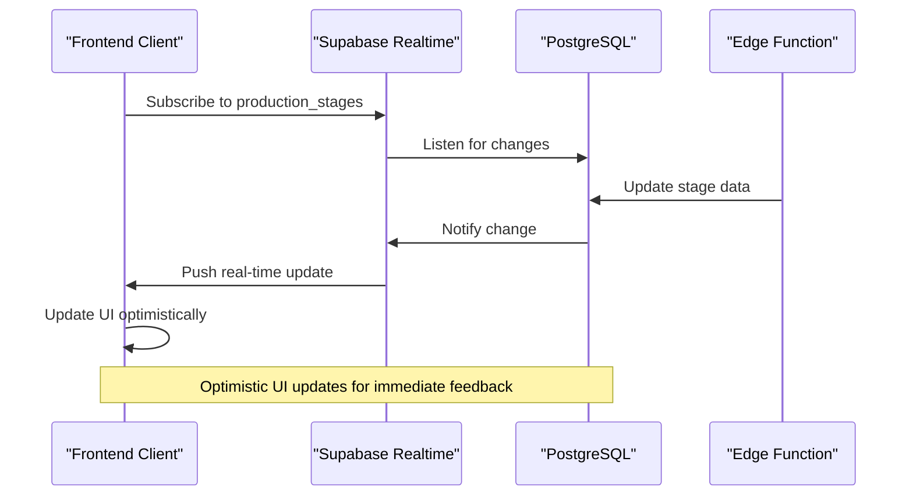
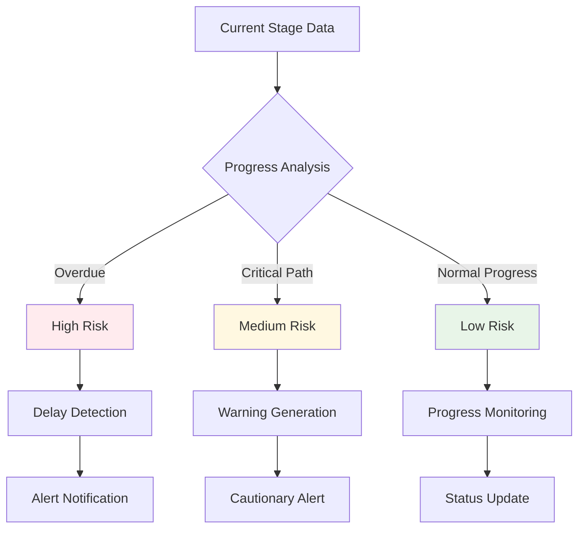
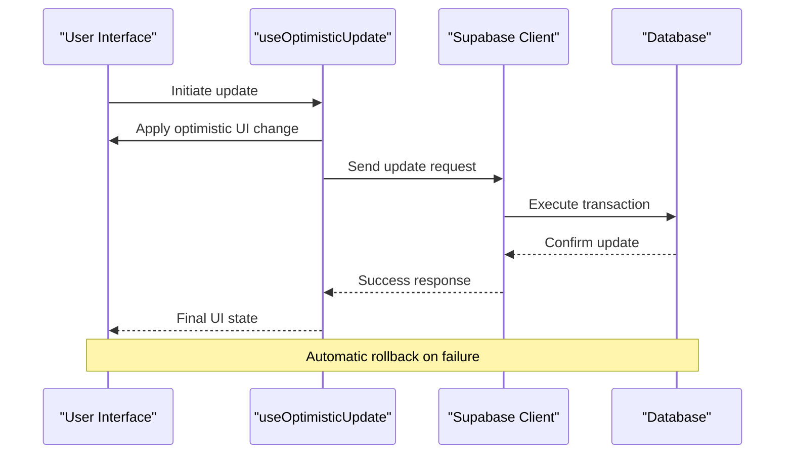
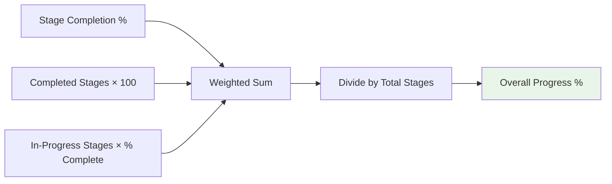

# LoopTrace™ Production Tracking

<cite>
**Referenced Files in This Document**
- [LoopTraceTimeline.tsx](file://src/components/modern/LoopTraceTimeline.tsx)
- [ProductionStageTimeline.tsx](file://src/components/production/ProductionStageTimeline.tsx)
- [PredictiveDelayAlert.tsx](file://src/components/production/PredictiveDelayAlert.tsx)
- [ProductionStageCard.tsx](file://src/components/production/ProductionStageCard.tsx)
- [AIQualityScanner.tsx](file://src/components/production/AIQualityScanner.tsx)
- [ProductionTracking.tsx](file://src/pages/ProductionTracking.tsx)
- [LoopTraceOrderTracking.tsx](file://src/components/buyer/LoopTraceOrderTracking.tsx)
- [useOptimisticUpdate.ts](file://src/hooks/useOptimisticUpdate.ts)
- [client.ts](file://src/integrations/supabase/client.ts)
- [types.ts](file://src/integrations/supabase/types.ts)
- [supabaseHelpers.ts](file://src/lib/supabaseHelpers.ts)
- [initialize-production-stages/index.ts](file://supabase/functions/initialize-production-stages/index.ts)
- [ProductionAnalytics.tsx](file://src/components/production/ProductionAnalytics.tsx)
</cite>

## Table of Contents
1. [Introduction](#introduction)
2. [System Architecture](#system-architecture)
3. [8-Stage Manufacturing Workflow](#8-stage-manufacturing-workflow)
4. [Real-Time Tracking Implementation](#real-time-tracking-implementation)
5. [AI-Powered Predictive Analytics](#ai-powered-predictive-analytics)
6. [Frontend-Backend Integration](#frontend-backend-integration)
7. [Visual Indicators and Progress Calculation](#visual-indicators-and-progress-calculation)
8. [Common Issues and Solutions](#common-issues-and-solutions)
9. [Performance Optimization](#performance-optimization)
10. [Implementation Examples](#implementation-examples)

## Introduction

LoopTrace™ Production Tracking is a comprehensive manufacturing visibility platform that provides real-time monitoring of production workflows across eight critical stages. Built on a modern React architecture with Supabase backend, it offers AI-powered predictive analytics, visual progress tracking, and seamless real-time synchronization for buyers, suppliers, and administrators.

The system transforms traditional production tracking into an interactive, data-driven experience that enables stakeholders to monitor progress, anticipate delays, and maintain quality standards throughout the manufacturing lifecycle.

## System Architecture

The LoopTrace™ Production Tracking system follows a modern full-stack architecture with clear separation of concerns:



**Diagram sources**
- [client.ts](file://src/integrations/supabase/client.ts#L1-L20)
- [useOptimisticUpdate.ts](file://src/hooks/useOptimisticUpdate.ts#L1-L176)

**Section sources**
- [ProductionTracking.tsx](file://src/pages/ProductionTracking.tsx#L1-L540)
- [client.ts](file://src/integrations/supabase/client.ts#L1-L20)

## 8-Stage Manufacturing Workflow

The LoopTrace™ system tracks production through eight essential manufacturing stages, each with specific indicators and quality controls:

### Stage 1: Order Confirmation
- **Duration**: 2 days
- **Activities**: Order review, confirmation, and preparation
- **Indicators**: Digital signature, approval status
- **Quality Checks**: Order accuracy verification

### Stage 2: Fabric & Trim Sourcing
- **Duration**: 10 days
- **Activities**: Material procurement, quality assessment
- **Indicators**: Purchase orders, material arrival
- **Quality Checks**: Fabric inspection, trim evaluation

### Stage 3: Pattern & Grading
- **Duration**: 5 days
- **Activities**: Pattern creation, size grading
- **Indicators**: Pattern approvals, grading completion
- **Quality Checks**: Pattern accuracy, fit testing

### Stage 4: Cutting & Pattern Making
- **Duration**: 3 days
- **Activities**: Fabric cutting, pattern application
- **Indicators**: Cutting completion, material utilization
- **Quality Checks**: Precision cutting, pattern alignment

### Stage 5: Printing / Embroidery
- **Duration**: 5 days
- **Activities**: Print application, embroidery execution
- **Indicators**: Print quality, embroidery precision
- **Quality Checks**: Color accuracy, stitch quality

### Stage 6: Sewing & Assembly
- **Duration**: 14 days
- **Activities**: Garment construction, assembly
- **Indicators**: Sewing progress, assembly completion
- **Quality Checks**: Stitch quality, seam strength

### Stage 7: Washing & Finishing
- **Duration**: 3 days
- **Activities**: Fabric treatment, finishing touches
- **Indicators**: Treatment completion, quality finish
- **Quality Checks**: Wash quality, final appearance

### Stage 8: Quality Control (Internal)
- **Duration**: 2 days
- **Activities**: Internal inspection, defect detection
- **Indicators**: Inspection results, defect reporting
- **Quality Checks**: Comprehensive quality assessment



**Diagram sources**
- [ProductionTracking.tsx](file://src/pages/ProductionTracking.tsx#L39-L48)

**Section sources**
- [ProductionTracking.tsx](file://src/pages/ProductionTracking.tsx#L39-L48)
- [initialize-production-stages/index.ts](file://supabase/functions/initialize-production-stages/index.ts#L65-L133)

## Real-Time Tracking Implementation

The real-time tracking system utilizes Supabase's built-in realtime capabilities to provide instant updates across all connected clients:

### Subscription Architecture



**Diagram sources**
- [LoopTraceOrderTracking.tsx](file://src/components/buyer/LoopTraceOrderTracking.tsx#L58-L119)
- [ProductionTracking.tsx](file://src/pages/ProductionTracking.tsx#L65-L90)

### Real-Time Data Flow

The system implements bidirectional real-time communication through PostgreSQL triggers and Supabase subscriptions:

1. **Data Insertion**: Edge functions create initial production stages
2. **State Changes**: Manual updates trigger PostgreSQL triggers
3. **Automatic Updates**: Triggers update timestamps and statuses
4. **Real-time Broadcasting**: Supabase broadcasts changes to subscribed clients
5. **UI Synchronization**: Frontend components receive and apply updates instantly

**Section sources**
- [LoopTraceOrderTracking.tsx](file://src/components/buyer/LoopTraceOrderTracking.tsx#L58-L119)
- [ProductionTracking.tsx](file://src/pages/ProductionTracking.tsx#L65-L90)
- [useOptimisticUpdate.ts](file://src/hooks/useOptimisticUpdate.ts#L79-L125)

## AI-Powered Predictive Analytics

The predictive delay alert system uses sophisticated algorithms to forecast potential production delays:

### Risk Assessment Model



**Diagram sources**
- [PredictiveDelayAlert.tsx](file://src/components/production/PredictiveDelayAlert.tsx#L43-L119)

### Delay Prediction Algorithm

The system employs multiple heuristics to assess production risks:

1. **Timeline Analysis**: Compares current progress against scheduled targets
2. **Velocity Tracking**: Monitors completion rates across stages
3. **Historical Patterns**: Learns from past production cycles
4. **External Factors**: Considers supply chain and operational variables

**Section sources**
- [PredictiveDelayAlert.tsx](file://src/components/production/PredictiveDelayAlert.tsx#L43-L119)
- [ProductionAnalytics.tsx](file://src/components/production/ProductionAnalytics.tsx#L30-L44)

## Frontend-Backend Integration

The integration between frontend components and Supabase backend ensures seamless data synchronization:

### Optimistic Update Pattern



**Diagram sources**
- [useOptimisticUpdate.ts](file://src/hooks/useOptimisticUpdate.ts#L79-L125)

### Data Type Safety

The system maintains strict type safety through Supabase-generated types:

| Component | Purpose | Type Coverage |
|-----------|---------|---------------|
| Supabase Client | Database operations | Full CRUD operations |
| Type Definitions | Runtime validation | 4,298+ database types |
| Helper Functions | Query abstraction | Type-safe queries |
| Hooks | State management | Optimistic updates |

**Section sources**
- [useOptimisticUpdate.ts](file://src/hooks/useOptimisticUpdate.ts#L79-L125)
- [types.ts](file://src/integrations/supabase/types.ts#L1-L800)
- [supabaseHelpers.ts](file://src/lib/supabaseHelpers.ts#L1-L376)

## Visual Indicators and Progress Calculation

### Progress Calculation Methodology

The system calculates overall progress using a weighted average approach:



**Diagram sources**
- [ProductionAnalytics.tsx](file://src/components/production/ProductionAnalytics.tsx#L31-L44)

### Visual Indicator System

| Status | Icon | Color | Animation |
|--------|------|-------|-----------|
| Pending | Circle | Gray | None |
| In Progress | Clock | Blue | Pulse |
| Completed | Checkmark | Green | Static |
| Delayed | Alert Triangle | Red | Pulse |

**Section sources**
- [LoopTraceTimeline.tsx](file://src/components/modern/LoopTraceTimeline.tsx#L129-L161)
- [ProductionStageCard.tsx](file://src/components/production/ProductionStageCard.tsx#L75-L87)
- [ProductionAnalytics.tsx](file://src/components/production/ProductionAnalytics.tsx#L31-L44)

## Common Issues and Solutions

### Delayed Stage Updates

**Problem**: Stages not updating in real-time despite manual updates.

**Solution**: Verify Supabase subscription connections and check for network interruptions.

```typescript
// Debug subscription status
const debugSubscription = () => {
  const channel = supabase.channel('test-channel')
    .on('postgres_changes', { /* filter conditions */ }, (payload) => {
      console.log('Received payload:', payload);
    })
    .subscribe();
    
  // Check connection state
  console.log('Channel state:', channel.state);
};
```

### Synchronization Conflicts

**Problem**: Multiple users updating the same stage simultaneously causing conflicts.

**Solution**: Implement optimistic updates with automatic conflict resolution.

**Section sources**
- [useOptimisticUpdate.ts](file://src/hooks/useOptimisticUpdate.ts#L79-L125)
- [ProductionStageCard.tsx](file://src/components/production/ProductionStageCard.tsx#L144-L175)

### Performance Issues with Large Datasets

**Problem**: Slow loading times with extensive production histories.

**Solution**: Implement pagination and lazy loading for historical data.

## Performance Optimization

### Real-Time Data Stream Optimization

1. **Selective Subscriptions**: Only subscribe to relevant order updates
2. **Debounced Updates**: Prevent excessive re-renders during rapid changes
3. **Efficient Filtering**: Use database-level filters for large datasets

### Memory Management

```typescript
// Efficient cleanup of subscriptions
useEffect(() => {
  const channel = supabase.channel(`production-${orderId}`)
    .on('postgres_changes', filter, callback)
    .subscribe();
    
  return () => {
    supabase.removeChannel(channel);
  };
}, [orderId]);
```

### Database Optimization

- **Indexing**: Proper indexes on frequently queried columns
- **Partitioning**: Large tables partitioned by date ranges
- **Materialized Views**: Pre-computed aggregates for analytics

**Section sources**
- [LoopTraceOrderTracking.tsx](file://src/components/buyer/LoopTraceOrderTracking.tsx#L112-L116)
- [ProductionTracking.tsx](file://src/pages/ProductionTracking.tsx#L65-L90)

## Implementation Examples

### Basic Production Stage Setup

```typescript
// Initialize production stages for a new order
const initializeProductionStages = async (orderId: string, productType: string) => {
  const { data, error } = await supabase.functions.invoke('initialize-production-stages', {
    body: { supplier_order_id: orderId, product_type: productType }
  });
  
  if (error) throw error;
  return data.stages;
};
```

### Real-Time Stage Monitoring

```typescript
// Monitor production stages in real-time
const setupStageMonitoring = (orderId: string) => {
  const channel = supabase
    .channel('production-stages')
    .on('postgres_changes', {
      event: '*',
      schema: 'public',
      table: 'production_stages',
      filter: `supplier_order_id=eq.${orderId}`
    }, (payload) => {
      // Handle stage updates
      handleStageUpdate(payload.new);
    })
    .subscribe();
};
```

### Progress Calculation Example

```typescript
// Calculate overall production progress
const calculateProgress = (stages: ProductionStage[]) => {
  if (stages.length === 0) return 0;
  
  const completedStages = stages.filter(s => s.status === 'completed').length;
  const inProgressStages = stages.filter(s => s.status === 'in_progress');
  
  let totalProgress = completedStages * 100;
  
  inProgressStages.forEach(stage => {
    totalProgress += (stage.completion_percentage || 0);
  });
  
  return Math.round(totalProgress / 8); // 8 total stages
};
```

**Section sources**
- [initialize-production-stages/index.ts](file://supabase/functions/initialize-production-stages/index.ts#L133-L147)
- [LoopTraceOrderTracking.tsx](file://src/components/buyer/LoopTraceOrderTracking.tsx#L58-L119)
- [ProductionAnalytics.tsx](file://src/components/production/ProductionAnalytics.tsx#L31-L44)