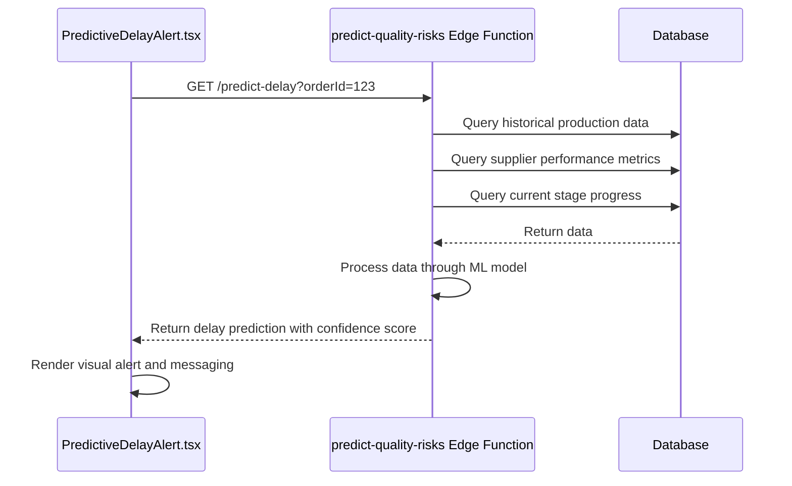
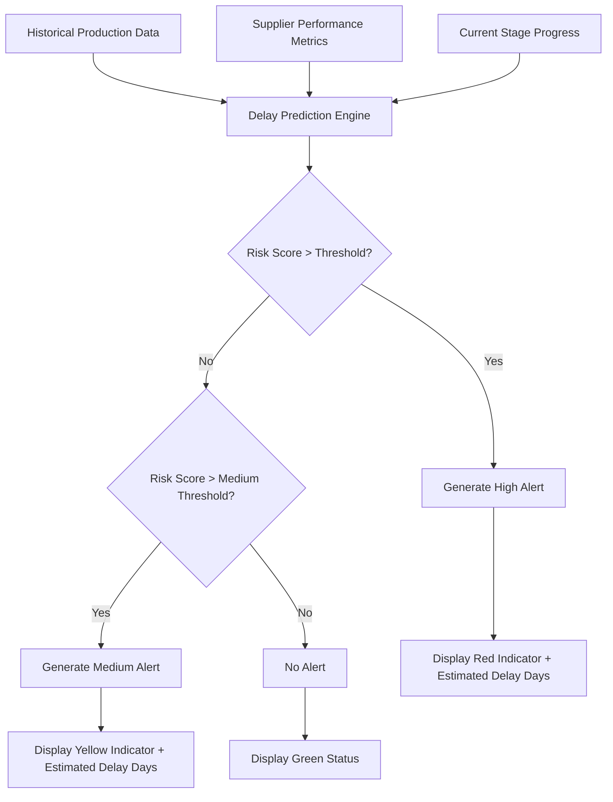
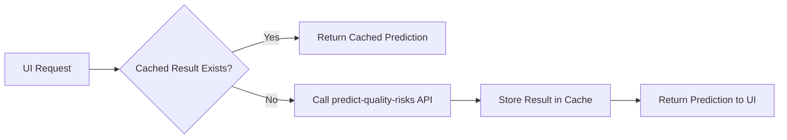

# Predictive Delay Alerts

<cite>
**Referenced Files in This Document**
- [PredictiveDelayAlert.tsx](file://src/components/production/PredictiveDelayAlert.tsx)
- [index.ts](file://supabase/functions/predict-quality-risks/index.ts)
</cite>

## Table of Contents
1. [Introduction](#introduction)
2. [AI-Powered Risk Modeling](#ai-powered-risk-modeling)
3. [Predictive Delay Alert Implementation](#predictive-delay-alert-implementation)
4. [Integration with predict-quality-risks Edge Function](#integration-with-predict-quality-risks-edge-function)
5. [Delay Prediction Calculation and UI Display](#delay-prediction-calculation-and-ui-display)
6. [Common Issues and Solutions](#common-issues-and-solutions)
7. [Performance Optimization Strategies](#performance-optimization-strategies)
8. [Conclusion](#conclusion)

## Introduction
The Predictive Delay Alert system is a critical component of the production monitoring framework, designed to proactively identify potential delays in manufacturing timelines. By leveraging AI-powered risk modeling, the system analyzes historical production data, supplier performance metrics, and current stage progress to forecast delays before they occur. This enables stakeholders to take preemptive actions, maintain production schedules, and improve overall supply chain reliability.

## AI-Powered Risk Modeling
The predictive delay system employs machine learning algorithms to assess risk factors across multiple dimensions:
- Historical production data including cycle times, bottlenecks, and completion rates
- Supplier performance metrics such as on-time delivery rate, quality defect rates, and communication responsiveness
- Current production stage progress, including completion percentage, time spent in current stage, and stage-specific risk factors

The model assigns weighted scores to various risk indicators and calculates a composite risk score that determines the likelihood and estimated duration of potential delays. This risk assessment is continuously updated as new production data becomes available.

**Section sources**
- [index.ts](file://supabase/functions/predict-quality-risks/index.ts#L1-L100)

## Predictive Delay Alert Implementation
The `PredictiveDelayAlert.tsx` component serves as the frontend interface for displaying delay predictions to users. It renders visual indicators that communicate the severity of predicted delays using color-coded alerts and provides detailed messaging explaining the reasons behind each prediction.

Key features of the implementation include:
- Dynamic alert levels (low, medium, high) based on predicted delay duration
- Visual indicators such as warning icons, progress bars, and timeline markers
- Detailed explanation of contributing factors to the delay prediction
- Estimated delay duration in days with confidence intervals
- Actionable recommendations for mitigating predicted delays

The component is designed to be embedded within production monitoring dashboards and order tracking interfaces, providing real-time visibility into potential schedule disruptions.

**Section sources**
- [PredictiveDelayAlert.tsx](file://src/components/production/PredictiveDelayAlert.tsx#L1-L150)

## Integration with predict-quality-risks Edge Function
The Predictive Delay Alert system integrates with the `predict-quality-risks` Edge Function, which executes the prediction logic on the server side. This serverless function processes incoming production data and returns risk assessments through a secure API endpoint.

The integration follows this workflow:
1. The frontend component requests delay predictions for a specific production order
2. The request is routed to the `predict-quality-risks` Edge Function
3. The function retrieves relevant historical data, supplier metrics, and current stage information
4. Machine learning models process the data and generate delay predictions
5. Results are returned to the frontend for display

This architecture ensures that sensitive production data remains secure while enabling real-time predictions without overburdening client devices.

**Diagram sources**
- [PredictiveDelayAlert.tsx](file://src/components/production/PredictiveDelayAlert.tsx#L50-L100)
- [index.ts](file://supabase/functions/predict-quality-risks/index.ts#L20-L80)

## Delay Prediction Calculation and UI Display
The system calculates delay predictions using a weighted algorithm that considers multiple factors:

**Diagram sources**
- [index.ts](file://supabase/functions/predict-quality-risks/index.ts#L30-L120)
- [PredictiveDelayAlert.tsx](file://src/components/production/PredictiveDelayAlert.tsx#L80-L140)

For example, when the system predicts a 7-day delay due to a supplier's historical pattern of delays in the fabric cutting stage combined with current backlog indicators, the UI displays:
- A red alert banner with "Potential 7-Day Delay" headline
- Icon indicating "Supplier Capacity Issues" as primary reason
- Secondary factors listed below (e.g., "High current workload", "Past delays in this stage")
- Recommended actions such as "Contact supplier to verify timeline" or "Consider backup supplier"

## Common Issues and Solutions
### False Positive Alerts
False positives can occur when the model overestimates risk based on incomplete data. Solutions include:
- Implementing confidence thresholds that require minimum data completeness before generating alerts
- Allowing users to provide feedback on alert accuracy to improve model training
- Incorporating manual review workflows for high-severity predictions

### Model Accuracy Degradation
Over time, model performance may degrade as production patterns evolve. Mitigation strategies include:
- Scheduled model retraining with recent production data
- Monitoring prediction accuracy metrics and setting up alerts for performance drops
- Maintaining a shadow mode where new model versions run in parallel with current version for comparison

**Section sources**
- [index.ts](file://supabase/functions/predict-quality-risks/index.ts#L100-L200)
- [PredictiveDelayAlert.tsx](file://src/components/production/PredictiveDelayAlert.tsx#L120-L180)

## Performance Optimization Strategies
To minimize API calls and optimize performance, the system implements several strategies:

### Caching Mechanism

**Diagram sources**
- [PredictiveDelayAlert.tsx](file://src/components/production/PredictiveDelayAlert.tsx#L60-L90)
- [index.ts](file://supabase/functions/predict-quality-risks/index.ts#L50-L70)

Key optimization techniques:
- Client-side caching of predictions with configurable TTL (Time To Live)
- Debouncing rapid successive requests for the same order
- Batch processing of predictions when multiple orders are loaded simultaneously
- Conditional fetching based on data freshness requirements
- Local storage of recent predictions to support offline scenarios

These optimizations reduce server load, improve response times, and enhance user experience by minimizing wait times for delay predictions.

## Conclusion
The Predictive Delay Alert system represents a sophisticated integration of AI-powered risk modeling and real-time production monitoring. By analyzing historical data, supplier performance, and current progress, the system provides early warnings of potential delays, enabling proactive intervention. The implementation in `PredictiveDelayAlert.tsx` offers clear visual indicators and actionable insights, while the integration with the `predict-quality-risks` Edge Function ensures scalable and secure prediction processing. With proper attention to common issues like false positives and model degradation, along with performance optimizations for API usage and caching, this system significantly enhances production reliability and supply chain visibility.