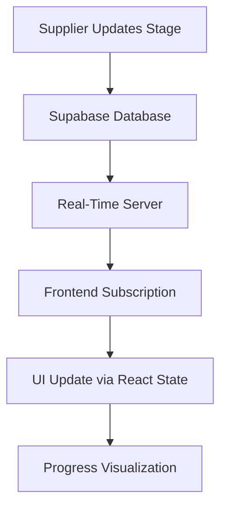
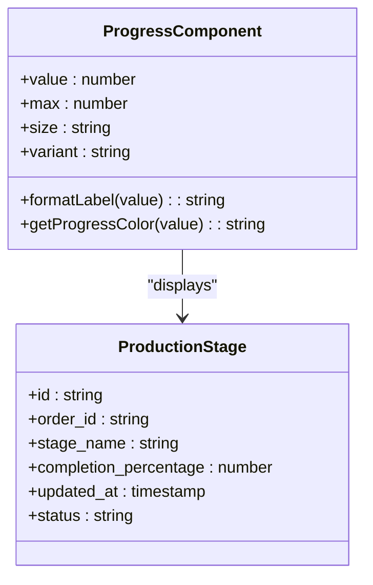
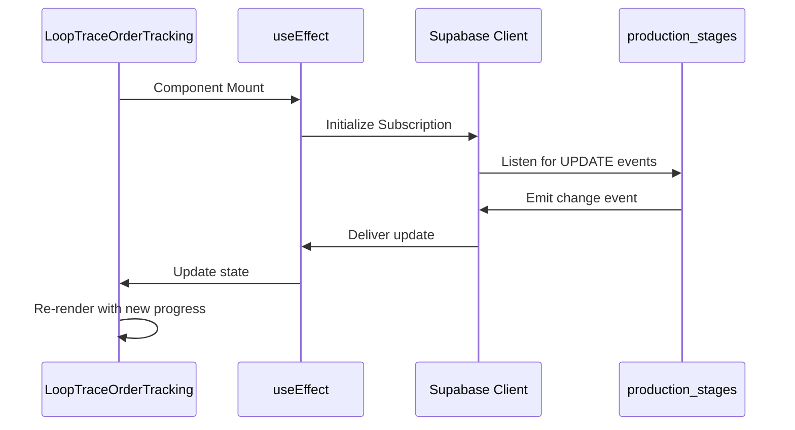

# Real-Time Stage Updates

<cite>
**Referenced Files in This Document**  
- [LoopTraceOrderTracking.tsx](file://src/components/buyer/LoopTraceOrderTracking.tsx)
- [progress.tsx](file://src/components/ui/progress.tsx)
- [client.ts](file://src/integrations/supabase/client.ts)
- [useRealtimeMessages.ts](file://src/hooks/useRealtimeMessages.ts)
</cite>

## Table of Contents
1. [Introduction](#introduction)
2. [Real-Time Synchronization Architecture](#real-time-synchronization-architecture)
3. [Supabase Real-Time Integration](#supabase-real-time-integration)
4. [Progress Calculation and Display](#progress-calculation-and-display)
5. [Frontend Implementation in LoopTraceOrderTracking](#frontend-implementation-in-looptraceordertracking)
6. [Error Handling and Connection Management](#error-handling-and-connection-management)
7. [Common Issues and Solutions](#common-issues-and-solutions)
8. [Performance Optimization Strategies](#performance-optimization-strategies)
9. [Conclusion](#conclusion)

## Introduction
The real-time stage updates system enables seamless synchronization between frontend components and the Supabase backend, providing buyers with live visibility into production progress. This document details the implementation of real-time updates using Supabase's subscription capabilities, focusing on how progress is calculated from `completion_percentage` data and rendered via the Progress component. The system ensures stakeholders receive immediate feedback on order status changes, enhancing transparency and trust in the production process.

## Real-Time Synchronization Architecture
The architecture leverages Supabase's real-time database capabilities to push updates from the `production_stages` table directly to frontend clients. When a supplier updates a production stage, the change is instantly broadcast to all subscribed clients without requiring manual refresh. This event-driven model reduces latency and improves user experience by eliminating polling mechanisms.

The system follows a publish-subscribe pattern where:
- The backend emits row-level changes (INSERT, UPDATE, DELETE) from the `production_stages` table
- Frontend components subscribe to relevant records based on order ID
- Updates are processed and reflected in the UI through React's reactivity model

**Diagram sources**
- [client.ts](file://src/integrations/supabase/client.ts#L1-L30)
- [LoopTraceOrderTracking.tsx](file://src/components/buyer/LoopTraceOrderTracking.tsx#L45-L80)

**Section sources**
- [client.ts](file://src/integrations/supabase/client.ts#L1-L50)
- [LoopTraceOrderTracking.tsx](file://src/components/buyer/LoopTraceOrderTracking.tsx#L1-L100)

## Supabase Real-Time Integration
The integration utilizes Supabase's WebSocket-based real-time engine to establish persistent connections between the frontend and database. The `client.ts` file configures the Supabase client with real-time capabilities enabled, allowing subscriptions to database changes.

Key configuration aspects include:
- Enabling the real-time protocol over secure WebSocket connections
- Setting appropriate reconnection intervals and retry policies
- Configuring channel presence for connection state awareness
- Implementing authentication token refresh for long-lived sessions

Subscriptions are created using Supabase's `.on()` method, which listens for specific event types on targeted database tables. The subscription filters ensure clients only receive relevant updates, reducing bandwidth usage and improving performance.

**Section sources**
- [client.ts](file://src/integrations/supabase/client.ts#L15-L60)

## Progress Calculation and Display
Progress is calculated based on the `completion_percentage` field in the `production_stages` table, which represents the current stage's completion as a numeric value between 0 and 100. The system aggregates data across multiple stages to compute overall order progress.

The Progress component renders this data as a visual indicator, typically a horizontal bar or circular progress ring. The component accepts the completion percentage as a prop and animates the transition between states for smooth visual feedback.

Calculation logic includes:
- Weighted averaging of stage completion percentages
- Handling of incomplete or missing stage data
- Validation of percentage values to prevent display anomalies
- Formatting for accessibility and internationalization

**Diagram sources**
- [progress.tsx](file://src/components/ui/progress.tsx#L10-L40)
- [LoopTraceOrderTracking.tsx](file://src/components/buyer/LoopTraceOrderTracking.tsx#L30-L50)

**Section sources**
- [progress.tsx](file://src/components/ui/progress.tsx#L1-L75)
- [LoopTraceOrderTracking.tsx](file://src/components/buyer/LoopTraceOrderTracking.tsx#L20-L60)

## Frontend Implementation in LoopTraceOrderTracking
The `LoopTraceOrderTracking.tsx` component implements real-time updates through a carefully designed `useEffect` hook that establishes and manages the Supabase subscription. Upon component mount, the hook creates a subscription to the `production_stages` table filtered by the current order ID.

The implementation follows these key steps:
1. Initialize the Supabase client and authenticate the session
2. Create a real-time channel for the specific order's production stages
3. Subscribe to UPDATE events on the filtered dataset
4. Update React state when new data arrives
5. Clean up the subscription on component unmount

The useEffect hook includes dependency management to prevent memory leaks and unnecessary re-subscriptions. It also handles initial data loading and subsequent real-time updates in a unified state management pattern.

**Diagram sources**
- [LoopTraceOrderTracking.tsx](file://src/components/buyer/LoopTraceOrderTracking.tsx#L45-L90)
- [client.ts](file://src/integrations/supabase/client.ts#L20-L40)

**Section sources**
- [LoopTraceOrderTracking.tsx](file://src/components/buyer/LoopTraceOrderTracking.tsx#L40-L120)

## Error Handling and Connection Management
The system implements robust error handling for real-time connection issues, including network interruptions, authentication failures, and server-side errors. The subscription logic includes automatic reconnection mechanisms with exponential backoff to handle transient failures gracefully.

Error handling strategies include:
- Try-catch blocks around subscription initialization
- Event listeners for connection state changes
- Local caching of last known good state
- Visual indicators for connection status
- Graceful degradation when real-time is unavailable

The implementation uses Supabase's built-in health checks and connection monitoring to detect and respond to issues proactively. When a disconnection occurs, the system attempts to re-establish the connection while maintaining UI responsiveness.

**Section sources**
- [useRealtimeMessages.ts](file://src/hooks/useRealtimeMessages.ts#L15-L80)
- [client.ts](file://src/integrations/supabase/client.ts#L30-L70)

## Common Issues and Solutions
### Delayed Updates
**Problem**: Real-time updates appear with noticeable latency.
**Solution**: Verify network connectivity, check Supabase dashboard for service status, and ensure proper indexing on the `production_stages` table.

### Subscription Failures
**Problem**: Subscriptions fail to establish or drop unexpectedly.
**Solution**: Confirm authentication tokens are valid, check row-level security policies, and validate channel name formatting.

### Duplicate Events
**Problem**: The same update is received multiple times.
**Solution**: Implement client-side deduplication using event timestamps and IDs.

### Memory Leaks
**Problem**: Unsubscribed components continue receiving updates.
**Solution**: Ensure proper cleanup in useEffect return functions and verify subscription removal.

**Section sources**
- [LoopTraceOrderTracking.tsx](file://src/components/buyer/LoopTraceOrderTracking.tsx#L80-L120)
- [useRealtimeMessages.ts](file://src/hooks/useRealtimeMessages.ts#L50-L100)

## Performance Optimization Strategies
To efficiently manage multiple real-time subscriptions, the system employs several optimization techniques:

### Connection Pooling
Reuse existing Supabase client instances across components to minimize WebSocket connections.

### Selective Subscription
Subscribe only to necessary tables and columns using `.select()` and `.filter()` methods.

### Debounced Updates
Implement throttling for rapid-fire updates to prevent UI thrashing.

### Lazy Loading
Establish subscriptions only when components are visible in the viewport.

### Batch Processing
Group multiple updates received within a short timeframe for single re-render.

### Memory Management
Properly unsubscribe from channels when components unmount to prevent memory leaks.

These optimizations ensure the application remains responsive even with numerous concurrent subscriptions.

**Section sources**
- [useRealtimeMessages.ts](file://src/hooks/useRealtimeMessages.ts#L20-L90)
- [client.ts](file://src/integrations/supabase/client.ts#L40-L80)

## Conclusion
The real-time stage updates system provides a robust foundation for live production tracking, leveraging Supabase's real-time capabilities to deliver immediate feedback to users. By combining efficient subscription management, proper error handling, and performance optimizations, the system ensures reliable and responsive updates. The integration between frontend components and backend data through the Progress component creates an intuitive visualization of order progress, enhancing the overall user experience in the LoopTrace order tracking workflow.