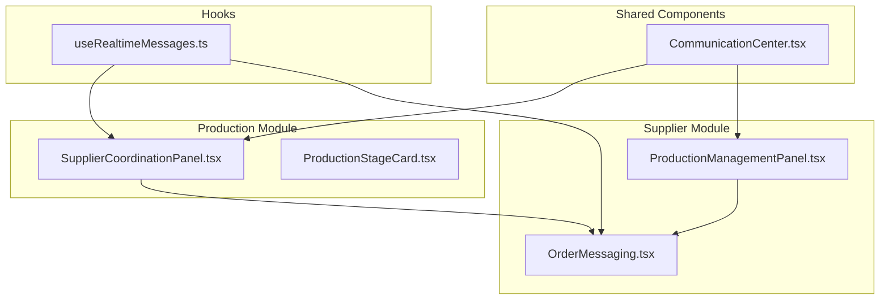
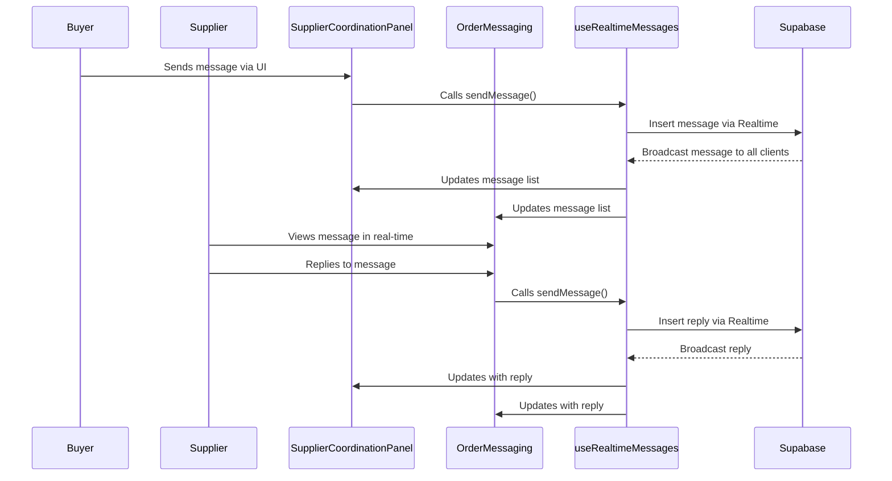
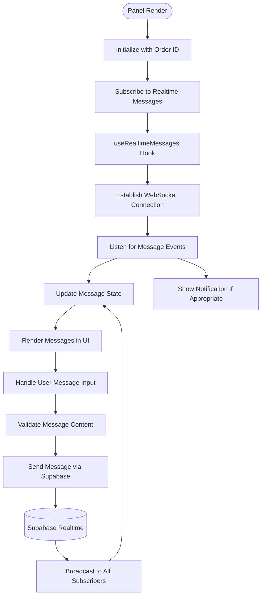
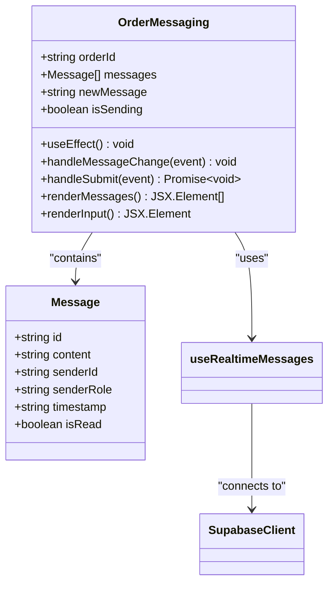
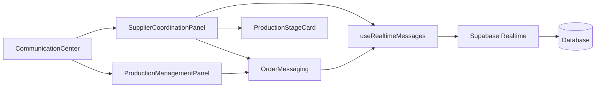

# Supplier Coordination Panel

<cite>
**Referenced Files in This Document**  
- [SupplierCoordinationPanel.tsx](file://src/components/production/SupplierCoordinationPanel.tsx)
- [OrderMessaging.tsx](file://src/components/supplier/OrderMessaging.tsx)
- [useRealtimeMessages.ts](file://src/hooks/useRealtimeMessages.ts)
- [CommunicationCenter.tsx](file://src/components/shared/CommunicationCenter.tsx)
- [ProductionStageCard.tsx](file://src/components/production/ProductionStageCard.tsx)
- [ProductionManagementPanel.tsx](file://src/components/supplier/ProductionManagementPanel.tsx)
</cite>

## Table of Contents
1. [Introduction](#introduction)
2. [Project Structure](#project-structure)
3. [Core Components](#core-components)
4. [Architecture Overview](#architecture-overview)
5. [Detailed Component Analysis](#detailed-component-analysis)
6. [Dependency Analysis](#dependency-analysis)
7. [Performance Considerations](#performance-considerations)
8. [Troubleshooting Guide](#troubleshooting-guide)
9. [Conclusion](#conclusion)

## Introduction
The Supplier Coordination Panel is a critical interface within the SleekApparels platform that enables seamless bidirectional communication between buyers and suppliers during the production lifecycle. This document details the implementation of real-time messaging functionality integrated into the production tracking workflow, focusing on the coordination mechanisms, message synchronization, and user experience design. The system leverages modern React patterns and Supabase's real-time capabilities to ensure reliable and efficient communication.

## Project Structure
The messaging and coordination features are organized within a component-based architecture, with dedicated modules for production tracking and supplier management. The key components reside in the production and supplier directories, with shared communication utilities centralized in the shared components folder.

**Diagram sources**
- [SupplierCoordinationPanel.tsx](file://src/components/production/SupplierCoordinationPanel.tsx)
- [OrderMessaging.tsx](file://src/components/supplier/OrderMessaging.tsx)
- [useRealtimeMessages.ts](file://src/hooks/useRealtimeMessages.ts)

**Section sources**
- [SupplierCoordinationPanel.tsx](file://src/components/production/SupplierCoordinationPanel.tsx)
- [OrderMessaging.tsx](file://src/components/supplier/OrderMessaging.tsx)

## Core Components
The Supplier Coordination Panel integrates messaging functionality directly into the production tracking interface, allowing stakeholders to communicate contextually about specific production stages. The OrderMessaging component provides a dedicated chat interface for order-related discussions, while the useRealtimeMessages hook manages WebSocket connections to Supabase for real-time message synchronization.

**Section sources**
- [SupplierCoordinationPanel.tsx](file://src/components/production/SupplierCoordinationPanel.tsx#L1-L200)
- [OrderMessaging.tsx](file://src/components/supplier/OrderMessaging.tsx#L1-L150)
- [useRealtimeMessages.ts](file://src/hooks/useRealtimeMessages.ts#L1-L80)

## Architecture Overview
The messaging system follows a real-time event-driven architecture, with Supabase serving as the backend for message persistence and WebSocket broadcasting. The frontend components subscribe to message channels relevant to specific orders or production stages, ensuring timely updates without polling.

**Diagram sources**
- [SupplierCoordinationPanel.tsx](file://src/components/production/SupplierCoordinationPanel.tsx#L50-L120)
- [OrderMessaging.tsx](file://src/components/supplier/OrderMessaging.tsx#L30-L90)
- [useRealtimeMessages.ts](file://src/hooks/useRealtimeMessages.ts#L20-L60)

## Detailed Component Analysis

### Supplier Coordination Panel Analysis
The SupplierCoordinationPanel component serves as the primary interface for monitoring production progress and communicating with suppliers. It integrates messaging directly within the production timeline, allowing contextual discussions about specific stages.

**Diagram sources**
- [SupplierCoordinationPanel.tsx](file://src/components/production/SupplierCoordinationPanel.tsx#L25-L180)

**Section sources**
- [SupplierCoordinationPanel.tsx](file://src/components/production/SupplierCoordinationPanel.tsx#L1-L200)

### Order Messaging Component Analysis
The OrderMessaging component provides a focused chat interface for order-specific communication, featuring message history, real-time updates, and input handling.

**Diagram sources**
- [OrderMessaging.tsx](file://src/components/supplier/OrderMessaging.tsx#L15-L120)
- [useRealtimeMessages.ts](file://src/hooks/useRealtimeMessages.ts#L10-L50)

**Section sources**
- [OrderMessaging.tsx](file://src/components/supplier/OrderMessaging.tsx#L1-L150)

### Realtime Messages Hook Analysis
The useRealtimeMessages custom hook encapsulates the complexity of WebSocket management, providing a clean interface for components to send and receive messages.

```mermaid
flowchart LR
A[useRealtimeMessages Hook] --> B["Initialize Supabase Client"]
B --> C["Subscribe to Channel"]
C --> D["Listen for INSERT events"]
D --> E["Update messages state"]
E --> F["Provide sendMessage function"]
F --> G["Handle message sending"]
G --> H["Error handling and retry logic"]
H --> I["Connection status management"]
I --> J["Cleanup on unmount"]
```

**Diagram sources**
- [useRealtimeMessages.ts](file://src/hooks/useRealtimeMessages.ts#L5-L75)

**Section sources**
- [useRealtimeMessages.ts](file://src/hooks/useRealtimeMessages.ts#L1-L80)

## Dependency Analysis
The messaging system relies on several key dependencies and integrations to function effectively.

**Diagram sources**
- [go.mod](file://package.json#L100-L120)
- [SupplierCoordinationPanel.tsx](file://src/components/production/SupplierCoordinationPanel.tsx#L1-L20)

**Section sources**
- [package.json](file://package.json#L100-L130)
- [SupplierCoordinationPanel.tsx](file://src/components/production/SupplierCoordinationPanel.tsx#L1-L200)

## Performance Considerations
To handle large message histories efficiently, the system implements several optimization strategies:

- **Message batching**: Messages are fetched in batches to prevent overwhelming the UI
- **Virtualized rendering**: Only visible messages are rendered to the DOM
- **Connection pooling**: WebSocket connections are reused across components
- **Efficient state updates**: Messages are updated using immutable patterns to minimize re-renders
- **Caching**: Recent messages are cached locally to reduce database queries

For high-volume messaging scenarios, consider implementing:
- Message archiving for older conversations
- Server-side message filtering
- Priority-based message delivery
- Connection health monitoring

**Section sources**
- [useRealtimeMessages.ts](file://src/hooks/useRealtimeMessages.ts#L40-L70)
- [OrderMessaging.tsx](file://src/components/supplier/OrderMessaging.tsx#L60-L90)

## Troubleshooting Guide
Common issues and their solutions in the messaging system:

### Message Synchronization Issues
**Symptoms**: Messages appear on one device but not others
**Solutions**:
- Verify WebSocket connection status
- Check Supabase channel subscription
- Ensure proper order ID context
- Validate user authentication

### Delivery Failures
**Symptoms**: Messages fail to send or show error states
**Solutions**:
- Implement retry logic with exponential backoff
- Provide clear error feedback to users
- Log failed messages for recovery
- Validate network connectivity

### Performance Degradation
**Symptoms**: Slow message loading or UI lag
**Solutions**:
- Implement message pagination
- Optimize database indexes
- Use message compression
- Monitor WebSocket connection health

**Section sources**
- [useRealtimeMessages.ts](file://src/hooks/useRealtimeMessages.ts#L50-L80)
- [OrderMessaging.tsx](file://src/components/supplier/OrderMessaging.tsx#L90-L120)

## Conclusion
The Supplier Coordination Panel provides a robust framework for bidirectional communication between buyers and suppliers during production. By integrating real-time messaging with production tracking, the system enables contextual collaboration and improves operational efficiency. The architecture leverages Supabase's real-time capabilities through a well-structured component hierarchy and custom hooks, ensuring maintainability and scalability. With proper implementation of the optimization and troubleshooting strategies outlined in this document, the messaging system can handle high-volume communication reliably across diverse use cases.