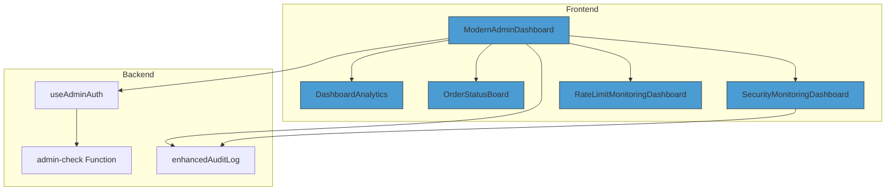
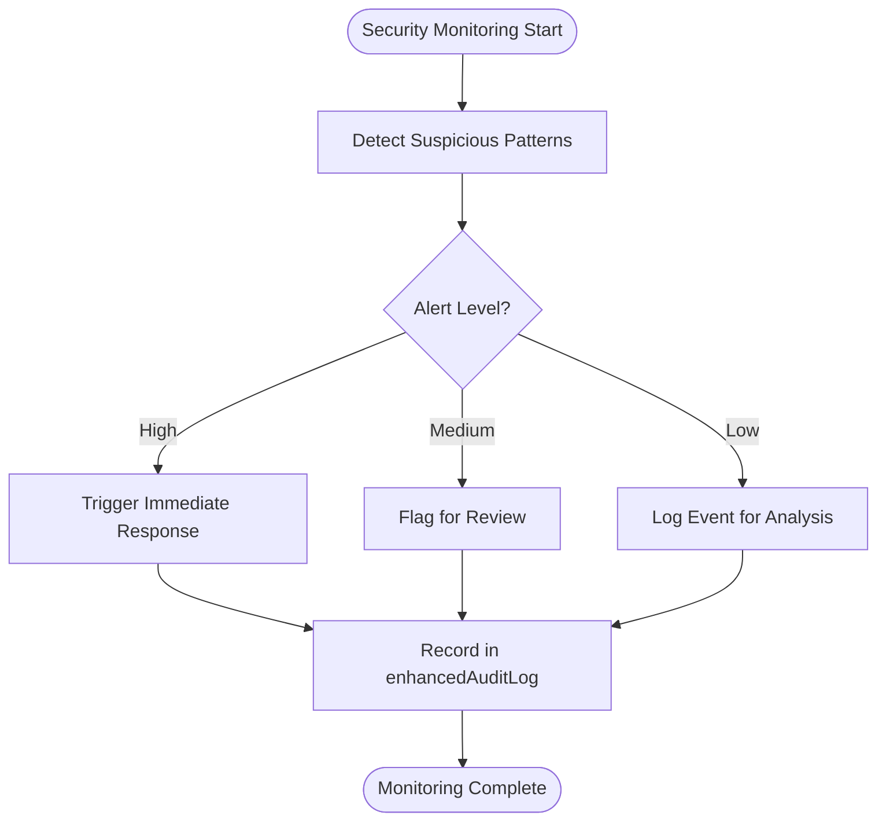
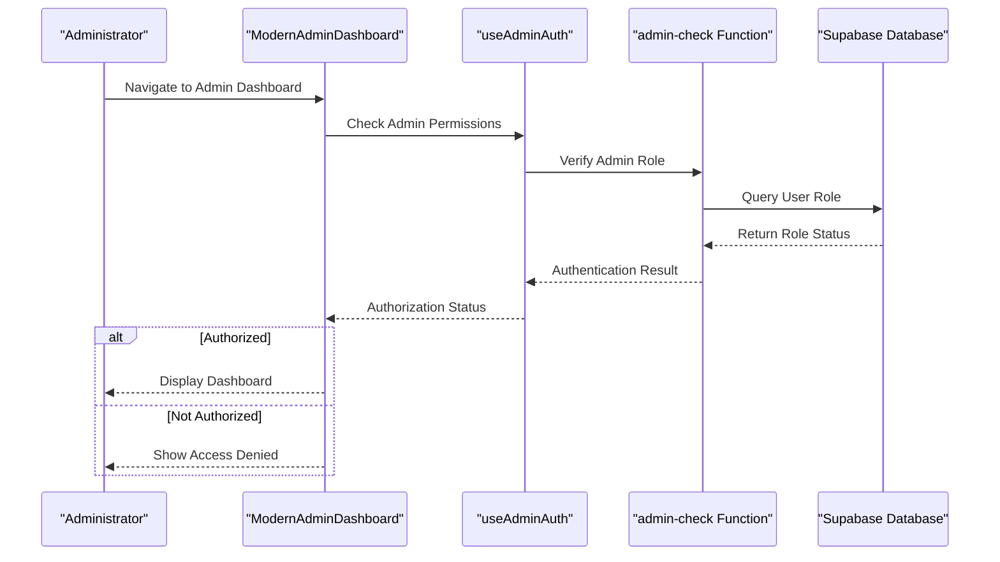

# Admin Dashboard

<cite>
**Referenced Files in This Document**  
- [ModernAdminDashboard.tsx](file://src/pages/ModernAdminDashboard.tsx)
- [useAdminAuth.ts](file://src/hooks/useAdminAuth.ts)
- [admin-check/index.ts](file://supabase/functions/admin-check/index.ts)
- [enhancedAuditLog.ts](file://src/lib/enhancedAuditLog.ts)
- [DashboardAnalytics.tsx](file://src/components/admin/DashboardAnalytics.tsx)
- [OrderStatusBoard.tsx](file://src/components/admin/OrderStatusBoard.tsx)
- [SecurityMonitoringDashboard.tsx](file://src/components/admin/SecurityMonitoringDashboard.tsx)
- [RateLimitMonitoringDashboard.tsx](file://src/components/admin/RateLimitMonitoringDashboard.tsx)
- [AdminLayout.tsx](file://src/pages/admin/AdminLayout.tsx)
- [SupplierVerification.tsx](file://src/pages/admin/SupplierVerification.tsx)
- [OrderManagement.tsx](file://src/pages/admin/OrderManagement.tsx)
- [AutomationRulesManager.tsx](file://src/components/admin/AutomationRulesManager.tsx)
</cite>

## Table of Contents
1. [Introduction](#introduction)
2. [Core Components](#core-components)
3. [Architecture Overview](#architecture-overview)
4. [Detailed Component Analysis](#detailed-component-analysis)
5. [Security and Authentication](#security-and-authentication)
6. [Admin Workflows](#admin-workflows)
7. [Troubleshooting Guide](#troubleshooting-guide)
8. [Security Best Practices](#security-best-practices)
9. [Conclusion](#conclusion)

## Introduction
The ModernAdminDashboard serves as the central control panel for system administrators, providing comprehensive oversight of the platform's operations. It integrates multiple specialized dashboards to deliver business insights, order management capabilities, and security monitoring tools. This documentation details the component's architecture, functionality, and integration points, focusing on its role in enabling administrative workflows while maintaining robust security controls.

## Core Components
The ModernAdminDashboard orchestrates several key components that provide specialized functionality for system administrators. These include analytics visualization, order status monitoring, security threat detection, and API rate limit monitoring. The dashboard acts as a unified interface that aggregates data from various subsystems, enabling administrators to monitor platform health, manage operations, and respond to security events from a single interface.

**Section sources**
- [ModernAdminDashboard.tsx](file://src/pages/ModernAdminDashboard.tsx#L1-L150)
- [AdminLayout.tsx](file://src/pages/admin/AdminLayout.tsx#L1-L80)

## Architecture Overview
The ModernAdminDashboard follows a modular architecture that integrates multiple specialized components through a centralized layout system. The dashboard leverages role-based access control to ensure that only authorized administrators can access sensitive functionality. Data flows from various backend services through API endpoints to the dashboard components, which render the information in an intuitive interface.

**Diagram sources**
- [ModernAdminDashboard.tsx](file://src/pages/ModernAdminDashboard.tsx#L1-L200)
- [AdminLayout.tsx](file://src/pages/admin/AdminLayout.tsx#L1-L100)

## Detailed Component Analysis

### Dashboard Analytics Integration
The DashboardAnalytics component provides business insights through data visualization of key performance metrics. It displays trends in user activity, order volume, and system performance, enabling administrators to make data-driven decisions. The component fetches aggregated data from analytics services and presents it through interactive charts and summary cards.

**Section sources**
- [DashboardAnalytics.tsx](file://src/components/admin/DashboardAnalytics.tsx#L1-L120)

### Order Management System
The OrderStatusBoard component enables administrators to oversee all orders across the platform. It provides real-time status updates, fulfillment tracking, and intervention capabilities for orders requiring manual review. The component integrates with the order management system to display order details, shipping information, and production timelines.

**Section sources**
- [OrderStatusBoard.tsx](file://src/components/admin/OrderStatusBoard.tsx#L1-L100)
- [OrderManagement.tsx](file://src/pages/admin/OrderManagement.tsx#L1-L80)

### Security Monitoring Capabilities
The SecurityMonitoringDashboard component provides threat detection and response capabilities. It monitors authentication attempts, API access patterns, and user behavior to identify potential security incidents. The dashboard displays security alerts, suspicious activity logs, and system integrity checks, enabling administrators to respond to threats promptly.

**Diagram sources**
- [SecurityMonitoringDashboard.tsx](file://src/components/admin/SecurityMonitoringDashboard.tsx#L1-L150)
- [enhancedAuditLog.ts](file://src/lib/enhancedAuditLog.ts#L1-L60)

### Rate Limit Monitoring
The RateLimitMonitoringDashboard component protects API endpoints by monitoring and visualizing rate limit usage. It displays metrics on API call volume, identifies potential abuse patterns, and alerts administrators to unusual traffic patterns that may indicate scraping or denial-of-service attacks.

**Section sources**
- [RateLimitMonitoringDashboard.tsx](file://src/components/admin/RateLimitMonitoringDashboard.tsx#L1-L90)

## Security and Authentication

### Role-Based Access Control
The useAdminAuth hook implements secure role verification for the ModernAdminDashboard. It validates that users have the required administrative privileges before granting access to sensitive functionality. The hook communicates with the admin-check edge function to verify user roles against the system's authorization policies.

**Diagram sources**
- [useAdminAuth.ts](file://src/hooks/useAdminAuth.ts#L1-L50)
- [admin-check/index.ts](file://supabase/functions/admin-check/index.ts#L1-L40)

**Section sources**
- [useAdminAuth.ts](file://src/hooks/useAdminAuth.ts#L1-L80)
- [admin-check/index.ts](file://supabase/functions/admin-check/index.ts#L1-L60)

## Admin Workflows

### Supplier Verification Process
The supplier verification workflow enables administrators to review and approve new supplier accounts. This process involves validating business credentials, verifying manufacturing capabilities, and confirming compliance with platform standards. The workflow is supported by the SupplierVerification component, which provides a structured interface for reviewing application materials and making approval decisions.

**Section sources**
- [SupplierVerification.tsx](file://src/pages/admin/SupplierVerification.tsx#L1-L100)

### Automation Rule Management
Administrators can manage automation rules through the AutomationRulesManager component. This feature enables the creation, modification, and monitoring of automated workflows that handle routine tasks such as order processing, inventory updates, and notification dispatching. The interface provides rule configuration, testing capabilities, and execution monitoring.

**Section sources**
- [AutomationRulesManager.tsx](file://src/components/admin/AutomationRulesManager.tsx#L1-L120)

## Troubleshooting Guide

### Permission Denial Issues
When administrators encounter permission denial errors, the issue typically stems from role configuration or authentication token expiration. To resolve this:
1. Verify the user account has the admin role assigned in the database
2. Check that the admin-check edge function is properly deployed and accessible
3. Ensure the authentication token is valid and not expired
4. Confirm the useAdminAuth hook is correctly implemented in the component

**Section sources**
- [useAdminAuth.ts](file://src/hooks/useAdminAuth.ts#L20-L60)
- [admin-check/index.ts](file://supabase/functions/admin-check/index.ts#L15-L35)

### Dashboard Loading Failures
If the ModernAdminDashboard fails to load, potential causes include:
1. Network connectivity issues preventing access to required data endpoints
2. Authentication failures or invalid session tokens
3. Component rendering errors due to missing dependencies
4. Server-side function failures in data retrieval processes

Troubleshooting steps:
- Check browser developer tools for network and console errors
- Verify authentication status and attempt re-login
- Ensure all required environment variables are properly configured
- Review server logs for edge function execution errors

**Section sources**
- [ModernAdminDashboard.tsx](file://src/pages/ModernAdminDashboard.tsx#L50-L120)
- [AdminLayout.tsx](file://src/pages/admin/AdminLayout.tsx#L30-L70)

## Security Best Practices

### Credential Protection
To safeguard admin credentials:
- Implement multi-factor authentication for all administrative accounts
- Use strong, unique passwords with regular rotation policies
- Store credentials securely using encrypted storage mechanisms
- Limit admin account usage to necessary personnel only
- Monitor login attempts and alert on suspicious activity

### Privilege Escalation Prevention
To prevent privilege escalation attacks:
- Implement the principle of least privilege in role assignments
- Regularly audit user permissions and remove unnecessary access
- Use signed and encrypted authentication tokens with limited lifespan
- Validate all authorization checks on the server side
- Implement comprehensive audit logging for all privileged actions

**Section sources**
- [useAdminAuth.ts](file://src/hooks/useAdminAuth.ts#L1-L80)
- [enhancedAuditLog.ts](file://src/lib/enhancedAuditLog.ts#L1-L60)
- [admin-check/index.ts](file://supabase/functions/admin-check/index.ts#L1-L60)

## Conclusion
The ModernAdminDashboard provides a comprehensive control panel for system administrators, integrating analytics, order management, and security monitoring functionalities. Its architecture emphasizes security through the useAdminAuth hook and admin-check edge function, ensuring that only authorized personnel can access sensitive operations. The dashboard supports critical administrative workflows while maintaining robust security controls and comprehensive audit logging through the enhancedAuditLog system. By following security best practices and understanding common troubleshooting scenarios, administrators can effectively manage the platform while minimizing security risks.