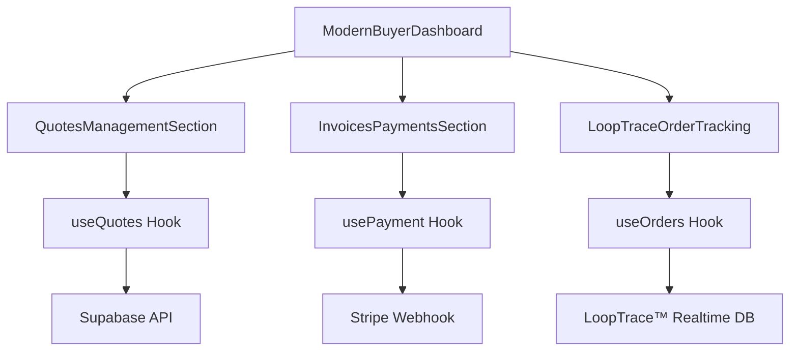
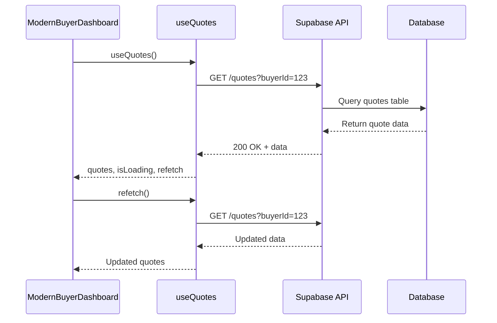
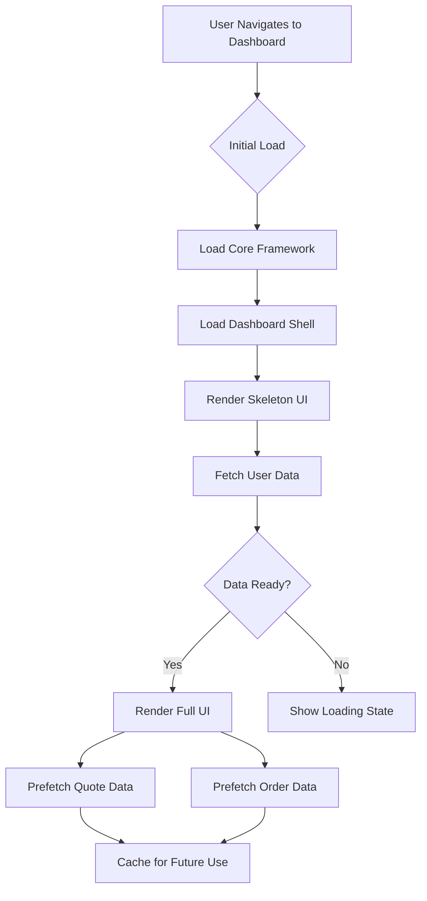
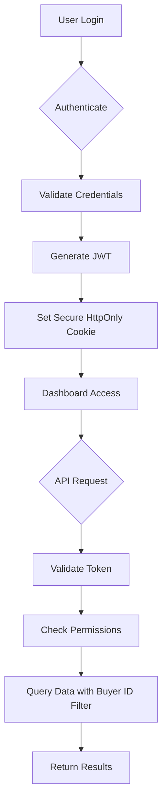

# Buyer Dashboard

<cite>
**Referenced Files in This Document**  
- [ModernBuyerDashboard.tsx](file://src/pages/ModernBuyerDashboard.tsx)
- [QuotesManagementSection.tsx](file://src/components/buyer/QuotesManagementSection.tsx)
- [InvoicesPaymentsSection.tsx](file://src/components/buyer/InvoicesPaymentsSection.tsx)
- [LoopTraceOrderTracking.tsx](file://src/components/buyer/LoopTraceOrderTracking.tsx)
- [useQuotes.ts](file://src/hooks/useQuotes.ts)
- [useOrders.ts](file://src/hooks/useOrders.ts)
- [lib/performanceOptimizer.ts](file://src/lib/performanceOptimizer.ts)
- [lib/security.ts](file://src/lib/security.ts)
</cite>

## Table of Contents
1. [Introduction](#introduction)
2. [Core Components and Integration](#core-components-and-integration)
3. [State Management with React Query](#state-management-with-react-query)
4. [Performance Optimization Strategies](#performance-optimization-strategies)
5. [Security Considerations](#security-considerations)
6. [Troubleshooting Common Issues](#troubleshooting-common-issues)
7. [Conclusion](#conclusion)

## Introduction
The ModernBuyerDashboard serves as the central interface for buyers within the SleekApparels platform, providing unified access to quote management, order tracking via LoopTrace™ technology, and secure payment processing. Designed with a user-centric approach, the dashboard integrates multiple specialized components to deliver a seamless procurement experience. It enables buyers to manage their entire supply chain workflow—from initial quote requests to final delivery—within a single, intuitive interface. The dashboard leverages modern React patterns, including React Query for state management, lazy loading for performance, and role-based access control for security.

## Core Components and Integration

The ModernBuyerDashboard orchestrates three primary functional modules: quote management, financial transactions, and real-time order tracking. These are implemented through dedicated subcomponents that communicate via shared hooks and context providers.

### QuotesManagementSection
This component enables buyers to view, compare, and manage AI-generated quotes. It supports features such as quote history, side-by-side comparison, and direct conversion to purchase orders. The section integrates with backend AI services that analyze market data, production costs, and supplier capabilities to generate competitive pricing.

### InvoicesPaymentsSection
Handles all financial aspects of the buyer journey, including invoice viewing, payment scheduling, and transaction history. The component integrates with Stripe via Supabase Functions to enable secure, PCI-compliant payment processing. It supports multiple currencies and provides detailed breakdowns of costs, including MOQ adjustments and shipping fees.

### LoopTraceOrderTracking
Provides real-time visibility into production progress using the proprietary LoopTrace™ system. This component displays a timeline of production stages, quality control checkpoints, and estimated delivery times. It pulls live data from factory IoT systems and supplier updates, ensuring accurate and up-to-date tracking information.

**Diagram sources**
- [ModernBuyerDashboard.tsx](file://src/pages/ModernBuyerDashboard.tsx)
- [QuotesManagementSection.tsx](file://src/components/buyer/QuotesManagementSection.tsx)
- [InvoicesPaymentsSection.tsx](file://src/components/buyer/InvoicesPaymentsSection.tsx)
- [LoopTraceOrderTracking.tsx](file://src/components/buyer/LoopTraceOrderTracking.tsx)

**Section sources**
- [ModernBuyerDashboard.tsx](file://src/pages/ModernBuyerDashboard.tsx#L1-L150)

## State Management with React Query

The dashboard utilizes React Query hooks to manage server state efficiently, minimizing unnecessary re-renders and optimizing data synchronization.

### useQuotes Hook
Manages quote-related data fetching, caching, and updates. It provides functions for:
- Fetching active and historical quotes
- Refreshing quote status
- Converting quotes to orders
- Handling optimistic updates during quote actions

### useOrders Hook
Handles order lifecycle data, including:
- Retrieving current and past orders
- Polling for real-time status updates
- Managing order modifications
- Syncing with LoopTrace™ production stages

These hooks implement automatic refetching on window focus and network reconnect, ensuring data freshness without manual intervention. They also support query invalidation patterns to keep related data in sync across components.

**Diagram sources**
- [useQuotes.ts](file://src/hooks/useQuotes.ts#L10-L80)
- [useOrders.ts](file://src/hooks/useOrders.ts#L15-L90)

**Section sources**
- [useQuotes.ts](file://src/hooks/useQuotes.ts)
- [useOrders.ts](file://src/hooks/useOrders.ts)

## Performance Optimization Strategies

The dashboard implements several performance optimizations to ensure a responsive user experience.

### Lazy Loading
Non-critical components are loaded on-demand using React.lazy() and Suspense. This reduces initial bundle size and improves time-to-interactive metrics.

### Data Prefetching
The system proactively fetches data likely to be needed next, such as:
- Preloading order details when a quote is opened
- Fetching invoice data when payment is due
- Loading tracking information as orders progress

### Code Splitting
Route-based code splitting ensures that only the necessary JavaScript is loaded for the current view. Component-level splitting further optimizes load times for complex sections.

**Diagram sources**
- [lib/performanceOptimizer.ts](file://src/lib/performanceOptimizer.ts)
- [ModernBuyerDashboard.tsx](file://src/pages/ModernBuyerDashboard.tsx)

**Section sources**
- [lib/performanceOptimizer.ts](file://src/lib/performanceOptimizer.ts)
- [ModernBuyerDashboard.tsx](file://src/pages/ModernBuyerDashboard.tsx)

## Security Considerations

The dashboard implements multiple layers of security to protect buyer data and prevent unauthorized access.

### Authentication and Authorization
- JWT-based authentication with short-lived tokens
- Role-based access control (RBAC) ensuring buyers only access their data
- Session validation on every API request

### Data Protection
- All sensitive data transmitted over HTTPS
- Field-level encryption for financial information
- Audit logging of all data access attempts

### Access Control
The system enforces strict data isolation:
- Database queries always include buyer ID filters
- API endpoints validate ownership before returning data
- UI components hide functionality based on user permissions

**Diagram sources**
- [lib/security.ts](file://src/lib/security.ts)
- [ModernBuyerDashboard.tsx](file://src/pages/ModernBuyerDashboard.tsx)

**Section sources**
- [lib/security.ts](file://src/lib/security.ts)

## Troubleshooting Common Issues

### Delayed Quote Loading
**Symptoms**: Quotes take longer than 5 seconds to appear after login.

**Solutions**:
1. Check network connectivity and API status
2. Verify the `useQuotes` hook is properly configured with correct buyer ID
3. Clear React Query cache using developer tools
4. Ensure the user has active quotes in the database

### Missing Order Updates
**Symptoms**: Order status not updating in real-time.

**Solutions**:
1. Verify WebSocket connection to LoopTrace™ system
2. Check that the `useOrders` hook has polling enabled
3. Confirm the order belongs to the current buyer (ownership mismatch)
4. Inspect browser console for authentication errors

### Payment Processing Failures
**Symptoms**: Payment form submission fails without error.

**Solutions**:
1. Verify Stripe integration keys are correctly configured
2. Check that the invoice is in "pending" status
3. Ensure the payment method is valid and not expired
4. Confirm sufficient inventory for the ordered items

## Conclusion
The ModernBuyerDashboard provides a comprehensive, secure, and high-performance interface for buyers to manage their apparel production lifecycle. By integrating quote management, payment processing, and real-time order tracking through LoopTrace™, it delivers a unified experience that simplifies complex supply chain operations. The implementation leverages modern React patterns, efficient state management with React Query, and robust security practices to ensure reliability and data protection. Ongoing performance optimizations through lazy loading and data prefetching maintain responsiveness even as functionality expands.