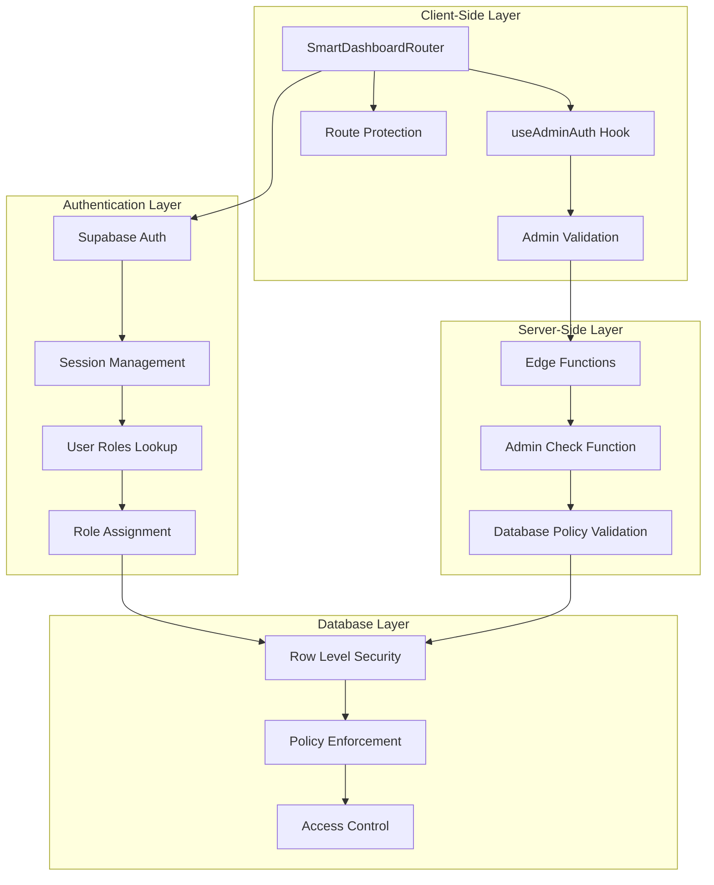
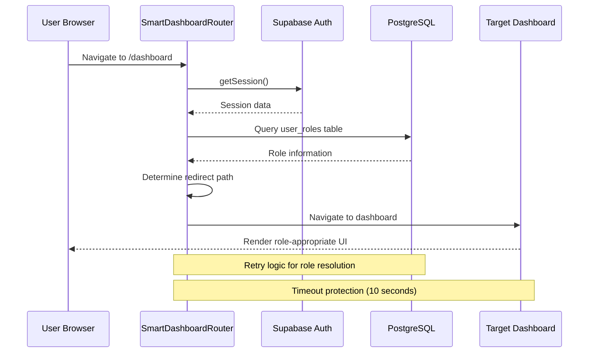
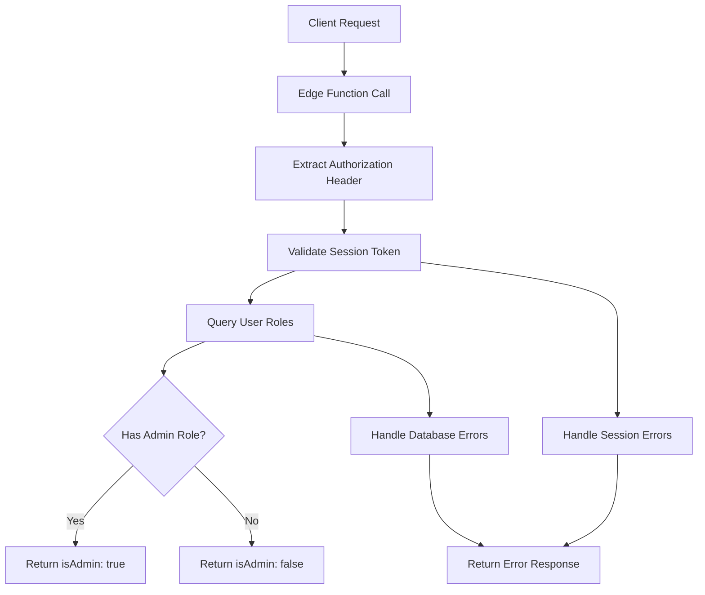
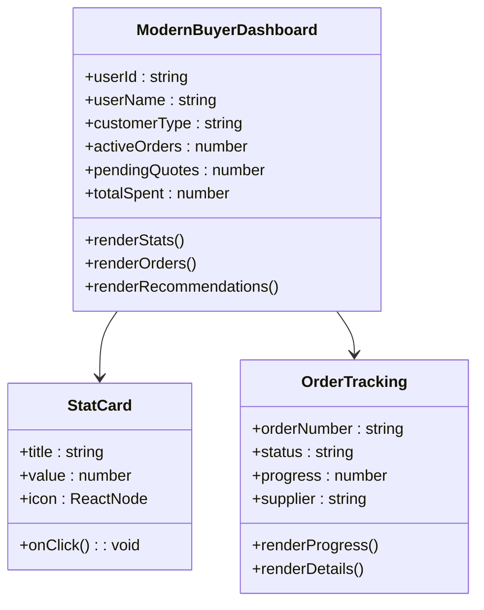
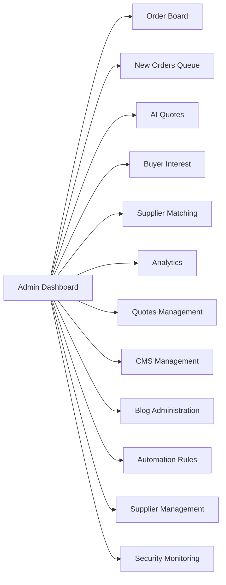
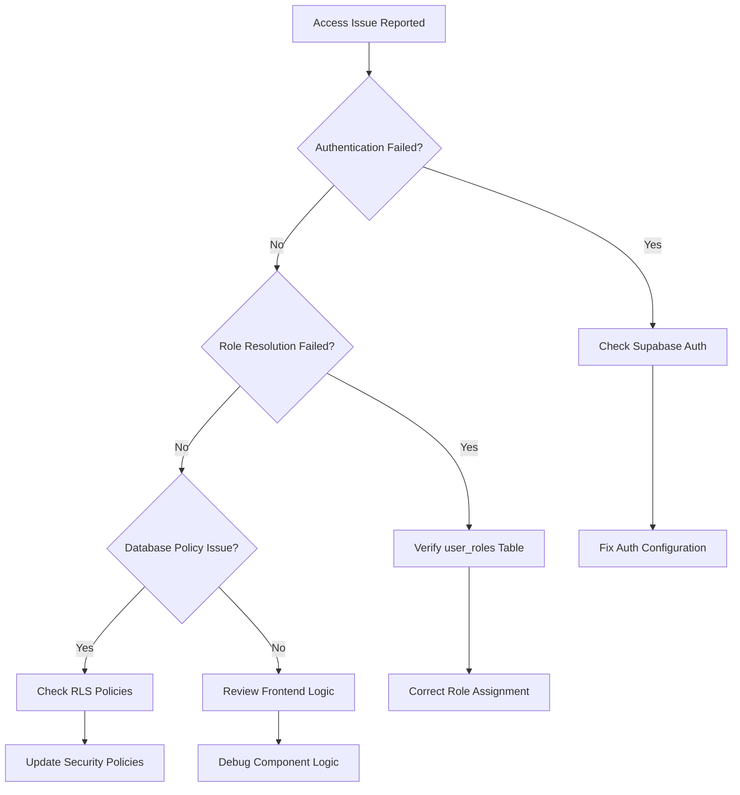
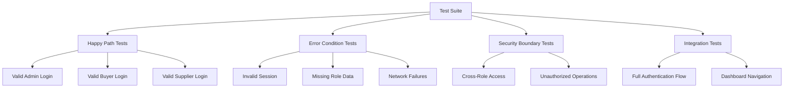

# Role-Based Access Control System

<cite>
**Referenced Files in This Document**
- [SmartDashboardRouter.tsx](file://src/components/SmartDashboardRouter.tsx)
- [useAdminAuth.ts](file://src/hooks/useAdminAuth.ts)
- [ModernBuyerDashboard.tsx](file://src/pages/ModernBuyerDashboard.tsx)
- [ModernSupplierDashboard.tsx](file://src/pages/ModernSupplierDashboard.tsx)
- [ModernAdminDashboard.tsx](file://src/pages/ModernAdminDashboard.tsx)
- [admin-check/index.ts](file://supabase/functions/admin-check/index.ts)
- [types.ts](file://src/integrations/supabase/types.ts)
- [database.ts](file://src/types/database.ts)
- [supabaseHelpers.ts](file://src/lib/supabaseHelpers.ts)
- [useAdminAuth.test.ts](file://src/hooks/__tests__/useAdminAuth.test.ts)
- [seed_FIXED.sql](file://supabase/seed_FIXED.sql)
- [BASE_MIGRATION_SAFE.sql](file://supabase/BASE_MIGRATION_SAFE.sql)
</cite>

## Table of Contents
1. [Introduction](#introduction)
2. [System Architecture](#system-architecture)
3. [User Roles and Permissions](#user-roles-and-permissions)
4. [SmartDashboardRouter Component](#smartdashboardrouter-component)
5. [Admin Authentication System](#admin-authentication-system)
6. [Dashboard Components](#dashboard-components)
7. [Database Security Policies](#database-security-policies)
8. [Common Issues and Solutions](#common-issues-and-solutions)
9. [Security Considerations](#security-considerations)
10. [Testing and Validation](#testing-and-validation)

## Introduction

The Sleek Apparels platform implements a sophisticated Role-Based Access Control (RBAC) system that provides secure, role-specific user experiences across three distinct user personas: Buyers, Suppliers, and Administrators. This system ensures that each user type has appropriate access to system functionality while maintaining strict security boundaries and preventing unauthorized access attempts.

The RBAC implementation combines client-side routing logic, server-side authentication validation, and database-level row-level security policies to create a comprehensive security framework that protects sensitive administrative functionality and prevents privilege escalation attacks.

## System Architecture

The RBAC system follows a multi-layered security architecture that operates at the application level, database level, and edge function level:



**Diagram sources**
- [SmartDashboardRouter.tsx](file://src/components/SmartDashboardRouter.tsx#L1-L139)
- [useAdminAuth.ts](file://src/hooks/useAdminAuth.ts#L1-L47)
- [admin-check/index.ts](file://supabase/functions/admin-check/index.ts#L1-L74)

## User Roles and Permissions

The system defines four primary user roles, each with distinct permissions and access levels:

### Role Definitions

| Role | Description | Access Level | Dashboard Access |
|------|-------------|--------------|------------------|
| `admin` | System administrators with full control | Highest | ModernAdminDashboard |
| `buyer` | Retail customers (default) | Medium-High | ModernBuyerDashboard |
| `supplier` | Manufacturing partners | Medium | ModernSupplierDashboard |
| `factory` | Specialized manufacturing units | Medium | ModernSupplierDashboard |

### Buyer Role Variants

Buyers can have specialized roles based on their business type:

| Buyer Role | Purpose | Features Available |
|------------|---------|-------------------|
| `retailer` | Individual clothing stores | Basic order tracking, instant quotes |
| `wholesaler` | Bulk purchase distributors | Volume discounts, bulk ordering |
| `educational` | Schools and institutions | Uniform purchasing, institutional pricing |
| `corporate` | Corporate apparel buyers | Enterprise accounts, bulk procurement |
| `sports_team` | Sports team apparel | Team uniform management, scheduling |
| `fashion_brand` | Apparel brands | Design collaboration, private labeling |

**Section sources**
- [seed_FIXED.sql](file://supabase/seed_FIXED.sql#L30-L89)
- [database.ts](file://src/types/database.ts#L5-L7)

## SmartDashboardRouter Component

The SmartDashboardRouter serves as the central authentication and routing hub for the application, implementing sophisticated role-based redirection logic with fallback mechanisms and error handling.

### Core Functionality

The router performs several critical security operations:

1. **Session Validation**: Verifies active user sessions using Supabase authentication
2. **Role Resolution**: Determines user roles through database queries with retry logic
3. **Secure Redirection**: Routes users to appropriate dashboards based on role
4. **Fallback Protection**: Implements timeout mechanisms and error recovery

### Implementation Details



**Diagram sources**
- [SmartDashboardRouter.tsx](file://src/components/SmartDashboardRouter.tsx#L15-L114)

### Key Security Features

- **Race Condition Prevention**: Uses `isRedirecting` state to prevent multiple simultaneous redirects
- **Timeout Protection**: Implements 10-second timeout with fallback to buyer dashboard
- **Retry Logic**: Attempts role resolution up to 3 times with 1-second delays
- **Graceful Degradation**: Falls back to buyer dashboard on errors

**Section sources**
- [SmartDashboardRouter.tsx](file://src/components/SmartDashboardRouter.tsx#L1-L139)

## Admin Authentication System

The admin authentication system provides server-side validation of administrative privileges through a dedicated edge function that cannot be bypassed by client-side modifications.

### useAdminAuth Hook

The `useAdminAuth` hook manages admin status validation with the following characteristics:

- **Server-Side Validation**: Uses edge function for authoritative admin status
- **Session-Based**: Relies on active Supabase session for user identification
- **Cached Results**: Maintains admin status in component state
- **Loading States**: Provides clear loading indicators during validation

### Edge Function Implementation

The admin check function operates independently of client-side data:



**Diagram sources**
- [admin-check/index.ts](file://supabase/functions/admin-check/index.ts#L8-L74)

### Security Mechanisms

- **Token Validation**: Validates JWT tokens using Supabase client
- **Database Isolation**: Queries user_roles table directly for authoritative data
- **Error Handling**: Graceful degradation with false positives avoided
- **CORS Protection**: Implements proper CORS headers for cross-origin requests

**Section sources**
- [useAdminAuth.ts](file://src/hooks/useAdminAuth.ts#L1-L47)
- [admin-check/index.ts](file://supabase/functions/admin-check/index.ts#L1-L74)

## Dashboard Components

Each dashboard component implements role-specific functionality and UI adaptations based on the user's assigned role.

### ModernBuyerDashboard

The buyer dashboard provides comprehensive order tracking, quote management, and purchasing functionality:

#### Key Features by Buyer Type

- **Retailers**: Basic order tracking, instant quote generation
- **Wholesalers**: Bulk ordering capabilities, volume discounts
- **Educational Institutions**: Uniform purchasing with institutional pricing
- **Corporate Buyers**: Enterprise account management, bulk procurement
- **Sports Teams**: Team uniform coordination, scheduling features
- **Fashion Brands**: Design collaboration tools, private labeling

#### Dashboard Components



**Diagram sources**
- [ModernBuyerDashboard.tsx](file://src/pages/ModernBuyerDashboard.tsx#L1-L584)

### ModernSupplierDashboard

The supplier dashboard focuses on production management, performance tracking, and business growth:

#### Key Features

- **Production Tracking**: Real-time order status monitoring
- **Performance Analytics**: Capacity utilization and quality metrics
- **Business Growth**: Tier system with benefits and achievements
- **Order Management**: Assignment and fulfillment workflows

#### Gamification Elements

- **Performance Tiers**: Bronze, Silver, Gold, Platinum with increasing benefits
- **Achievements System**: Unlockable badges for milestones
- **Capacity Management**: Visual progress indicators for production capacity

### ModernAdminDashboard

The admin dashboard provides comprehensive system management capabilities:

#### Administrative Features

- **Order Management**: Complete order lifecycle oversight
- **Supplier Monitoring**: Supplier performance and verification
- **Analytics Dashboard**: System-wide performance metrics
- **Content Management**: Blog and CMS administration
- **Automation Rules**: Workflow automation management

#### Tabbed Interface

The admin dashboard uses a tabbed interface for organized access to different administrative functions:



**Diagram sources**
- [ModernAdminDashboard.tsx](file://src/pages/ModernAdminDashboard.tsx#L280-L334)

**Section sources**
- [ModernBuyerDashboard.tsx](file://src/pages/ModernBuyerDashboard.tsx#L1-L584)
- [ModernSupplierDashboard.tsx](file://src/pages/ModernSupplierDashboard.tsx#L1-L669)
- [ModernAdminDashboard.tsx](file://src/pages/ModernAdminDashboard.tsx#L1-L559)

## Database Security Policies

The system implements comprehensive row-level security policies that restrict data access based on user roles and ownership relationships.

### Policy Categories

#### 1. User Ownership Policies
- **Profiles**: Users can only view/update their own profile data
- **User Roles**: Role assignments are restricted to authorized users
- **Orders**: Buyers can only access their own orders, suppliers their assigned orders

#### 2. Administrative Policies
- **Admin Operations**: Only admin users can perform system-level operations
- **Role Management**: Admin-only ability to assign/revoke roles
- **System Configuration**: Restricted access to system settings

#### 3. Supplier-Specific Policies
- **Supplier Data**: Suppliers can only access their own supplier records
- **Order Assignment**: Suppliers can only view orders assigned to them
- **Performance Data**: Self-service access to performance metrics

### Policy Implementation Example

```sql
-- Example policy for supplier orders
CREATE POLICY "Suppliers can view their assigned orders"
ON public.supplier_orders
FOR SELECT
TO authenticated
USING (
  supplier_id IN (
    SELECT id FROM public.suppliers
    WHERE user_id = auth.uid()
  )
);
```

### Security Benefits

- **Principle of Least Privilege**: Users only access data necessary for their role
- **Data Isolation**: Prevents cross-user data leakage
- **Audit Trail**: All access attempts logged for security monitoring
- **Granular Control**: Fine-grained access control at the row level

**Section sources**
- [BASE_MIGRATION_SAFE.sql](file://supabase/BASE_MIGRATION_SAFE.sql#L4227-L4641)

## Common Issues and Solutions

### Unauthorized Access Attempts

**Issue**: Users attempting to access dashboards or routes not intended for their role.

**Solution**: 
- SmartDashboardRouter implements role-based redirection
- Edge function validation prevents client-side bypass
- Database policies enforce access restrictions at the data layer

### Role Assignment Errors

**Issue**: Users not receiving expected role assignments or experiencing role conflicts.

**Solution**:
- Verify user_roles table entries in database
- Check for conflicting role assignments
- Ensure proper role assignment during user registration

### Authentication Failures

**Issue**: Users unable to authenticate or maintain sessions.

**Solution**:
- Verify Supabase authentication configuration
- Check session storage and token refresh mechanisms
- Validate user registration and email verification processes

### Performance Issues

**Issue**: Slow role resolution or dashboard loading times.

**Solution**:
- Implement caching for role data
- Optimize database queries with proper indexing
- Use pagination for large datasets

### Debugging Common Issues



## Security Considerations

### Defense in Depth Approach

The RBAC system implements multiple layers of security controls:

#### 1. Client-Side Security
- Role-based UI rendering
- Conditional component rendering
- Secure state management

#### 2. Network-Level Security
- HTTPS enforcement
- CSRF protection
- CORS policy implementation

#### 3. Server-Side Security
- Edge function validation
- Session management
- Rate limiting

#### 4. Database Security
- Row-level security policies
- Audit logging
- Data encryption

### Preventing Privilege Escalation

The system implements several mechanisms to prevent privilege escalation:

- **Server-Side Validation**: All critical operations validated on server
- **Role Boundaries**: Strict separation between user types
- **Least Privilege**: Minimal access rights granted
- **Audit Logging**: All access attempts logged and monitored

### Data Protection Measures

- **Encryption**: Sensitive data encrypted at rest and in transit
- **Access Logging**: Comprehensive audit trail of all access attempts
- **Data Minimization**: Only necessary data collected and stored
- **Regular Audits**: Periodic security assessments and policy reviews

### Compliance Considerations

The RBAC system supports various compliance requirements:

- **GDPR**: Data protection and user consent management
- **SOC 2**: Security controls and access management
- **ISO 27001**: Information security management systems
- **Industry Standards**: Applicable regulatory compliance

## Testing and Validation

### Unit Testing

The system includes comprehensive unit tests for authentication and authorization logic:

#### Test Coverage Areas

- **useAdminAuth Hook**: Admin status validation scenarios
- **Role Resolution**: Different role assignment combinations
- **Error Handling**: Failure modes and graceful degradation
- **Session Management**: Authentication state transitions

#### Testing Scenarios



**Diagram sources**
- [useAdminAuth.test.ts](file://src/hooks/__tests__/useAdminAuth.test.ts#L1-L381)

### Integration Testing

- **End-to-End Workflows**: Complete user journey testing
- **Cross-Component Interaction**: Multi-component authentication flows
- **Database Integration**: Role-based data access testing
- **Performance Testing**: Load and stress testing under various scenarios

### Security Testing

- **Penetration Testing**: Vulnerability assessment and penetration testing
- **Access Control Testing**: Authorization boundary validation
- **Data Leakage Testing**: Information disclosure prevention
- **Authentication Testing**: Brute force protection and session security

**Section sources**
- [useAdminAuth.test.ts](file://src/hooks/__tests__/useAdminAuth.test.ts#L1-L381)