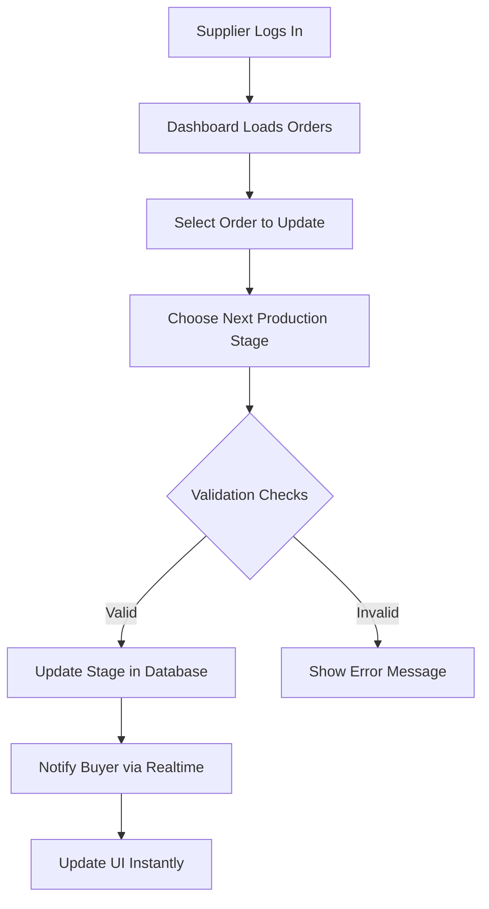
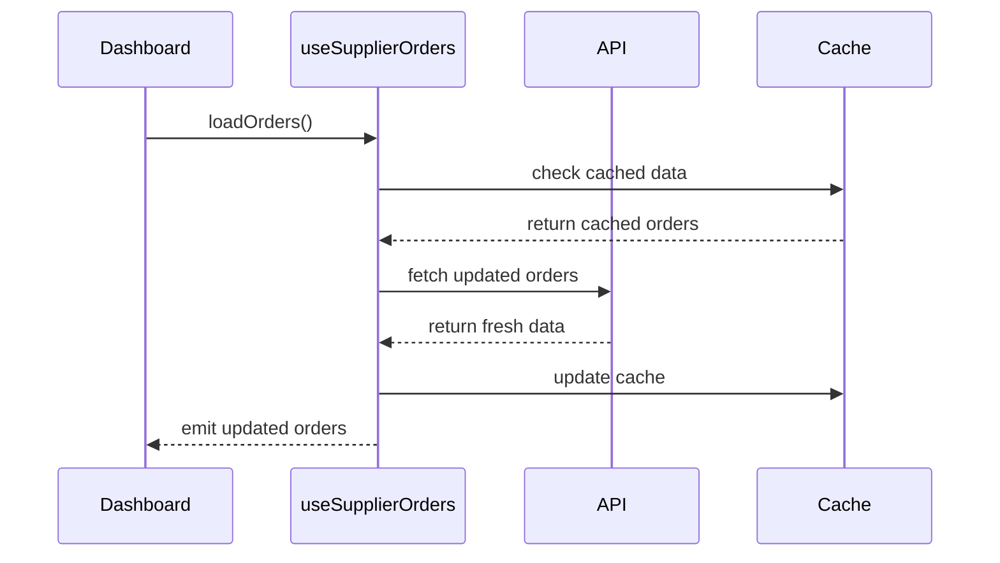
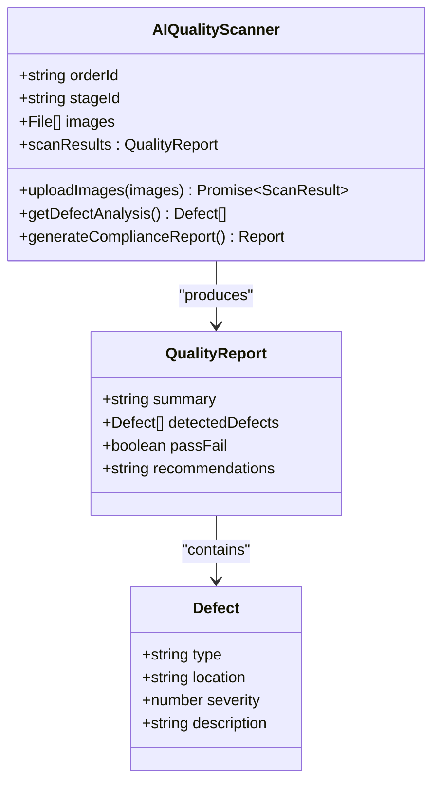

# Supplier Dashboard

<cite>
**Referenced Files in This Document**  
- [ModernSupplierDashboard.tsx](file://src/pages/ModernSupplierDashboard.tsx)
- [SupplierOrdersList.tsx](file://src/components/supplier/SupplierOrdersList.tsx)
- [ProductionManagementPanel.tsx](file://src/components/supplier/ProductionManagementPanel.tsx)
- [FinancialDashboard.tsx](file://src/components/supplier/FinancialDashboard.tsx)
- [OrderMessaging.tsx](file://src/components/supplier/OrderMessaging.tsx)
- [useSupplierOrders.ts](file://src/hooks/useSupplierOrders.ts)
- [useRealtimeMessages.ts](file://src/hooks/useRealtimeMessages.ts)
- [AIQualityScanner.tsx](file://src/components/production/AIQualityScanner.tsx)
- [PredictiveDelayAlert.tsx](file://src/components/production/PredictiveDelayAlert.tsx)
</cite>

## Table of Contents
1. [Introduction](#introduction)
2. [Core Functionality](#core-functionality)
3. [Component Integration](#component-integration)
4. [Data Synchronization](#data-synchronization)
5. [AI-Powered Features](#ai-powered-features)
6. [Common Issues and Troubleshooting](#common-issues-and-troubleshooting)
7. [Performance Considerations](#performance-considerations)
8. [Security Practices](#security-practices)
9. [Conclusion](#conclusion)

## Introduction
The ModernSupplierDashboard serves as the central interface for suppliers within the SleekApparels platform, enabling comprehensive management of production workflows, order tracking, financial monitoring, and buyer communication. Designed with an intuitive layout, the dashboard consolidates critical tools and information to streamline supplier operations and enhance collaboration with buyers across the supply chain.

**Section sources**
- [ModernSupplierDashboard.tsx](file://src/pages/ModernSupplierDashboard.tsx#L1-L50)

## Core Functionality
The ModernSupplierDashboard provides suppliers with a unified workspace to manage their production lifecycle. Key functions include viewing assigned orders, updating production stages, monitoring financial performance, and communicating directly with buyers. The dashboard dynamically loads supplier-specific data, ensuring that each user only accesses information relevant to their organization. Real-time updates keep suppliers informed of order changes, message notifications, and system alerts without requiring manual refreshes.

**Section sources**
- [ModernSupplierDashboard.tsx](file://src/pages/ModernSupplierDashboard.tsx#L51-L120)

## Component Integration

### Supplier Orders Management
The dashboard integrates with the SupplierOrdersList component to display all orders assigned to the supplier. This list includes order identifiers, product details, quantities, deadlines, and current status. Suppliers can filter orders by status (e.g., pending, in production, completed) and sort by priority or deadline. Clicking on an order opens detailed specifications and production requirements.

**Section sources**
- [SupplierOrdersList.tsx](file://src/components/supplier/SupplierOrdersList.tsx#L1-L40)

### Production Stage Updates
The ProductionManagementPanel enables suppliers to update the manufacturing progress of each order. The interface presents a clear timeline of production stages (e.g., fabric cutting, sewing, quality inspection, packaging) with visual indicators of completion. Suppliers can advance orders through stages with timestamped updates, attach progress photos, and add notes for buyers.

**Diagram sources**
- [ProductionManagementPanel.tsx](file://src/components/supplier/ProductionManagementPanel.tsx#L15-L60)
- [ModernSupplierDashboard.tsx](file://src/pages/ModernSupplierDashboard.tsx#L80-L100)

### Financial Tracking
Integrated with the FinancialDashboard component, the supplier interface displays revenue metrics, payment status, and transaction history. Key performance indicators include total earnings, pending payments, completed orders revenue, and monthly trends. The financial data is updated in real time as orders progress and payments are processed.

**Section sources**
- [FinancialDashboard.tsx](file://src/components/supplier/FinancialDashboard.tsx#L1-L35)

### Real-Time Communication
The OrderMessaging component facilitates direct communication between suppliers and buyers. This integrated chat system allows file sharing, order-specific discussions, and quick resolution of queries. Messages are organized by order, ensuring contextual conversations remain grouped and searchable. Read receipts and typing indicators enhance communication efficiency.

**Section sources**
- [OrderMessaging.tsx](file://src/components/supplier/OrderMessaging.tsx#L1-L45)

## Data Synchronization

### useSupplierOrders Hook
The `useSupplierOrders` custom hook manages the retrieval and caching of supplier-specific order data. It handles authentication context to ensure data isolation between suppliers, implements optimistic updates for smoother UI interactions, and includes error handling for network failures. The hook automatically refreshes data when the dashboard becomes visible and supports pagination for large order volumes.

**Diagram sources**
- [useSupplierOrders.ts](file://src/hooks/useSupplierOrders.ts#L10-L80)

### useRealtimeMessages Hook
The `useRealtimeMessages` hook establishes a persistent WebSocket connection for instant message delivery. It manages connection lifecycle, handles reconnection attempts during network interruptions, and ensures message delivery through acknowledgment protocols. The hook also processes incoming notifications and updates the message count badge in the UI.

**Section sources**
- [useRealtimeMessages.ts](file://src/hooks/useRealtimeMessages.ts#L1-L50)

## AI-Powered Features

### AI Quality Scanner Integration
Suppliers interact with the AIQualityScanner component during the quality inspection phase. The system analyzes uploaded product images using computer vision algorithms to detect defects such as stitching errors, color variations, or fabric imperfections. Suppliers receive immediate feedback with highlighted problem areas and suggested corrective actions before approving products for shipment.

**Diagram sources**
- [AIQualityScanner.tsx](file://src/components/production/AIQualityScanner.tsx#L1-L40)

### Predictive Delay Alerts
The PredictiveDelayAlert component analyzes production timelines, historical performance, and current progress to forecast potential delivery delays. When risk factors are detected (e.g., stage completion lagging behind schedule, resource constraints), the system generates alerts with estimated delay durations and recommended mitigation strategies. Suppliers can acknowledge alerts and provide updated timelines directly through the interface.

**Section sources**
- [PredictiveDelayAlert.tsx](file://src/components/production/PredictiveDelayAlert.tsx#L1-L30)

## Common Issues and Troubleshooting

### Failed Stage Updates
When production stage updates fail, common causes include network connectivity issues, authentication token expiration, or validation errors in the update payload. The system implements automatic retry logic with exponential backoff and provides clear error messages to guide suppliers. Offline mode allows temporary local storage of updates for synchronization when connectivity is restored.

**Section sources**
- [ProductionManagementPanel.tsx](file://src/components/supplier/ProductionManagementPanel.tsx#L61-L100)

### Message Delivery Problems
Issues with message delivery typically stem from WebSocket connection interruptions or rate limiting. The messaging system includes fallback mechanisms using HTTP long-polling when WebSocket connections fail. Users receive notifications about delivery status, and undelivered messages are queued for automatic retry. Message size limits prevent system overload.

**Section sources**
- [OrderMessaging.tsx](file://src/components/supplier/OrderMessaging.tsx#L46-L80)

## Performance Considerations
The dashboard is optimized to handle high-volume order data through several strategies: paginated data loading, selective field retrieval, and efficient state management. Virtualized lists prevent rendering performance degradation with large order counts. Data fetching is prioritized based on user interaction patterns, with critical information loaded first. The system implements debounced search and filtering to minimize backend load during user interactions.

**Section sources**
- [ModernSupplierDashboard.tsx](file://src/pages/ModernSupplierDashboard.tsx#L121-L150)
- [useSupplierOrders.ts](file://src/hooks/useSupplierOrders.ts#L81-L120)

## Security Practices
Supplier data isolation is enforced through strict authentication and authorization mechanisms. All API endpoints validate the requesting supplier's identity and ensure they only access their own data. Sensitive information is encrypted in transit using TLS 1.3 and at rest using AES-256 encryption. The system implements role-based access control, audit logging for critical operations, and regular security scanning to identify vulnerabilities.

**Section sources**
- [ModernSupplierDashboard.tsx](file://src/pages/ModernSupplierDashboard.tsx#L151-L180)
- [useSupplierOrders.ts](file://src/hooks/useSupplierOrders.ts#L121-L150)

## Conclusion
The ModernSupplierDashboard provides a comprehensive, secure, and efficient interface for suppliers to manage their operations within the SleekApparels ecosystem. By integrating order management, production tracking, financial monitoring, and real-time communication with AI-powered quality and predictive analytics, the dashboard enhances operational visibility and collaboration. Continuous performance optimization and robust security practices ensure reliable operation at scale while protecting sensitive supplier information.