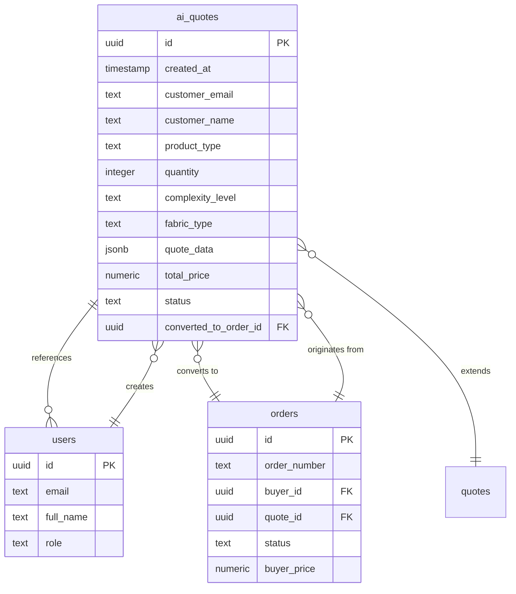
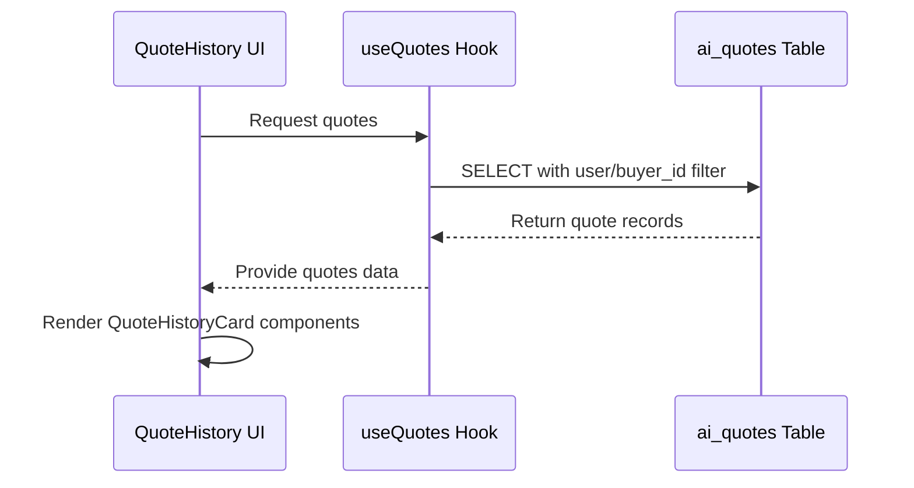
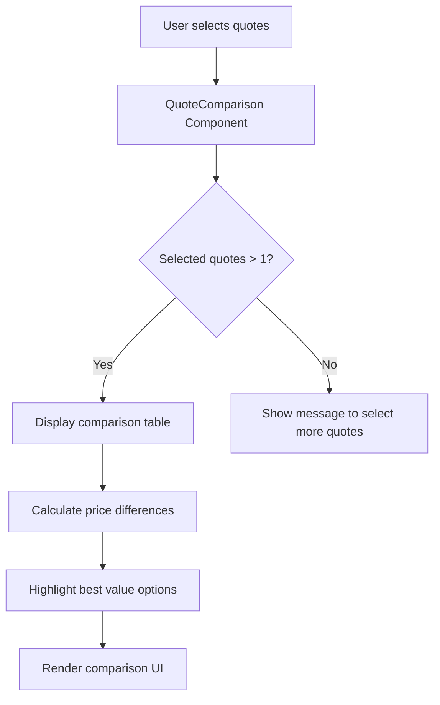
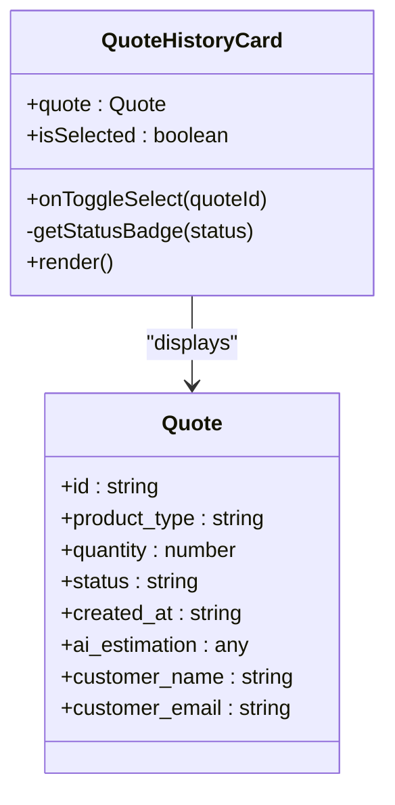
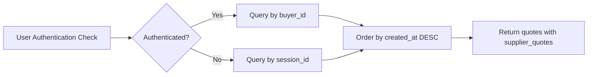

# AI Quotes Schema

<cite>
**Referenced Files in This Document**   
- [TABLES_ONLY.sql](file://supabase/TABLES_ONLY.sql)
- [useQuotes.ts](file://src/hooks/useQuotes.ts)
- [QuoteHistoryCard.tsx](file://src/components/quote/QuoteHistoryCard.tsx)
- [QuoteComparison.tsx](file://src/components/quote/QuoteComparison.tsx)
- [QuoteHistory.tsx](file://src/pages/QuoteHistory.tsx)
- [AIQuoteGeneratorWithOTP.tsx](file://src/components/AIQuoteGeneratorWithOTP.tsx)
- [add_supplier_to_quotes.sql](file://supabase/migrations/add_supplier_to_quotes.sql)
</cite>

## Table of Contents
1. [Introduction](#introduction)
2. [Entity Relationship Model](#entity-relationship-model)
3. [Field Definitions](#field-definitions)
4. [Business Rules and Constraints](#business-rules-and-constraints)
5. [Data Lifecycle and Workflow](#data-lifecycle-and-workflow)
6. [Data Access Patterns](#data-access-patterns)
7. [Sample Data Scenarios](#sample-data-scenarios)
8. [Performance Considerations](#performance-considerations)
9. [Security Measures](#security-measures)
10. [Conclusion](#conclusion)

## Introduction

The ai_quotes table serves as the central repository for intelligent pricing data generated through the conversational quote builder system. This schema captures comprehensive information about customer requests for custom apparel manufacturing, enabling AI-driven price estimation, historical tracking, and seamless conversion to production orders. The table is designed to support the core business process of transforming customer requirements into actionable manufacturing quotes while maintaining a complete audit trail of pricing decisions and customer interactions.

The AI quotes system represents a key competitive advantage for Sleek Apparels, leveraging artificial intelligence to provide instant, accurate pricing for complex custom manufacturing requests. By capturing detailed product specifications, customer information, and AI-generated pricing data in a structured format, the system enables powerful features such as quote comparison, historical analysis, and data-driven decision making for both customers and internal stakeholders.

**Section sources**
- [TABLES_ONLY.sql](file://supabase/TABLES_ONLY.sql#L87-L117)

## Entity Relationship Model

The ai_quotes table is centrally positioned in the application's data model, establishing relationships with multiple core entities to support the end-to-end quoting and ordering process. The primary relationships enable tracking of customer information, order conversion, and supplier assignment workflows.



**Diagram sources**
- [TABLES_ONLY.sql](file://supabase/TABLES_ONLY.sql#L87-L117)
- [TABLES_ONLY.sql](file://supabase/TABLES_ONLY.sql#L560-L574)
- [TABLES_ONLY.sql](file://supabase/TABLES_ONLY.sql#L437-L478)

**Section sources**
- [TABLES_ONLY.sql](file://supabase/TABLES_ONLY.sql#L87-L117)

## Field Definitions

The ai_quotes table contains a comprehensive set of fields designed to capture all relevant information for AI-powered quote generation and management. Each field serves a specific purpose in the quoting workflow, from basic customer information to complex AI-generated pricing data.

### Core Identification Fields
- **id**: Unique identifier for each quote (UUID, primary key)
- **created_at**: Timestamp when the quote was created (timestamp with time zone, default: now())
- **session_id**: Identifier for the user session, used for anonymous quote tracking

### Customer Information
- **customer_email**: Email address of the customer requesting the quote
- **customer_name**: Full name of the customer
- **phone_number**: Contact phone number for the customer
- **country**: Country of origin for the customer

### Product Specifications
- **product_type**: Type of apparel product being quoted (e.g., t-shirts, hoodies)
- **quantity**: Number of units requested
- **complexity_level**: Assessment of manufacturing complexity (simple, medium, complex)
- **fabric_type**: Type of fabric/material requested
- **additional_requirements**: Text field for special requirements or notes

### Pricing and Estimation Data
- **quote_data**: JSON structure containing detailed AI-generated pricing breakdown
- **total_price**: Final estimated total price for the requested quantity
- **estimated_delivery_days**: AI-estimated number of days for production and delivery
- **ai_suggestions**: Text field containing AI-generated recommendations for cost optimization

### Status and Workflow Tracking
- **status**: Current status of the quote (draft, quoted, converted, etc.)
- **converted_to_order_id**: Foreign key reference to the orders table when quote is converted
- **lead_status**: Sales lead qualification status (new, contacted, hot, warm, cold, lost)
- **production_route**: Designated manufacturing route (bangladesh_only, hybrid, specialty_only)

### Specialized Sourcing Information
- **specialty_sourcing_required**: Boolean flag indicating if specialty manufacturing is needed
- **specialty_notes**: Additional notes for specialty sourcing requirements
- **bangladesh_cost**: Estimated cost if manufactured in Bangladesh
- **specialty_cost**: Estimated cost if manufactured through specialty suppliers
- **admin_markup**: Additional markup applied by administrators

**Section sources**
- [TABLES_ONLY.sql](file://supabase/TABLES_ONLY.sql#L87-L117)
- [AIQuoteGeneratorWithOTP.tsx](file://src/components/AIQuoteGeneratorWithOTP.tsx#L66-L75)

## Business Rules and Constraints

The ai_quotes table enforces several business rules through database constraints to ensure data integrity and maintain consistent business logic across the application. These constraints validate critical aspects of the quoting process and prevent invalid data states.

### Check Constraints
The table implements check constraints to validate data within acceptable ranges and predefined options:

- **lead_status_check**: Ensures lead status is one of: 'new', 'contacted', 'hot', 'warm', 'cold', 'lost'
- **production_route_check**: Validates production route is one of: 'bangladesh_only', 'hybrid', 'specialty_only'

These constraints prevent invalid status values from being stored in the database, ensuring that all quotes maintain a valid workflow state that aligns with business processes.

### Foreign Key Relationships
The table establishes foreign key relationships to maintain referential integrity:

- **converted_to_order_id**: References the orders table to track when a quote has been converted to a production order
- This relationship enables bidirectional tracking between quotes and orders, allowing the system to maintain a complete history of how customer requests evolve into manufacturing commitments.

### Default Values
The schema defines sensible default values for key fields to streamline the quote creation process:

- **created_at**: Automatically set to current timestamp
- **status**: Defaults to 'draft' for new quotes
- **lead_status**: Defaults to 'new' for initial lead qualification
- **specialty_sourcing_required**: Defaults to false

These defaults reduce the burden on users during quote creation while ensuring that all records have consistent baseline values.

**Section sources**
- [TABLES_ONLY.sql](file://supabase/TABLES_ONLY.sql#L115-L117)

## Data Lifecycle and Workflow

The ai_quotes table supports a comprehensive workflow that guides customer requests from initial inquiry to order conversion. This lifecycle is designed to provide a seamless experience for customers while capturing valuable data for business analysis and process optimization.

### Quote Creation Process
Quotes are created through the conversational quote builder, which guides customers through a series of questions to gather necessary specifications. The process begins with basic information collection and progressively captures more detailed requirements:

1. Customer provides contact information and product type
2. System gathers quantity, complexity level, and fabric type
3. Additional requirements and special instructions are collected
4. AI analyzes the requirements and generates a comprehensive quote
5. Quote is stored in the ai_quotes table with status 'draft'

### Status Transitions
The quote status field tracks the progression through the sales funnel:

- **draft**: Initial state when quote is being created
- **quoted**: AI has generated pricing and the quote is ready for review
- **converted**: Customer has accepted the quote and converted it to an order
- **expired**: Quote has passed its validity period
- **rejected**: Customer has declined the quote

These status transitions enable effective sales pipeline management and provide visibility into conversion rates at each stage.

### Order Conversion
When a customer decides to proceed with production, the quote can be converted to an order through the convertQuoteToOrder function. This process:

1. Updates the quote status to 'converted'
2. Creates a corresponding record in the orders table
3. Links the order back to the original quote via the quote_id field
4. Preserves the complete quote history for reference

This conversion process maintains data integrity while enabling seamless transition from pricing inquiry to production execution.

**Section sources**
- [TABLES_ONLY.sql](file://supabase/TABLES_ONLY.sql#L87-L117)
- [aiQuote.ts](file://src/lib/api/aiQuote.ts#L192-L207)

## Data Access Patterns

The ai_quotes table is accessed through various components and hooks that support different user workflows and business requirements. These access patterns reflect the primary use cases for quote data within the application.

### Quote History Access
The QuoteHistory component retrieves and displays a user's quote history using the useQuotes hook:



**Diagram sources**
- [QuoteHistory.tsx](file://src/pages/QuoteHistory.tsx#L15-L149)
- [useQuotes.ts](file://src/hooks/useQuotes.ts#L55-L78)

### Quote Comparison
The QuoteComparison component enables side-by-side analysis of multiple quotes, supporting informed decision making:



**Diagram sources**
- [QuoteComparison.tsx](file://src/components/quote/QuoteComparison.tsx#L1-L152)

### Quote Display
The QuoteHistoryCard component renders individual quotes in a compact, information-dense format:



**Diagram sources**
- [QuoteHistoryCard.tsx](file://src/components/quote/QuoteHistoryCard.tsx#L1-L130)

**Section sources**
- [QuoteHistory.tsx](file://src/pages/QuoteHistory.tsx#L15-L149)
- [QuoteComparison.tsx](file://src/components/quote/QuoteComparison.tsx#L1-L152)
- [QuoteHistoryCard.tsx](file://src/components/quote/QuoteHistoryCard.tsx#L1-L130)

## Sample Data Scenarios

The following sample data illustrates different quote scenarios that demonstrate the flexibility and comprehensive nature of the ai_quotes schema.

### Basic T-Shirt Quote
```json
{
  "id": "a1b2c3d4-e5f6-7890-g1h2-i3j4k5l6m7n8",
  "created_at": "2025-11-20T10:30:00Z",
  "customer_email": "retailer@example.com",
  "customer_name": "Sarah Johnson",
  "product_type": "t-shirts",
  "quantity": 500,
  "complexity_level": "simple",
  "fabric_type": "100% organic cotton",
  "additional_requirements": "Custom neck tape, double-stitched hems",
  "quote_data": {
    "base_cost": 3.50,
    "material_cost": 1.20,
    "labor_cost": 1.80,
    "overhead": 0.50,
    "profit_margin": 1.00
  },
  "total_price": 4000.00,
  "estimated_delivery_days": 35,
  "status": "quoted",
  "production_route": "bangladesh_only"
}
```

### Complex Hoodie Quote with Specialty Sourcing
```json
{
  "id": "b2c3d4e5-f6g7-8901-h2i3-j4k5l6m7n8o9",
  "created_at": "2025-11-21T14:45:00Z",
  "customer_email": "brand@example.com",
  "customer_name": "Michael Chen",
  "product_type": "hoodies",
  "quantity": 200,
  "complexity_level": "complex",
  "fabric_type": "recycled polyester blend with moisture-wicking finish",
  "additional_requirements": "Custom woven labels, reflective piping, YKK zippers",
  "quote_data": {
    "base_cost": 8.75,
    "material_cost": 4.20,
    "labor_cost": 3.10,
    "specialty_materials": 1.45,
    "overhead": 1.20,
    "profit_margin": 2.00
  },
  "total_price": 2250.00,
  "estimated_delivery_days": 45,
  "status": "quoted",
  "specialty_sourcing_required": true,
  "production_route": "hybrid",
  "specialty_notes": "Requires specialty zipper supplier and moisture-wicking treatment"
}
```

### Small Batch Custom Apparel Quote
```json
{
  "id": "c3d4e5f6-g7h8-9012-i3j4-k5l6m7n8o9p0",
  "created_at": "2025-11-22T09:15:00Z",
  "customer_email": "startup@example.com",
  "customer_name": "Alex Rodriguez",
  "product_type": "custom activewear",
  "quantity": 100,
  "complexity_level": "medium",
  "fabric_type": "performance blend with UV protection",
  "additional_requirements": "Custom prints on front and back, tagless labels",
  "quote_data": {
    "base_cost": 12.50,
    "material_cost": 6.80,
    "labor_cost": 3.20,
    "printing_cost": 2.50,
    "overhead": 1.80,
    "profit_margin": 3.00
  },
  "total_price": 1780.00,
  "estimated_delivery_days": 40,
  "status": "draft",
  "production_route": "specialty_only"
}
```

**Section sources**
- [TABLES_ONLY.sql](file://supabase/TABLES_ONLY.sql#L87-L117)
- [AIQuoteGeneratorWithOTP.tsx](file://src/components/AIQuoteGeneratorWithOTP.tsx#L66-L75)

## Performance Considerations

The ai_quotes table is optimized for common query patterns to ensure responsive performance for users accessing their quote history and comparing options. Several indexing and query optimization strategies are employed to maintain efficiency as the dataset grows.

### Indexing Strategy
The table benefits from several indexes that accelerate common query patterns:

- Primary key index on `id` for direct record access
- Index on `created_at` for chronological sorting of quote history
- Index on `customer_email` for customer-specific queries
- Index on `status` for filtering quotes by workflow stage
- Index on `session_id` for anonymous session-based retrieval

These indexes ensure that the most common access patterns—retrieving a user's quote history, filtering by status, and sorting by creation date—perform efficiently even with large datasets.

### Query Optimization
The useQuotes hook implements optimized queries that minimize database load:



This approach ensures that queries are appropriately scoped based on authentication status, reducing the result set size and improving response times.

### Data Retrieval Patterns
The application follows best practices for data retrieval:

- Quotes are fetched once and cached using React Query
- Only necessary fields are selected in queries
- Server-side sorting is used for consistent ordering
- Pagination could be implemented for users with extensive quote histories

These patterns minimize network overhead and provide a responsive user experience, even when dealing with large volumes of quote data.

**Section sources**
- [useQuotes.ts](file://src/hooks/useQuotes.ts#L55-L78)
- [TABLES_ONLY.sql](file://supabase/TABLES_ONLY.sql#L87-L117)

## Security Measures

The ai_quotes table implements several security measures to protect sensitive customer data and ensure compliance with data privacy regulations. These measures address both technical security and data governance aspects.

### Data Access Control
Row-level security policies restrict access to quote data based on user roles and ownership:

- Customers can only access quotes associated with their account (via buyer_id) or session (via session_id)
- Administrators have broader access for management and support purposes
- Suppliers can only access quotes relevant to their participation in the marketplace

This ensures that sensitive pricing information and customer details are only accessible to authorized parties.

### Sensitive Data Protection
Customer information is handled with appropriate safeguards:

- Email addresses and phone numbers are stored securely
- Personal data is only retained as long as necessary for business purposes
- Data minimization principles are applied, collecting only information essential for quote generation

### Audit and Compliance
The system maintains comprehensive audit trails:

- All quote modifications are tracked with timestamps
- Conversion from quote to order is recorded with appropriate status changes
- Access patterns are monitored for suspicious activity

These measures support compliance with data protection regulations and provide transparency into data handling practices.

**Section sources**
- [useQuotes.ts](file://src/hooks/useQuotes.ts#L55-L78)
- [TABLES_ONLY.sql](file://supabase/TABLES_ONLY.sql#L87-L117)

## Conclusion

The ai_quotes table represents a sophisticated data model that enables Sleek Apparels to deliver AI-powered instant quoting for custom apparel manufacturing. By capturing comprehensive product specifications, customer information, and AI-generated pricing data in a structured format, the schema supports critical business functions including quote comparison, historical tracking, and seamless conversion to production orders.

The table's design reflects a deep understanding of the apparel manufacturing quoting process, with fields that capture both technical specifications and commercial considerations. The integration with the users and orders tables creates a cohesive data ecosystem that tracks customer journeys from initial inquiry to fulfilled order, providing valuable insights for business optimization.

Key strengths of the schema include its flexibility in handling diverse product types and manufacturing complexities, its robust constraints that ensure data integrity, and its performance optimizations that deliver responsive user experiences. The security measures in place protect sensitive customer information while enabling the collaborative marketplace model that is central to Sleek Apparels' business.

As the AI capabilities continue to evolve, the extensible JSON fields in the schema provide room for incorporating new types of intelligence and recommendations, ensuring that the data model can adapt to future requirements while maintaining backward compatibility with existing systems.