# Database Schema Design

<cite>
**Referenced Files in This Document**
- [supabase/config.toml](file://supabase/config.toml)
- [supabase/seed.sql](file://supabase/seed.sql)
- [supabase/TABLES_ONLY.sql](file://supabase/TABLES_ONLY.sql)
- [supabase/migrations/20250122000000_create_marketplace_system.sql](file://supabase/migrations/20250122000000_create_marketplace_system.sql)
- [supabase/migrations/20251115150759_remix_migration_from_pg_dump.sql](file://supabase/migrations/20251115150759_remix_migration_from_pg_dump.sql)
- [supabase/migrations/20251120131648_76091c3c-ec15-4a1a-a0bc-3d265c494103.sql](file://supabase/migrations/20251120131648_76091c3c-ec15-4a1a-a0bc-3d265c494103.sql)
- [supabase/migrations/add_supplier_to_quotes.sql](file://supabase/migrations/add_supplier_to_quotes.sql)
- [supabase/seed_comprehensive_test_data.sql](file://supabase/seed_comprehensive_test_data.sql)
- [src/types/database.ts](file://src/types/database.ts)
- [README.md](file://README.md)
</cite>

## Table of Contents
1. [Introduction](#introduction)
2. [Database Architecture Overview](#database-architecture-overview)
3. [Core Entity Relationships](#core-entity-relationships)
4. [Key Tables and Their Definitions](#key-tables-and-their-definitions)
5. [Data Validation and Constraints](#data-validation-and-constraints)
6. [Row Level Security Policies](#row-level-security-policies)
7. [Indexing Strategy](#indexing-strategy)
8. [Data Access Patterns](#data-access-patterns)
9. [Performance Considerations](#performance-considerations)
10. [Data Lifecycle Management](#data-lifecycle-management)
11. [Migration and Versioning](#migration-and-versioning)
12. [Security and Privacy](#security-and-privacy)

## Introduction

Sleek Apparels operates on a sophisticated PostgreSQL database powered by Supabase, designed to support a comprehensive knitwear manufacturing and supply chain management platform. The database architecture centers around production tracking, supplier management, order processing, and marketplace functionality, all built with robust security, performance, and scalability in mind.

The system manages complex B2B relationships between buyers, suppliers, and manufacturers while providing real-time production tracking through the innovative LoopTrace™ technology. The database schema reflects this complexity with carefully designed entity relationships, comprehensive validation rules, and advanced security measures.

## Database Architecture Overview

The database follows a normalized relational design with strategic denormalization for performance optimization. The architecture supports multiple user roles with granular access controls and provides real-time data synchronization through Supabase's subscription capabilities.

```mermaid
erDiagram
USERS {
uuid id PK
text email
jsonb raw_user_meta_data
timestamp created_at
timestamp updated_at
}
PROFILES {
uuid id PK
uuid user_id FK
text full_name
text company_name
text phone
text avatar_url
timestamp created_at
timestamp updated_at
}
USER_ROLES {
uuid id PK
uuid user_id FK
text role
timestamp created_at
}
SUPPLIERS {
uuid id PK
uuid user_id FK
text company_name
text business_type
text country
text city
text address
int production_capacity_monthly
int minimum_order_quantity
int lead_time_days
text_array specializations
text verification_status
text tier
decimal rating
int total_orders
decimal on_time_delivery_rate
timestamp created_at
timestamp updated_at
}
PRODUCTS {
uuid id PK
uuid supplier_id FK
text name
text category
text description
decimal base_price
boolean featured
int minimum_order
text_array available_colors
text_array available_sizes
int lead_time_days
timestamp created_at
timestamp updated_at
}
ORDERS {
uuid id PK
text order_number
uuid buyer_id FK
uuid supplier_id FK
text product_type
int quantity
text status
date target_date
text notes
timestamp created_at
timestamp updated_at
text current_stage
jsonb stage_progress
uuid quote_id FK
text payment_status
text workflow_status
date expected_delivery_date
date actual_delivery_date
text tracking_token
}
PRODUCTION_STAGES {
uuid id PK
uuid supplier_order_id FK
int stage_number
text stage_name
text description
date target_date
int completion_percentage
text status
text_array photos
text notes
timestamp started_at
timestamp completed_at
uuid updated_by FK
timestamp updated_at
}
SUPPLIER_ORDERS {
uuid id PK
text order_number
uuid supplier_id FK
uuid buyer_order_id FK
text product_type
int quantity
decimal buyer_price
decimal supplier_price
decimal margin
date target_date
text status
text_array tech_pack_urls
text_array reference_images
text special_instructions
uuid created_by FK
timestamp created_at
timestamp updated_at
text acceptance_status
timestamp accepted_at
timestamp rejected_at
text rejection_reason
decimal counter_offer_price
text counter_offer_notes
}
AI_QUOTES {
uuid id PK
timestamp created_at
text customer_email
text customer_name
text product_type
int quantity
text complexity_level
text fabric_type
text additional_requirements
jsonb quote_data
decimal total_price
int estimated_delivery_days
text ai_suggestions
jsonb alternative_options
text status
uuid converted_to_order_id FK
text session_id
text phone_number
text country
text lead_status
text lead_notes
boolean specialty_sourcing_required
text production_route
text specialty_notes
decimal bangladesh_cost
decimal specialty_cost
decimal admin_markup
}
MARKETPLACE_PRODUCTS {
uuid id PK
uuid supplier_id FK
text product_type
text title
text description
text category
text subcategory
text slug
decimal base_price
decimal platform_fee_percentage
decimal platform_fee_amount
decimal final_price
int available_quantity
int moq
text unit
int reserved_quantity
text_array images
text primary_image
text video_url
text_array sizes
text_array colors
text material
int gsm
text fabric_composition
jsonb specifications
int lead_time_days
text shipping_from
decimal shipping_weight_kg
text status
text rejection_reason
text admin_feedback
int quality_score
timestamp approval_date
uuid approved_by FK
int views
int inquiries
int sales
decimal rating
text_array meta_keywords
text meta_description
boolean is_featured
timestamp featured_until
timestamp created_at
timestamp updated_at
timestamp published_at
}
USERS ||--|| PROFILES : "has"
USER_ROLES ||--|| PROFILES : "belongs to"
PROFILES ||--|| SUPPLIERS : "is supplier"
SUPPLIERS ||--o{ PRODUCTS : "produces"
SUPPLIERS ||--o{ ORDERS : "fulfills"
SUPPLIERS ||--o{ SUPPLIER_ORDERS : "receives"
ORDERS ||--o{ PRODUCTION_STAGES : "tracks"
ORDERS ||--|| AI_QUOTES : "converts from"
SUPPLIER_ORDERS ||--o{ ORDERS : "generates"
MARKETPLACE_PRODUCTS ||--|| SUPPLIERS : "listed by"
```



**Diagram sources**
- [supabase/TABLES_ONLY.sql](file://supabase/TABLES_ONLY.sql#L15-L886)
- [supabase/migrations/20250122000000_create_marketplace_system.sql](file://supabase/migrations/20250122000000_create_marketplace_system.sql#L42-L118)

## Core Entity Relationships

The database schema is built around several core entities that represent the fundamental business objects of the Sleek Apparels platform. These entities form the backbone of the supply chain management system and enable complex business workflows.

### Primary Entities

**Users and Profiles**
- The `profiles` table serves as the central hub for user information, extending basic Supabase authentication with rich profile data
- Each user can have multiple roles through the `user_roles` junction table
- Profiles are linked to suppliers through a one-to-one relationship

**Suppliers and Products**
- Suppliers represent manufacturing partners with comprehensive business information
- Products are manufactured by suppliers and can be listed in the marketplace
- The relationship supports both internal product catalogs and marketplace listings

**Orders and Production**
- Orders represent customer commitments and link buyers to suppliers
- Production stages track the manufacturing journey through eight distinct phases
- Supplier orders manage the internal logistics of fulfilling customer orders

**Marketplace Integration**
- Marketplace products extend supplier products with pricing, availability, and marketplace-specific metadata
- Supports both direct purchases and inquiry-based ordering workflows

**Section sources**
- [supabase/TABLES_ONLY.sql](file://supabase/TABLES_ONLY.sql#L543-L886)
- [supabase/migrations/20250122000000_create_marketplace_system.sql](file://supabase/migrations/20250122000000_create_marketplace_system.sql#L42-L118)

## Key Tables and Their Definitions

### Production Stages Table

The `production_stages` table tracks the manufacturing process through eight distinct phases, providing real-time visibility into production progress.

| Field | Type | Description | Constraints |
|-------|------|-------------|-------------|
| `id` | UUID | Primary key | Generated automatically |
| `supplier_order_id` | UUID | Foreign key to supplier_orders | References supplier_orders(id) |
| `stage_number` | Integer | Stage sequence (1-8) | Must be between 1 and 8 |
| `stage_name` | Text | Human-readable stage name | Not null |
| `description` | Text | Stage-specific description | Nullable |
| `target_date` | Date | Expected completion date | Nullable |
| `completion_percentage` | Integer | Progress tracking (0-100) | CHECK constraint 0-100 |
| `status` | Text | Current stage status | ENUM: pending, in_progress, completed, delayed |
| `photos` | Text Array | Associated photo URLs | Nullable |
| `notes` | Text | Stage-specific notes | Nullable |
| `started_at` | Timestamp | Actual start time | Nullable |
| `completed_at` | Timestamp | Actual completion time | Nullable |
| `updated_by` | UUID | User who updated stage | References profiles(id) |
| `updated_at` | Timestamp | Last modification time | Automatically managed |

**Business Rules:**
- Completion percentage automatically updates status: 0% → pending, 100% → completed
- Started_at is automatically set when completion_percentage > 0
- Completed_at is automatically set when completion_percentage = 100

### Supplier Orders Table

The `supplier_orders` table manages the internal order processing workflow between buyers and suppliers.

| Field | Type | Description | Constraints |
|-------|------|-------------|-------------|
| `id` | UUID | Primary key | Generated automatically |
| `order_number` | Text | Unique order identifier | Not null, unique |
| `supplier_id` | UUID | Supplier receiving order | References suppliers(id) |
| `buyer_order_id` | UUID | Reference to buyer order | References orders(id) |
| `product_type` | Text | Product category | Not null |
| `quantity` | Integer | Order quantity | Must be > 0 |
| `buyer_price` | Decimal | Price charged to buyer | Nullable |
| `supplier_price` | Decimal | Price paid to supplier | Nullable |
| `margin` | Decimal | Calculated profit margin | Generated column |
| `target_date` | Date | Expected delivery date | Nullable |
| `status` | Text | Order status | ENUM: pending, accepted, rejected, cancelled |
| `tech_pack_urls` | Text Array | Technical specifications | Nullable |
| `reference_images` | Text Array | Reference images | Nullable |
| `special_instructions` | Text | Special requirements | Nullable |
| `created_by` | UUID | Creator user ID | References profiles(id) |
| `created_at` | Timestamp | Creation timestamp | Not null, default now() |
| `updated_at` | Timestamp | Last update timestamp | Not null, default now() |
| `acceptance_status` | Text | Supplier acceptance | ENUM: pending, accepted, rejected, counter_offered |
| `accepted_at` | Timestamp | Acceptance timestamp | Nullable |
| `rejected_at` | Timestamp | Rejection timestamp | Nullable |
| `rejection_reason` | Text | Reason for rejection | Nullable |
| `counter_offer_price` | Decimal | Counter-offer price | Nullable |
| `counter_offer_notes` | Text | Counter-offer notes | Nullable |

**Business Rules:**
- Margin is automatically calculated as `buyer_price - supplier_price`
- Status transitions follow predefined workflow rules
- Acceptance_status determines the current negotiation state

### AI Quotes Table

The `ai_quotes` table stores AI-generated pricing estimates and lead capture information.

| Field | Type | Description | Constraints |
|-------|------|-------------|-------------|
| `id` | UUID | Primary key | Generated automatically |
| `created_at` | Timestamp | Quote creation time | Not null, default now() |
| `customer_email` | Text | Customer email address | Nullable |
| `customer_name` | Text | Customer full name | Nullable |
| `product_type` | Text | Requested product type | Not null |
| `quantity` | Integer | Requested quantity | Not null, must be > 0 |
| `complexity_level` | Text | Complexity classification | Nullable |
| `fabric_type` | Text | Fabric specification | Nullable |
| `additional_requirements` | Text | Special requirements | Nullable |
| `quote_data` | JSONB | Complete quote structure | Not null |
| `total_price` | Decimal | Total estimated price | Not null |
| `estimated_delivery_days` | Integer | Delivery timeline | Not null |
| `ai_suggestions` | Text | AI recommendations | Nullable |
| `alternative_options` | JSONB | Alternative suggestions | Nullable |
| `status` | Text | Quote status | ENUM: draft, sent, accepted, rejected |
| `converted_to_order_id` | UUID | Associated order ID | References orders(id) |
| `session_id` | Text | Session identifier | Nullable |
| `phone_number` | Text | Contact phone | Nullable |
| `country` | Text | Country of interest | Nullable |
| `lead_status` | Text | Sales lead status | ENUM: new, contacted, hot, warm, cold, lost |
| `lead_notes` | Text | Sales notes | Nullable |
| `specialty_sourcing_required` | Boolean | Specialty sourcing flag | Default false |
| `production_route` | Text | Production strategy | ENUM: bangladesh_only, hybrid, specialty_only |
| `specialty_notes` | Text | Specialty details | Nullable |
| `bangladesh_cost` | Decimal | Bangladesh production cost | Nullable |
| `specialty_cost` | Decimal | Specialty sourcing cost | Nullable |
| `admin_markup` | Decimal | Administrative markup | Nullable |

**Business Rules:**
- Lead_status follows a sales pipeline workflow
- Production_route determines sourcing strategy
- Specialty_sourcing_required triggers specialized workflows

### Marketplace Products Table

The `marketplace_products` table extends supplier products with marketplace-specific features.

| Field | Type | Description | Constraints |
|-------|------|-------------|-------------|
| `id` | UUID | Primary key | Generated automatically |
| `supplier_id` | UUID | Supplier listing product | References suppliers(id) |
| `product_type` | Text | Product category | Not null |
| `title` | Text | Product title | Not null |
| `description` | Text | Product description | Nullable |
| `category` | Text | Product category | Not null |
| `subcategory` | Text | Subcategory | Nullable |
| `slug` | Text | URL-friendly identifier | Unique |
| `base_price` | Decimal | Supplier's price | Not null, positive |
| `platform_fee_percentage` | Decimal | Platform commission | Default 10.00 |
| `platform_fee_amount` | Decimal | Calculated fee | Generated column |
| `final_price` | Decimal | Final selling price | Generated column |
| `available_quantity` | Integer | Stock quantity | Not null, >= 0 |
| `moq` | Integer | Minimum order quantity | Not null, >= 1 |
| `unit` | Text | Measurement unit | Default 'pieces' |
| `reserved_quantity` | Integer | Reserved stock | Default 0 |
| `images` | Text Array | Product images | Default empty array |
| `primary_image` | Text | Main product image | Nullable |
| `video_url` | Text | Product demonstration | Nullable |
| `sizes` | Text Array | Available sizes | Default empty array |
| `colors` | Text Array | Available colors | Default empty array |
| `material` | Text | Material composition | Nullable |
| `gsm` | Integer | Grams per square meter | Nullable |
| `fabric_composition` | Text | Fabric details | Nullable |
| `specifications` | JSONB | Extended specs | Default empty JSONB |
| `lead_time_days` | Integer | Shipping timeline | Default 0 |
| `shipping_from` | Text | Origin location | Nullable |
| `shipping_weight_kg` | Decimal | Package weight | Nullable |
| `status` | Text | Listing status | ENUM: draft, pending_approval, approved, rejected, sold_out, archived |
| `rejection_reason` | Text | Rejection details | Nullable |
| `admin_feedback` | Text | Review comments | Nullable |
| `quality_score` | Integer | Listing quality | Default 0, CHECK 0-100 |
| `approval_date` | Timestamp | Approval timestamp | Nullable |
| `approved_by` | UUID | Approving admin | References auth.users(id) |
| `views` | Integer | View count | Default 0 |
| `inquiries` | Integer | Inquiry count | Default 0 |
| `sales` | Integer | Sales count | Default 0 |
| `rating` | Decimal | Average rating | Default 0.00 |
| `meta_keywords` | Text Array | SEO keywords | Default empty array |
| `meta_description` | Text | SEO description | Nullable |
| `is_featured` | Boolean | Featured status | Default false |
| `featured_until` | Timestamp | Feature expiration | Nullable |
| `created_at` | Timestamp | Creation timestamp | Not null, default now() |
| `updated_at` | Timestamp | Last update timestamp | Not null, default now() |
| `published_at` | Timestamp | Publication timestamp | Nullable |

**Business Rules:**
- Final_price = base_price + (base_price × platform_fee_percentage ÷ 100)
- Platform fee percentage affects final pricing
- Featured products have time-limited promotion
- Quality score influences listing visibility

**Section sources**
- [supabase/TABLES_ONLY.sql](file://supabase/TABLES_ONLY.sql#L526-L886)
- [supabase/migrations/20250122000000_create_marketplace_system.sql](file://supabase/migrations/20250122000000_create_marketplace_system.sql#L42-L118)

## Data Validation and Constraints

The database implements comprehensive validation rules to maintain data integrity and enforce business logic. These constraints operate at multiple levels: field-level validation, cross-field validation, and referential integrity.

### Field-Level Constraints

**Numeric Constraints**
- Prices must be positive decimals with appropriate precision
- Quantities must be positive integers
- Percentages must be between 0 and 100
- Completion percentages follow strict 0-100 bounds

**String Constraints**
- Email addresses follow RFC standards
- Phone numbers support international formats
- Text fields have appropriate length limits
- Slugs must be URL-friendly and unique

**Temporal Constraints**
- Dates must follow logical sequences (e.g., target_date ≤ expected_delivery_date)
- Timestamps maintain chronological order
- Expiration dates trigger automatic status changes

### Cross-Field Validation

**Price Relationships**
```sql
-- Platform fee calculation
final_price = base_price + (base_price × platform_fee_percentage ÷ 100)

-- Margin calculation
margin = buyer_price - supplier_price
```

**Quantity Validation**
```sql
-- Available quantity cannot exceed total
reserved_quantity + available_quantity <= total_quantity

-- MOQ must be less than or equal to available quantity
moq <= available_quantity
```

**Status Transitions**
```sql
-- Production stage progression
CASE WHEN completion_percentage = 100 THEN 'completed' ELSE 'in_progress' END

-- Order workflow states
CASE WHEN status = 'completed' THEN expected_delivery_date END
```

### Referential Integrity

**Foreign Key Relationships**
- All child tables maintain referential integrity with cascading deletes
- Supplier relationships cascade appropriately for data consistency
- User relationships preserve data lineage

**Unique Constraints**
- Order numbers must be globally unique
- Email addresses must be unique per user
- Product slugs must be unique within categories

**Section sources**
- [supabase/TABLES_ONLY.sql](file://supabase/TABLES_ONLY.sql#L526-L886)
- [supabase/migrations/20250122000000_create_marketplace_system.sql](file://supabase/migrations/20250122000000_create_marketplace_system.sql#L115-L118)

## Row Level Security Policies

The database implements comprehensive Row Level Security (RLS) policies to ensure data isolation and proper access control across different user roles. These policies operate transparently through Supabase's security layer.

### Policy Categories

**Marketplace Product Policies**
```sql
-- Anyone can view approved products
CREATE POLICY "Anyone can view approved products" ON marketplace_products
  FOR SELECT USING (status = 'approved');

-- Suppliers can view their own products  
CREATE POLICY "Suppliers can view their own products" ON marketplace_products
  FOR SELECT USING (
    supplier_id IN (
      SELECT id FROM suppliers WHERE user_id = auth.uid()
    )
  );

-- Suppliers can create products
CREATE POLICY "Suppliers can create products" ON marketplace_products
  FOR INSERT WITH CHECK (
    supplier_id IN (
      SELECT id FROM suppliers WHERE user_id = auth.uid() AND can_list_products = true
    )
  );

-- Admins can view all products
CREATE POLICY "Admins can view all products" ON marketplace_products
  FOR SELECT USING (
    EXISTS (
      SELECT 1 FROM user_roles 
      WHERE user_id = auth.uid() AND role = 'admin'
    )
  );
```

**Order and Production Policies**
```sql
-- Buyers can view their orders
CREATE POLICY "Buyers can view their orders" ON orders
  FOR SELECT USING (buyer_id = auth.uid());

-- Suppliers can view orders assigned to them
CREATE POLICY "Suppliers can view assigned orders" ON orders
  FOR SELECT USING (
    supplier_id IN (
      SELECT id FROM suppliers WHERE user_id = auth.uid()
    )
  );

-- Suppliers can update production stages
CREATE POLICY "Suppliers can update production stages" ON production_stages
  FOR UPDATE USING (
    supplier_order_id IN (
      SELECT id FROM supplier_orders 
      WHERE supplier_id IN (
        SELECT id FROM suppliers WHERE user_id = auth.uid()
      )
    )
  );
```

**Message and Communication Policies**
```sql
-- Users can view their messages
CREATE POLICY "Users can view their messages" ON messages
  FOR SELECT USING (sender_id = auth.uid() OR recipient_id = auth.uid());

-- Users can send messages
CREATE POLICY "Users can send messages" ON messages
  FOR INSERT WITH CHECK (sender_id = auth.uid());

-- Users can update their received messages
CREATE POLICY "Users can update their received messages" ON messages
  FOR UPDATE USING (recipient_id = auth.uid());
```

### Role-Based Access Control

**Administrative Policies**
- Admin users can bypass most restrictions for system maintenance
- Audit logs capture all administrative actions
- Bulk operations are restricted to authorized users

**Supplier Policies**
- Suppliers can manage their own products and orders
- Production data access is limited to assigned orders
- Communication is restricted to relevant parties

**Buyer Policies**
- Buyers can view their own orders and production progress
- Marketplace access is unrestricted for approved products
- Communication is limited to assigned suppliers

**Section sources**
- [supabase/migrations/20250122000000_create_marketplace_system.sql](file://supabase/migrations/20250122000000_create_marketplace_system.sql#L248-L328)
- [supabase/migrations/20251120131648_76091c3c-ec15-4a1a-a0bc-3d265c494103.sql](file://supabase/migrations/20251120131648_76091c3c-ec15-4a1a-a0bc-3d265c494103.sql#L156-L189)

## Indexing Strategy

The database employs a comprehensive indexing strategy to optimize query performance across frequently accessed data patterns. Indexes are strategically placed to support the platform's real-time requirements and analytical workloads.

### Primary Key Indexes

All tables utilize UUID primary keys with automatic generation, ensuring optimal distribution and preventing hotspot issues in distributed systems.

### Foreign Key Indexes

Critical foreign key relationships receive dedicated indexes to accelerate join operations:

**Order Processing Indexes**
```sql
CREATE INDEX idx_orders_buyer_id ON orders(buyer_id);
CREATE INDEX idx_orders_supplier_id ON orders(supplier_id);
CREATE INDEX idx_orders_workflow_status ON orders(workflow_status);
CREATE INDEX idx_orders_created_at ON orders(created_at);

CREATE INDEX idx_production_stages_supplier_order_id ON production_stages(supplier_order_id);
CREATE INDEX idx_production_stages_stage_number ON production_stages(stage_number);
CREATE INDEX idx_production_stages_status ON production_stages(status);
```

**Marketplace Indexes**
```sql
CREATE INDEX idx_marketplace_products_supplier ON marketplace_products(supplier_id);
CREATE INDEX idx_marketplace_products_status ON marketplace_products(status);
CREATE INDEX idx_marketplace_products_category ON marketplace_products(category);
CREATE INDEX idx_marketplace_products_approved ON marketplace_products(status, approval_date DESC) 
  WHERE status = 'approved';
CREATE INDEX idx_marketplace_products_featured ON marketplace_products(is_featured, featured_until) 
  WHERE is_featured = true;
CREATE INDEX idx_marketplace_products_price ON marketplace_products(final_price);
CREATE INDEX idx_marketplace_products_search ON marketplace_products USING gin(
  to_tsvector('english', title || ' ' || COALESCE(description, ''))
);
```

### Composite Indexes

**Temporal Queries**
```sql
CREATE INDEX idx_factory_capacity_supplier_date ON factory_capacity(supplier_id, date);
CREATE INDEX idx_capacity_utilization_logs_date ON capacity_utilization_logs(date);
CREATE INDEX idx_order_status_history_order_id ON order_status_history(order_id);
```

**Search and Filtering**
```sql
CREATE INDEX idx_ai_quotes_customer_email ON ai_quotes(customer_email);
CREATE INDEX idx_ai_quotes_status ON ai_quotes(status);
CREATE INDEX idx_ai_quotes_created_at ON ai_quotes(created_at);
```

### Performance Considerations

**Query Optimization**
- Covering indexes reduce I/O for common queries
- Selectivity-aware indexing prevents index bloat
- Maintenance overhead balanced against query performance gains

**Storage Efficiency**
- Partial indexes reduce storage requirements
- Expression indexes support complex predicates
- Bitmap indexes optimize multi-dimensional filtering

**Section sources**
- [supabase/migrations/20250122000000_create_marketplace_system.sql](file://supabase/migrations/20250122000000_create_marketplace_system.sql#L120-L128)
- [supabase/migrations/20251120131648_76091c3c-ec15-4a1a-a0bc-3d265c494103.sql](file://supabase/migrations/20251120131648_76091c3c-ec15-4a1a-a0bc-3d265c494103.sql#L15-L17)

## Data Access Patterns

The application follows specific data access patterns optimized for the platform's real-time requirements and user experience demands. These patterns reflect the system's emphasis on concurrent access, real-time updates, and responsive user interfaces.

### Real-Time Subscription Patterns

**Production Tracking Updates**
```typescript
// Subscribe to production stage changes
const { data: stageUpdates } = await supabase
  .from('production_stages')
  .select('*')
  .eq('supplier_order_id', orderId)
  .on('INSERT', payload => {
    // Handle new stage creation
  })
  .on('UPDATE', payload => {
    // Handle stage progress updates
  });
```

**Order Status Monitoring**
```typescript
// Monitor order workflow changes
const { data: orderStatus } = await supabase
  .from('orders')
  .select('workflow_status, current_stage, stage_progress')
  .eq('id', orderId)
  .on('UPDATE', payload => {
    // Update UI with new status
  });
```

### Batch Operation Patterns

**Supplier Product Management**
```typescript
// Bulk product operations
const { data: products } = await supabase
  .from('marketplace_products')
  .update({ status: 'approved' })
  .match({ supplier_id: supplierId, status: 'pending_approval' });
```

**Production Stage Coordination**
```typescript
// Atomic stage updates
const { data: updatedStage } = await supabase
  .from('production_stages')
  .update({
    completion_percentage: 100,
    status: 'completed',
    completed_at: new Date()
  })
  .eq('id', stageId)
  .single();
```

### Caching Strategies

**Application-Level Caching**
- Frequently accessed supplier information cached for 5 minutes
- Product catalog data cached with cache-aside pattern
- User preferences stored in Redis for rapid retrieval

**Database-Level Caching**
- Query result caching for analytical reports
- Materialized views for dashboard metrics
- Connection pooling for high-concurrency scenarios

### Concurrency Control

**Optimistic Locking**
```typescript
// Version-based updates prevent conflicts
const { data: updatedOrder } = await supabase
  .from('orders')
  .update({
    stage_progress: newProgress,
    updated_at: new Date()
  })
  .eq('id', orderId)
  .eq('version', currentVersion);
```

**Transaction Isolation**
- Serializable transactions for financial operations
- Read committed for general data access
- Snapshot isolation for reporting queries

**Section sources**
- [src/types/database.ts](file://src/types/database.ts#L438-L478)
- [supabase/seed_comprehensive_test_data.sql](file://supabase/seed_comprehensive_test_data.sql#L315-L430)

## Performance Considerations

The database architecture incorporates numerous performance optimization strategies to handle the platform's demanding real-time requirements and high-volume operations.

### Query Performance Optimization

**Index Utilization**
- Strategic placement of composite indexes for multi-column queries
- Expression indexes for complex predicates
- Partial indexes for filtered datasets

**Query Execution Plans**
- Analyzed execution plans identify bottlenecks
- Query rewriting optimizes complex joins
- Materialized views accelerate analytical queries

### Scalability Patterns

**Horizontal Partitioning**
- Time-based partitioning for historical data
- Supplier-based partitioning for large-scale operations
- Geographic partitioning for regional operations

**Vertical Partitioning**
- Separation of frequently accessed vs. infrequently accessed data
- Compression strategies for historical records
- Archival strategies for aging data

### Memory Management

**Connection Pooling**
- Dynamic connection scaling based on load
- Connection lifecycle management
- Idle connection cleanup

**Buffer Management**
- Shared buffer allocation for critical queries
- Effective cache hit ratios maintained
- Memory pressure monitoring

### Monitoring and Alerting

**Performance Metrics**
- Query response time tracking
- Concurrent connection monitoring
- Index effectiveness measurement

**Capacity Planning**
- Growth trend analysis
- Resource utilization forecasting
- Infrastructure scaling decisions

## Data Lifecycle Management

The database implements comprehensive data lifecycle management to ensure optimal performance, regulatory compliance, and cost efficiency throughout the system's operational life.

### Data Retention Policies

**Order Data Lifecycle**
- Active orders retained indefinitely
- Completed orders archived after 2 years
- Cancelled orders purged after 6 months
- Audit trails maintained for 7 years

**Production Data Lifecycle**
- Stage updates retained for 3 years
- Quality control data preserved for 5 years
- Supplier performance data archived annually

**Marketplace Data Lifecycle**
- Product listings retained until deactivation
- Sales data archived quarterly
- Analytics data compressed monthly

### Archival Strategies

**Cold Storage Implementation**
- Historical production data moved to cold storage
- Reduced-cost backup solutions for compliance data
- Tiered storage based on access patterns

**Data Compression**
- Automatic compression for historical data
- Columnar storage for analytical queries
- Deduplication strategies for repetitive data

### Cleanup Procedures

**Automated Maintenance**
- Daily cleanup of expired sessions
- Weekly compression of historical data
- Monthly archive creation and verification

**Manual Procedures**
- Quarterly data quality audits
- Annual compliance reviews
- Emergency data recovery procedures

## Migration and Versioning

The database employs a systematic migration approach using Supabase's migration system, ensuring consistent schema evolution across development, staging, and production environments.

### Migration Strategy

**Version Control**
- Semantic versioning for schema changes
- Descriptive migration names for clarity
- Rollback procedures documented for each migration

**Environment Management**
- Development migrations for feature work
- Staging migrations for testing
- Production migrations with zero-downtime deployment

### Migration Examples

**Supplier Assignment Enhancement**
```sql
-- Add supplier assignment fields to quotes table
ALTER TABLE quotes 
ADD COLUMN IF NOT EXISTS supplier_id UUID REFERENCES profiles(id) ON DELETE SET NULL,
ADD COLUMN IF NOT EXISTS assigned_at TIMESTAMP WITH TIME ZONE,
ADD COLUMN IF NOT EXISTS assigned_by UUID REFERENCES profiles(id) ON DELETE SET NULL;

-- Create indexes for faster lookups
CREATE INDEX IF NOT EXISTS idx_quotes_supplier_id ON quotes(supplier_id);
CREATE INDEX IF NOT EXISTS idx_quotes_assigned_at ON quotes(assigned_at);
```

**Social Shares Security Update**
```sql
-- Security enhancement for social shares
ALTER TABLE public.social_shares 
ADD COLUMN IF NOT EXISTS ip_address text;

ALTER TABLE public.email_verification_otps
ADD COLUMN IF NOT EXISTS user_id uuid;

CREATE INDEX IF NOT EXISTS idx_email_verification_otps_user_id 
ON public.email_verification_otps(user_id);
```

### Version Management Approach

**Change Tracking**
- Detailed migration descriptions
- Impact assessments for each change
- Testing procedures for complex migrations

**Rollback Capabilities**
- Automatic rollback on failure
- Manual intervention procedures
- Data preservation during rollbacks

**Section sources**
- [supabase/migrations/add_supplier_to_quotes.sql](file://supabase/migrations/add_supplier_to_quotes.sql#L1-L28)
- [supabase/migrations/20251120131648_76091c3c-ec15-4a1a-a0bc-3d265c494103.sql](file://supabase/migrations/20251120131648_76091c3c-ec15-4a1a-a0bc-3d265c494103.sql#L1-L31)

## Security and Privacy

The database implements multiple layers of security to protect sensitive business data, ensure regulatory compliance, and maintain user trust throughout the platform's operations.

### Data Protection Measures

**Encryption at Rest**
- Full disk encryption for production data
- Encrypted backups for disaster recovery
- Secure key management for encryption keys

**Encryption in Transit**
- TLS 1.3 for all database connections
- Certificate pinning for external communications
- Secure connection protocols for all data transfers

### Privacy Compliance

**GDPR Compliance**
- Data minimization principles applied
- Right to erasure implementation
- Data portability mechanisms
- Consent management systems

**Regulatory Requirements**
- SOX compliance for financial data
- HIPAA considerations for healthcare-related data
- Industry-specific compliance for manufacturing data

### Access Control Implementation

**Principle of Least Privilege**
- Role-based access control implementation
- Service role separation for automated processes
- User permission auditing and review

**Authentication Integration**
- Supabase authentication integration
- Multi-factor authentication support
- Single sign-on capabilities

### Audit and Monitoring

**Comprehensive Logging**
- All data access logged and auditable
- Administrative actions tracked
- Security events monitored in real-time

**Incident Response**
- Automated threat detection
- Immediate incident notification
- Forensic data preservation

**Section sources**
- [supabase/config.toml](file://supabase/config.toml#L1-L80)
- [supabase/migrations/20250122000000_create_marketplace_system.sql](file://supabase/migrations/20250122000000_create_marketplace_system.sql#L248-L328)