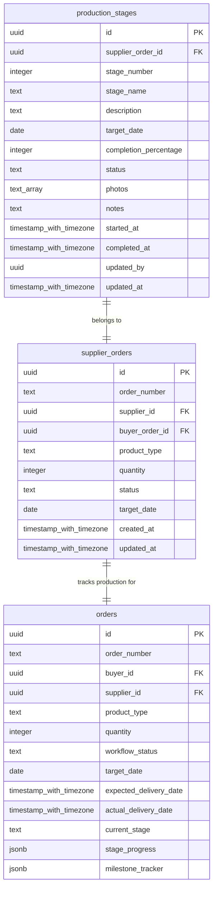
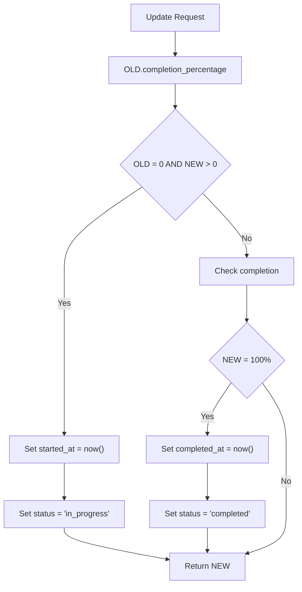
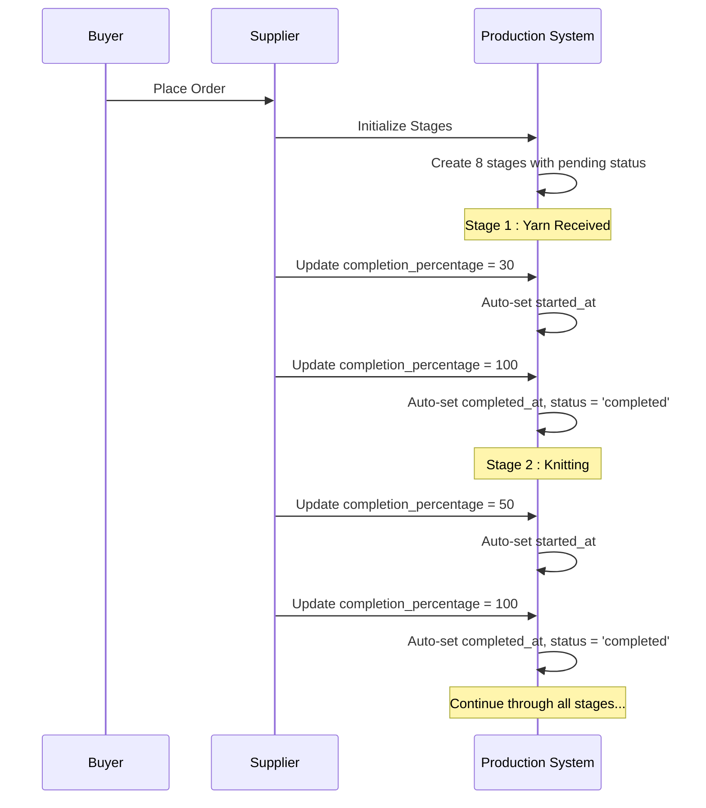

# Production Stages Schema

<cite>
**Referenced Files in This Document**
- [TABLES_ONLY.sql](file://supabase/TABLES_ONLY.sql)
- [COMPLETE_SETUP.sql](file://supabase/COMPLETE_SETUP.sql)
- [20251115150759_remix_migration_from_pg_dump.sql](file://supabase/migrations/20251115150759_remix_migration_from_pg_dump.sql)
- [20251116120215_71189c74-c2d3-4f3e-a1af-87d7e6b5f8fa.sql](file://supabase/migrations/20251116120215_71189c74-c2d3-4f3e-a1af-87d7e6b5f8fa.sql)
- [20251119005557_d0e64af9-ad20-4d7c-b2be-501eb80476de.sql](file://supabase/migrations/20251119005557_d0e64af9-ad20-4d7c-b2be-501eb80476de.sql)
- [20251121014007_e1ea3a7e-b3b2-4082-a10a-c5eff6b1135b.sql](file://supabase/migrations/20251121014007_e1ea3a7e-b3b2-4082-a10a-c5eff6b1135b.sql)
- [ProductionStageTimeline.tsx](file://src/components/production/ProductionStageTimeline.tsx)
- [ProductionAnalytics.tsx](file://src/components/production/ProductionAnalytics.tsx)
- [types.ts](file://src/integrations/supabase/types.ts)
- [ProductionStageManager.tsx](file://src/components/supplier/ProductionStageManager.tsx)
- [seed_comprehensive_test_data.sql](file://supabase/seed_comprehensive_test_data.sql)
</cite>

## Table Overview

The `production_stages` table is a central component of the sleekapp-v100 production tracking system, managing the 8-stage manufacturing workflow for supplier orders. It tracks the complete production lifecycle from initial material receipt through final shipment readiness.



**Diagram sources**
- [TABLES_ONLY.sql](file://supabase/TABLES_ONLY.sql#L526-L541)
- [types.ts](file://src/integrations/supabase/types.ts#L2243-L2282)

**Section sources**
- [TABLES_ONLY.sql](file://supabase/TABLES_ONLY.sql#L526-L541)
- [COMPLETE_SETUP.sql](file://supabase/COMPLETE_SETUP.sql#L1415-L1431)

## Entity Relationships

### Primary Relationships

The production_stages table establishes critical relationships with other key entities in the system:

**1. Supplier Orders Relationship**
- **Foreign Key**: `supplier_order_id` references `supplier_orders.id`
- **Cascade Delete**: Enforced to maintain data integrity
- **Purpose**: Links production stages to specific supplier orders, enabling tracking of individual order progress

**2. User Access Relationship**
- **Optional Foreign Key**: `updated_by` references `auth.users.id`
- **Purpose**: Tracks who made updates to production stages for accountability

### Supporting Relationships

**Order Workflow Integration**
- Production stages feed into the broader order workflow system
- Status updates influence order-level progress tracking
- Completion percentages contribute to overall order completion metrics

**Section sources**
- [BASE_MIGRATION_SAFE.sql](file://supabase/BASE_MIGRATION_SAFE.sql#L3305-L3310)
- [types.ts](file://src/integrations/supabase/types.ts#L2273-L2282)

## Field Definitions

### Core Tracking Fields

| Field | Type | Constraints | Description |
|-------|------|-------------|-------------|
| `id` | UUID | PRIMARY KEY, DEFAULT gen_random_uuid() | Unique identifier for each production stage record |
| `supplier_order_id` | UUID | NOT NULL, FK to supplier_orders | Links stage to specific supplier order |
| `stage_number` | INTEGER | NOT NULL | Sequential stage identifier (1-8) |
| `stage_name` | TEXT | NOT NULL | Human-readable stage name |
| `description` | TEXT | NULLABLE | Detailed description of stage activities |

### Progress Tracking Fields

| Field | Type | Default | Description |
|-------|------|---------|-------------|
| `completion_percentage` | INTEGER | 0 | Percentage completion (0-100) |
| `status` | TEXT | 'pending' | Current stage status |
| `started_at` | TIMESTAMP WITH TIME ZONE | NULLABLE | Timestamp when stage began |
| `completed_at` | TIMESTAMP WITH TIME ZONE | NULLABLE | Timestamp when stage finished |

### Metadata Fields

| Field | Type | Description |
|-------|------|-------------|
| `target_date` | DATE | Expected completion date |
| `photos` | TEXT[] | Array of photo URLs for visual evidence |
| `notes` | TEXT | Additional comments and observations |
| `updated_by` | UUID | User who last modified the record |
| `updated_at` | TIMESTAMP WITH TIME ZONE | Automatic timestamp update |

### Status Values

The `status` field supports the following values:
- `'pending'`: Stage not yet started
- `'in_progress'`: Active production work
- `'completed'`: Stage finished successfully
- `'delayed'`: Stage behind schedule

### Completion Percentage Validation

The table enforces strict validation through the constraint:
```sql
CONSTRAINT production_stages_completion_percentage_check 
CHECK (((completion_percentage >= 0) AND (completion_percentage <= 100)))
```

**Section sources**
- [TABLES_ONLY.sql](file://supabase/TABLES_ONLY.sql#L526-L541)
- [20251116120215_71189c74-c2d3-4f3e-a1af-87d7e6b5f8fa.sql](file://supabase/migrations/20251116120215_71189c74-c2d3-4f3e-a1af-87d7e6b5f8fa.sql#L60-L70)

## Manufacturing Workflow Stages

The production_stages table supports an 8-stage manufacturing workflow that covers the complete apparel production process:

### Stage 1: Yarn Received
- **Purpose**: Initial material intake and inspection
- **Typical Duration**: 2-3 days
- **Activities**: Yarn quality verification, quantity confirmation

### Stage 2: Knitting
- **Purpose**: Fabric creation through knitting machines
- **Typical Duration**: 5-7 days
- **Activities**: Pattern execution, fabric quality control

### Stage 3: Linking
- **Purpose**: Assembly of knitted components
- **Typical Duration**: 3-5 days
- **Activities**: Piece joining, seam preparation

### Stage 4: Washing & Finishing
- **Purpose**: Post-production treatment
- **Typical Duration**: 2-3 days
- **Activities**: Fabric washing, ironing, finishing treatments

### Stage 5: Final QC
- **Purpose**: Comprehensive quality inspection
- **Typical Duration**: 1-2 days
- **Activities**: Defect detection, quality verification

### Stage 6: Packing
- **Purpose**: Pre-shipping preparation
- **Typical Duration**: 1-2 days
- **Activities**: Packaging, labeling, documentation

### Stage 7: Ready to Ship
- **Purpose**: Final readiness confirmation
- **Typical Duration**: 1 day
- **Activities**: Shipping coordination, logistics preparation

### Stage 8: Quality Control (Internal)
- **Purpose**: Factory internal quality assurance
- **Typical Duration**: 2 days
- **Activities**: Internal inspection, corrective actions

**Section sources**
- [20251120233928_2016afb8-d720-4858-9e12-7fb4ebbd5de0.sql](file://supabase/migrations/20251120233928_2016afb8-d720-4858-9e12-7fb4ebbd5de0.sql#L219-L239)

## Business Rules and Constraints

### Automatic Timestamp Management

The system enforces automatic timestamp management through the `update_production_stage_status()` trigger function:



**Diagram sources**
- [20251116120215_71189c74-c2d3-4f3e-a1af-87d7e6b5f8fa.sql](file://supabase/migrations/20251116120215_71189c74-c2d3-4f3e-a1af-87d7e6b5f8fa.sql#L60-L70)

### Trigger Implementation

The trigger is automatically applied to all updates:
```sql
CREATE TRIGGER update_production_stage_status 
BEFORE UPDATE ON public.production_stages 
FOR EACH ROW 
EXECUTE FUNCTION public.update_production_stage_status();
```

### Data Integrity Constraints

1. **Completion Percentage Range**: Enforced through CHECK constraint
2. **Cascade Delete**: Ensures orphaned records are removed
3. **Status Transitions**: Logical progression from pending → in_progress → completed

**Section sources**
- [20251116120215_71189c74-c2d3-4f3e-a1af-87d7e6b5f8fa.sql](file://supabase/migrations/20251116120215_71189c74-c2d3-4f3e-a1af-87d7e6b5f8fa.sql#L52-L74)
- [BASE_MIGRATION_SAFE.sql](file://supabase/BASE_MIGRATION_SAFE.sql#L3305-L3310)

## Data Access Patterns

### Component Integration

The production_stages table integrates with several frontend components:

#### ProductionStageTimeline Component
- **Purpose**: Visual timeline representation of production stages
- **Data Access**: Fetches all stages for an order, sorted by stage_number
- **Usage Pattern**: Real-time monitoring and progress visualization

#### ProductionAnalytics Component  
- **Purpose**: Performance metrics and insights
- **Data Access**: Aggregates completion percentages across all stages
- **Usage Pattern**: Overall progress calculation and delay detection

#### ProductionStageManager Component
- **Purpose**: Supplier stage management interface
- **Data Access**: CRUD operations with automatic timestamp management
- **Usage Pattern**: Real-time stage updates and progress tracking

### Query Patterns

**1. Order-Specific Queries**
```sql
SELECT * FROM production_stages 
WHERE supplier_order_id = 'specific-order-id'
ORDER BY stage_number ASC;
```

**2. Progress Aggregation**
```sql
SELECT 
    COUNT(*) as total_stages,
    SUM(CASE WHEN status = 'completed' THEN 1 ELSE 0 END) as completed_stages,
    AVG(completion_percentage) as avg_progress
FROM production_stages 
WHERE supplier_order_id = 'specific-order-id';
```

**3. Delay Detection**
```sql
SELECT * FROM production_stages 
WHERE status != 'completed' 
AND target_date < CURRENT_DATE
AND target_date IS NOT NULL;
```

**Section sources**
- [ProductionStageTimeline.tsx](file://src/components/production/ProductionStageTimeline.tsx#L22-L50)
- [ProductionAnalytics.tsx](file://src/components/production/ProductionAnalytics.tsx#L30-L60)
- [ProductionStageManager.tsx](file://src/components/supplier/ProductionStageManager.tsx#L39-L89)

## Performance Considerations

### Indexing Strategy

**Primary Index**: The table uses UUID primary keys with automatic indexing
**Foreign Key Index**: `supplier_order_id` is automatically indexed for join performance
**Composite Index**: Consider composite index on `(supplier_order_id, stage_number)` for timeline queries

### Query Optimization

**1. Selective Retrieval**: Components should only fetch necessary fields
**2. Pagination**: For orders with many stages, implement pagination
**3. Caching**: Cache frequently accessed stage data at the application level
**4. Real-time Updates**: Use Supabase realtime subscriptions for live updates

### Scalability Factors

**1. Stage Count**: The 8-stage limit ensures manageable query performance
**2. Photo Storage**: Text arrays for photos support efficient storage
**3. Timestamp Precision**: Timezone-aware timestamps prevent synchronization issues

**Section sources**
- [TABLES_ONLY.sql](file://supabase/TABLES_ONLY.sql#L526-L541)

## Role-Based Security (RLS)

### Policy Structure

The system implements comprehensive Row-Level Security policies:

#### Public Policy Removal
Critical security enhancement removes overly permissive public policies:
- Removed: `production_stages_delete_policy`
- Removed: `production_stages_update_policy`  
- Removed: `production_stages_insert_policy`
- Removed: `production_stages_select_policy`

#### Restricted Policies Maintained

**1. Admin Access**
```sql
CREATE POLICY "Admins can manage all production stages"
ON public.production_stages FOR ALL
USING (public.has_role(auth.uid(), 'admin'));
```

**2. Supplier Access**
```sql
CREATE POLICY "Suppliers can update stages for their orders"
ON public.production_stages FOR UPDATE
USING (
    supplier_order_id IN (
        SELECT id FROM supplier_orders
        WHERE supplier_id IN (
            SELECT id FROM suppliers WHERE user_id = auth.uid()
        )
    )
);
```

**3. View Access**
```sql
CREATE POLICY "Order participants view production stages"
ON public.production_stages FOR SELECT
USING (
    supplier_order_id IN (
        SELECT id FROM supplier_orders 
        WHERE buyer_id = auth.uid()
    )
);
```

### Service Role Access

```sql
CREATE POLICY "Service role full access to production stages"
ON public.production_stages FOR ALL
USING (auth.role() = 'service_role');
```

### Security Benefits

1. **Principle of Least Privilege**: Users only access data relevant to their role
2. **Audit Trail**: All actions logged with user context
3. **Data Isolation**: Suppliers cannot access other suppliers' production data
4. **Administrative Control**: Full admin oversight and management capabilities

**Section sources**
- [20251119005557_d0e64af9-ad20-4d7c-b2be-501eb80476de.sql](file://supabase/migrations/20251119005557_d0e64af9-ad20-4d7c-b2be-501eb80476de.sql#L1-L23)
- [20251121014007_e1ea3a7e-b3b2-4082-a10a-c5eff6b1135b.sql](file://supabase/migrations/20251121014007_e1ea3a7e-b3b2-4082-a10a-c5eff6b1135b.sql#L29-L62)

## Sample Data and Usage Examples

### Typical Stage Progression

Here's how production stages typically progress through the workflow:



### Component Integration Examples

**Timeline Component Usage**:
- Fetches all stages for an order
- Displays visual progress indicators
- Shows completion percentages and dates
- Highlights delays and upcoming deadlines

**Analytics Component Usage**:
- Calculates overall progress (average of all stages)
- Identifies delayed stages
- Provides estimated completion dates
- Generates performance insights

**Manager Component Usage**:
- Enables real-time stage updates
- Supports photo uploads for visual evidence
- Allows note-taking and communication
- Triggers automatic timestamp management

**Section sources**
- [seed_comprehensive_test_data.sql](file://supabase/seed_comprehensive_test_data.sql#L1-L200)
- [ProductionStageTimeline.tsx](file://src/components/production/ProductionStageTimeline.tsx#L22-L183)
- [ProductionAnalytics.tsx](file://src/components/production/ProductionAnalytics.tsx#L30-L249)

## Conclusion

The production_stages table serves as the backbone of the sleekapp-v100 production tracking system, providing comprehensive visibility into the manufacturing process while maintaining strict security controls and performance optimization. Its design balances flexibility with reliability, supporting both real-time monitoring and historical analysis while ensuring data integrity through automated triggers and robust access controls.

The table's integration with frontend components creates a seamless production management experience, enabling stakeholders to monitor progress, identify bottlenecks, and make informed decisions throughout the manufacturing workflow.