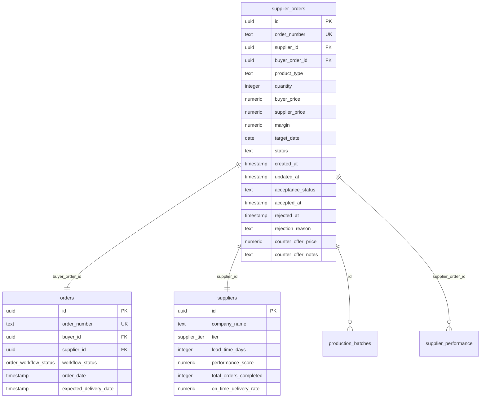
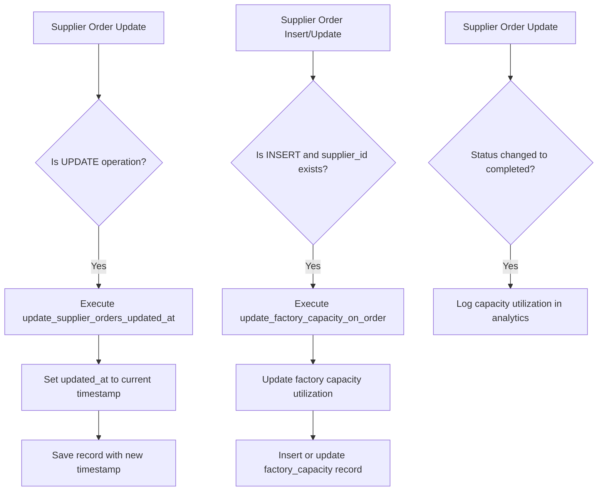
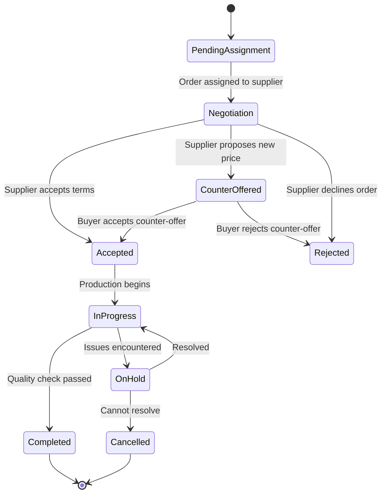
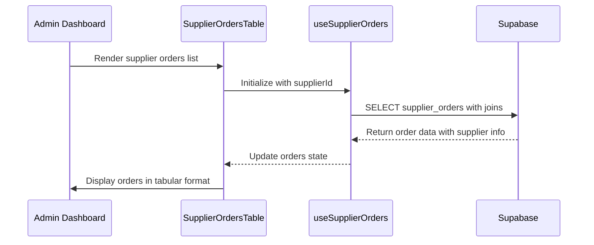
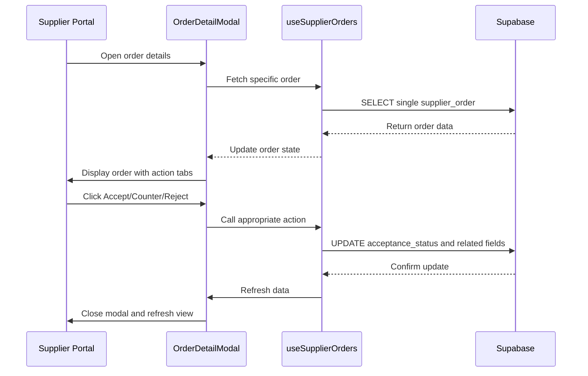

# Supplier Orders Schema

<cite>
**Referenced Files in This Document**   
- [supplier_orders.sql](file://supabase/FIXED_SETUP_PART1.sql#L785-L811)
- [SupplierOrdersTable.tsx](file://src/components/admin/SupplierOrdersTable.tsx)
- [OrderDetailModal.tsx](file://src/components/supplier/SupplierOrderDetailModal.tsx)
- [useSupplierOrders.ts](file://src/hooks/useSupplierOrders.ts)
- [BASE_MIGRATION_SAFE.sql](file://supabase/BASE_MIGRATION_SAFE.sql)
- [COMPLETE_SETUP.sql](file://supabase/COMPLETE_SETUP.sql)
- [update_factory_capacity_on_order.sql](file://supabase/BASE_MIGRATION_SAFE.sql#L535-L570)
- [update_supplier_orders_updated_at.sql](file://supabase/BASE_MIGRATION_SAFE.sql#L658-L670)
</cite>

## Table of Contents
1. [Introduction](#introduction)
2. [Entity Relationship Model](#entity-relationship-model)
3. [Field Definitions](#field-definitions)
4. [Business Rules and Constraints](#business-rules-and-constraints)
5. [Data Lifecycle and Sample Data](#data-lifecycle-and-sample-data)
6. [Data Access Patterns](#data-access-patterns)
7. [Performance Considerations](#performance-considerations)
8. [Security and Access Control](#security-and-access-control)

## Introduction
The supplier_orders table represents manufacturing commitments between suppliers and buyers within the SleekApparels platform. This table serves as a critical link in the production workflow, connecting buyer orders with supplier capacity and manufacturing capabilities. Supplier orders are created when a buyer's order is assigned to a supplier, formalizing the production agreement with specific terms including quantity, pricing, and delivery timelines. The table supports a negotiation workflow where suppliers can accept, reject, or counter-offer on orders, ensuring mutual agreement before production commences.

**Section sources**
- [supplier_orders.sql](file://supabase/FIXED_SETUP_PART1.sql#L785-L811)
- [SupplierOrdersTable.tsx](file://src/components/admin/SupplierOrdersTable.tsx)

## Entity Relationship Model



**Diagram sources**
- [supplier_orders.sql](file://supabase/FIXED_SETUP_PART1.sql#L785-L811)
- [BASE_MIGRATION_SAFE.sql](file://supabase/BASE_MIGRATION_SAFE.sql)

**Section sources**
- [supplier_orders.sql](file://supabase/FIXED_SETUP_PART1.sql#L785-L811)

## Field Definitions

The supplier_orders table contains the following fields that define the manufacturing commitment:

| Field | Type | Nullable | Default | Description |
|-------|------|----------|---------|-------------|
| **id** | uuid | NOT NULL | gen_random_uuid() | Primary key identifier for the supplier order |
| **order_number** | text | NOT NULL | | Unique identifier for the order (e.g., "SO-2025-001") |
| **supplier_id** | uuid | YES | | Foreign key to suppliers table, identifies the manufacturing partner |
| **buyer_order_id** | uuid | YES | | Foreign key to orders table, links to the original buyer request |
| **product_type** | text | NOT NULL | | Category of product being manufactured (e.g., "T-Shirts", "Hoodies") |
| **quantity** | integer | NOT NULL | | Number of units committed for production |
| **buyer_price** | numeric | YES | | Price paid by the buyer to SleekApparels platform |
| **supplier_price** | numeric | YES | | Price paid by SleekApparels to the supplier for manufacturing |
| **margin** | numeric | NO | (buyer_price - supplier_price) | Calculated profit margin stored as a generated column |
| **target_date** | date | YES | | Expected completion date for the manufacturing commitment |
| **status** | text | NOT NULL | 'pending' | Current state of the order (pending, in_progress, completed, etc.) |
| **tech_pack_urls** | text[] | YES | | Array of URLs to technical specification documents |
| **reference_images** | text[] | YES | | Array of URLs to visual reference materials |
| **special_instructions** | text | YES | | Additional manufacturing requirements or notes |
| **created_by** | uuid | NOT NULL | | User ID of the entity that created the supplier order |
| **created_at** | timestamp with time zone | NOT NULL | now() | Timestamp when the record was created |
| **updated_at** | timestamp with time zone | NOT NULL | now() | Timestamp automatically updated on any modification |
| **acceptance_status** | text | YES | 'pending' | Negotiation status: pending, accepted, rejected, counter_offered |
| **accepted_at** | timestamp with time zone | YES | | Timestamp when supplier accepted the order |
| **rejected_at** | timestamp with time zone | YES | | Timestamp when supplier rejected the order |
| **rejection_reason** | text | YES | | Explanation provided by supplier for rejection |
| **counter_offer_price** | numeric | YES | | Proposed alternative price when supplier makes counter-offer |
| **counter_offer_notes** | text | YES | | Explanation for the counter-offer proposal |

**Section sources**
- [supplier_orders.sql](file://supabase/FIXED_SETUP_PART1.sql#L785-L811)

## Business Rules and Constraints

The supplier_orders table enforces several business rules through database constraints and triggers to maintain data integrity and automate key processes:

### Database Constraints
- **Primary Key Constraint**: `supplier_orders_pkey` on the id column ensures each supplier order has a unique identifier
- **Unique Constraint**: `supplier_orders_order_number_key` ensures order numbers are globally unique across the system
- **Acceptance Status Check**: `supplier_orders_acceptance_status_check` restricts acceptance_status to valid values: 'pending', 'accepted', 'rejected', or 'counter_offered'

### Database Triggers
Two critical triggers maintain data consistency and automate business processes:



**Diagram sources**
- [update_supplier_orders_updated_at.sql](file://supabase/BASE_MIGRATION_SAFE.sql#L658-L670)
- [update_factory_capacity_on_order.sql](file://supabase/BASE_MIGRATION_SAFE.sql#L535-L570)

The `update_supplier_orders_updated_at()` trigger automatically updates the `updated_at` timestamp whenever a supplier order is modified, providing an audit trail of changes. This trigger fires before any UPDATE operation on the supplier_orders table.

The `update_factory_capacity_on_order()` trigger serves two critical functions:
1. When a new supplier order is created, it updates the factory's capacity utilization by inserting or updating a record in the factory_capacity table with the order quantity
2. When an order status changes to 'completed', it logs the capacity utilization percentage, order count, and revenue generated in the capacity_utilization_logs table for analytics and reporting

These triggers ensure that factory capacity data remains synchronized with supplier order commitments, preventing overbooking and providing real-time visibility into production capacity.

**Section sources**
- [update_supplier_orders_updated_at.sql](file://supabase/BASE_MIGRATION_SAFE.sql#L658-L670)
- [update_factory_capacity_on_order.sql](file://supabase/BASE_MIGRATION_SAFE.sql#L535-L570)

## Data Lifecycle and Sample Data

The supplier order lifecycle progresses through several stages from assignment to completion. Below is a sample data progression showing the evolution of a supplier order:



**Diagram sources**
- [OrderDetailModal.tsx](file://src/components/supplier/SupplierOrderDetailModal.tsx)

**Section sources**
- [OrderDetailModal.tsx](file://src/components/supplier/SupplierOrderDetailModal.tsx)
- [useSupplierOrders.ts](file://src/hooks/useSupplierOrders.ts)

### Sample Data Progression

**Initial Assignment (Pending Acceptance)**
```json
{
  "id": "a1b2c3d4-e5f6-7890-1234-567890abcdef",
  "order_number": "SO-2025-001",
  "supplier_id": "7d52fff8-1992-4994-9817-296e7da7e27b",
  "buyer_order_id": "50000000-0000-0000-0000-000000000001",
  "product_type": "T-Shirts",
  "quantity": 1000,
  "buyer_price": 8.00,
  "supplier_price": 5.50,
  "target_date": "2025-03-15",
  "status": "pending",
  "acceptance_status": "pending",
  "created_at": "2025-01-15T10:30:00Z",
  "updated_at": "2025-01-15T10:30:00Z"
}
```

**After Supplier Acceptance**
```json
{
  "id": "a1b2c3d4-e5f6-7890-1234-567890abcdef",
  "order_number": "SO-2025-001",
  "supplier_id": "7d52fff8-1992-4994-9817-296e7da7e27b",
  "buyer_order_id": "50000000-0000-0000-0000-000000000001",
  "product_type": "T-Shirts",
  "quantity": 1000,
  "buyer_price": 8.00,
  "supplier_price": 5.50,
  "target_date": "2025-03-15",
  "status": "in_progress",
  "acceptance_status": "accepted",
  "accepted_at": "2025-01-16T14:22:00Z",
  "created_at": "2025-01-15T10:30:00Z",
  "updated_at": "2025-01-16T14:22:00Z"
}
```

**Completed Order**
```json
{
  "id": "a1b2c3d4-e5f6-7890-1234-567890abcdef",
  "order_number": "SO-2025-001",
  "supplier_id": "7d52fff8-1992-4994-9817-296e7da7e27b",
  "buyer_order_id": "50000000-0000-0000-0000-000000000001",
  "product_type": "T-Shirts",
  "quantity": 1000,
  "buyer_price": 8.00,
  "supplier_price": 5.50,
  "target_date": "2025-03-15",
  "status": "completed",
  "acceptance_status": "accepted",
  "accepted_at": "2025-01-16T14:22:00Z",
  "created_at": "2025-01-15T10:30:00Z",
  "updated_at": "2025-03-15T16:45:00Z"
}
```

## Data Access Patterns

The supplier_orders table is accessed through several key components that serve different user roles within the platform:

### SupplierOrdersTable Component
The `SupplierOrdersTable` component provides an administrative view of all supplier orders, allowing platform administrators to monitor order status across all suppliers. This component queries the supplier_orders table with joins to the suppliers table to display company names alongside order details.



**Diagram sources**
- [SupplierOrdersTable.tsx](file://src/components/admin/SupplierOrdersTable.tsx)
- [useSupplierOrders.ts](file://src/hooks/useSupplierOrders.ts)

### OrderDetailModal Component
The `OrderDetailModal` component provides suppliers with a detailed view of individual orders, including the ability to accept, reject, or counter-offer on orders. This component implements the negotiation workflow through the acceptance_status field.



**Diagram sources**
- [OrderDetailModal.tsx](file://src/components/supplier/SupplierOrderDetailModal.tsx)
- [useSupplierOrders.ts](file://src/hooks/useSupplierOrders.ts)

The `useSupplierOrders` custom hook encapsulates all data access logic, providing a clean interface for components to interact with the supplier_orders table. It handles fetching orders, updating acceptance status, and managing the negotiation workflow while providing error handling and user feedback through toast notifications.

**Section sources**
- [SupplierOrdersTable.tsx](file://src/components/admin/SupplierOrdersTable.tsx)
- [OrderDetailModal.tsx](file://src/components/supplier/SupplierOrderDetailModal.tsx)
- [useSupplierOrders.ts](file://src/hooks/useSupplierOrders.ts)

## Performance Considerations

To ensure optimal query performance for supplier order operations, the following indexing and query optimization strategies are recommended:

### Indexing Strategy
- **Primary Key Index**: Automatically created on the id column for O(1) lookups
- **Unique Index**: On order_number for fast order lookups by number
- **Foreign Key Indexes**: On supplier_id and buyer_order_id to optimize JOIN operations
- **Composite Index**: On (supplier_id, status, created_at) to support common supplier-specific queries

### Query Optimization
For supplier-specific queries, always filter by supplier_id first to leverage indexing and row-level security policies. When displaying order lists, use pagination to limit result sets and include only necessary fields in SELECT clauses.

For administrative views that require supplier information, use JOINs with the suppliers table to retrieve company_name and other relevant details in a single query rather than making multiple round trips to the database.

The margin field is implemented as a GENERATED ALWAYS AS stored column, which calculates the difference between buyer_price and supplier_price automatically. This approach ensures data consistency and eliminates the need for application-level calculation while providing fast access to margin information for reporting and analytics.

**Section sources**
- [supplier_orders.sql](file://supabase/FIXED_SETUP_PART1.sql#L785-L811)
- [SupplierOrdersTable.tsx](file://src/components/admin/SupplierOrdersTable.tsx)

## Security and Access Control

The supplier_orders table implements Row Level Security (RLS) policies to ensure data privacy and prevent unauthorized access:

### RLS Policies
- **Supplier Access**: Suppliers can only view and modify orders assigned to their supplier_id
- **Buyer Access**: Buyers can view orders through their associated buyer_order_id
- **Admin Access**: Platform administrators have full read/write access to all supplier orders

These policies ensure that suppliers cannot see each other's orders or pricing information, maintaining competitive confidentiality while allowing the platform to coordinate the manufacturing network effectively.

The acceptance workflow is designed to prevent unauthorized modifications. Only suppliers can update the acceptance_status field through the approved channels (accept, reject, counter-offer), and these actions are logged with timestamps to provide an audit trail of the negotiation process.

**Section sources**
- [useSupplierOrders.ts](file://src/hooks/useSupplierOrders.ts)
- [OrderDetailModal.tsx](file://src/components/supplier/SupplierOrderDetailModal.tsx)