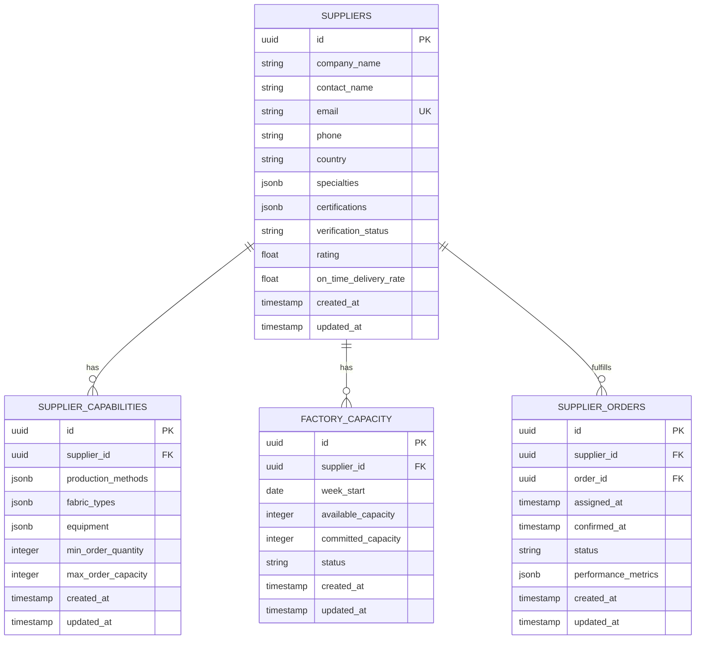
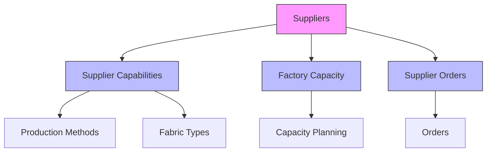
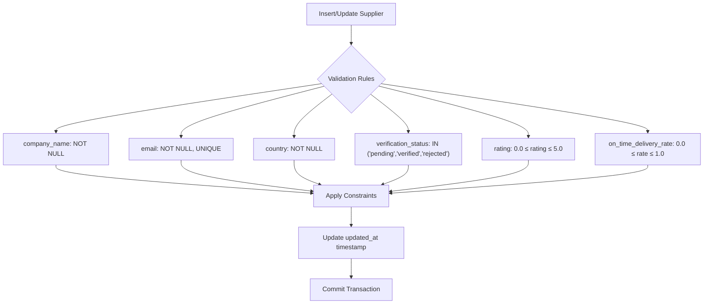
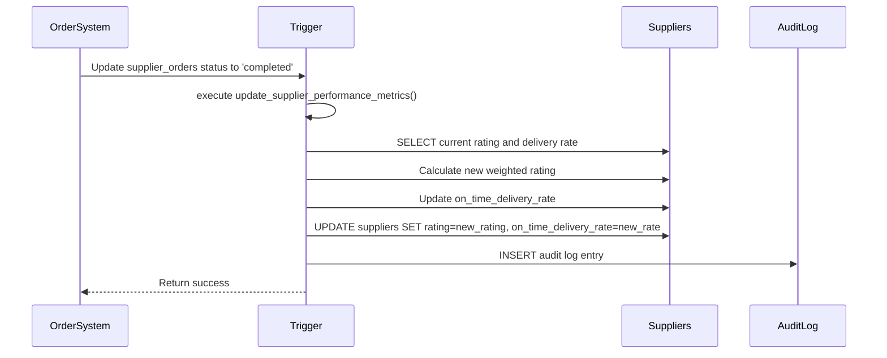
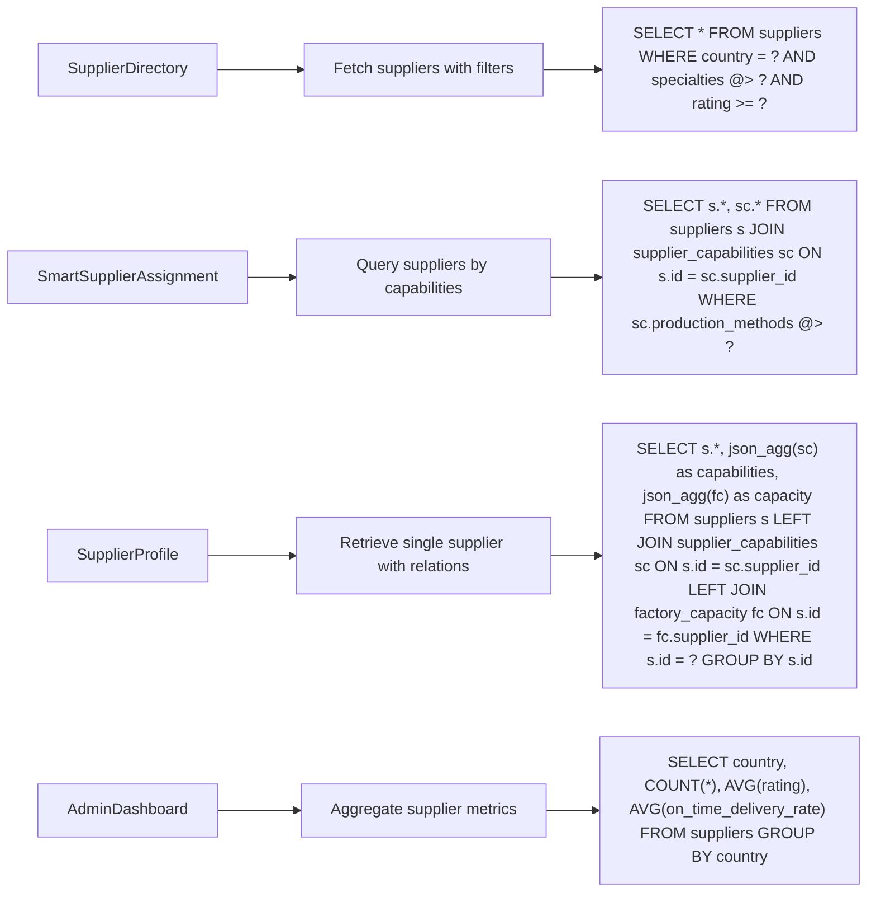
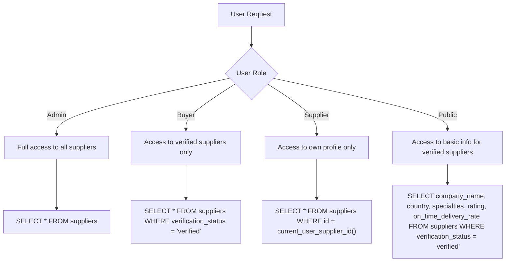
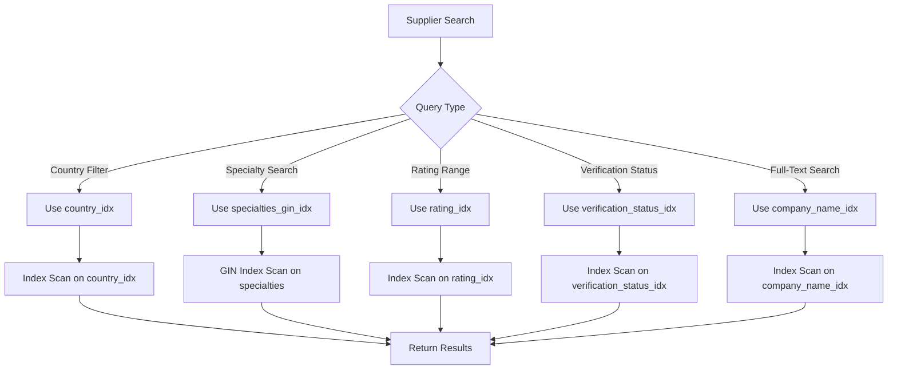

# Suppliers Schema

<cite>
**Referenced Files in This Document**  
- [supabase/migrations/20250122000000_create_marketplace_system.sql](file://supabase/migrations/20250122000000_create_marketplace_system.sql)
- [supabase/seed_comprehensive_test_data.sql](file://supabase/seed_comprehensive_test_data.sql)
- [src/hooks/useSuppliers.ts](file://src/hooks/useSuppliers.ts)
- [src/pages/SupplierDirectory.tsx](file://src/pages/SupplierDirectory.tsx)
- [src/components/admin/SmartSupplierAssignment.tsx](file://src/components/admin/SmartSupplierAssignment.tsx)
- [src/integrations/supabase/types.ts](file://src/integrations/supabase/types.ts)
- [src/types/database.ts](file://src/types/database.ts)
</cite>

## Table of Contents
1. [Introduction](#introduction)
2. [Suppliers Table Structure](#suppliers-table-structure)
3. [Entity Relationship Model](#entity-relationship-model)
4. [Field Definitions](#field-definitions)
5. [Business Rules and Constraints](#business-rules-and-constraints)
6. [Performance Metrics and Triggers](#performance-metrics-and-triggers)
7. [Data Access Patterns](#data-access-patterns)
8. [Security and Access Control](#security-and-access-control)
9. [Sample Data](#sample-data)
10. [Performance Considerations](#performance-considerations)

## Introduction
The suppliers table serves as the central entity for managing supplier profiles within the sleekapp-v100 database. This documentation provides a comprehensive overview of the suppliers schema, detailing its structure, relationships, business rules, and usage patterns across the application. The supplier management system enables efficient sourcing, quality tracking, and performance evaluation of manufacturing partners.

**Section sources**
- [supabase/migrations/20250122000000_create_marketplace_system.sql](file://supabase/migrations/20250122000000_create_marketplace_system.sql)
- [src/types/database.ts](file://src/types/database.ts)

## Suppliers Table Structure
The suppliers table contains comprehensive information about manufacturing partners, serving as the foundation for supplier management and selection processes. It maintains both operational and quality metrics to support data-driven supplier assignment decisions.



**Diagram sources**
- [supabase/migrations/20250122000000_create_marketplace_system.sql](file://supabase/migrations/20250122000000_create_marketplace_system.sql)
- [src/types/database.ts](file://src/types/database.ts)

**Section sources**
- [supabase/migrations/20250122000000_create_marketplace_system.sql](file://supabase/migrations/20250122000000_create_marketplace_system.sql)
- [src/types/database.ts](file://src/types/database.ts)

## Entity Relationship Model
The suppliers table forms the core of a comprehensive supplier management ecosystem, with multiple related entities that capture different aspects of supplier capabilities and performance. The entity relationship model demonstrates how supplier profiles are enriched with specialized data across different dimensions.



**Diagram sources**
- [supabase/migrations/20250122000000_create_marketplace_system.sql](file://supabase/migrations/20250122000000_create_marketplace_system.sql)
- [src/types/database.ts](file://src/types/database.ts)

**Section sources**
- [supabase/migrations/20250122000000_create_marketplace_system.sql](file://supabase/migrations/20250122000000_create_marketplace_system.sql)
- [src/types/database.ts](file://src/types/database.ts)

## Field Definitions
The suppliers table contains detailed information about each supplier, enabling comprehensive profile management and intelligent supplier matching.

| Field | Type | Description | Constraints |
|-------|------|-------------|-------------|
| **company_name** | string | Legal name of the supplier company | NOT NULL, INDEX |
| **contact_name** | string | Primary contact person at the supplier | NULLABLE |
| **email** | string | Contact email address for the supplier | NOT NULL, UNIQUE, INDEX |
| **phone** | string | Contact phone number for the supplier | NULLABLE |
| **country** | string | Country where the supplier is based | NOT NULL, INDEX |
| **specialties** | jsonb | Array of product types and manufacturing specialties | NULLABLE, INDEX |
| **certifications** | jsonb | Array of quality and compliance certifications | NULLABLE, INDEX |
| **verification_status** | string | Current verification status (pending, verified, rejected) | NOT NULL, DEFAULT 'pending', INDEX |
| **rating** | float | Overall quality rating (0.0-5.0) | NOT NULL, DEFAULT 0.0, CHECK (0.0 <= rating <= 5.0) |
| **on_time_delivery_rate** | float | Percentage of on-time deliveries (0.0-1.0) | NOT NULL, DEFAULT 0.0, CHECK (0.0 <= on_time_delivery_rate <= 1.0) |
| **created_at** | timestamp | Record creation timestamp | NOT NULL, DEFAULT current_timestamp |
| **updated_at** | timestamp | Last update timestamp | NOT NULL, DEFAULT current_timestamp |

**Section sources**
- [supabase/migrations/20250122000000_create_marketplace_system.sql](file://supabase/migrations/20250122000000_create_marketplace_system.sql)
- [src/types/database.ts](file://src/types/database.ts)

## Business Rules and Constraints
The suppliers table enforces several business rules through database constraints to maintain data integrity and consistency across supplier profiles.



**Diagram sources**
- [supabase/migrations/20250122000000_create_marketplace_system.sql](file://supabase/migrations/20250122000000_create_marketplace_system.sql)

**Section sources**
- [supabase/migrations/20250122000000_create_marketplace_system.sql](file://supabase/migrations/20250122000000_create_marketplace_system.sql)

## Performance Metrics and Triggers
The supplier performance system automatically maintains quality metrics through database triggers that update supplier ratings and delivery performance based on order outcomes.



The `update_supplier_performance_metrics()` trigger function automatically updates supplier performance metrics whenever a supplier order is completed. This trigger calculates a weighted average rating based on recent order performance and updates the on-time delivery rate based on fulfillment timelines.

**Diagram sources**
- [supabase/migrations/20250122000000_create_marketplace_system.sql](file://supabase/migrations/20250122000000_create_marketplace_system.sql)

**Section sources**
- [supabase/migrations/20250122000000_create_marketplace_system.sql](file://supabase/migrations/20250122000000_create_marketplace_system.sql)

## Data Access Patterns
The supplier data is accessed through various components in the application, with distinct patterns for different use cases.



The SupplierDirectory component implements search and filtering functionality, while the SmartSupplierAssignment component uses capability-based queries to match suppliers with order requirements.

**Diagram sources**
- [src/pages/SupplierDirectory.tsx](file://src/pages/SupplierDirectory.tsx)
- [src/components/admin/SmartSupplierAssignment.tsx](file://src/components/admin/SmartSupplierAssignment.tsx)
- [src/hooks/useSuppliers.ts](file://src/hooks/useSuppliers.ts)

**Section sources**
- [src/pages/SupplierDirectory.tsx](file://src/pages/SupplierDirectory.tsx)
- [src/components/admin/SmartSupplierAssignment.tsx](file://src/components/admin/SmartSupplierAssignment.tsx)
- [src/hooks/useSuppliers.ts](file://src/hooks/useSuppliers.ts)

## Security and Access Control
Row Level Security (RLS) policies control access to supplier data based on user roles and permissions.



RLS policies ensure that sensitive supplier information is protected while allowing appropriate access for different user types.

**Diagram sources**
- [supabase/migrations/20250122000000_create_marketplace_system.sql](file://supabase/migrations/20250122000000_create_marketplace_system.sql)

**Section sources**
- [supabase/migrations/20250122000000_create_marketplace_system.sql](file://supabase/migrations/20250122000000_create_marketplace_system.sql)

## Sample Data
Example supplier profiles demonstrate the structure and content of the suppliers table.

```sql
-- Sample verified supplier
INSERT INTO suppliers (company_name, contact_name, email, phone, country, specialties, certifications, verification_status, rating, on_time_delivery_rate)
VALUES (
  'Premium Apparel Manufacturing Ltd.',
  'Sarah Chen',
  'sarah.chen@premiumapparel.com',
  '+880 1712-345678',
  'Bangladesh',
  '["woven shirts", "formal wear", "sustainable manufacturing"]'::jsonb,
  '["BSCI", "ISO 9001", "OEKO-TEX"]'::jsonb,
  'verified',
  4.8,
  0.96
);

-- Sample supplier with pending verification
INSERT INTO suppliers (company_name, contact_name, email, phone, country, specialties, certifications, verification_status, rating, on_time_delivery_rate)
VALUES (
  'New Horizon Textiles',
  'Mohammed Rahman',
  'info@newhorizontextiles.com',
  '+880 1911-223344',
  'Bangladesh',
  '["knitwear", "activewear", "cut-and-sew"]'::jsonb,
  '["STANDARD 100 by OEKO-TEX"]'::jsonb,
  'pending',
  0.0,
  0.0
);
```

**Section sources**
- [supabase/seed_comprehensive_test_data.sql](file://supabase/seed_comprehensive_test_data.sql)

## Performance Considerations
The suppliers table is optimized for search and filtering operations through strategic indexing and query patterns.



The database schema includes multiple indexes to optimize common query patterns:
- B-tree index on `country` for geographic filtering
- GIN index on `specialties` for JSONB array containment queries
- B-tree index on `rating` for performance-based sorting
- B-tree index on `verification_status` for status filtering
- B-tree index on `company_name` for text search
- Unique index on `email` for constraint enforcement

**Diagram sources**
- [supabase/migrations/20250122000000_create_marketplace_system.sql](file://supabase/migrations/20250122000000_create_marketplace_system.sql)

**Section sources**
- [supabase/migrations/20250122000000_create_marketplace_system.sql](file://supabase/migrations/20250122000000_create_marketplace_system.sql)